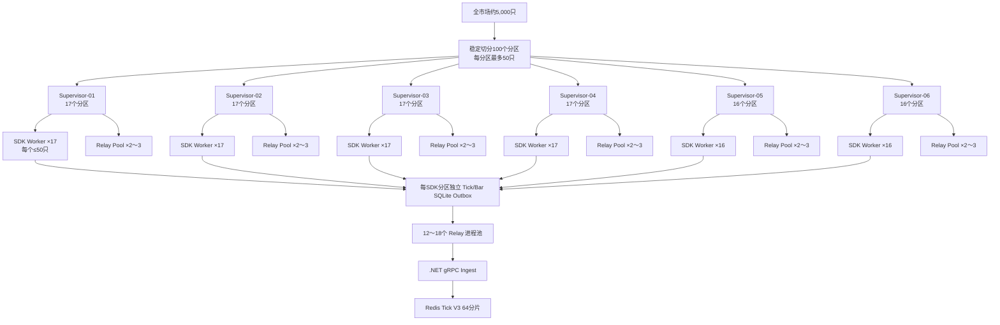
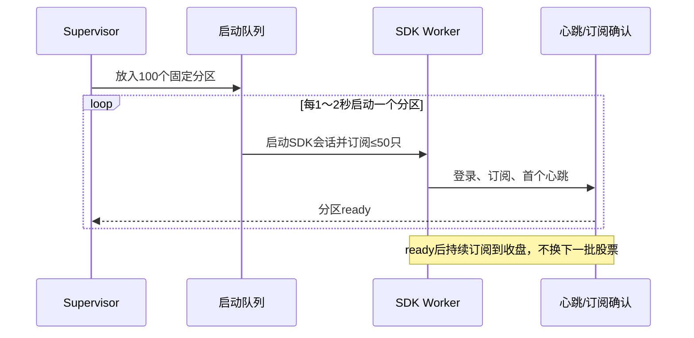
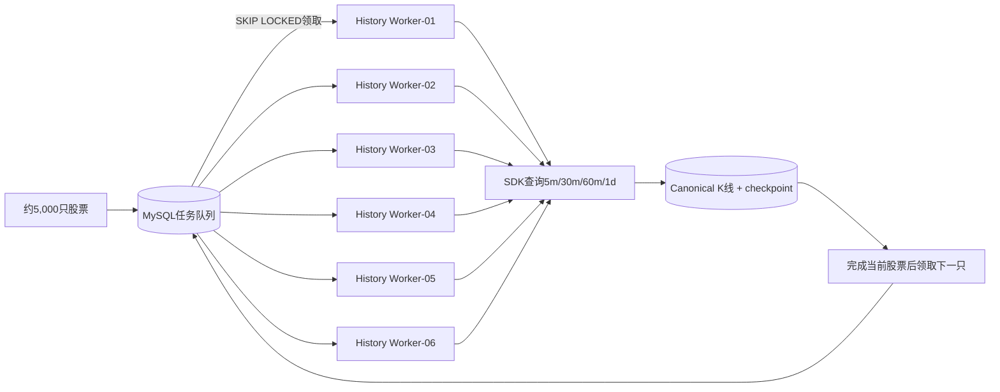

# 东方掘金 SDK 全市场 5,000 股票调度方案

> 方案日期：2026-08-14  
> 本轮范围：只形成方案，不修改正式采集代码。  
> 已知实测：东方掘金 SDK 每进程/会话最多订阅 50 只证券；当前 1,000 只股票使用 20 个 SDK Worker + 20 个 Relay。

## 1. 先纠正“6 个脚本 × 200 只，后续排队”的含义

这个模型用于**历史 K 线下载**是合理的，用于**全市场实时 Tick**则不成立。

实时 Tick 订阅从开盘持续到收盘，没有“单只股票执行完成”的时点。若一个脚本先订阅 50 只，完成后再换下一批，未被订阅股票在等待期间产生的 Tick 无法实时获得，盘中对子、VWAP 和策略监控都会出现数据盲区。

容量计算：

```text
5,000只 ÷ 50只/SDK会话 = 100个SDK会话
```

因此，若要求 5,000 只股票 Tick 全时段连续覆盖，**100 个 SDK 会话是当前限制下的理论下限**。6 个脚本可以作为 6 个顶层 Supervisor，但不能把 SDK 的单会话 50 只限制变成 200 只。

## 2. 三种模式对比

| 模式 | 实时覆盖 | 资源 | 是否适合对子/盘中策略 | 结论 |
|---|---:|---:|---:|---|
| 6 个 SDK 会话，每会话轮换约 200 只 | 不连续，且总覆盖远小于 5,000 | 低 | 否 | 不采用 |
| 20 个会话固定 1,000 只，其余排队轮换 | 核心池连续，其余股票有盲区 | 中 | 只适合核心池 | 可作为过渡方案 |
| 6 个 Supervisor 管理 100 个 SDK 会话 | 5,000 只连续 | 高 | 是 | 全市场实时目标方案 |

## 3. 推荐的全市场实时架构

6 个脚本改为 6 个 **Supervisor Group**。每个 Supervisor 管理一组 SDK Worker 和 Relay，不直接突破 SDK 单会话限制。



### 3.1 为什么建议 Relay 池化

完全沿用“一 SDK Worker + 一 Relay”会产生约 200 个子进程。5,000 股票模拟测试正是 50 个生产进程 + 50 个 Relay，在约 5,000 Tick/秒时虽然没有拒绝或过期，但出现周期性 3～6 万条短时积压，说明 Windows 进程调度、Python GC、SQLite 和 Relay 并发存在抖动。

建议保留“每 SDK 分区独立 SQLite Outbox”，但每个 Supervisor 使用 2～3 个 Relay 进程，每个 Relay 稳定负责约 6～9 个 Outbox：

- SDK 回调与网络传输仍是进程隔离的；
- SQLite 文件仍不共享写入，不会重新引入多 SDK 写同库锁冲突；
- Relay 总数从 100 降为约 12～18；
- 每个 Relay 内部使用异步轮询和一个长期 gRPC 连接；
- Relay 故障时只影响其租约内的几个分区，Supervisor 可快速接管。

池化必须先压测验证，不能直接替换当前 1:1 Relay 后上线。

## 4. “排队”应该用在哪里

### 4.1 实时采集的启动队列

实时链路可以排队启动会话，但不能轮换股票覆盖：



启动节流的目的，是避免东方掘金终端在几秒内同时建立 100 个会话，而不是降低持续订阅数量。

### 4.2 失败恢复队列

只有以下任务进入实时恢复队列：

- SDK 会话断开；
- 分区心跳超时；
- Outbox 超过年龄门槛；
- Relay 租约丢失；
- 股票池日内变更需要重新分片。

优先级顺序：已断开分区 → 有 Outbox Pending 的分区 → 新增股票分区 → 普通重平衡。重试采用指数退避和随机抖动，避免终端恢复时 100 个会话同时登录。

### 4.3 历史 K 线队列

“6 个脚本，每个脚本领取任务，一只完成后领取下一只”非常适合历史 K 线与缺口恢复：



可以把 200 只定义为一个可观测的 `partition_id`，但 Worker 不应被固定分区拖住：分区内逐股票推进检查点，完成后继续领取；某个慢股票被隔离后，其他 Worker 可以继续工作。

## 5. 推荐的近期落地方式

考虑当前系统规模、SDK 限制和测试结果，建议分两层推进。

### 5.1 第一阶段：生产保持 1,000 只实时池

- 维持 20 SDK Worker + 20 Relay；
- 每会话 50 只，不改成 200；
- 完成一个真实完整交易日的覆盖率、P95/P99、Outbox 年龄和 Bar 并发验收；
- 修复并验证所有下游都读取 Tick V3；
- 同时使用现有 6 个历史进程完成全市场官方四周期 K 线增量。

### 5.2 第二阶段：验证授权和终端会话上限

按 20 → 30 → 50 → 75 → 100 个 SDK 会话灰度，每档至少观察一个完整交易时段。需要确认：

- Token/终端允许的总会话数；
- 总订阅证券数限制；
- 终端 CPU、内存、句柄和网络；
- SDK 回调延迟和断线率；
- 官方 Bar 与 Tick 同时订阅是否互相影响；
- Redis 和 gRPC 是否出现持续而非瞬时积压。

任一档出现持续积压或会话拒绝，就停留在当前档，不继续扩容。

### 5.3 第三阶段：Relay Pool 影子测试

- 先让池化 Relay 只处理模拟 Outbox；
- 再选择 2～4 个真实 SDK 分区影子运行；
- 对比 1:1 Relay 的 ACK 延迟、CPU、内存、重连和故障隔离；
- 连续 3 个交易日稳定后再逐组替换。

### 5.4 第四阶段：5,000 只全市场实时

- 100 个固定分区，每分区最多 50 只；
- 6 个 Supervisor 组分配为 17/17/17/17/16/16；
- 所有股票盘中持续订阅，不轮换；
- Supervisor、SDK Worker、Outbox、Relay 都具有独立 `partition_id`、会话 ID 和心跳；
- 单分区失败只重启该分区，不影响其他 99 个分区；
- 股票池变化使用新旧分区重叠订阅后再切换，避免重平衡空窗。

## 6. 验收指标

| 指标 | 目标 |
|---|---:|
| 盘中应订阅股票覆盖率 | 100% |
| SDK Worker 在线率 | ≥99.99% |
| Tick 回调到 Redis P95 | <100ms |
| Tick 回调到 Redis P99 | <300ms |
| 正常 Outbox 最旧 Tick | <2s |
| Redis Stream 正常 Lag | <2s |
| 持续 Pending 增长 | 0 |
| Tick rejected/expired | 正常运行时 0 |
| 单分区恢复时间 | <30s |
| 单分区故障影响范围 | ≤50只股票 |
| MySQL Tick 新增量 | 0 |

瞬时积压允许存在，但必须在输入回到稳态后快速收敛。若每隔固定周期出现积压，应分别采集 Python GC、Windows CPU 调度、磁盘 fsync、SQLite checkpoint、gRPC 耗时和 Redis Lua 耗时，不能只看最终是否排空。

## 7. 最终建议

推荐采用以下组合：

1. **实时 Tick**：6 个 Supervisor 管理最多 100 个固定 SDK 会话，每会话不超过 50 只；股票不轮换。
2. **Relay**：保留独立 Outbox，逐步验证 12～18 个池化 Relay，降低 200 进程带来的调度抖动。
3. **历史 K 线**：6 个下载 Worker 使用 MySQL 队列，一只完成后领取下一只；200 只只作为分区和进度统计单位。
4. **若授权不支持 100 会话**：保持 1,000 只核心实时池，其余股票只做官方 K 线轮询/增量，不宣称全市场 Tick 实时监控。

这套方案既保留您希望的“6 个脚本统一管理”，也遵守 SDK 每会话 50 只的硬限制，并把实时持续订阅与可排队的历史任务明确分开。
