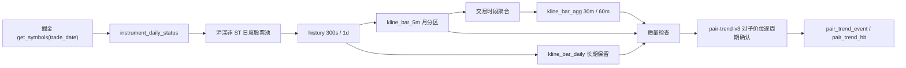

# 历史 K 线数据底座

## 1. 范围与口径

本模块负责 2026 年起的沪深 A 股历史 K 线、按日股票池、质量检查、对子局部顶底候选和每日增量计算。

- 数据源只使用东方财富掘金 Python SDK，不运行策略、不连接账户、不调用交易接口。
- 交易所只包含 `SHSE`、`SZSE`，因此排除北交所。
- 股票池优先按每个交易日重新构建；通过 SDK 在指定 `trade_date` 下分别查询全部股票、非 ST 股票和未停牌股票。若当前终端缺少新版证券主数据服务，采集器会自动切换 SDK 兼容接口并按上市/退市日期过滤；兼容接口的历史 ST/停牌状态是当前快照近似，`raw_attributes._universe_adapter` 会明确记录降级来源，不会静默降级。
- `is_eligible` 表示当日沪深非 ST；`is_suspended` 独立保存。停牌股票仍属于当日非 ST 股票池，但不要求生成当日 K 线。
- 源数据保存 5 分钟不复权 K 线和日线；30/60 分钟由 5 分钟数据按交易时段聚合。
- 对子价格以原始不复权价格判定。趋势类扩展指标可另行使用复权序列，不能改变对子价格本身。

## 2. 数据流



历史批处理与实时 Tick 热路径相互独立。历史任务直接批量写 MySQL，不经过实时 gRPC、SignalR 或 Redis Streams。

## 3. 数据库结构

迁移文件：`database/migrations/002_historical_kline_foundation.sql`。

| 表 | 用途 | 保留策略 |
|---|---|---|
| `instrument` | 证券静态主数据 | 长期 |
| `instrument_daily_status` | 每交易日 ST、停牌、股票池资格 | 长期 |
| `bar_ingest_batch` | 回放/增量批次、行数和错误统计 | 长期 |
| `bar_ingest_checkpoint` | 每个股票和频率的断点 | 长期 |
| `kline_bar_5m` | 5 分钟源 K 线 | 月分区，年度归档清理 |
| `kline_bar_agg` | 30/60 分钟衍生 K 线 | 月分区，年度归档清理 |
| `kline_bar_daily` | 日线源数据 | 长期，不自动删除 |
| `bar_quality_run` / `bar_quality_issue` | 质量运行及明细 | 长期 |
| `pair_pivot_signal` | 第一版对子研究结果，兼容保留 | 长期 |
| `pair_trend_backtest_run` / `pair_trend_backtest_symbol` | v2 回测审计和股票级断点 | 长期 |
| `pair_trend_event` / `pair_trend_hit` | v2 同股多周期事件与完整命中明细 | 长期 |
| `daily_pipeline_run` | 每日增量流水线状态 | 长期 |
| `archive_manifest` | Parquet 路径、行数、SHA-256、归档/删除状态 | 长期 |
| `maintenance_job_run` | 年度维护审计 | 长期 |

`kline_bar_5m` 和 `kline_bar_agg` 的唯一键都包含分区字段 `trading_date`，满足 MySQL 分区表约束。写入使用 `INSERT ... ON DUPLICATE KEY UPDATE`，相同股票、频率和结束时间重复下载不会产生重复行。

未来分区由 `PartitionManager` 在每日流水线开始前补齐至下一自然年，也可手动执行：

```powershell
cd .\collector
.\.venv\Scripts\python.exe -m astock_collector.history.cli partitions --through-year 2028
```

## 4. 历史回放

### 4.1 本机配置与环境覆盖

单用户部署从已加入 `.gitignore` 的 `collector/config.local.json` 读取Token，格式参考 `collector/config.example.json`。Token不得进入日志、数据库、Swagger响应或提交记录。其他连接参数仍可通过环境变量覆盖：

```powershell
$env:ASTOCK_MYSQL_HOST = "127.0.0.1"
$env:ASTOCK_MYSQL_PORT = "3306"
$env:ASTOCK_MYSQL_DATABASE = "astock_monitor"
$env:ASTOCK_MYSQL_USER = "astock_app"
$env:ASTOCK_MYSQL_PASSWORD = "change-me"
```

读取优先级是当前进程 `ASTOCK_TOKEN`、本机 `config.local.json`、Windows Credential Manager。正常运行使用本机配置，环境变量只用于临时覆盖。

### 4.2 小样本验收

真实全市场回放前，先选 3 个股票验证 SDK 权限、字段和行数：

```powershell
cd .\collector

.\.venv\Scripts\python.exe -m astock_collector.history.cli universe `
  --start 2026-01-01 --end 2026-08-13

.\.venv\Scripts\python.exe -m astock_collector.history.cli download `
  --start 2026-01-01 --end 2026-08-13 `
  --frequencies 5m,1d --workers 1 --symbol-limit 3

.\.venv\Scripts\python.exe -m astock_collector.history.cli aggregate `
  --start 2026-01-01 --end 2026-08-13 --symbol-limit 3

.\.venv\Scripts\python.exe -m astock_collector.history.cli quality `
  --start 2026-01-01 --end 2026-08-13 --validate-source-symbols 3

.\.venv\Scripts\python.exe -m astock_collector.history.cli pairs `
  --start 2026-01-01 --end 2026-08-13 --symbol-limit 3
```

### 4.3 全市场回放

小样本质量门通过后执行：

```powershell
cd .\collector
.\.venv\Scripts\python.exe -m astock_collector.history.cli replay `
  --start 2026-01-01 --end 2026-08-13 `
  --workers 4 --validate-source-symbols 10
```

回放可安全重启：

- 股票池按主键覆盖更新；
- 下载断点保存在 `bar_ingest_checkpoint`；
- 5 分钟与日线幂等写入；
- 30/60 分钟和对子结果按指定日期范围重新计算并覆盖；
- 单次 5 分钟 SDK 请求按 31 天切片，低于单次最大行数限制；
- 单股票/频率失败会记录错误，其他进程继续工作，批次状态标记为 `partial`。

当前分钟 K 线下载范围限制为最近 60 个自然日且不含当天，日线不受该分钟窗口限制。下载器会分别计算各频率的有效区间，默认可通过 `ASTOCK_HISTORY_INTRADAY_LIMIT_DAYS` 和 `ASTOCK_HISTORY_INTRADAY_EXCLUDES_TODAY` 调整。范围裁剪会写入 `bar_ingest_batch.details.effective_ranges`，批次标记为 `partial`；范围外分钟区间不会生成空数据、伪数据，也不会被报告为完整。

## 5. 30/60 分钟聚合

聚合使用两个独立交易时段：

- 上午：`09:30 < eob <= 11:30`；
- 下午：`13:00 < eob <= 15:00`。

30 分钟每根应包含 6 根 5 分钟 K 线，正常交易日共 8 根；60 分钟每根应包含 12 根，正常交易日共 4 根。午休前后的数据绝不放进同一个桶。

聚合字段：

- `open`：第一根 5 分钟开盘；
- `high`：组内最高；
- `low`：组内最低；
- `close`：最后一根 5 分钟收盘；
- `volume`、`amount`：组内求和；
- `component_count`：实际组成数量；
- `expected_component_count`：期望组成数量。

质量阶段可抽样直接下载 SDK 的 `1800s`、`3600s`，与已固化的官方 30m、60m 数据逐字段比较。差异记录为 `SOURCE_AGGREGATE_MISMATCH`，保留源值和已固化值；系统不再本地聚合生成正式 30m、60m K 线。

## 6. 质量规则

当前 `quality-v1` 包含：

1. 缺失：非 ST 且未停牌股票的正常日应有 48/8/4/1 根 `5m/30m/60m/1d`。
2. 重复：同一股票、频率和 K 线结束时间只能有一行。
3. OHLC：价格必须大于 0；`high >= max(open, close)`；`low <= min(open, close)`；`high >= low`。
4. 成交量/额：不得为负数。
5. 交易时段：5 分钟结束时间必须对齐 5 分钟边界并位于沪深连续竞价时段。
6. 聚合完整性：`component_count == expected_component_count`。
7. 源校验：抽样比较本地 30/60 分钟与 SDK 直接结果。

任何错误都写入 `bar_quality_issue`，不会静默丢弃。完整回放是否通过以质量报告为准，而不是只看进程退出码。

## 7. 对子趋势顶底

当前正式实现为 `.NET pair-trend-v3`，旧 Python `pair_pivot_signal` 仅作为早期研究表保留，不再代表当前业务口径。

新版包含 `.00`、`.11`～`.99`，在上升趋势中检查 K 线高点并记录 `TOP`，在下降趋势中检查 K 线低点并记录 `BOTTOM`。候选后观察最多 3 根 K 线进行延迟确认或失效判定，并把同股票、同顶底、同事件窗口的 5m/30m/60m/日线命中归并为一条事件，所有周期明细仍完整保留。

完整算法、数据库字段、回测命令和分页接口见 [对子顶底 V3](pair-trend-v3.md)。

## 8. 每日增量

交易日收盘后执行：

```powershell
powershell -ExecutionPolicy Bypass -File .\scripts\run-daily-history.ps1 -Workers 4
```

流水线按以下顺序运行：

```text
补齐未来分区
→ 构建目标交易日股票池
→ 下载目标日 5m/1d
→ 聚合目标日 30m/60m
→ 质量检查并抽样源校验
→ 以 45 天上下文重算对子候选
→ 记录 daily_pipeline_run
→ 一月份检查年度归档任务
```

未指定日期时，15:30 前运行会选择上一已完成交易日；15:30 后选择当天（前提是当天是交易日）。

Windows 计划任务安装脚本已提供，但不会自动执行：

```powershell
powershell -ExecutionPolicy Bypass -File .\scripts\install-daily-history-task.ps1 `
  -RunAt "16:20" -Workers 4
```

计划任务账户必须能访问东方财富量化终端和 `collector/config.local.json`。安装计划任务前应先在同一账户下手动运行一次每日流水线。

无需前端即可通过后端读取运行状态：

```text
GET /api/history/status
GET /api/history/quality/issues?limit=100
```

## 9. 年度归档和清理

每年一月使用滚动口径：归档并删除早于“上一年 7 月 1 日”的分钟 K 线分区。

- 2027 年 1 月：处理 2026 年 1–6 月；
- 2028 年 1 月：处理 2026 年 7–12 月和 2027 年 1–6 月，即所有 `< 2027-07-01` 的在线分钟数据；
- 日线、股票池历史、质量结果和对子候选长期保留。

先运行 dry-run：

```powershell
cd .\collector
.\.venv\Scripts\python.exe -m astock_collector.history.cli retention `
  --as-of 2027-01-05
```

确认候选分区和归档磁盘后，显式开启清理：

```powershell
$env:ASTOCK_ARCHIVE_ROOT = "E:\AStockData\archive"
$env:ASTOCK_RETENTION_PURGE_ENABLED = "true"
.\.venv\Scripts\python.exe -m astock_collector.history.cli retention `
  --as-of 2027-01-05 --purge
```

每个分区先流式写入 Zstandard 压缩 Parquet，再验证 Parquet 行数、计算 SHA-256 并写入 `archive_manifest`；只有全部验证成功后才执行 `DROP PARTITION`。默认禁止 purge，避免误删。数据库 advisory lock 防止两个清理任务并发运行。

## 10. 验证命令

```powershell
# 纯算法单元测试
$env:PYTHONPATH = (Resolve-Path .\collector).Path
.\collector\.venv\Scripts\python.exe -m unittest discover `
  -s .\collector\tests -v

# MySQL 端到端测试；使用 2099 年 TEST.000001，结束后自动清理
.\collector\.venv\Scripts\python.exe .\collector\tests\verify_history_database.py

# .NET 实时底座回归
dotnet build .\AStockMonitor.sln
```
