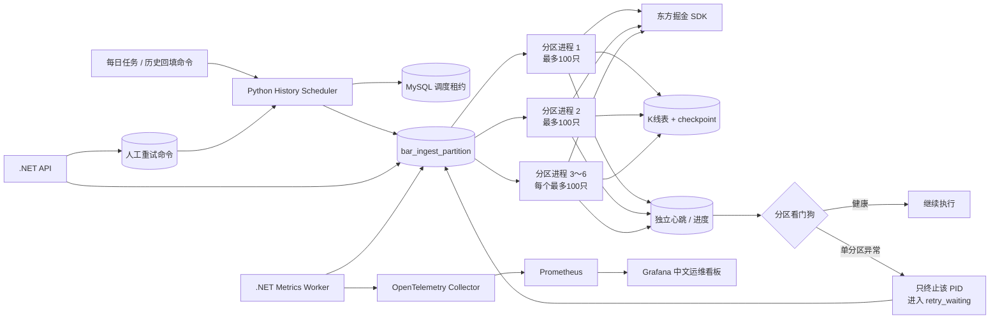
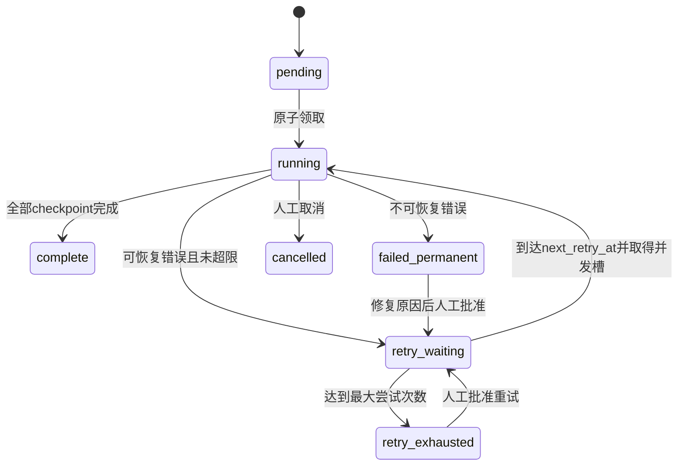

# 历史 K 线分区自动重试与监控方案

版本：V1.0  
日期：2026-08-14  
范围：东方掘金 SDK 历史 K 线下载分区，不包含 Tick 采集、策略计算和前端业务页面。

## 1. 目标

本方案在现有“6 个并发进程、每分区最多 100 只股票、独立 `partition_id`、独立心跳”的基础上补齐两个闭环：

1. 单个分区失败后自动重试并从 MySQL 断点续传，不终止其他健康分区；
2. 通过 `.NET API + OpenTelemetry + Prometheus + Grafana` 查看批次、分区、重试和看门狗状态。

验收后的核心保证：

- 全局并发始终不超过 6，重试进程也计入并发；
- 同一个 `partition_id` 同一时刻最多有一个有效进程；
- 失败不删除已写 K 线，不回退 `bar_ingest_checkpoint.next_date`；
- 自动重试只处理可恢复错误；配置、授权和结构错误不无限重试；
- API、Grafana 或 OpenTelemetry 故障不阻塞 K 线下载；
- Prometheus 不使用 `partition_id`、股票代码或 PID 作为标签，避免高基数指标；
- 每次尝试保留完整审计记录，能够回答“何时失败、为何失败、重试几次、由哪个 PID 执行”。

## 2. 职责边界

| 组件 | 职责 | 禁止事项 |
|---|---|---|
| Python History Scheduler | 领取分区、启动 SDK 子进程、看门狗、自动重试、断点续传 | 不提供公网接口，不写业务策略 |
| Python SDK 子进程 | 下载本分区最多 100 只股票并写心跳、进度和 K 线 | 不终止其他分区，不决定批次最终状态 |
| MySQL | 分区状态机、尝试历史、断点、人工命令和调度租约的权威存储 | 不用 Redis 保存可靠状态 |
| `.NET API` | 分页查询、详情查询、提交人工重试命令、Swagger 注释 | 不直接启动或终止 Windows Python 进程 |
| `.NET Metrics Worker` | 每 10 秒读取 MySQL 聚合状态并导出 OTLP 指标 | 不扫描每只股票，不输出高基数标签 |
| Prometheus/Grafana | 聚合指标、趋势、告警和浏览器可视化 | 不作为分区状态权威来源 |
| Loki | 保存结构化运行日志和故障上下文 | `partition_id` 不作为 Loki 标签，仅作为 JSON 字段 |

## 3. 总体架构



## 4. 分区状态机

### 4.1 状态定义

| 状态 | 含义 | 是否占用并发 |
|---|---|---:|
| `pending` | 首次等待执行 | 否 |
| `running` | 已由一个有效 PID 执行 | 是 |
| `retry_waiting` | 可恢复失败，等待 `next_retry_at` | 否 |
| `complete` | 分区所有股票和周期断点完成 | 否 |
| `retry_exhausted` | 达到最大尝试次数仍失败 | 否 |
| `failed_permanent` | 授权、配置、数据库结构等不可恢复错误 | 否 |
| `cancelled` | 人工取消且保留断点 | 否 |

`watchdog_terminated` 不再作为长期状态，而是一次尝试的 `failure_code`。这样分区被看门狗终止后可以进入 `retry_waiting`，同时保留真实原因。



### 4.2 默认重试策略

- 最大尝试次数：4 次，即首次执行加 3 次自动重试；
- 退避时间：30 秒、120 秒、300 秒；
- 每次增加 0～20% 随机抖动，避免多个分区同时冲击 SDK；
- 到期重试分区优先于新的 `pending` 分区，但全局活跃进程仍不得超过 6；
- 重试使用同一个 `partition_id`，每次进程执行生成新的 `attempt_id`；
- 重试前不重置 checkpoint，已完成的股票和周期由幂等断点直接跳过；
- 人工重试默认再增加 1 次授权额度，但必须写原因和幂等键。

### 4.3 错误分类

自动重试：

- `HEARTBEAT_LOST`：进程心跳超过 60 秒；
- `NO_PROGRESS`：进度心跳超过 900 秒；
- `SDK_TIMEOUT`、`SDK_NETWORK`、`SDK_RATE_LIMIT`；
- `PROCESS_EXIT`：子进程异常退出；
- `MYSQL_TRANSIENT`：连接中断、死锁、锁等待超时；
- `ORCHESTRATOR_RECOVERY`：调度器重启后接管遗留的 `running` 分区。

不自动重试：

- `TOKEN_INVALID`、`ENTITLEMENT_DENIED`；
- `INVALID_FREQUENCY`、`INVALID_CONFIGURATION`；
- `SCHEMA_MISMATCH`、`DATA_CONTRACT_ERROR`；
- 明确的股票代码永久无效。

无法识别的错误按可恢复错误处理一次；第二次仍为同类未知错误时转 `retry_exhausted`，防止死循环。

## 5. 调度与故障隔离

### 5.1 原子领取

调度器每 2 秒从 MySQL 领取到期分区：

```sql
SELECT partition_id
FROM bar_ingest_partition
WHERE status IN ('pending','retry_waiting')
  AND (next_retry_at IS NULL OR next_retry_at <= UTC_TIMESTAMP(6))
ORDER BY CASE status WHEN 'retry_waiting' THEN 0 ELSE 1 END,
         next_retry_at, partition_index
LIMIT 1
FOR UPDATE SKIP LOCKED;
```

同一事务内将状态改为 `running`、增加 `attempt_count`、创建 attempt 记录并写入 `owner_instance_id`。所有状态更新必须带 `row_version` 或当前状态条件，防止重复领取。

### 5.2 看门狗处理

1. 每 5 秒只读取当前调度器拥有的 `running` 分区；
2. 按各自 `partition_id` 判断心跳和进度，不使用整个 scope 的最大时间；
3. 只调用目标分区对应 `Process.terminate()`；
4. 等待最多 5 秒并回收 PID；
5. 关闭该 attempt，记录失败码、断点水位和错误；
6. 根据错误分类转入 `retry_waiting`、`retry_exhausted` 或 `failed_permanent`；
7. 释放一个并发槽并继续运行其他分区。

### 5.3 调度器重启恢复

增加单例调度租约，避免计划任务、手工命令和 Windows 服务重复启动造成双调度器：

- 租约每 10 秒续期，有效期 30 秒；
- 租约包含递增 `fencing_token`；
- 所有领取操作必须携带当前 token；
- 新调度器取得租约后，将“owner 租约已失效且心跳已过期”的 `running` 分区转为 `retry_waiting`；
- 仍有新鲜子进程心跳时不接管，避免误杀正常进程。

## 6. 数据库升级

新增迁移建议命名为 `016_history_partition_retry_and_monitoring.sql`。

### 6.1 扩展 `bar_ingest_partition`

新增字段：

```text
attempt_count            SMALLINT       默认0
max_attempts             SMALLINT       默认4
next_retry_at            DATETIME(6)    可空
failure_code             VARCHAR(64)    可空
retryable                BOOLEAN        默认true
owner_instance_id        VARCHAR(128)   可空
fencing_token            BIGINT         可空
current_attempt_id       BIGINT         可空
completed_tasks          INT            默认0
total_tasks              INT            非空
last_symbol              VARCHAR(32)    可空
last_frequency           VARCHAR(16)    可空
last_checkpoint_date     DATE           可空
row_version              BIGINT         默认0
manual_retry_count       SMALLINT       默认0
```

索引：

```text
(status, next_retry_at, partition_index)
(batch_id, status)
(owner_instance_id, status, heartbeat_at)
```

### 6.2 新增 `bar_ingest_partition_attempt`

一行表示一次真实进程执行：

```text
id, partition_id, batch_id, attempt_number,
owner_instance_id, process_id, status,
started_at, heartbeat_at, progress_at, finished_at,
rows_read, rows_written, rows_filtered,
completed_tasks, failure_code, error_message,
checkpoint_snapshot JSON
```

唯一键：`(partition_id, attempt_number)`。

### 6.3 新增 `history_scheduler_lease`

```text
lease_name, owner_instance_id, fencing_token,
heartbeat_at, lease_expires_at, updated_at
```

固定租约名：`official-kline-history-scheduler`。

### 6.4 新增 `history_control_command`

用于 `.NET API` 与 Windows Python 调度器解耦：

```text
id, request_id, command_type, batch_id, partition_id,
reason, requested_by, status,
created_at, claimed_at, completed_at, error_message
```

`request_id` 唯一，保证重复 HTTP 请求不会生成两个重试命令。

## 7. API 设计

所有接口纳入现有 `HistoryController` 或拆分为 `HistoryBatchesController`，提供完整中文 XML 注释并进入 Swagger。

### 7.1 批次分页

```http
GET /api/history/batches?page=1&pageSize=20&status=running&dateFrom=2026-08-01
```

返回：批次范围、周期、状态、股票数、分区状态汇总、完成百分比、写入量、重试次数、预计剩余秒数和开始/结束时间。

### 7.2 批次详情

```http
GET /api/history/batches/{batchId}
```

返回批次详情、各状态分区数量、当前 6 个活跃进程、心跳最大年龄、进度最大年龄、吞吐量和失败摘要。

### 7.3 分区分页

```http
GET /api/history/batches/{batchId}/partitions?page=1&pageSize=50&status=running&sort=progressAgeDesc
```

分页项包括：

```text
partitionId, partitionIndex, symbolCount, status,
processId, attemptCount, maxAttempts,
heartbeatAt, heartbeatAgeSeconds,
progressAt, progressAgeSeconds,
completedTasks, totalTasks, progressPercent,
rowsRead, rowsWritten, lastSymbol, lastFrequency,
nextRetryAt, failureCode, lastError, startedAt, finishedAt
```

列表默认不返回 `symbols_json`，避免一次响应过大。

### 7.4 分区详情与尝试历史

```http
GET /api/history/partitions/{partitionId}
```

返回完整股票列表、当前状态、断点摘要和所有 attempt 历史。

### 7.5 人工重试

```http
POST /api/history/partitions/{partitionId}/retry
Content-Type: application/json

{
  "requestId": "7ca9d41a-...",
  "reason": "已修复SDK登录状态，批准重新执行"
}
```

行为：

- API 只写 `history_control_command`，返回 `202 Accepted`；
- 写接口仅允许本机/受信网段，并校验独立的运维 API Key；查询接口保持现有内网访问方式；
- `running` 分区返回 `409 Conflict`，不允许并行重复执行；
- 不存在返回 `404`；
- 相同 `requestId` 返回首次结果，不重复创建；
- 调度器领取命令后转为 `retry_waiting`，从原 checkpoint 恢复；
- 保存请求时间、来源 IP 和操作理由。

建议同时提供批量入口：

```http
POST /api/history/batches/{batchId}/retry-failed
```

仅处理 `retry_exhausted` 和 `failed_permanent`，单次最多 100 个分区。

## 8. 指标设计

由 `.NET API` 中新增的 `HistoryPartitionMetricsWorker` 每 10 秒执行一次聚合 SQL，将结果保存在内存快照中，再由 OpenTelemetry ObservableGauge 导出。查询失败只记录指标和日志，不影响下载器。

| 指标 | 类型 | 标签 | 说明 |
|---|---|---|---|
| `astock.history.partitions` | Gauge | `status` | 最新活跃批次各状态分区数 |
| `astock.history.workers.active` | Gauge | 无 | 当前运行 PID 数，正常上限 6 |
| `astock.history.symbols.pending` | Gauge | 无 | 等待处理股票数 |
| `astock.history.batch.progress` | Gauge | 无 | 0～1 完成比例 |
| `astock.history.batch.rows.written` | Gauge | 无 | 当前批次累计写入量 |
| `astock.history.rows.rate` | Gauge | 无 | 最近采样窗口每秒写入量 |
| `astock.history.heartbeat.age.max` | Gauge | 无 | 运行分区最大心跳年龄，秒 |
| `astock.history.progress.age.max` | Gauge | 无 | 运行分区最大进度年龄，秒 |
| `astock.history.retries` | Gauge | `outcome` | waiting、succeeded、exhausted 数量 |
| `astock.history.watchdog.terminations` | Counter | `reason` | 从新增 attempt 记录按 ID 增量采集 heartbeat、progress、process_exit |
| `astock.history.batch.eta` | Gauge | 无 | 按近期吞吐估算的剩余秒数 |
| `astock.history.scheduler.lease` | Gauge | 无 | 有效租约为 1，否则为 0 |
| `astock.history.metrics.poll.failures` | Counter | 无 | 监控采集自身错误数 |

禁止给这些指标增加 `partition_id`、`symbol`、`pid`、`batch_id` 标签。详细定位通过分页 API 和 Loki 完成。

## 9. Grafana 看板与告警

现有中文运维总览增加“历史 K 线分区调度”一行：

1. 批次完成百分比；
2. 活跃进程数 / 配置并发数；
3. pending、running、retry_waiting、complete、exhausted 状态分布；
4. 每秒写入 K 线数量；
5. 最大心跳年龄；
6. 最大进度年龄；
7. 最近 1 小时自动重试与看门狗终止次数；
8. 预计剩余时间；
9. Loki 失败日志快捷查询；
10. Swagger 分区查询接口快捷链接。

告警规则：

| 告警 | 条件 | 等级 |
|---|---|---|
| `HistorySchedulerLeaseLost` | 活跃批次存在且租约为 0，持续 30 秒 | critical |
| `HistoryPartitionHeartbeatStale` | 最大心跳年龄大于 60 秒，持续 30 秒 | critical |
| `HistoryPartitionNoProgress` | pending/running 存在且最大进度年龄大于 900 秒 | warning |
| `HistoryRetryExhausted` | `retry_exhausted > 0` | critical |
| `HistoryWorkersUnderCapacity` | 待执行分区存在但活跃进程少于 6，持续 2 分钟 | warning |
| `HistoryThroughputStopped` | 待执行分区存在且写入速率为 0，持续 10 分钟 | warning |
| `HistoryMetricsPollFailed` | 5 分钟内采集失败次数大于 0 | warning |

## 10. 日志与追踪

Python 调度器和子进程输出结构化 JSON，固定字段：

```text
event, batch_id, partition_id, partition_index,
attempt_id, attempt_number, process_id,
symbol_count, frequency, failure_code,
heartbeat_age_seconds, progress_age_seconds,
rows_read, rows_written, elapsed_ms
```

事件至少包括：

```text
partition_claimed, partition_started, partition_progress,
partition_completed, partition_failed, watchdog_terminated,
partition_retry_scheduled, partition_retry_started,
partition_retry_exhausted, scheduler_lease_acquired,
scheduler_lease_lost, manual_retry_accepted
```

Loki 标签只使用 `service=history-scheduler`、`level`、`event`。`partition_id` 保留在 JSON 正文中供查询，避免高基数标签。

## 11. 开发顺序

### 阶段 A：数据库与状态机

1. 增加迁移 016；
2. 增加分区 attempt、调度租约和人工命令仓储方法；
3. 统一错误分类；
4. 将 `watchdog_terminated` 改为失败码并进入重试状态；
5. 增加调度器重启后的遗留分区接管。

### 阶段 B：Python 自动重试

1. 本地 pending 列表改为 MySQL 原子领取；
2. 将到期重试与首次分区放入同一 6 槽调度器；
3. 每次运行创建 attempt；
4. 按错误类型退避；
5. 处理人工重试命令；
6. 增加结构化日志和单元测试。

### 阶段 C：`.NET` 查询与命令接口

1. 增加批次分页、详情、分区分页和分区详情；
2. 增加人工重试和批量重试命令；
3. 增加参数校验、幂等、冲突响应和中文 Swagger 注释；
4. API 查询设置 3 秒命令超时，分页上限 200；
5. 为查询索引执行 `EXPLAIN` 验证。

### 阶段 D：指标、看板和告警

1. 实现 10 秒 MySQL 聚合采样；
2. 增加 OpenTelemetry 指标；
3. 更新 Prometheus 告警；
4. 更新 Grafana 中文看板；
5. 验证 Loki 故障日志检索。

### 阶段 E：故障演练与上线

1. 人工终止一个子进程；
2. 模拟 SDK 超时、MySQL 短暂断连和调度器重启；
3. 确认其他 5 个进程持续运行；
4. 确认失败分区从原 checkpoint 恢复且无重复 K 线；
5. 灰度到 2 个进程，再恢复 6 个进程；
6. 连续运行一个完整 60 日增量批次后验收。

当前正在运行的 015 版回填批次不做热切换。先让它完成；如必须提前部署，则先正常停止父调度器并保留 checkpoint，确认没有 `running` 子进程后再执行迁移 016。禁止在旧调度器仍运行时启用新状态机。

## 12. 验收标准

- 终止一个 PID 后 60 秒内只影响该分区；
- 该分区进入 `retry_waiting`，到期后重新运行；
- 其他 5 个运行分区心跳连续、PID 不被终止；
- 重试后 K 线唯一键无重复，checkpoint 不回退；
- 同一分区永远不会同时出现两个有效 attempt；
- 自动尝试总次数严格受 `max_attempts` 控制；
- 调度器重启后能接管过期分区，不接管仍有新鲜心跳的分区；
- API 分页、筛选、排序和 Swagger 注释完整；
- 人工重试接口具备幂等与审计记录；
- Prometheus 能查询全部指标，Grafana 中文面板正常；
- 每条告警至少完成一次可重复的故障演练；
- API、OTLP、Prometheus 暂停时，SDK 下载和 MySQL 固化继续运行。

## 13. 本期不做

- 不开发业务前端页面；
- 不修改对子顶底和 8 个策略算法；
- 不把 Tick 写入 MySQL；
- 不由 `.NET API` 直接控制 Windows PID；
- 不把 Redis 作为重试队列或可靠状态源；
- 不自动重试明确的 Token、授权和结构错误。

## 14. 建议工期

| 阶段 | 预计工作量 |
|---|---:|
| 数据库与状态机 | 0.5～1 天 |
| Python 自动重试与租约 | 1～1.5 天 |
| `.NET` 分页和命令接口 | 1 天 |
| 指标、Grafana、告警 | 0.5～1 天 |
| 故障演练和修正 | 0.5～1 天 |

合计预计 3.5～5.5 个开发日。建议按 A→B→C→D→E 顺序一次完成，不在状态机稳定前先做看板外观。

## 15. 实施记录

2026-08-14 已完成：

- 应用数据库迁移016；
- Python自动重试、attempt审计、错误分类、调度租约和人工命令领取；
- `.NET API` 批次/分区分页、详情、单分区与批次重试命令接口；
- OpenTelemetry聚合指标、Prometheus告警和Grafana中文面板；
- 24项Python测试和完整.NET Release构建通过；
- 真实故障演练中，PID 21412退出后仅分区0进入`retry_waiting`，分区1的PID 26628持续运行；
- 退避结束后分区0以新PID 9776启动第2次attempt，分区1仍保持原PID和第1次attempt；
- 发现并修复SDK原生调用占用GIL导致线程心跳停顿的问题：存活心跳改由调度器按实际PID独立写入，业务进度仍由子进程写入；
- Swagger已显示全部历史分区接口；对运行分区提交重试得到HTTP 409，未产生重复执行；
- Prometheus实测活跃进程为2、调度租约为1，指标链路正常。

当前批次22正在后台增量补回上批次未完成的200只股票。该任务继续使用checkpoint幂等续传。
