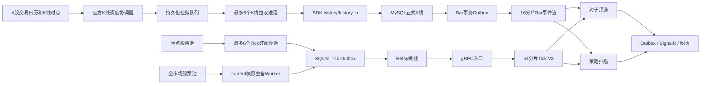

# 行情采集 V4 可执行改造方案

> 版本：V4.0  
> 日期：2026-08-14  
> 适用环境：Windows、东方掘金 Python SDK、.NET 10、MySQL、Redis  
> 目标：全市场官方 K 线主动拉取、重点股票实时 Tick 订阅、全市场 `current()` 快照轮询。

## 0. 实施状态（2026-08-14）

V4 已于 2026-08-14 收盘后完成正式切换。对子 V3 全市场回放运行 3 以 5015/5015、0 失败完成，随后装载 88,272 个有效事件作为盘中基线；API、Worker、StrategyScanner 均已按 Windows 服务运行，Snapshot、HotTick、Recovery 均已替换为隐藏计划任务。当前仍需在下一个完整交易日完成延迟和周期时限验收。

已完成：

- Tick/gRPC协议增加 `collection_mode`、`source_priority`，Redis Latest同一事件时点按来源优先级择优；
- Outbox、gRPC入口和Redis写入同时校验 `event_time/receive_time`，过期快照不能覆盖当前行情；
- 新增全市场 `current()` Snapshot Worker、Redis主租约、交易时段控制、覆盖率与时效状态；
- 新增重点Tick池协调器，来源包括对子观察/重点/成立、活跃策略机会、人工高优先级池；
- 新增动态Tick Supervisor，最多6个SDK会话、每会话最多50只，分配变化只重启受影响会话；
- 原SDK进程改成Tick-only，不再订阅5m/30m/60m/1d；
- 新增官方K线时点调度器，按5m→30m→60m→1d设置同边界屏障；
- Recovery Provider支持精确BOB/EOB窗口；每个进程一次领取最多50只同运行、同周期、同窗口股票并执行一次SDK批量请求，每只仍独立落库和重试；六个常驻进程继续使用MySQL租约、`SKIP LOCKED`、幂等写入和自动重试；
- `official-v4-*` 周期运行完成后直接标记完成，由Bar事件驱动对子和策略增量消费；不会触发普通缺口恢复使用的45天历史对子重算；
- 快照1分钟预览采用累计量差值，订阅/快照切换共享累计水位，避免成交量重复；
- 策略读取只使用Tick V3，V4启用后彻底关闭V2 Latest兼容回退，并按来源应用15秒/120秒新鲜度；
- `GET /api/market-collection-v4/status` 和 `GET /api/market-collection-v4/hot-tick-symbols` 已加入Swagger；
- Grafana/Prometheus增加快照年龄、周期耗时、重点池规模、SDK会话数及对应告警；
- 所有新增Python采集程序均由WScript隐藏启动，不产生控制台窗口。
- 调度器从MySQL接管同交易日、同周期、同边界的既有运行，Worker重启不重复创建补数任务；
- 六进程恢复把明细提交与共享运行汇总拆成不同事务，消除多进程锁顺序死锁；
- 官方K线允许停牌/临停造成的权威空槽，同时继续拒绝越界、重复、重叠和OHLCV异常；
- 历史补数照常重建对子状态，但超过实时窗口的Bar事件不产生过期策略卡片或对子警报。
- MySQL已采用北京时间，恢复运行、缺口检测及完成时间统一使用 `CURRENT_TIMESTAMP(6)`；已修复开始/结束时间相差8小时导致的运维状态倒序。

验证结果：Python测试47项通过；解决方案Release全量编译0警告、0错误；Grafana Dashboard JSON可解析；真实SDK已验证 `current()` 与多股票精确5分钟窗口；V4状态接口已返回 `enabled=true`，重点Tick池稳定选出300只并分配6个会话。

首次正式拉取结果：5m、30m、60m、1d 四个运行均完成5000/5000只、0失败、0质量问题，分别新增219,005、36,066、18,922、5,000根官方K线。当日正式表最终覆盖5000只股票，共有239,986根5m、40,000根30m、20,000根60m和5,000根日线；官方确认、来源优先级、质量状态及OHLCV检查均为0异常。一次Worker重启测试产生的重复5m运行在下载前取消，持久化幂等守卫已补齐。

事件链路结果：319,914条Bar Outbox记录全部发布；16个Redis Bar分片上的SignalR、对子V3、策略扫描三个消费组均为 `pending=0、lag=0`；对子与策略消息Outbox无待发布数据。Bar Outbox发布已改成1000条微批、并发写Redis、单SQL批量确认，正式回放产生的积压已完全排空。

切换脚本：`scripts/activate-market-collection-v4.ps1` 已执行。后续发布仍使用同一脚本完成预检、当日股票池刷新、服务发布、基线装载和任务注册；交易时段灰度验收仍是最终完成条件。

## 1. 结论与实施边界

本次改造采用三条独立采集通道：

1. 全市场 `5m/30m/60m/1d` 使用官方接口按交易时点主动拉取；
2. Tick 只订阅重点观察股票；
3. 全市场最新价格使用 `current()` 快照轮询。

正式 K 线仍然只认东方掘金官方数据，Tick 仍然不写 MySQL。现有 MySQL K 线表、K 线事务 Outbox、Redis Bar 事件流、对子状态机、策略消息、SignalR 和网页不重建。

本次不是简单修改几个订阅参数。采集层需要中等规模改造，但下游约 80% 的链路可直接复用。

## 2. 目标架构



## 3. 三类数据的正式口径

| 数据 | 覆盖范围 | 获取方式 | 目标延迟 | 存储 |
|---|---|---|---:|---|
| 5m K线 | 沪深非ST全市场 | 每个正式5分钟时点主动拉取 | 收盘后60秒内完成全市场 | MySQL |
| 30m K线 | 沪深非ST全市场 | 官方30分钟时点主动拉取 | 收盘后90秒内 | MySQL |
| 60m K线 | 沪深非ST全市场 | 官方60分钟时点主动拉取 | 收盘后90秒内 | MySQL |
| 1d K线 | 沪深非ST全市场 | 15:05开始主动拉取 | 15:10前 | MySQL |
| 实时Tick | 重点观察股票 | SDK实时订阅 | P95不高于1秒 | Redis当日层 |
| 最新快照 | 沪深非ST全市场 | `current()`循环查询 | 一轮3～5秒 | Redis当日层 |
| 1分钟预览 | 全市场 | 快照采样聚合；重点股由完整Tick增强 | 约1分钟 | Redis当日层 |

K线表继续使用：

- `kline_bar_5m`
- `kline_bar_agg`：`30m/60m`
- `kline_bar_daily`

禁止恢复 `quote_tick` MySQL 写入。

## 4. 官方K线主动拉取

### 4.1 调度方式

不得使用“服务启动后每隔5分钟”的普通定时器。调度器必须按照交易日历和正式 K 线结束时间运行。

- 5分钟：`09:35～11:30`、`13:05～15:00`的正式5分钟边界；
- 30分钟：使用 `ChinaBarSlotGenerator` 生成的官方结束时间；
- 60分钟：使用 `ChinaBarSlotGenerator` 生成的官方结束时间，不跨午休；
- 日线：`15:00`结束，默认 `15:05`开始拉取；
- 非交易日、停牌股票不制造无限重试任务；
- 服务重启后，根据 MySQL 已有水位补齐遗漏的正式时点。

默认数据就绪宽限：

| 周期 | 首次执行时间 |
|---|---:|
| 5m | EOB + 15秒 |
| 30m | EOB + 20秒 |
| 60m | EOB + 30秒 |
| 1d | 15:05 |

宽限时间必须配置化，并通过交易时段实测校准。

### 4.2 六进程与500只分区

- 每个逻辑分区最多500只股票；
- 同时最多运行6个 Python 拉取进程；
- 约5000只股票形成约10个分区；
- 前6个分区并行，其余分区排队；
- 一个进程完成当前分区后立即领取下一分区；
- 分区内按更小的 SDK 请求批次执行，建议从50只开始压测，不把500只一次性塞入大响应；
- 每只股票保留独立状态，单只失败不能让整个500只分区失败。

调度和任务状态优先复用：

- `market_recovery_run`
- `market_recovery_item`
- 现有租约、`next_retry_at`、`retry_count` 和 `SKIP LOCKED` 领取逻辑；
- 现有6进程 `start-recovery-worker.ps1`；
- 现有恢复任务状态接口和指标。

正常周期任务的 `trigger_type` 使用 `official-v4-{frequency}-{HHmm}`，旧缺口扫描继续保留原触发口径但在V4启用后不再并行运行。两者共享同一缺口唯一键，不能重复创建同一股票、周期、EOB的任务。

### 4.3 请求窗口

盘中增量拉取禁止每5分钟重新下载整天数据。Provider需要支持精确时点请求：

```text
symbol + frequency + expected_bob + expected_eob
```

优先使用短时间窗口 `history()`；如果SDK对当前周期支持稳定的 `history_n(count=1, end_time=eob)`，可作为优化，但必须校验返回 EOB 与期望一致。

每次允许向前重叠一个周期，用确定性 `row_hash` 和数据库唯一键去重，以处理官方修订。

### 4.4 同时点的周期顺序屏障

同一股票、同一 EOB 必须按以下顺序进入业务事件流：

```text
5m → 30m → 60m → 1d
```

调度协调器按频率建立屏障：

1. 先完成该时点全部5m任务，或将无法完成项明确标为可重试；
2. 再开放30m任务；
3. 再开放60m任务；
4. 15:00最后开放1d任务；
5. 迟到或重试成功的低周期事件到达后，触发该股票的状态重算，防止高周期证据曾被提前忽略。

不能仅依赖6个进程自然完成顺序。

### 4.5 失败重排

| 尝试 | 等待时间 |
|---:|---:|
| 1 | 5秒 |
| 2 | 15秒 |
| 3 | 30秒 |
| 4 | 60秒 |
| 5 | 120秒 |

失败分类：

- 网络、超时、SDK临时错误：进入 `retry_waiting`；
- 返回空但股票停牌/未上市：`verified_no_bar`；
- 超出分钟历史 60 自然日：`source_expired`；
- 代码无效、退市、无权限：进入隔离状态，不无限重试；
- 进程崩溃：租约过期后由其他进程领取；
- 看门狗只处理心跳和进度同时停止的分区。

### 4.6 落库和事件发布

继续调用现有 `HistoryDatabase.upsert_bars(..., emit_events=True)`：

```text
SDK官方K线
  → OHLC/成交量校验
  → MySQL幂等Upsert
  → bar_event_outbox同事务写入
  → Worker发布到Redis Bar流
  → StrategyScanner消费
```

不允许 Python 在 MySQL 提交前直接发布业务 Bar 事件。

## 5. 全市场 current() 快照轮询

### 5.1 运行模型

- 一个主 Worker 执行轮询；
- 一个备用 Worker仅持有候选资格，不并发调用；
- Redis租约保证单活；
- 当前一轮未完成时不启动下一轮；
- 目标一轮3～5秒；
- 一轮超过10秒触发告警；
- 一轮超过30秒进入降级，只保留最新快照，不追赶历史快照。

虽然实测一次获取5000只约3秒，仍需保留可配置小批次模式。默认先测试 `500/1000/5000` 三档，选择请求耗时、行情新鲜度和错误率最稳定的档位。

### 5.2 必须校验行情新鲜度

接口响应快不等于行情新。每轮必须记录：

```text
request_elapsed = 响应时间 - 请求时间
quote_age = 本机当前时间 - created_at
coverage = 返回股票数 / 应返回股票数
```

默认规则：

- `created_at`晚于本机时间30秒以上：拒绝并告警时钟；
- 交易时段 `quote_age > 15秒`：标记 `STALE`；
- 单轮覆盖率低于99%：将缺失股票加入下一轮优先队列；
- 连续3轮缺失：进入失败队列并告警。

### 5.3 数据模式

Tick数据协议增加采集模式：

```text
REALTIME_SUBSCRIPTION
SNAPSHOT_POLL
GAP_RECOVERY
SIMULATION
```

`SNAPSHOT_POLL`是采样快照，不得在API或页面上宣称为完整逐笔Tick。

### 5.4 与重点订阅去重

重点股票会同时存在于全市场快照结果中。发布规则：

1. `current()`可以查询全部股票；
2. 已健康订阅的重点股票不把快照追加为普通Tick Stream事件；
3. 重点订阅超过2秒无数据时，允许快照作为降级数据更新 Latest；
4. 同一事件时间下，优先级为 `REALTIME_SUBSCRIPTION > SNAPSHOT_POLL`；
5. 快照不能重复累加订阅股票的 `last_volume/last_amount`；
6. 最新行情投影按 `event_time + source_priority + sequence` 比较，不允许旧快照覆盖新Tick。

### 5.5 复用现有链路

快照标准化后继续复用：

```text
normalize_tick
  → SQLite Outbox
  → Relay微批
  → gRPC
  → Redis V3 Latest/Stream
```

需要将当前只检查 `receive_time` 的过期判断改成同时检查 `event_time`，防止主动查询的旧数据被伪装为实时行情。

## 6. 重点股票Tick订阅

### 6.1 重点股票来源

默认候选集合：

1. 用户手工关注股票；
2. 对子阶段为 `OBSERVING`；
3. 对子阶段为 `FOCUS`；
4. 对子阶段为 `ESTABLISHED`；
5. 当前有效策略任务关联股票。

默认优先级：

```text
手工关注 > ESTABLISHED > FOCUS > OBSERVING > 有效策略任务
```

优先级和最大容量配置化。

### 6.2 容量

当前SDK每个进程/会话最多50只：

```text
最多6个SDK订阅Worker × 50只 = 最多300只重点股票
```

如果重点集合超过300只：

- 先按业务阶段排序；
- 同阶段按当前价距离关键价格的比例排序；
- 未进入订阅池的股票继续由3～5秒快照和5分钟K线兜底；
- 页面和监控必须显示“候选数、已订阅数、因容量未订阅数”。

### 6.3 动态订阅

当前 `worker.py` 只在 `init()` 时固定订阅，需要改为：

- SDK Worker全天常驻；
- 通过控制通道接收分配版本和目标股票列表；
- 在SDK安全执行线程调用 `subscribe()`/`unsubscribe()`；
- 变更股票不重启整个采集池；
- 每个Worker上报实际订阅列表和版本；
- 调度端只有在6个Worker确认后才将分配标记为生效；
- 退订采用至少30秒驻留和10秒防抖，避免来回抖动。

现有 gRPC `AssignmentCommand` 可以扩展使用，但Relay收到命令后必须通过明确IPC交给SDK Worker，不能只更新Relay自身状态。

### 6.4 移除K线订阅

Tick Worker中删除：

```python
for frequency in ("300s", "1800s", "3600s", "1d"):
    subscribe(...)
```

Tick Worker只保留 `frequency="tick"`。正式四周期K线全部由第4节的主动拉取通道提供。

### 6.5 断线恢复

重点股票订阅恢复后允许调用：

```text
history(symbol, "tick", last_event_time-overlap, now)
```

规则：

- 最大补Tick窗口120秒；
- 保留1～2秒重叠并按确定性 `event_id` 去重；
- 超过120秒不追赶完整Tick，立即恢复订阅并依靠快照、5分钟K线补偿；
- `GAP_RECOVERY` Tick不得覆盖时间更新的实时订阅数据。

## 7. 对子顶底适配

对子阶段链路保持：

```text
5m发现 → 30m观察 → 60m重点 → 1d成立
```

变更点：

- 5m/30m/60m/1d证据改由主动拉取产生；
- 重点订阅Tick继续提供亚秒级突破；
- 未订阅股票的快照可提供3～5秒突破判断；
- 5分钟官方K线仍是最终可靠兜底；
- `TOP`严格大于对子价失效，`BOTTOM`严格小于对子价失效；
- 快照和迟到Tick必须保证 `event_time > first_seen_at`；
- 同一股票迟到低周期K线成功补入后，触发该股票对子状态重建。

对子通知、生命周期、Outbox和页面无需改变业务口径。

## 8. 策略扫描适配

当前8个策略都需要最新价和盘中特征，其中以下2个明确依赖连续1分钟覆盖：

- `intraday-vwap-volume-resonance`
- `gap-recovery-vwap-restart`

改造后：

- Redis Latest由全市场快照保持覆盖；
- 1分钟预览由3～5秒快照采样聚合；
- 重点股票的完整Tick增强1分钟预览；
- 1分钟数据增加质量等级：`FULL_TICK/SAMPLED_SNAPSHOT/INSUFFICIENT`；
- 依赖精确1分钟量价的策略在 `SAMPLED_SNAPSHOT` 下先产生候选，不直接产生最高等级提醒；
- 候选进入重点订阅后，用完整Tick窗口二次确认；
- 市场平均涨跌幅继续基于全市场Latest计算。

历史回放继续使用历史K线，不读取盘中快照。

## 9. Redis和数据保留

- Tick仍不写MySQL；
- Tick V3明细正常安全裁剪窗口保持30分钟；
- Latest、LatestMeta、Watermark键TTL保持36小时；
- 快照与实时Tick使用同一交易日隔离；
- 增加 `collection_mode` 和 `source_priority`；
- 近期Tick接口必须返回数据模式，普通股票只能称为“采样快照序列”；
- Redis不可用时，SQLite Outbox只保留120秒内值得重放的Tick；正式K线由MySQL事务Outbox可靠保留。

## 10. 代码改造清单

### 10.1 Python采集端

| 文件/模块 | 改造 |
|---|---|
| `collector/astock_collector/worker.py` | 删除四周期K线订阅，SDK会话只接收Tick |
| 新增 `hot_tick_supervisor.py` | 从Redis重点池生成最多6×50分配，变化时只重启受影响的SDK/Relay进程对 |
| 新增 `snapshot_worker.py` | `current()`全市场快照、租约、覆盖率、新鲜度、失败重排 |
| `normalizer.py` | 增加 `collectionMode/sourcePriority`，保留确定性事件ID |
| `grpc_publisher.py` | 快照和订阅Tick统一通过SQLite Outbox及gRPC微批发布 |
| `history/provider.py` | 支持精确BOB/EOB短窗口，不重复下载整天K线 |
| `history/recovery.py` | 同窗口最多50只一次SDK请求，每只独立落库/重试，六进程消费队列 |
| 新增重点Tick启动脚本 | 替换旧采集任务动作，使用WScript隐藏启动 |
| 新增快照启动脚本 | 隐藏窗口、单活租约、主备拉起 |

### 10.2 .NET服务端

| 文件/模块 | 改造 |
|---|---|
| `MarketGapScanWorker` | 重构为正式时点协调器；启动遗漏追赶和频率屏障 |
| 新增 `TickSubscriptionCoordinator` | 汇总重点集合、排序、分配和容量降级 |
| `TickEvent`及gRPC协议 | 增加可选 `collection_mode/source_priority`，保持向后兼容 |
| `RedisTickStreamPublisher` | Latest比较增加来源优先级；旧元数据兼容迁移 |
| `IntradayPreviewWorker` | 识别完整Tick和快照采样，避免重复成交量 |
| `StrategyMarketDataReader` | 读取1分钟质量等级，保持全市场Latest覆盖 |
| `PairTrendTickInvalidationWorker` | 接受订阅Tick和合格快照，拒绝迟到/过期数据 |
| 运维状态接口 | 增加K线周期、快照、重点订阅三组状态 |

### 10.3 数据库

复用现有K线、Recovery和Outbox表。迁移022只为批量领取增加
`(recovery_run_id,frequency,gap_start,gap_end,status,lease_expires_at)`组合索引；
采集模式保存在Tick消息和Redis投影中，不新增Tick明细表。

所有DDL必须形成新迁移文件，不直接改旧迁移。

## 11. 配置建议

```json
{
  "MarketCollectionV4": {
    "Enabled": false,
    "OfficialBars": {
      "Enabled": false,
      "MaxWorkers": 6,
      "SymbolsPerPartition": 500,
      "RequestBatchSize": 50,
      "FiveMinuteGraceSeconds": 15,
      "ThirtyMinuteGraceSeconds": 20,
      "SixtyMinuteGraceSeconds": 30,
      "DailyStartTime": "15:05:00",
      "MaxRetries": 5
    },
    "Snapshot": {
      "Enabled": false,
      "TargetCycleSeconds": 5,
      "WarnCycleSeconds": 10,
      "StaleQuoteSeconds": 15,
      "MinimumCoveragePercent": 99.0,
      "LeaderLeaseSeconds": 15
    },
    "HotTick": {
      "Enabled": false,
      "MaxWorkers": 6,
      "SymbolsPerWorker": 50,
      "MaxSymbols": 300,
      "MinResidenceSeconds": 30,
      "AssignmentDebounceSeconds": 10,
      "MaxGapRecoverySeconds": 120
    }
  }
}
```

上线前所有新通道默认关闭，通过功能开关逐步启用。

## 12. 状态接口和指标

新增或扩展：

```text
GET /api/market-data/collection/status
GET /api/market-data/collection/runs
GET /api/market-data/snapshot/status
GET /api/market-data/subscriptions
GET /api/pair-trends/live/status/ticks
```

核心指标：

```text
astock_official_bar_job_duration_seconds{frequency}
astock_official_bar_partition_queue{frequency,status}
astock_official_bar_missing_total{frequency}
astock_snapshot_cycle_duration_seconds
astock_snapshot_quote_age_seconds
astock_snapshot_coverage_ratio
astock_hot_tick_desired_symbols
astock_hot_tick_assigned_symbols
astock_hot_tick_capacity_dropped_symbols
astock_hot_tick_latency_seconds
astock_market_outbox_pending{type}
```

告警：

- 5m全市场任务未在下一周期前完成；
- 分区心跳和进度同时停止；
- 快照一轮超过10秒；
- 快照覆盖率连续3轮低于99%；
- 交易时段行情年龄P95超过5秒或最大值超过15秒；
- Tick订阅实际列表与目标列表持续30秒不一致；
- Outbox持续积压；
- 同一股票同一EOB出现周期乱序未完成重算。

## 13. 开发实施顺序

### 阶段A：基线与压测

1. 固化当前1000只订阅链路的CPU、内存、延迟和策略命中基线；
2. 交易时段压测 `current()` 的500、1000、5000股票请求；
3. 压测K线精确窗口的50、100、500股票分区；
4. 确认全市场5m任务可在5分钟内稳定完成；
5. 输出基线报告，不切换生产来源。

完成标准：快照周期、行情年龄、覆盖率、SDK错误率和K线全市场完成时间均有实测值。

### 阶段B：官方K线主动拉取

1. 改造精确时间窗口Provider；
2. 将 `MarketGapScanWorker` 升级为正式时点协调器；
3. 接入6进程、500只分区和失败重排；
4. 实现周期顺序屏障；
5. 影子运行主动拉取，保留旧K线订阅；
6. 对比两种来源的行数、OHLC、成交量、EOB和到达时间；
7. 连续一个完整交易日通过后关闭SDK K线订阅。

完成标准：四周期零重复、无无法解释缺口、无周期乱序，Bar Outbox正常发布。

### 阶段C：全市场快照

1. 实现快照主备、单活租约和批量调用；
2. 增加采集模式、新鲜度和覆盖率；
3. 先写入影子Redis键，不影响现有策略；
4. 与原订阅最新价对比；
5. 验证稳定后切换Redis Latest来源；
6. 接入采样1分钟预览并标记质量等级。

完成标准：全市场Latest覆盖率不低于99%，交易时段行情年龄P95不高于5秒。

### 阶段D：重点Tick订阅

1. 实现重点股票选择和容量排序；
2. 接通分配命令、SDK动态订阅和确认；
3. 初期固定50只灰度；
4. 扩至150只；
5. 最后扩至最大300只；
6. 验证订阅与快照重叠去重；
7. 关闭旧1000只固定Tick订阅。

完成标准：重点Tick延迟P95不高于1秒，进程数稳定，无窗口弹出，无成交量重复累计。

### 阶段E：对子和策略验收

1. 模拟5m发现、30m观察、60m重点、1d成立；
2. 验证重点Tick突破在1秒内失效；
3. 验证普通股票快照突破在一个快照周期内失效；
4. 断开快照和Tick，验证5m兜底；
5. 比较2个分钟策略在完整Tick和快照采样下的差异；
6. 校准策略二次确认规则；
7. 验证SignalR和网页任务卡片无重复提醒。

完成标准：对子生命周期一致性校验全部为0，策略无全市场 `LatestQuoteMissing` 异常。

### 阶段F：正式切换

1. 选择非交易时段发布；
2. 先启动MySQL、Redis、Worker和API；
3. 启用官方K线主动拉取；
4. 启用全市场快照；
5. 启用重点Tick池；
6. 启动StrategyScanner；
7. 禁用旧固定1000只五类订阅；
8. 开盘前检查股票池、任务水位和订阅分配；
9. 交易时段持续观察至少一个完整交易日。

## 14. 验收清单

### 数据正确性

- [ ] 5m/30m/60m/1d只保存官方确认K线；
- [ ] 同股票、周期、EOB无重复；
- [ ] OHLC关系、成交量和成交额校验为0异常；
- [ ] 同EOB业务事件顺序为5m、30m、60m、1d；
- [ ] 缺失任务能自动重排；
- [ ] 日线在收盘后完成；
- [ ] Tick未写入MySQL。

### 时效性

- [ ] 5m全市场任务在下一周期前完成；
- [ ] 快照一轮稳定在目标3～5秒；
- [ ] 快照行情年龄P95不高于5秒；
- [ ] 重点Tick延迟P95不高于1秒；
- [ ] 普通对子突破不超过一个快照周期；
- [ ] 5m兜底可在实时链路故障时生效。

### 稳定性

- [ ] K线进程不超过6个；
- [ ] Tick SDK进程不超过6个；
- [ ] 单分区失败不影响其他分区；
- [ ] 单股票失败不阻塞500只分区；
- [ ] SDK、Redis、MySQL短暂中断可恢复；
- [ ] 所有Python进程隐藏运行；
- [ ] 无持续增长的Outbox、Pending和重试队列；
- [ ] API、对子、策略和网页无重复消息。

## 15. 回滚方案

新功能全部由独立开关控制。回滚不删除已写入的正式K线，因为写入幂等且来源仍是官方SDK。

回滚顺序：

1. 关闭 `HotTick.Enabled`；
2. 关闭 `Snapshot.Enabled`；
3. 关闭 `OfficialBars.Enabled`；
4. 恢复旧股票池文件；
5. 启动旧1000只固定订阅采集器；
6. 保留MySQL K线和Bar Outbox；
7. 检查Redis Latest恢复、Bar事件继续发布；
8. 恢复StrategyScanner。

出现以下任一情况立即回滚：

- 连续两个5分钟周期未完成全市场K线；
- 快照覆盖率持续低于95%；
- 大量策略出现 `LatestQuoteMissing`；
- K线周期乱序造成对子晋级遗漏；
- Tick和快照重复导致成交量明显放大；
- SDK限流或错误率持续上升且无法通过减小批次恢复。

## 16. 本次开发完成定义

只有同时满足以下条件，V4才算完成：

1. 旧1000只股票的五类SDK订阅已退出；
2. 全市场四周期K线按时主动获取并可靠落库；
3. 全市场最新价格由 `current()` 稳定更新；
4. 重点股票由最多6个SDK会话实时订阅；
5. 对子顶底、8个策略、消息推送和网页均通过真实交易时段验收；
6. 缺口、重试、心跳、延迟和容量均可在Grafana及状态接口查看；
7. 回滚脚本通过演练。
