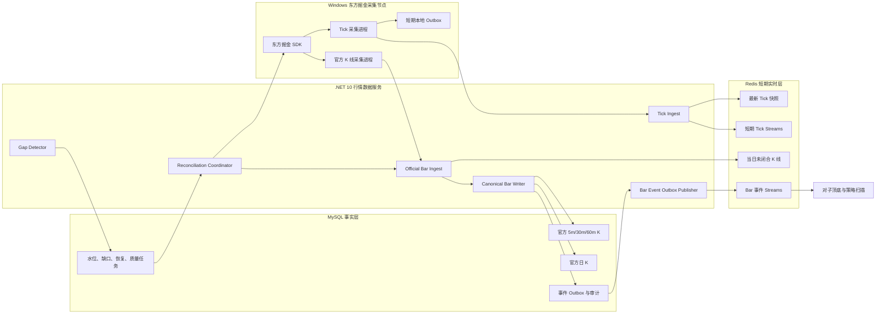
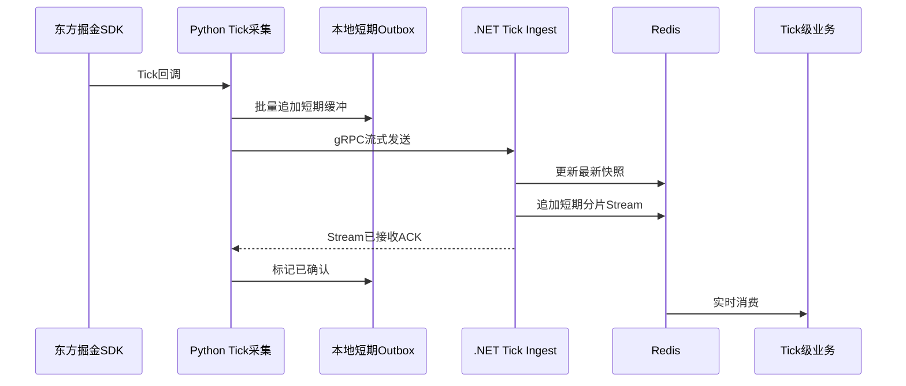
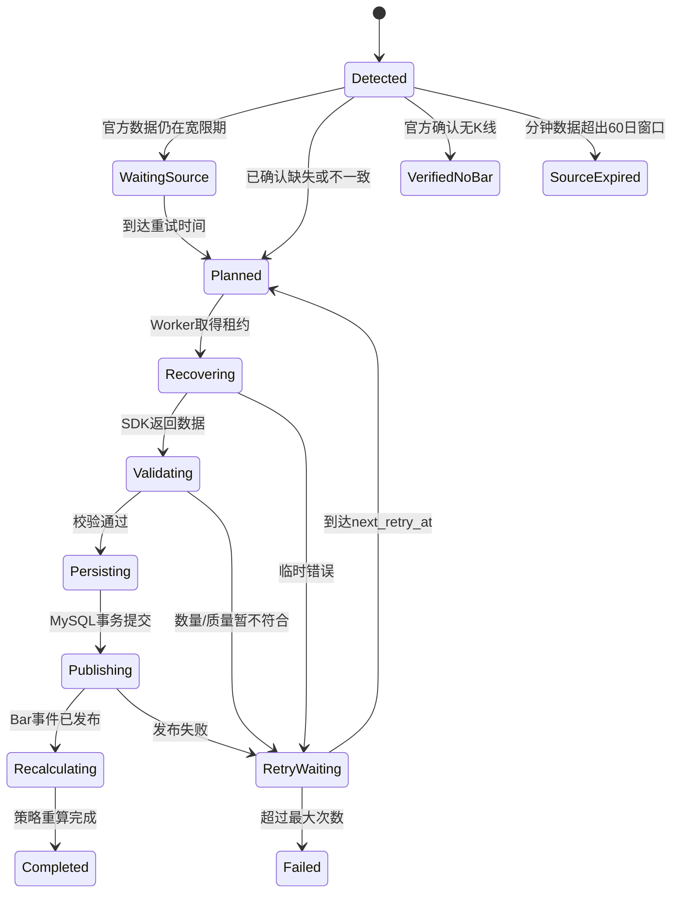
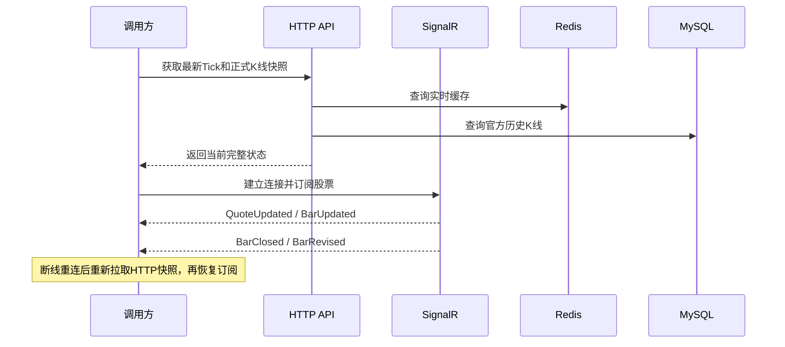

# 行情数据存储与官方 K 线补数 V2 方案

> 文档状态：待实施  
> 适用项目：A股监控程序  
> 目标平台：Windows 东方掘金采集端；.NET 10 服务端可部署在 Windows 或 Linux；MySQL、Redis 可运行在 Docker/WSL2  
> 本方案只调整行情数据底座与缺口恢复链路，不改变对子顶底和八个策略的业务规则。

## 1. 决策结论

本次把以下两项修改作为一个整体实施，不能只修改其中一项：

1. Tick 降级为短期实时数据：只进入进程内存、Redis 和采集端短期故障缓冲，不再写入 MySQL。
2. 5 分钟、30 分钟、60 分钟和日 K 线全部以东方掘金 SDK 返回的数据为正式事实，闭合后增量、幂等写入 MySQL。
3. 当日未闭合 K 线放在 Redis；正式闭合 K 线在盘中立即写入 MySQL，不能等到收盘统一落库。
4. 取消 1 分钟 K 线正式存储和默认补数；取消“由 Tick 生成正式 K 线”的职责。
5. 5 分钟聚合 30/60 分钟只保留为质量校验能力，不再作为正式 30/60 分钟 K 线的数据来源。
6. 缺口恢复服务只检测和补充 5m、30m、60m、1d 官方 K 线，不补历史 Tick。
7. 补入新 K 线发布 `BarClosed`；官方值改变已有 K 线时发布 `BarRevised`；未闭合 K 线更新发布 `BarUpdated`。
8. K 线补齐或修订后，按“股票 + 周期 + 受影响区间”触发对子顶底和策略重算。
9. Redis 中的 Tick 使用交易日隔离、TTL 和滚动裁剪，不采用固定时间直接删除全库。
10. MySQL 是正式 K 线、补数任务、质量记录和策略结果的最终事实来源；Redis 丢失后必须可由 SDK 和 MySQL恢复。
11. 分钟 K 的 SDK 历史恢复窗口限制为最近 60 个自然日；超过窗口的本地已存数据继续可用，缺口标记 `source_expired`。
12. HTTP 改为“快照和历史事实”，SignalR 改为“实时变化”；调用方断线后先重新获取 HTTP 快照，再恢复实时订阅。

这套设计的核心边界是：

> Tick 负责实时感知；东方掘金官方 K 线负责行情事实；MySQL 负责长期固化；补数服务负责事实完整性；策略服务只消费统一 K 线事件。

## 2. 范围与非目标

### 2.1 本次实施范围

- Tick 的采集、短期缓冲、Redis 存储和清理规则；
- 官方 5m/30m/60m/1d K 线实时增量接入；
- 正式 K 线 MySQL 结构和幂等规则；
- 未闭合 K 线 Redis 缓存；
- K 线生命周期事件；
- K 线缺口检测、恢复、对账、修订和策略重算；
- SDK、HTTP、SignalR及策略内部读取接口的调用语义调整；
- 运行指标、告警、压测、灰度切换和回滚。

### 2.2 本次不做

- 不保存长期历史 Tick；
- 不恢复系统停机期间的历史 Tick；
- 不把 Tick 预览 K 线当成正式 K 线；
- 不修改对子顶底与八个策略本身的阈值；
- 不在本阶段建设前端业务页面；
- 不执行自动交易、下单或账户操作。

## 3. 现状与改造点

当前系统已经具备 Redis 分片流、SQLite Outbox、实时 K 线引擎、官方 K 线回放流、缺口任务表、多进程恢复 Worker 和策略重算框架。下列旧职责需要调整：

| 当前实现 | 当前用途 | V2 处理 |
|---|---|---|
| `quote_tick` | MySQL Tick 明细 | 停止写入，观察期后归档/删除表 |
| `StreamPersistenceWorker` | Redis Tick 写 MySQL | 下线 Tick 落库职责 |
| `RealtimeBarEngine.ProcessTick` | Tick 生成正式 1m/5m/30m/60m/1d | 不再生成正式 K 线；可选保留预览能力 |
| `quote_bar` | Tick K 线及官方修订 | 过渡期兼容；最终停止作为第二份正式 K 线事实表 |
| `kline_bar_1m` | 1 分钟历史 K | 停止新增和默认补数，按保留策略退出 |
| `kline_bar_5m` | 官方 5 分钟 K | 保留并作为正式数据表 |
| `kline_bar_agg` | 聚合 30/60 分钟 K | 改为保存官方 30/60 分钟 K；聚合结果仅作校验 |
| `kline_bar_daily` | 官方日 K | 保留并作为正式数据表 |
| `BarAggregator` | 5m 聚合 30/60m | 从生产数据生成器改为质量校验器 |
| `MarketGapDetectionService` | 检测 1m/5m/30m/60m/1d | 默认只检测 5m/30m/60m/1d，并增加修订检测 |
| `MarketRecoveryWorker` | 按缺口下载官方 K 线 | 复用并改造成批量下载、幂等写入、事件发布 |

现有历史回填任务产生的 5m 和日 K 数据继续保留。现有 30/60m 聚合数据在正式切换前不能删除，后续由官方周期 K 线对账和替换。

## 4. 目标总体架构



部署边界如下：

- 东方掘金 SDK 相关 Python 进程固定运行在 Windows；
- .NET API、Worker、StrategyScanner 可运行在 Windows，也可运行在 Linux 容器；
- 采集端通过现有 gRPC 通道向 .NET 发送 Tick 和官方 Bar；
- MySQL 和 Redis 不向公网开放，只允许采集节点和服务节点访问；
- Python 只负责获取、标准化和传输行情；正式幂等规则与事件语义由 .NET 统一控制。

## 5. 数据分层与保留规则

| 数据 | 进程内存 | Redis | MySQL | 保留规则 |
|---|---:|---:|---:|---|
| 最新 Tick | 是 | 是 | 否 | Redis 24～36 小时 TTL |
| Tick 短期流 | 可选 | 是 | 否 | 正常滚动 30 分钟，最大不超过 2 小时 |
| Tick 本地 Outbox | 否 | 否 | 否 | 采集机本地磁盘，确认后 1～6 小时清理 |
| 未闭合 5m/30m/60m/1d | 是 | 是 | 否 | 交易日隔离，TTL 36～72 小时 |
| 已闭合 5m/30m/60m | 可短存 | 可短存 | 是 | 按现有年度归档/清理政策 |
| 已闭合日 K | 可短存 | 可短存 | 是 | 长期保留 |
| BarClosed/BarRevised 事件 | 消费中 | 是 | 是 | Redis 短期传输；MySQL 审计保留 12 个月或更久 |
| 缺口和恢复任务 | 否 | 仅运行指标 | 是 | 完成记录保留 24 个月 |
| 策略结果 | 可缓存 | 可缓存 | 是 | 按业务保留策略 |

### 5.1 Tick Redis 键

```text
md:v2:tick:latest:{tradingDate}:{symbol}
md:v2:tick:stream:{tradingDate}:{shard}
md:v2:tick:health:{collectorId}
```

规则：

- `tradingDate` 使用 Asia/Shanghai 交易日；
- 旧交易日键设置 TTL，自然过期，不在午夜对 Redis 执行全库删除；
- Stream 按 16 个稳定分片保存，同一股票始终进入同一分片；
- 每分钟执行一次近似长度裁剪，每 5 分钟执行一次基于时间的精确裁剪；
- 裁剪前检查必要消费者的 Pending 和 Lag；正常情况下保留最近 30 分钟；
- Redis 或消费者异常时允许扩大到 2 小时，超过硬上限后告警并裁剪，不能无限增长；
- Tick 是实时缓存，超过恢复窗口的旧 Tick 不再回灌实时策略。

### 5.2 未闭合 K 线 Redis 键

```text
md:v2:bar:active:{tradingDate}:{frequency}:{symbol}
md:v2:bar:latest:{frequency}:{symbol}
```

内容至少包括：

```text
symbol, frequency, tradingDate, bob, eob,
open, high, low, close, preClose, volume, amount,
source, sourceUpdatedAt, officialConfirmed, rowHash
```

- SDK 推送未闭合 K 线时覆盖 `active`；
- SDK 确认闭合后进入 MySQL，并更新 `latest`；
- MySQL 提交成功后，`active` 可删除，也可保留至 TTL 到期供故障检查；
- 业务层不得把 Redis `active` 当成历史事实。

## 6. Tick 链路设计

### 6.1 正常流程



### 6.2 本地 Outbox 调整

现有 SQLite 每条 Tick 同步 `FULL` 提交会成为全市场采集瓶颈。V2 建议：

- 每个采集进程仍使用独立文件，避免多进程文件锁；
- 回调线程只进入有界内存队列，不直接执行每条 SQLite 事务；
- 独立写线程按“20 毫秒或 200 条”批量提交，以先到者为准；
- SQLite 使用 WAL；同步级别通过配置选择，Tick 默认 `NORMAL`，官方 K 线仍使用可靠提交；
- Outbox 设置容量、磁盘大小和最老未确认时间上限；
- Redis/.NET 短暂故障时重试最近窗口；超过恢复窗口的旧 Tick 标记为 `expired`，不回放到实时业务；
- 重连后首先刷新每只股票最新快照，再恢复实时流；历史缺口交给官方 K 线补数服务。

初始参数建议：

| 参数 | 初始值 |
|---|---:|
| 内存队列 | 每进程 20,000 条 |
| SQLite 批量 | 200 条 |
| 最大批量等待 | 20ms |
| 未确认 Tick 恢复窗口 | 30 分钟 |
| 已确认记录保留 | 1 小时 |
| Outbox 软上限 | 每进程 2GB |
| Outbox 硬上限 | 每进程 5GB，触发降级和告警 |

这些值必须通过交易时段压测校准，不作为永远固定的常量。

### 6.3 Tick 消费边界

- 最新价格、盘口、SignalR 行情和 Tick 级策略读取最新快照或短期流；
- K 线型策略读取官方 K 线，不直接依赖 Tick 明细；
- 系统停机期间的 Tick 不补，不能承诺 Tick 级历史完整性；
- 需要长期 Tick 回放时，应另立冷数据项目，例如 Parquet/列式存储，不能重新塞回 MySQL OLTP 主库。

## 7. 官方 K 线增量链路

### 7.1 采集方式

东方掘金采集端新增独立的官方 K 线采集职责，与 Tick 采集解耦。使用 SDK 的实时 K 线订阅或当前交易日查询能力，具体接口按已安装 SDK 实测确认，但输出统一为：

```text
OfficialBarEnvelope
- eventId
- symbol
- frequency: 5m | 30m | 60m | 1d
- bob / eob / tradingDate
- OHLC / preClose / volume / amount
- isClosed
- sourceUpdatedAt
- source: dongcai-gm
- rowHash
- collectionMode: live | recovery | reconcile
```

采集进程继续支持“每进程约 100 只股票”的分片模式。正式上线前必须实测单进程可订阅的股票数和四周期订阅数量；若 SDK 对订阅数量有限制，则按股票池拆分进程，不改变下游协议。

### 7.2 写入时机

- `isClosed=false`：只更新 Redis active bar，可发布可合并的 `BarUpdated`；
- `isClosed=true`：立即进入 Canonical Bar Writer；
- 5m、30m、60m 在各自边界加宽限后确认；
- 日 K 在收盘后获取，首次写入后仍参加收盘对账；
- 同一 K 线后续收到不同 `rowHash` 时执行修订。

### 7.3 正式写入事务

每次写入必须在一个 MySQL 事务中完成：

1. 按唯一键读取或执行条件 Upsert；
2. 新增正式 K 线时确定事件类型为 `BarClosed`；
3. 已有记录且 `rowHash` 改变时提高 revision，事件类型为 `BarRevised`；
4. 完全相同时只刷新同步水位，不重复产生业务事件；
5. 写入 `bar_event_outbox`；
6. 更新 `bar_sync_checkpoint`；
7. 提交事务；
8. Outbox Publisher 异步发布 Redis Bar Stream；
9. 下游消费成功后更新 Outbox 发布状态。

这种顺序避免“MySQL 已提交但 Redis 事件丢失”或“事件已发布但 K 线未落库”。

### 7.4 SDK 能力实测结论与调用约束

2026-08-13 使用本机 `gm 3.0.186` 和已配置账号完成只读实测，确认东方掘金 SDK 可直接提供四种正式周期：

| 业务周期 | SDK frequency | 单只股票完整交易日返回数 | 历史查询 | 实时订阅 |
|---|---|---:|---:|---:|
| 5m | `300s` | 48 | 支持 | 支持 |
| 30m | `1800s` | 8 | 支持 | 支持 |
| 60m | `3600s` | 4 | 支持 | 支持 |
| 1d | `1d` | 1 | 支持 | 支持 |

同时验证：

- `history()` 一次查询 20 只股票时，四个周期均能返回完整数据；
- 单进程同时保持“100 只股票 × 4 个周期 = 400 个订阅组合”可被当前 SDK 和账号接受；
- 分钟 K 历史窗口为最近 60 个自然日；日 K 不受该分钟窗口约束；
- 60 天限制只影响从数据源重新下载，不影响 MySQL 已经固化的数据；
- 当前系统首次建设时，2026 年分钟 K 实际可用交易日从 2026-02-24 开始；
- 未闭合 K 是否持续推送、闭合事件的 P99 延迟仍需在完整交易日影子运行中实测，不能仅凭订阅成功判定。

正式调用模型：

```text
subscribe(tick)
  → 最新价格、盘口、SignalR、Tick级监控
  → 不生成正式K线

subscribe(300s/1800s/3600s/1d)
  → on_bar
  → 官方实时K线通道
  → 闭合后进入Canonical Bar Writer

history(300s/1800s/3600s/1d)
  → 启动恢复、缺口补数、收盘对账、历史回填
  → 不允许按Tick或按秒轮询
```

调用频率约束：

- 正常盘中以 `subscribe()` 为主，`history()` 只承担校验与恢复；
- 每个 Python 进程初始分配约 100 只股票，四周期同时订阅；
- 历史和补数查询每批初始最多 20 只股票；
- 订阅重连后先恢复实时订阅，再查询重叠窗口内已闭合 K 线；
- SDK 限流、超时、权限不足和空结果必须使用不同错误码，不能统一当成普通重试；
- 分钟缺口已经超出 60 个自然日时标记 `source_expired`，停止无限重试；
- 每日增量与滚动补数必须优先处理接近 60 天边界、尚未固化的数据。

## 8. MySQL 正式数据模型

### 8.1 过渡期原则

为降低迁移风险，第一阶段不立即合并现有历史表：

- `kline_bar_5m`：正式 5m；
- `kline_bar_agg`：正式 30m/60m，但新增/校正来源语义为官方 SDK；
- `kline_bar_daily`：正式日 K；
- `quote_bar`：只作为兼容读模型，停止接收 Tick 生成的正式 K 线后逐步退出；
- `kline_bar_1m`：停止新增，退出默认查询和补数。

完成所有读路径切换后，再评估是否把 5m/30m/60m 合并到统一分区表。不要在同一版本同时完成数据源切换和全表重构。

### 8.2 正式 K 线必备字段

现有表不足的字段通过新迁移补齐：

```text
symbol
frequency
trading_date
bob
eob
open_price / high_price / low_price / close_price
pre_close
volume / amount
source
source_priority
source_updated_at
official_confirmed
revision
row_hash
quality_status
ingest_batch_id
recovery_run_id
created_at / updated_at
```

幂等唯一键：

```text
5m:       symbol + eob + trading_date
30m/60m: symbol + frequency + eob + trading_date
1d:       symbol + trading_date
```

要求：

- MySQL 分区表的所有唯一键包含 `trading_date`；
- 时间统一采用 Asia/Shanghai 的无时区业务时间，API 输出时显式带 `+08:00`；
- `row_hash` 只包含影响行情事实的标准化字段，不包含抓取时间；
- `source_priority` 中官方 SDK 高于预览值和旧聚合值；
- 正式业务查询只返回 `official_confirmed=true`，除非接口显式请求预览。

### 8.3 新增可靠性表

#### `bar_sync_checkpoint`

```text
symbol, frequency,
last_seen_eob,
last_closed_eob,
last_persisted_eob,
last_reconciled_eob,
last_source_updated_at,
status, consecutive_failures,
updated_at
```

主键：`symbol + frequency`。

#### `bar_event_outbox`

```text
id, event_id, event_type,
symbol, frequency, trading_date, bob, eob,
revision, row_hash, payload,
status, attempt_count, next_attempt_at,
created_at, published_at, last_error
```

`event_id` 唯一；状态为 `pending/publishing/published/retry_waiting/failed`。

#### `bar_reconcile_log`

记录官方值与本地值的对比结果、旧值、新值、修订原因、恢复任务号和检查时间。完全一致的记录可只保留摘要统计，不必为全市场每根 K 线写明细。

## 9. K 线事件语义

| 事件 | 产生条件 | 是否可靠 Stream | 是否必须已写 MySQL | 下游用途 |
|---|---|---:|---:|---|
| `BarUpdated` | 官方未闭合 K 线内容变化 | 否，可合并 | 否 | 盘中提前观察 |
| `BarClosed` | 首次写入一根官方闭合 K 线 | 是 | 是 | 正式策略增量计算 |
| `BarRevised` | 官方数据改变已存在的正式 K 线 | 是 | 是 | 历史结果校正 |
| `BarPreviewUpdated` | 可选 Tick 预览 K 线变化 | 否 | 否 | 极低延迟提示，不作为事实 |

所有可靠事件至少包含：

```text
eventId, eventType, symbol, frequency,
tradingDate, bob, eob, revision, rowHash,
source, cause, recoveryRunId, occurredAt
```

策略消费者必须使用 `eventId` 幂等处理。Redis Stream 只承担传输，MySQL `bar_event_outbox/realtime_bar_event` 承担事件恢复和审计。

## 10. 缺口检测 V2

### 10.1 检测对象

默认数据集固定为：

```text
5m, 30m, 60m, 1d
```

移除 `1m`；不创建 Tick 缺口任务。Tick 链路只监控采集延迟、断线时间和最新快照年龄。

### 10.2 预期槽位

普通完整交易日预期：

| 周期 | 数量 | 交易时段 |
|---|---:|---|
| 5m | 48 | 09:30～11:30、13:00～15:00 |
| 30m | 8 | 上午4根、下午4根 |
| 60m | 4 | 上午2根、下午2根 |
| 1d | 1 | 当日 |

生成槽位前必须检查：

- 交易日历；
- 沪深股票池，排除北交所；
- 当日是否 ST；
- 上市、退市日期；
- 当日停牌状态；
- SDK K 线时间戳是开始时间还是结束时间；
- 当前槽位是否闭合并超过宽限期；
- 临时停牌或官方明确无 K 线的特殊状态。

### 10.3 检测类型

V2 不只检测“没有记录”，还检测：

| 类型 | 含义 | 动作 |
|---|---|---|
| `missing_slot` | 应有槽位不存在 | 下载该缺口及重叠窗口 |
| `source_mismatch` | 本地 rowHash 与官方不同 | 修订写入并发 `BarRevised` |
| `stale_unconfirmed` | 已有记录不是官方确认值 | 用官方值覆盖 |
| `sequence_gap` | 水位跳过一个或多个闭合槽位 | 创建快速恢复任务 |
| `source_delayed` | 宽限期后 SDK 暂未返回 | 延迟重试，不立即判定永久缺失 |
| `verified_no_bar` | 停牌/无交易且官方确认无K线 | 关闭缺口，不无限重试 |
| `source_expired` | 分钟缺口早于最近 60 自然日边界 | 停止自动重试，改查本地归档或标记不可恢复 |

### 10.4 宽限时间初值

| 周期 | 首次尝试 | 判缺宽限 | 最大来源等待 |
|---|---:|---:|---:|
| 5m | EOB + 5秒 | 60秒 | 5分钟 |
| 30m | EOB + 10秒 | 120秒 | 10分钟 |
| 60m | EOB + 10秒 | 120秒 | 10分钟 |
| 1d | 15:05 | 30分钟 | 当日收盘对账结束 |

上述参数必须记录 SDK 实际延迟直方图后再校准。

### 10.5 检测调度

1. 实时边界检查：每个周期边界后，只检查刚闭合槽位，要求批量 SQL，禁止逐股票查询。
2. 当日滚动检查：每 10 分钟检查当天最近 2 个已闭合槽位。
3. 收盘全量对账：15:30 后重新获取和比对当日 5m/30m/60m/1d。
4. 启动恢复：服务启动后检查最近 5 个交易日，再从 checkpoint 继续。
5. 周末深度检查：按可配置日期范围扫描缺失和修订，不影响盘中实时链路。

## 11. 自动补数 V2

### 11.1 状态机



### 11.2 下载合并规则

当前一个恢复项目调用一次 SDK 的方式需要改为批量：

- 按 `frequency + trading_date + gap_start + gap_end` 合并任务；
- 单个 SDK 请求初始最多 20 只股票，与现有历史批量配置一致；
- 单个 Python 进程仍负责约 100 只股票，可启动 4 个常驻进程；
- 盘中最多 2 个并发恢复进程，收盘后可提升到 4～8 个；
- 每次请求在缺口前后增加一个周期重叠窗口；
- Upsert 幂等，不因为重叠请求产生重复数据；
- SDK 限流、超时、空响应分开记录，使用指数退避和随机抖动。
- 分钟恢复请求开始日期必须先与动态的“当前日期减 60 个自然日”比较；超出范围直接进入 `source_expired`，不得占用恢复 Worker 反复请求；
- 处于授权边界附近的缺口按剩余可恢复天数提高优先级，防止可恢复数据因排队而过期。

### 11.3 校验规则

写入前必须执行：

- 唯一性：同一股票、周期、EOB 只有一条；
- 时间：槽位属于正确交易日和交易时段，不跨午休；
- OHLC：`high >= max(open,close)`、`low <= min(open,close)`、`high >= low`；
- 数值：价格大于 0，成交量和成交额不小于 0；
- 连续性：返回区间覆盖请求槽位；
- 口径：不复权/复权模式与系统配置一致；
- 来源：必须标记 `dongcai-gm` 和 SDK 更新时间；
- 数量：不能简单要求“返回数等于理论数”后无限重试，停牌/无交易必须走 `verified_no_bar` 分类。

### 11.4 补数后的事件

- 本地不存在：写正式 K 线，产生 `BarClosed`；
- 本地存在且相同：不产生事件，只完成任务并推进水位；
- 本地存在但不同：revision + 1，保留修订审计，产生 `BarRevised`；
- 旧记录来源为 `tick-preview` 或旧聚合：官方值无条件提高优先级；
- 事件发布失败：K 线不回滚，由 MySQL Outbox 重试发布。

## 12. 策略重算规则

补数服务不能在 K 线写入后直接宣布完成，必须登记受影响范围：

```text
symbol + frequency + earliestChangedEob + latestChangedEob + reason
```

重算流程：

1. 将同一股票、周期的相邻影响范围合并；
2. 根据策略依赖配置增加预热窗口；
3. 对子顶底至少包含左右确认 K 线；
4. 使用均线、平台和趋势窗口的策略按自身最大回看长度扩展；
5. 重算采用幂等业务键更新已有记录；
6. 新发现信号新增；数值变化更新；失效信号标记 `invalidated/revised`，不静默删除审计记录；
7. 历史重算不发送盘中实时通知，但保留“由数据修订产生”的原因；
8. 所有受影响策略完成后，恢复运行状态才进入 `completed`。

策略依赖不应由补数服务硬编码。建议建立 `StrategyDataDependencyRegistry`，由各策略声明周期、回看长度、向后确认长度和重算入口。

## 13. 接口与调用逻辑调整

### 13.1 总体原则

接口 URL 尽量保持稳定，但底层数据来源、失败语义和可靠性边界必须随 V2 一起切换：

```text
HTTP API
  → 获取当前快照和正式历史事实

SignalR
  → 接收实时变化，不承担历史补发

Redis
  → 最新Tick、短期Tick、未闭合K线

MySQL
  → 官方闭合K线、修订、补数任务和业务结果
```

调用方断线重连时必须遵守：

1. 先通过 HTTP 获取最新快照和正式 K 线；
2. 再建立 SignalR 连接并订阅股票；
3. 使用 `eventId/revision` 去重；
4. SignalR 中断期间不要求服务器补发全部 Quote；
5. 对可靠的 `BarClosed/BarRevised`，服务端通过 Redis Stream 与 MySQL Outbox 保证内部最终投递，外部客户端重连后仍以 HTTP 快照校准。

### 13.2 最新行情接口

保留：

```http
GET /api/market/latest?symbol=SHSE.600000
```

读取顺序由：

```text
进程内存 → Redis → MySQL quote_tick
```

调整为：

```text
进程内存 → Redis
```

Redis 无数据时不再查询 MySQL Tick 表。响应增加：

```json
{
  "symbol": "SHSE.600000",
  "price": 12.35,
  "eventTime": "2026-08-14T10:15:01.250+08:00",
  "receiveTime": "2026-08-14T10:15:01.310+08:00",
  "ageMilliseconds": 60,
  "source": "dongcai-gm",
  "dataStatus": "realtime"
}
```

`dataStatus` 取值：`realtime/stale/unavailable/market_closed`。交易时段没有有效缓存时返回明确的不可用状态，不能使用数据库中的陈旧 Tick 冒充实时值。

### 13.3 最近 Tick 接口

保留兼容接口：

```http
GET /api/market/ticks/recent?symbol=SHSE.600000&seconds=300&limit=1000
```

语义调整为“Redis 短期窗口查询”：

- 不再回退 `quote_tick`；
- 不支持昨日或更早的 Tick；
- `seconds` 不得超过配置的保留窗口；
- 响应明确 `storage=redis`、`retentionMinutes` 和 `complete=false`；
- 该接口不得用于历史回测或数据完整性判断；
- 如果后续没有业务消费者，在旧客户端迁移完成后可整体废弃。

示例：

```json
{
  "storage": "redis",
  "retentionMinutes": 30,
  "complete": false,
  "items": []
}
```

### 13.4 最新与历史 K 线接口

保留：

```http
GET /api/market/bars/latest?symbol=SHSE.600000&frequency=5m&includeActive=true
GET /api/market/bars?symbol=SHSE.600000&frequency=30m&from=2026-07-01&to=2026-08-13&page=1&pageSize=500
```

最新 K 线读取顺序：

```text
includeActive=true
  → Redis当前未闭合官方K线
  → 无活动数据时返回MySQL最新正式K线

includeActive=false
  → 只返回MySQL最新正式K线
```

历史 K 线只读取正式表：

| frequency | 正式来源 |
|---|---|
| 5m | `kline_bar_5m` |
| 30m | `kline_bar_agg` 中 `source=dongcai-gm` 的官方30m，后续可统一改表名 |
| 60m | `kline_bar_agg` 中 `source=dongcai-gm` 的官方60m，后续可统一改表名 |
| 1d | `kline_bar_daily` |

历史接口默认且必须满足 `official_confirmed=true`，不能返回 Tick 生成值或旧聚合值。每条 K 线返回：

```text
isClosed, officialConfirmed, source, sourceUpdatedAt,
revision, rowHash, qualityStatus
```

未闭合 K 线必须同时满足 `isClosed=false`、`officialConfirmed=false`，业务调用方不得把它用于正式回放。

### 13.5 1分钟 K 线退役

V2 不再提供正式 1m K 线。由于前端尚未正式开发，优先直接从 OpenAPI 枚举中移除 `1m`：

- Swagger 只展示 `5m/30m/60m/1d`；
- 传入 `frequency=1m` 返回 HTTP 400 和 `UNSUPPORTED_FREQUENCY`；
- `kline_bar_1m` 停止新增并退出默认查询；
- 如发现已有外部调用方，则短暂标记 deprecated，并给出明确 Sunset 日期后删除。

### 13.6 缺口检测与补数接口

保留：

```text
POST /api/market-data/gaps/detect
GET  /api/market-data/gaps
GET  /api/market-data/recovery-runs
GET  /api/market-data/recovery-runs/{id}
POST /api/market-data/recovery-runs/{id}/retry
```

检测请求调整为：

```json
{
  "dateFrom": "2026-08-12",
  "dateTo": "2026-08-12",
  "symbols": ["SHSE.600000"],
  "datasets": ["5m", "30m", "60m", "1d"],
  "detectTypes": ["missing_slot", "source_mismatch", "stale_unconfirmed"],
  "dryRun": false
}
```

规则：

- `datasets` 只接受 `5m/30m/60m/1d`；
- `tick` 和 `1m` 返回 HTTP 400 `UNSUPPORTED_DATASET`；
- 移除 `tickRecoverable` 和 `ticksReplayed` 的业务意义；
- 增加 `gapType`、`nextRetryAt`、`sourceDelayMs`、`sourceAvailableFrom`、`oldRowHash/newRowHash`；
- 运行统计增加 `barsUnchanged`、`verifiedNoBar`、`sourceExpired`、`eventsPublished`；
- 超出 60 自然日范围的分钟缺口返回 `source_expired`，不能伪装成普通失败；
- 全市场检测、补数和对账均异步执行，HTTP 只创建任务并返回 `202 Accepted + runId`。

`source_expired` 是缺口/恢复项目的终态，不是整个异步请求的HTTP失败：同一批次中仍可继续处理其他可恢复项目，调用方通过运行详情查看过期数量和明细。

新增：

```text
GET  /api/market-data/checkpoints?symbol=&frequency=
GET  /api/market-data/recovery-items?runId=&status=&page=
POST /api/market-data/reconcile/daily
GET  /api/market-data/health/summary
```

收盘对账示例：

```json
{
  "tradingDate": "2026-08-13",
  "symbols": null,
  "frequencies": ["5m", "30m", "60m", "1d"],
  "dryRun": false
}
```

### 13.7 SignalR 消息调用逻辑

连接地址和股票订阅方式尽量保持不变，消息语义调整为：

| 消息 | 数据来源 | 可靠性 | 用途 |
|---|---|---|---|
| `QuoteUpdated` | Tick最新快照 | 可合并、可丢旧值 | 行情展示与Tick级监控 |
| `BarUpdated` | SDK未闭合K线 | 可合并 | 盘中提前观察 |
| `BarClosed` | MySQL已提交的官方闭合K线 | 内部可靠 | 正式增量策略 |
| `BarRevised` | MySQL已提交的官方修订K线 | 内部可靠 | 历史校正与重算 |

调用方流程：



SignalR 不提供全量历史重放。客户端使用 `symbol + frequency + eob + revision` 处理版本覆盖，使用 `eventId` 去重。

### 13.8 策略与对子顶底内部接口

业务代码不得直接知道 K 线物理表名。新增统一读取契约：

```csharp
IOfficialBarReader.GetLatestAsync(symbol, frequency, officialOnly: true)
IOfficialBarReader.GetBarsAsync(symbol, frequency, from, to, officialOnly: true)
```

内部调用变化：

```text
最新价格
  旧：Redis → quote_tick
  新：只读内存/Redis；盘中缺失时标记LatestQuoteUnavailable

正式K线
  旧：quote_bar + 多张历史表混读
  新：IOfficialBarReader → 四周期官方表

历史策略回放
  旧：可能借用实时最新价
  新：严格使用对应时点已闭合官方K线
```

对子顶底与策略扫描只正式消费 `BarClosed/BarRevised`。`BarUpdated` 只能产生预警状态，不能直接写成已确认的正式信号。

### 13.9 接口兼容、错误码与 Swagger

项目尚无正式前端，建议保持主要 URL、直接升级响应模型，不额外维护长期 `/api/v1` 和 `/api/v2` 双版本。统一错误码：

| HTTP | code | 场景 |
|---:|---|---|
| 400 | `UNSUPPORTED_FREQUENCY` | 请求1m或未知周期 |
| 400 | `UNSUPPORTED_DATASET` | 补数请求Tick/1m |
| 404 | `DATA_NOT_FOUND` | 指定范围没有正式K线 |
| 409 | `RECOVERY_NOT_RETRYABLE` | 任务状态不可重试 |
| 503 | `REALTIME_DATA_UNAVAILABLE` | 交易时段Redis最新行情不可用 |

Swagger 必须补齐：

- 中文摘要和详细说明；
- 四周期枚举；
- active与official示例；
- 60 自然日限制说明；
- 分页上限、异步任务状态和错误码；
- SignalR事件模型及重连流程；
- 所有时间字段明确为 Asia/Shanghai，并在JSON中输出 `+08:00`。

## 14. 监控与告警

### 14.1 必须增加的指标

```text
astock_tick_received_total{collector,shard}
astock_tick_latest_age_seconds{collector}
astock_tick_stream_length{shard}
astock_tick_stream_lag{group,shard}
astock_tick_stream_pending{group,shard}
astock_tick_outbox_pending{collector}
astock_tick_outbox_oldest_seconds{collector}
astock_official_bar_delay_seconds{frequency}
astock_official_bar_closed_total{frequency}
astock_official_bar_revised_total{frequency}
astock_bar_gap_open_total{frequency,type}
astock_bar_recovery_queue{status,frequency}
astock_bar_recovery_oldest_seconds{frequency}
astock_bar_reconcile_mismatch_total{frequency}
astock_strategy_recalculation_queue{strategy}
```

### 14.2 初始告警阈值

| 告警 | 条件 |
|---|---|
| Tick 数据陈旧 | 交易时段最新 Tick 年龄连续 10 秒超过 5 秒 |
| Tick Stream 堆积 | Lag 连续 2 分钟增长，或最老消息超过 60 秒 |
| Outbox 堆积 | 最老未确认超过 60 秒或文件超过 2GB |
| 5m 官方 K 延迟 | EOB 后 90 秒仍未确认 |
| 30/60m 官方 K 延迟 | EOB 后 180 秒仍未确认 |
| 日 K 未完成 | 15:40 仍有大量未确认日 K |
| 恢复任务积压 | 最老 planned/retry_waiting 超过 10 分钟（盘中） |
| 修订异常 | 单周期修订率突然超过历史基线 |
| 策略重算积压 | 最老任务超过 10 分钟 |

Grafana 页面至少展示：采集节点、Tick 延迟、Redis 内存和流长度、各周期 K 线完成率、缺口状态、补数吞吐、SDK 错误、策略重算状态。

## 15. 故障处理

| 故障 | 系统行为 |
|---|---|
| Python Tick 进程退出 | 进程守护重启；刷新最新快照；不补历史 Tick |
| Python K 线采集退出 | 启动恢复扫描，从 checkpoint 补已闭合 K 线 |
| .NET Ingest 不可用 | Python 短期 Outbox 缓冲；超过窗口丢弃旧 Tick，但官方 K 线继续可靠重试 |
| Redis 不可用 | Tick 实时能力降级；官方 K 线仍可进入可靠传输/重试，Redis恢复后重建投影 |
| MySQL 不可用 | 正式 K 线不确认闭合；Bar Outbox 不发布；恢复后幂等重试 |
| Redis Bar Stream 消费者退出 | Pending 由 `XAUTOCLAIM` 接管；MySQL Outbox可重发 |
| SDK 返回空数据 | 先进入来源等待；结合停牌状态分类，不能立即无限失败 |
| SDK 修订历史值 | revision 增加，发 `BarRevised`，触发受影响区间重算 |
| Redis 整库丢失 | 从 MySQL恢复最新正式K线，从SDK刷新最新Tick和活动K线 |

## 16. 分阶段实施计划

### 阶段 0：基线与保护（0.5～1天）

- 冻结当前表结构和事件语义清单；
- 统计 `quote_tick` 日写入量、Redis Tick 峰值、官方 K 线延迟；
- 备份现有迁移和数据库结构；
- 当前历史回填继续完成，不删除任何既有 K 线；
- 给新路径全部增加独立开关，默认关闭。

验收：取得一天真实或仿真基线；现有服务不受影响。

### 阶段 1：数据库与协议准备（1～2天）

- 新增下一号数据库迁移；
- 补齐官方 K 线字段、checkpoint、event outbox 和 reconcile log；
- gRPC 协议增加 `OfficialBarEnvelope`；
- 实现 Canonical Bar Writer 的幂等事务；
- 定义 `IOfficialBarReader`、HTTP响应模型、SignalR事件模型和统一错误码；
- 更新 OpenAPI 周期枚举为 `5m/30m/60m/1d`，暂不切换正式读路径；
- 保留旧 Tick 落库和旧 K 线引擎开关。

验收：重复提交相同 Bar 不新增记录；修改 rowHash 只增加一次 revision；事务失败不产生事件。

### 阶段 2：官方 K 线采集影子运行（2～4天）

- Windows 启动官方 5m/30m/60m/1d 采集进程；
- 只写影子表或影子标记，不驱动正式策略；
- 对比 SDK 官方 K 与现有 Tick K/聚合 K；
- 记录各周期实际延迟、缺失率和修订率；
- 验证 `on_bar` 是否提供未闭合更新、闭合时间、重复与乱序情况；
- 验证每进程100只股票、四周期同时订阅在完整交易日的稳定性；
- 校准边界宽限时间和进程分片数。

验收：连续至少 3 个交易日，官方 K 完整率达到目标，重复率为 0，时间槽口径明确。

### 阶段 3：正式 K 线切换（1～2天）

- 正式读路径优先读取官方 K 线表；
- HTTP K线接口切换到 `IOfficialBarReader`，最新行情取消 `quote_tick` 兜底的准备开关；
- 策略正式消费官方 `BarClosed/BarRevised`；
- SignalR按新语义发布 `QuoteUpdated/BarUpdated/BarClosed/BarRevised`；
- 关闭 Tick 生成正式 K 线，必要时仅保留 `BarPreviewUpdated`；
- 关闭 5m 聚合生成正式 30/60m，保留差异校验；
- `quote_bar` 进入只读兼容阶段。

验收：策略输入的四个周期全部 `official_confirmed=true`；同一槽位只有一个正式版本。

### 阶段 4：Tick 停止落 MySQL（0.5～1天）

- 先关闭 `StreamPersistenceWorker` 的 Tick 插入；
- 修改最新行情和最近 Tick 查询，不再回退 `quote_tick`；
- API 的最近 Tick 只保证进程内存/Redis短窗口；
- 启用 `REALTIME_DATA_UNAVAILABLE`、缓存保留信息和数据新鲜度字段；
- 启用交易日键、TTL 和 Stream 裁剪；
- 观察 3～5 个交易日后停止 `quote_tick` 所有读路径。

验收：MySQL `quote_tick` 新增量为 0；最新行情、SignalR、策略和K线链路正常；Redis内存稳定有界。

### 阶段 5：补数服务 V2（2～4天）

- 数据集改为 5m/30m/60m/1d；
- 增加 mismatch、stale、source_delayed、verified_no_bar；
- 增加 `source_expired` 和动态 60 自然日边界判断；
- 增加实时边界、滚动、收盘、启动四类调度；
- Recovery Worker 使用多股票批量下载；
- 补数写入 Canonical Bar Writer，不再形成第二套写入语义；
- 接通策略依赖范围重算；
- 补齐异步对账API、任务详情分页、错误码和Swagger示例。

验收：模拟停机 30 分钟后，四周期 K 线最终补齐；不补 Tick；重复执行不产生重复数据或重复业务事件。

### 阶段 6：清理旧路径（连续稳定5～10个交易日后）

- 归档 `quote_tick`，确认无读写依赖后再删除表；
- 停止 `kline_bar_1m` 新增和 API 暴露，按审批后的保留方案归档；
- 清理 `quote_bar` 双写或将其改为兼容视图；
- 删除旧 mysql-writer consumer group 前先确认 Pending 为 0；
- 更新架构文档、运维手册和 Grafana 看板。

验收：代码搜索、数据库连接审计和指标均证明旧路径无调用；回滚窗口结束后再执行物理删除。

## 17. 功能开关与回滚

建议开关：

```text
Market:TickMySqlPersistenceEnabled
Market:TickStreamRetentionEnabled
Market:TickStreamRetentionMinutes
Market:TickOutboxMaxAgeMinutes
Market:OfficialBarIngestEnabled
Market:OfficialBarShadowMode
Market:TickBarPreviewEnabled
Market:TickBarOfficialPersistenceEnabled
MarketRecovery:Datasets
MarketRecovery:IntradayScanEnabled
MarketRecovery:DailyReconcileEnabled
MarketRecovery:StrategyReplayEnabled
```

回滚原则：

- 每一阶段只切换一个事实来源或一个消费路径；
- 影子期保留旧路径，正式切换后至少观察 3～5 个交易日；
- 物理删除表是最后一步，不能作为切换手段；
- 回滚时重新启用旧写路径前，先确认同一唯一键和 source priority 不会造成低优先级数据覆盖官方值；
- 已发布的 `BarRevised` 和策略修订记录不回删。

## 18. 测试方案

### 18.1 单元测试

- 交易时段、午休、收盘边界和四周期槽位；
- Bar 幂等、修订和 rowHash；
- 停牌/无交易分类；
- Redis 键交易日隔离和 TTL；
- Outbox 过期 Tick 不回放；
- 缺口分段、重叠窗口和批量任务合并；
- 60 自然日动态边界和 `source_expired` 状态；
- 最新行情只读内存/Redis且不回退MySQL；
- `IOfficialBarReader` 只返回官方确认的四周期K线；
- HTTP错误码、分页边界和 `includeActive` 语义；
- 策略受影响区间扩展。

### 18.2 集成测试

- Python SDK模拟数据 → gRPC → Redis/MySQL → Bar事件；
- Redis 重启、MySQL 重启、.NET 重启、Python重启；
- 在 MySQL 提交前后、事件发布前后强制终止进程；
- 多恢复进程 `SKIP LOCKED` 不重复领取；
- `XAUTOCLAIM` 接管 Pending；
- 同一官方 K 线重复100次只保留一个正式版本；
- 官方值改变后只产生一次有效修订；
- HTTP快照后连接SignalR、断线重连再校准快照；
- `frequency=1m`、补数请求 Tick/1m、超出 60 日分钟补数分别返回约定错误；
- Redis无最新Tick时接口不访问 `quote_tick`；
- `BarUpdated` 不产生正式策略结果，`BarClosed/BarRevised` 才驱动正式计算。

### 18.3 历史与盘中回放

- 使用已有 2026 年数据验证 5m/30m/60m/1d 查询；
- 把现有聚合 30/60m 与 SDK 官方 30/60m逐条比较；
- 对对子顶底和八个策略执行切换前后差异报告；
- 差异必须能够归因于“官方周期口径替换”或“数据修订”，不能出现无原因丢失；
- 对2026-02-24之前的分钟请求验证为明确的授权边界结果，不作为系统质量缺失无限重试；
- 日K仍能覆盖2026年完整授权区间。

### 18.4 容量测试

至少覆盖：

- Tick 20,000 条/秒持续 30 分钟；
- 拉伸测试 50,000 条/秒持续 10 分钟；
- 5,000 股票四周期边界同时到达；
- 30 分钟停机后的补数积压；
- Redis消费者变慢、MySQL短时不可用和SDK限流。

## 19. 验收标准

### 19.1 数据正确性

- MySQL 不再新增 Tick；
- 正式表只包含 5m/30m/60m/1d；
- 正式 K 线均可追溯到东方掘金 SDK；
- 唯一键重复数为 0；
- OHLC、成交量、成交额质量错误为 0 或有明确隔离记录；
- 收盘对账后有效股票的 K 线完整率不低于 99.99%，剩余项都有可解释状态；
- 30/60m 正式值来自 SDK，5m 聚合只输出校验结果；
- 分钟 K 超出 60 日后仍可从 MySQL 或归档读取；60 日限制只影响重新从 SDK 下载；
- API和策略正式读取路径不再访问 `quote_tick`、`quote_bar` 中的Tick生成正式值或1m数据。

### 19.2 实时性

- 最新 Tick 正常 P99 年龄小于 1 秒；
- 5m `BarClosed` P99 在 EOB 后 60 秒内；
- 30/60m `BarClosed` P99 在 EOB 后 120 秒内；
- 正常情况下 Redis Tick Stream Lag 小于 2 秒；
- 恢复吞吐至少达到故障前峰值的 1.5 倍，保证积压能够收敛。

### 19.3 可靠性

- Redis、MySQL、Python、.NET 任一组件重启后最终恢复；
- Redis Stream 和 Outbox 大小有硬上限，不再无限增长；
- MySQL提交后的 Bar 事件最终必达；
- 补数任务重复运行幂等；
- 补数或修订完成后策略结果同步重算；
- Grafana 能定位采集、缓存、K线、补数、事件和策略中的故障环节；
- HTTP快照与SignalR重连流程可恢复到一致版本，重复事件不会产生重复业务结果；
- OpenAPI 只暴露四种正式周期，并完整说明短期 Tick 与 60 日分钟源限制。

## 20. 代码实施清单

以下是后续开发时的主要修改位置，不代表本方案阶段已经修改代码：

### .NET

- `src/AStockMonitor.Worker/StreamPersistenceWorker.cs`：退出 Tick MySQL 写入；
- `src/AStockMonitor.Worker/RealtimeBarWorker.cs`：停止 Tick 生成正式 K 线，保留/拆分预览和官方协调职责；
- `src/AStockMonitor.Application/Market/RealtimeBarEngine.cs`：正式事件以官方 Bar 为准；
- `src/AStockMonitor.Infrastructure/Market/RedisTickStreamPublisher.cs`：交易日键、TTL、裁剪；
- `src/AStockMonitor.Infrastructure/Market/LayeredMarketDataReader.cs`：取消 `quote_tick` 回退；
- `src/AStockMonitor.Api/Controllers/MarketController.cs`：最新行情与短期Tick缓存语义、数据新鲜度和错误码；
- `src/AStockMonitor.Api/Controllers/BarsController.cs`：切换至 `IOfficialBarReader`、四周期枚举和 `includeActive`；
- `src/AStockMonitor.Api/Hubs/MarketHub.cs` 及广播服务：按新语义发布Quote与Bar事件，并约束重连流程；
- `src/AStockMonitor.Infrastructure/Strategies/StrategyMarketDataReader.cs`：最新行情读取 Redis，K线读取正式表；
- 新增 `IOfficialBarReader` 与正式K线统一查询实现，隔离物理表结构；
- `src/AStockMonitor.Application/Recovery/MarketGapDetectionService.cs`：V2数据集和检测类型；
- `src/AStockMonitor.Infrastructure/Recovery/MySqlMarketRecoveryRepository.cs`：批量槽位查询、checkpoint和修订任务；
- `src/AStockMonitor.Worker/MarketGapScanWorker.cs`：四类调度；
- `src/AStockMonitor.Api/Controllers/MarketRecoveryController.cs`：V2 异步任务 API、60 日边界错误与 Swagger；
- 新增 Canonical Bar Writer、Bar Event Outbox Publisher 和 Stream Trimmer。

### Python

- `collector/astock_collector/outbox.py`：批量异步写、容量和过期策略；
- `collector/astock_collector/grpc_publisher.py`：过期 Tick 处理和最新快照恢复；
- `collector/astock_collector/history/provider.py`：复用官方四周期标准化；
- `collector/astock_collector/history/recovery.py`：多股票批量领取和下载；
- 新增实时官方 K 线采集器及 gRPC Bar 发布器；
- 新增 SDK 错误分类与 60 自然日边界判断；
- 30m/60m 质量检查直接对比 SDK 官方数据与已固化官方 K 线，不保留本地聚合入口。

### 数据库

- 新增下一号迁移，补齐正式K线字段；
- 新增 `bar_sync_checkpoint`、`bar_event_outbox`、`bar_reconcile_log`；
- 扩展 `market_data_gap` 和 `market_recovery_item` 状态/类型，包括 `source_expired`；
- 先停止 `quote_tick` 写入，稳定观察后再单独执行归档和删除迁移；
- 不在同一个迁移里立即删除 `quote_tick`、`quote_bar`、`kline_bar_1m`。

## 21. 推荐执行顺序

下一开发迭代严格按以下顺序进行：

1. 数据库和官方 Bar gRPC 协议；
2. Canonical Bar Writer 与事件 Outbox；
3. 官方 K 线影子采集；
4. 连续交易日对账和延迟校准；
5. 实现并验证 `IOfficialBarReader`、HTTP与SignalR新契约；
6. 策略读路径切换到官方 K 线；
7. 关闭 Tick 生成正式 K 线；
8. 关闭 Tick MySQL 写入并启用 Redis 有界保留；
9. 升级缺口检测、60 日边界和恢复服务；
10. 接通策略影响区间重算；
11. 完成接口兼容、故障演练和容量验收；
12. 稳定观察后归档旧表、删除旧消费者和兼容路径。

任何阶段验收不通过，都停留在当前阶段修复，不进入物理删除步骤。
