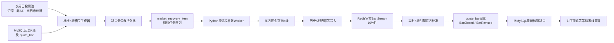

# 行情缺口检测与自动补数服务

## 目标与边界

该服务解决程序停机、网络中断、行情源短时异常或消费进程崩溃造成的K线缺失，并将补回的数据重新送入统一实时K线事件链。它只负责数据完整性，不执行交易、不调用账户或下单接口。

当前自动补数范围为官方 `1m/5m/30m/60m/1d` K线。Tick没有成交时天然不存在记录，无法仅凭时间槽准确判断缺失，因此默认只监控Tick水位，不伪造历史Tick；若数据源以后提供可靠历史Tick接口，可通过 `HistoricalTickBackfillEnabled` 单独启用。

## 总体流程



Redis只承担低延迟传递和实时状态缓存，MySQL是缺口、任务、官方K线、修订事件和执行进度的最终事实来源。即使Redis状态丢失，服务也能从MySQL和官方数据重新恢复。

## 检测规则

- 以 `instrument_daily_status` 的交易日股票池为准，排除北交所、ST和当日停牌股票，避免把非交易状态误判为缺口。
- 沪深连续竞价槽位为 `09:30-11:30`、`13:00-15:00`，午休不跨段合并。
- 每个正常交易日应有：1分钟240根、5分钟48根、30分钟8根、60分钟4根、日线1根。
- 只检查已结束并超过宽限期的K线，默认宽限90秒，避免盘中把尚未关线的K线误报为缺失。
- 相邻缺失槽位合并成一个缺口；上午和下午分别成段。
- 单次API检测最多31个自然日，较大范围由调度器按批次执行。
- 同一缺口使用稳定 `gap_key` 幂等保存；重复扫描更新当前状态，不重复创建可执行任务。

## 恢复与一致性

1. Python Worker 使用 `SELECT ... FOR UPDATE SKIP LOCKED` 领取任务，每个进程处理不同的“股票+周期+缺口段”。可并行启动多个进程。
2. 领取后写入租约。进程在下载或发布中崩溃时，租约超时的 `recovering/replaying` 项可被重新领取。
3. 官方K线先写历史表，再发布到按股票稳定分片的官方Bar Stream。历史表唯一键和行哈希保证重复下载幂等。
4. 实时K线引擎将官方数据作为高优先级数据：新槽位发 `BarClosed`，内容变化发 `BarRevised`，完全相同的数据不重复产生业务事件。
5. 每次官方消息处理后均从 `quote_bar` 重新核算任务进度。即使进程在“数据已落库、任务未更新”之间崩溃，重复消息也能完成任务。
6. Stream消息仅在Redis状态、MySQL K线及审计事件提交后ACK。未ACK消息可由消费者组自动认领重放。
7. 全部缺口归零后，任务进入 `strategy_recalculating`，按受影响股票和时间范围重算对子顶底等派生记录，最后变为 `completed`；局部失败为 `partial`。

## 数据存储

| 数据 | 存储位置 | 说明 |
|---|---|---|
| 1分钟官方历史K线 | `kline_bar_1m` | 月分区、幂等唯一键 |
| 5分钟官方历史K线 | `kline_bar_5m` | 历史底座 |
| 30/60分钟官方K线 | `kline_bar_agg` | `algorithm_version=official-gm-v1` |
| 日线 | `kline_bar_1d` | 历史底座 |
| 实时统一K线视图 | `quote_bar` | Tick生成与官方修订后的权威当前版本 |
| K线事件审计 | `realtime_bar_event` | Closed/Revised、回放来源和任务编号 |
| 缺口 | `market_data_gap` | 缺失范围、数量、状态、错误 |
| 恢复批次 | `market_recovery_run` | 执行指标和最终状态 |
| 恢复明细 | `market_recovery_item` | 租约、重试、读取/写入进度 |
| 官方回放缓冲 | Redis `*:stream:market:official:bar:00..15` | 消费者组可靠传递，不作为长期事实库 |

## API

检测但不创建任务：

```http
POST /api/market-data/gaps/detect
Content-Type: application/json

{
  "dateFrom": "2026-08-12",
  "dateTo": "2026-08-12",
  "symbols": ["SHSE.600000"],
  "datasets": ["1m", "5m", "30m", "60m", "1d"],
  "dryRun": true,
  "triggerType": "manual"
}
```

将 `dryRun` 改为 `false` 即持久化可执行补数明细。查询接口：

- `GET /api/market-data/gaps?page=1&pageSize=50`
- `GET /api/market-data/recovery-runs?page=1&pageSize=50`
- `GET /api/market-data/recovery-runs/{id}`
- `POST /api/market-data/recovery-runs/{id}/retry`

完整参数和响应模型可在 [Swagger UI](http://127.0.0.1:5222/swagger) 查看。

## 运行方式

本机单用户部署从不会提交到版本控制的 `collector/config.local.json` 读取东方掘金Token，文件格式参考 `collector/config.example.json`。环境变量 `ASTOCK_TOKEN` 仍可作为最高优先级临时覆盖。

前台单进程持续运行：

```powershell
powershell -ExecutionPolicy Bypass -File .\scripts\start-recovery-worker.ps1
```

四进程并行或只处理指定任务：

```powershell
powershell -ExecutionPolicy Bypass -File .\scripts\start-recovery-worker.ps1 -Workers 4
powershell -ExecutionPolicy Bypass -File .\scripts\start-recovery-worker.ps1 -RunId 123 -Workers 4 -Once
```

安装当前Windows账户登录后自动运行、异常自动重启的计划任务：

```powershell
powershell -ExecutionPolicy Bypass -File .\scripts\install-market-recovery-task.ps1 -Workers 4
```

配置文件已加入 `.gitignore`，不得通过Swagger、日志或异常信息返回其中内容。交易时段可运行2个进程，收盘后可提升到4至8个；东方掘金限流策略最终应以终端实际授权和压测结果为准。

## 状态机与重试

`planned -> recovering -> replaying -> strategy_recalculating -> completed`

失败先进入 `retry_waiting`，达到最大重试次数后进入 `failed`，批次最终标记为 `partial`。租约防止进程永久占用任务，行级锁防止多进程领取同一任务。错误文本、重试次数和恢复来源均保留在MySQL中。

## 验收标准

- 完整交易日槽位数量正确，午休不产生槽位。
- 重复检测不重复创建任务；重复下载不重复插入历史K线。
- 相同官方K线重复投递不产生重复业务事件，但仍能推进未完成任务。
- 官方K线与Tick生成K线不一致时产生 `BarRevised`，并保留修订前因、任务号和回放原因。
- Worker在下载、发布、落库、ACK任一边界崩溃后均可重放并最终收敛。
- 任务完成时 `missing_count=0`，恢复数量等于预期数量，质量问题为零或明确记录。
