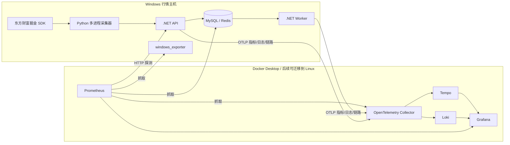

# 运维监控平台部署说明

## 1. 部署结果

本项目采用 Grafana + Prometheus + Loki + Tempo + OpenTelemetry Collector，当前部署在 Windows 主机的 Docker Desktop（WSL2 后端）中。东方财富掘金 SDK、Python 采集进程、.NET API 和 Worker 可以继续运行在 Windows；监控平台与业务进程不要求在同一操作系统中。

当前入口：

| 功能 | 地址 | 说明 |
|---|---|---|
| Grafana 运维总览 | http://127.0.0.1:3000/d/astock-operations-overview/a61cfa9 | 日常主要入口 |
| Grafana 首页 | http://127.0.0.1:3000 | 登录后默认进入运维总览 |
| Prometheus | http://127.0.0.1:9090 | 指标、目标和告警规则查询 |
| Loki | http://127.0.0.1:3100/ready | 日志存储健康检查 |
| Tempo | http://127.0.0.1:3200/ready | 链路存储健康检查 |
| OpenTelemetry | http://127.0.0.1:13133 | 遥测接收器健康检查 |

Grafana 本机开发账号为 `admin`，初始密码为 `astock-admin`，系统默认语言为简体中文（`zh-Hans`）。所有 Web 端口目前只绑定 `127.0.0.1`，局域网和互联网无法直接访问。正式长期使用前应在 Grafana 个人资料页修改密码，或执行 `docker exec astock-grafana grafana cli admin reset-admin-password "新密码"`。

## 2. 数据流与部署位置



以后服务分开部署时，建议把 Grafana、Prometheus、Loki、Tempo 和 OpenTelemetry Collector 统一放在一台 Linux 监控服务器上；每台 Windows 行情主机只安装 `windows_exporter`，.NET 进程通过 OTLP 主动发送到中心 Collector。Python 采集器后续也可接入 OpenTelemetry SDK。该结构可以覆盖 Windows SDK 节点、Windows/.NET 节点和 Linux 服务节点。

## 3. 已覆盖的监控范围

- API 可用性、HTTP 延迟、请求量和异常。
- Worker 及各数据流水线启动时间、最后成功时间、处理量、失败量和批处理耗时。
- Tick 接收入库、延迟、K 线事件和 SignalR 推送。
- MySQL、Redis、Prometheus、Loki、Tempo、Grafana、Collector 运行状态。
- Windows CPU、内存、磁盘、网络、进程、服务和计划任务。
- .NET 日志集中检索，以及 API 请求链路追踪。
- 服务不可用、MySQL/Redis/Collector 中断和流水线错误告警。

Prometheus 指标保留 30 天，Loki 日志保留 7 天，Tempo 链路保留 72 小时。Grafana 和三类数据均使用 Docker 命名卷持久化，普通容器重启不会丢失。

## 4. 启停和验证

首次安装 Windows 主机采集器时，使用管理员 PowerShell：

```powershell
powershell -ExecutionPolicy Bypass -File .\scripts\install-windows-exporter.ps1
```

首次启动监控栈（密码参数只负责初始化新数据卷）：

```powershell
powershell -ExecutionPolicy Bypass -File .\scripts\start-observability.ps1 `
  -GrafanaAdminPassword "替换为本机强密码"
```

已经初始化的数据卷不会被环境变量重复改密；已有部署应通过 Grafana 页面或上面的 CLI 命令改密。后续启动或升级可以直接执行：

```powershell
powershell -ExecutionPolicy Bypass -File .\scripts\start-observability.ps1
```

执行完整健康检查：

```powershell
powershell -ExecutionPolicy Bypass -File .\scripts\verify-observability.ps1
```

停止监控容器但保留全部历史数据：

```powershell
docker compose -f .\deploy\docker-compose.observability.yml stop
```

不要使用 `down -v`，该参数会删除 Grafana、Prometheus、Loki 和 Tempo 的持久化数据卷。

## 5. 应用接入配置

.NET API 与 Worker 默认把 OTLP 数据发送到 `http://127.0.0.1:4317`。迁移到中心 Linux 监控服务器后，通过环境变量覆盖地址：

```powershell
$env:Observability__OtlpEndpoint = "http://监控服务器地址:4317"
```

跨主机部署时仅在防火墙中放行必需的内网端口：Windows 到 Collector 的 TCP 4317，以及 Prometheus 到 Windows 的 TCP 9182。Grafana 3000 端口应只对管理网段开放；Loki、Tempo、Prometheus 和 Collector 管理端口不建议直接暴露到互联网。

东方财富 Token 不进入监控配置、日志标签或指标标签，仍只从本地私有配置读取。

## 6. 故障定位顺序

1. 打开 Grafana 运维总览，先查看顶端可用性和正在触发的告警。
2. 查看“各环节最后成功时间”，定位停止推进的数据流水线。
3. 在日志面板按 `service_name`、错误级别和关键字过滤。
4. 从异常 API 请求进入 Tempo 查看完整链路。
5. 使用 Prometheus `Status → Targets` 确认具体采集目标与错误原因。
