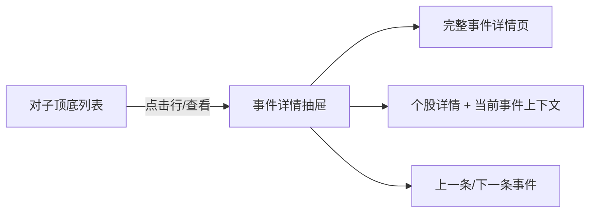
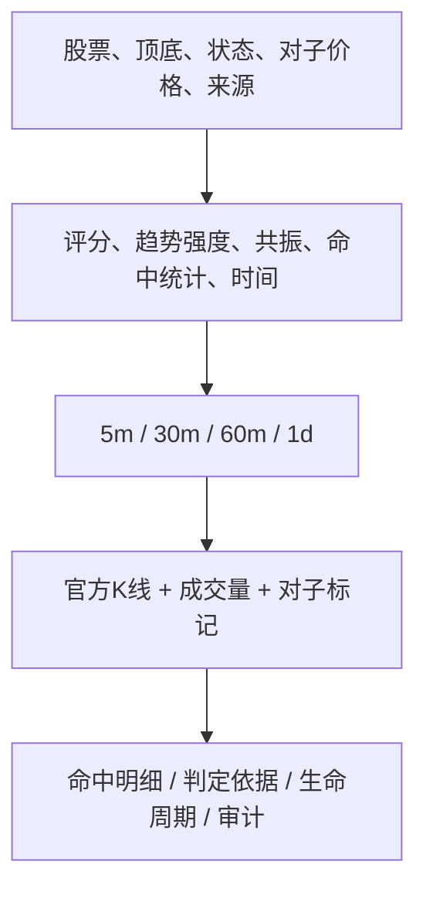
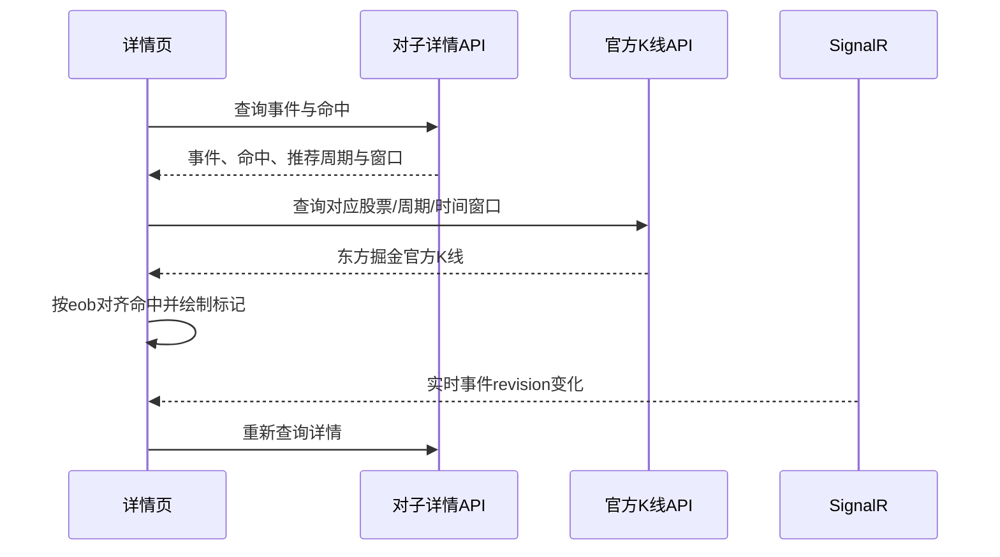

# 对子顶底事件详情页与实时详情接口方案

> 版本：V1.0  
> 日期：2026-08-14  
> 阶段：开发前方案  
> 范围：对子事件详情抽屉、完整详情页、实时详情接口、K线命中标记。  
> 不包含：算法规则调整、数据健康页面、策略参数修改和任何交易功能。

## 1. 结论

采用“列表详情抽屉 + 可独立访问的完整详情页 + 个股详情上下文入口”三层交互：

1. 在对子顶底列表点击整行或“查看”，先打开宽度约 960px 的详情抽屉，快速查看事件摘要、四周期命中和生命周期；
2. 抽屉提供“打开完整详情”，进入可刷新、可收藏链接的对子事件详情页；
3. 抽屉和详情页提供“查看个股”，进入股票 K 线页面并保留当前对子事件上下文；
4. 盘中实时和历史回放采用相同 UI ViewModel，但接口保留各自数据表和语义；
5. 正式股票展示东方掘金官方 K 线并标注命中；`acceptance-fixture`、`TEST.TOP/TEST.BOTTOM` 明确显示“算法验收样本，无真实官方行情”。

本功能不重新计算对子算法，只读取已经固化的事件、命中和官方 K 线。

## 2. 当前缺口

### 2.1 后端

- 历史回放已有 `GET /api/pair-trends/events/{id}`，能返回事件和分页命中；
- 盘中实时只有事件列表和命中列表，没有 `GET /api/pair-trends/live/events/{id}`；
- 历史详情没有一起返回回放运行的 `runMode/dataSource/notes`，前端难以准确判断是否验收样本；
- 实时 DTO 比历史 DTO 多 `eventRevision`、`retractedHitCount`、`sourceEventId` 等修订语义，两者不能直接强制共用数据库 DTO。

### 2.2 前端

- 当前“查看”跳转 `/stocks/{symbol}?pair={id}`；
- 个股页面没有读取 `pair` 参数，也没有请求对子事件详情；
- K 线组件只显示蜡烛和成交量，不支持候选、确认、失效、撤回标记；
- 历史和实时列表未把 `source` 一起传给详情，因此相同数字 ID 可能查错表；
- `TEST.*` 没有官方 K 线，当前页面容易被误解为数据加载失败。

## 3. 用户交互设计

### 3.1 列表与抽屉



列表必须把来源写进 URL：

- 实时：`/pair-trends?source=live&eventId=123`；
- 历史：`/pair-trends?source=history&eventId=456`。

这样浏览器刷新、前进后退和复制链接都能恢复同一个抽屉。

抽屉展示：

- 股票名称、代码、实时/历史/验收样本来源；
- `TOP/BOTTOM`、候选/确认/失效、对子价格和 `.00/.11～.99`；
- 分数、趋势强度、最强周期、共振周期数；
- 首次发现、最后发现、确认时间、事件修订号；
- 5m/30m/60m/1d 周期标签和各状态命中数；
- 最近命中列表和生命周期时间轴；
- “完整详情”“查看个股”两个主操作。

### 3.2 完整详情页

路由：

```text
/pair-trends/live/{eventId}
/pair-trends/history/{eventId}
```

页面结构：



详情区域建议使用四个页签：

1. **K线复核**：官方 K 线、成交量、候选/确认/失效/撤回标记；
2. **命中明细**：按周期分页展示 OHLC、量额、对子字段和确认原因；
3. **算法依据**：EMA20、EMA60、ATR14、趋势方向/强度、滚动极值、量能分位、影线比例、反转 ATR；
4. **生命周期与审计**：发现、确认、修订、撤回、失效时间线，以及算法版本、源事件 ID、行哈希和 revision。

### 3.3 个股详情上下文

从对子详情进入个股页：

```text
/stocks/SHSE.600000?pairSource=live&pairEventId=123
```

个股页面读取参数后：

- 自动选择事件最强周期；
- K 线定位到事件时间窗口；
- 高亮当前对子事件；
- 页面下方固定展示该事件摘要和命中；
- “返回对子事件”恢复来源和 ID。

## 4. API 方案

### 4.1 新增实时详情接口

```http
GET /api/pair-trends/live/events/{id}?hitPage=1&hitPageSize=100
```

响应：

```json
{
  "source": "live",
  "sourceInfo": {
    "runMode": "realtime",
    "dataSource": "dongcai-gm",
    "isAcceptanceSample": false,
    "notes": null
  },
  "pairEvent": {},
  "hits": {
    "page": 1,
    "pageSize": 100,
    "total": 4,
    "totalPages": 1,
    "items": []
  },
  "recommendedChart": {
    "frequency": "60m",
    "from": "2026-08-01T09:30:00+08:00",
    "to": "2026-08-14T15:00:00+08:00"
  }
}
```

实现要求：

- 先按 `pair_trend_live_event.id` 查询事件，不存在返回 404；
- 按 `pair_trend_live_hit.event_id` 查询命中；
- 命中分页上限 200，默认 100；
- 命中按 `observed_at、frequency、id` 正序，便于生成时间线；
- 事件必须返回 `eventRevision/retractedHitCount/lastSourceEventId`；
- 命中必须返回 `sourceRevision/sourceEventId/sourceRowHash`；
- 只读接口，不触发重算或状态变更；
- 增加 Swagger 中文注释和响应示例。

### 4.2 增强历史详情接口

保留原地址，避免破坏现有调用：

```http
GET /api/pair-trends/events/{id}?hitPage=1&hitPageSize=100
```

在响应中向后兼容增加：

```json
{
  "source": "history",
  "sourceInfo": {
    "runId": 12,
    "runMode": "historical",
    "dataSource": "dongcai-gm",
    "isAcceptanceSample": false,
    "notes": null
  }
}
```

当 `runMode=acceptance`、`dataSource=acceptance-fixture` 或股票代码为 `TEST.*` 时，`isAcceptanceSample=true`。前端必须显示醒目提示，不能把验收样本伪装成真实 A 股。

### 4.3 前端统一模型

数据库 DTO 保持实时/历史差异，前端 API Adapter 转换成统一模型：

```ts
interface PairTrendDetail {
  source: 'live' | 'history'
  sourceInfo: PairSourceInfo
  event: PairEventViewModel
  hits: PageResponse<PairHitViewModel>
  recommendedChart: ChartWindow
}
```

统一字段缺失时使用 `undefined`，不能用 0 伪装不存在的数据。例如历史事件没有 `eventRevision` 时不显示“修订 0”。

## 5. K线标记方案

### 5.1 数据加载

详情接口和 K 线接口并行请求：



K 线仍调用现有接口：

```http
GET /api/market/bars?symbol=...&frequency=...&from=...&to=...&limit=3000
```

默认窗口：事件首次发现前至少 80 根 K 线，最后发现后至少 20 根；日线最多受东方掘金历史范围和本地已固化数据约束。

### 5.2 标记类型

扩展 `KlineChart`，增加 `markers`：

| 标记 | 视觉 | 含义 |
|---|---|---|
| 顶部候选 | K线上方琥珀色倒三角 | 上升趋势中命中对子高点 |
| 底部候选 | K线下方青蓝色正三角 | 下降趋势中命中对子低点 |
| 已确认 | 实心圆环 + “确认” | 后续 K 线达到确认条件 |
| 已失效 | 灰色叉号 | 候选未成立或被反向突破 |
| 已撤回 | 空心叉号 | 源 Bar 修订后原命中被撤回 |
| 当前选中 | 紫色外圈 | 当前明细行对应的 K 线 |

每次只在当前周期 K 线上显示同周期命中，避免把 5m 时间点错误叠加到 60m K 线。标记悬浮提示显示对子价格、字段 `HIGH/LOW`、状态、分数、发现和确认时间。

## 6. 实时更新

完整详情页打开实时事件时，复用 `/hubs/market`：

1. 调用 `SubscribeSymbols([symbol])`；
2. 监听 `pairTrend.changed`；
3. 仅当 `eventKey` 与当前事件一致且 `eventRevision` 更大时刷新详情；
4. 关闭抽屉/离开页面时调用 `UnsubscribeSymbols`；
5. SignalR 断线时显示“详情暂非实时”，重连后重新订阅并强制补查一次 REST；
6. 额外保留 30 秒低频刷新作为兜底，不使用高频轮询。

历史回放详情是不可变读取，不订阅 SignalR。

## 7. 异常与边界

- **404**：事件不存在或已被清理，显示“记录不存在”，不跳到空白股票页；
- **来源错误**：历史 ID 用 live 路径查询时返回 404，不自动猜另一个表；
- **验收样本**：显示事件和命中，但不请求真实 K 线，并解释 `TEST.*`；
- **正式股票暂无 K 线**：显示“当前周期未固化官方 K 线”，事件详情仍可查看；
- **Bar 修订**：实时事件 revision 增加，图表和命中原位刷新；
- **命中超过 200**：分页加载，图表只加载当前周期必要标记；
- **跨周期共振**：切换周期时保留事件头部，替换 K 线和命中标记；
- **无确认时间**：候选状态不显示虚假的确认点；
- **时区**：接口保留明确时间语义，页面统一按 Asia/Shanghai 展示。

## 8. 开发步骤

### 阶段 1：接口与契约（0.5～1天）

- 抽取共享详情响应和来源信息模型；
- 新增实时事件详情接口；
- 增强历史详情的回放运行来源；
- 补全 Swagger 注释；
- 验证 200、404、分页上限和验收样本识别。

### 阶段 2：详情抽屉（1天）

- 列表 URL 增加 `source/eventId`；
- 开发 `PairTrendDetailDrawer`；
- 展示事件摘要、命中统计、周期分组和生命周期；
- 支持刷新恢复、关闭清理参数、上一条/下一条。

### 阶段 3：完整详情和 K 线标记（1～1.5天）

- 增加完整详情路由；
- 扩展 KlineChart markers；
- 详情/K线并行加载；
- 周期切换、标记联动和命中表格定位；
- 个股页面读取对子上下文。

### 阶段 4：实时联调和交付（0.5天）

- 接入 MarketHub 按股票订阅；
- 验证 CREATED/UPDATED/CONFIRMED/REVISED/INVALIDATED/RETRACTED；
- 浏览器刷新、断线重连、空 K 线和 TEST 验收样本测试；
- 构建、部署并更新使用文档。

预计总开发量：3～4个开发日。

## 9. 验收标准

1. 实时列表任一真实事件点击后，抽屉能显示事件和全部命中；
2. 历史列表任一事件点击后，来源、运行模式和备注准确；
3. `TEST.*` 明确标识为非真实行情，不出现误导性股票价格；
4. 正式股票可切换 5m/30m/60m/1d，并只显示对应周期命中；
5. `.00` 与 `.11～.99` 正确显示；
6. TOP 标记位于 K 线上方，BOTTOM 标记位于 K 线下方；
7. 事件修订后不新增重复详情，按 revision 原位更新；
8. URL 刷新后仍能恢复相同详情；
9. 事件不存在、K 线为空、SignalR 断线均有明确提示；
10. API、前端类型检查和浏览器控制台无错误。

## 10. 推荐执行顺序

先开发实时详情接口和统一前端模型，再开发抽屉；抽屉稳定后复用同一组件完成完整详情页和个股上下文，最后增加 K 线标记与 SignalR 修订联动。这样不会在两个页面重复实现两套对子详情逻辑。

