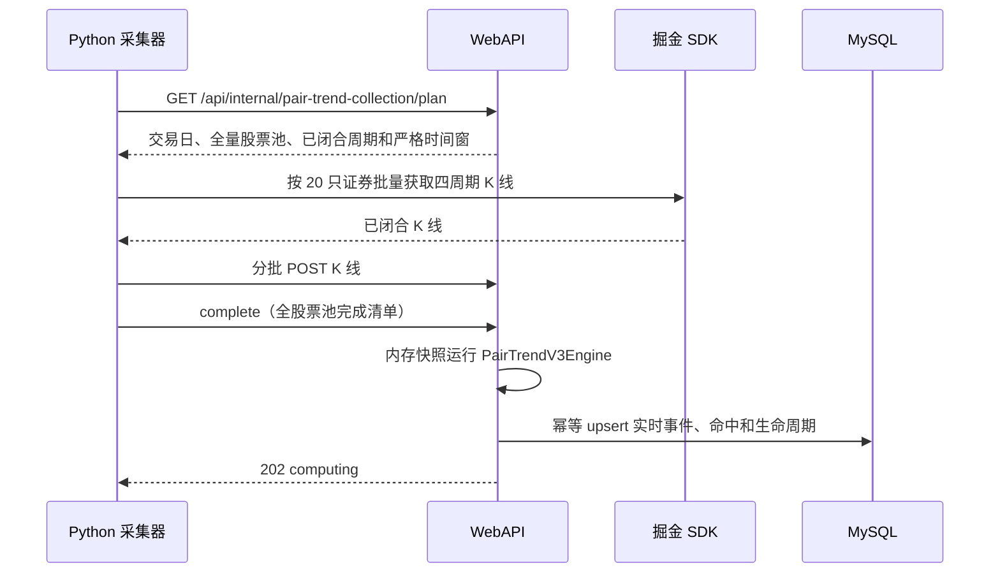

# 对子顶底：Python 四周期采集与 WebAPI 内存回放

## 职责边界

| 组件 | 只负责的内容 | 明确不负责 |
| --- | --- | --- |
| Python `collector/pair_kline_collector` | 领计划、调用掘金 SDK、推送 5m/30m/60m/1d 已闭合 K 线 | Redis、MySQL、对子计算、任务调度和结果写入 |
| WebAPI | 交易日与股票池判定、内存 K 线会话、对子 V3 回放、结果幂等写 MySQL | 直连掘金 SDK |
| MySQL | `pair_trend_live_event`、`pair_trend_live_hit`、`pair_trend_live_lifecycle` 查询结果 | 原始盘中 K 线缓存 |

## 一次采集周期

## 时间与补齐规则

- 交易日启动、API 重启或 Python 首次启动：`bootstrap`，从 09:30 拉到每个周期最近已闭合的 EOB。
- 后续轮次：`incremental`，从上一成功水位向前重叠一个周期后拉取到新 EOB。重叠 K 线会替换内存同一 `symbol + frequency + eob`，不会重复累计。
- 15:00 后首次启动：四个周期均从开盘拉取至收盘，覆盖完整交易日。
- 只接受 5m（09:35 起）、30m（10:00 起）、60m（10:30 起）和日线（15:00）的已闭合 EOB；午间不会把未闭合 K 线当成数据。

## 严格性

- API 下发的股票池、完成清单和每周期实际接收证券集合必须完全一致。
- 任意 SDK 缺证券、推送失败或 API 计算/写库失败，水位都不前进；Python 会调用 `abort` 显式作废该计划，下一轮重新拉取。未显式中止的计划 15 分钟后同样作废，仍不推进水位。
- 不删除重建实时结果。按稳定 `event_key`/`hit_key` upsert；供应商修订导致旧事件消失时，旧记录明确标记为 `SOURCE_RECONCILIATION` 失效。
- API 内存只保存当前交易日的四周期 K 线；新交易日自动释放前一日工作集。MySQL 不保存本设计中的原始 K 线。

## 部署所需配置

Python 进程仅需：

1. 私有 `config.local.json`（由 `config.example.json` 复制，填写 WebAPI URL 和掘金 Token；也可用 `ASTOCK_TOKEN` 进程覆盖）；
2. 进程环境变量 `PAIR_TREND_GATEWAY_KEY`；
3. 可用且已认证的东方财富掘金 SDK。

密钥值必须等于 WebAPI 进程的 `CollectorControl:GatewayApiKey`。它不应写入仓库、配置样例、任务计划命令行或日志。Python 不需要 Redis/Mysql 地址、账号或密码。
