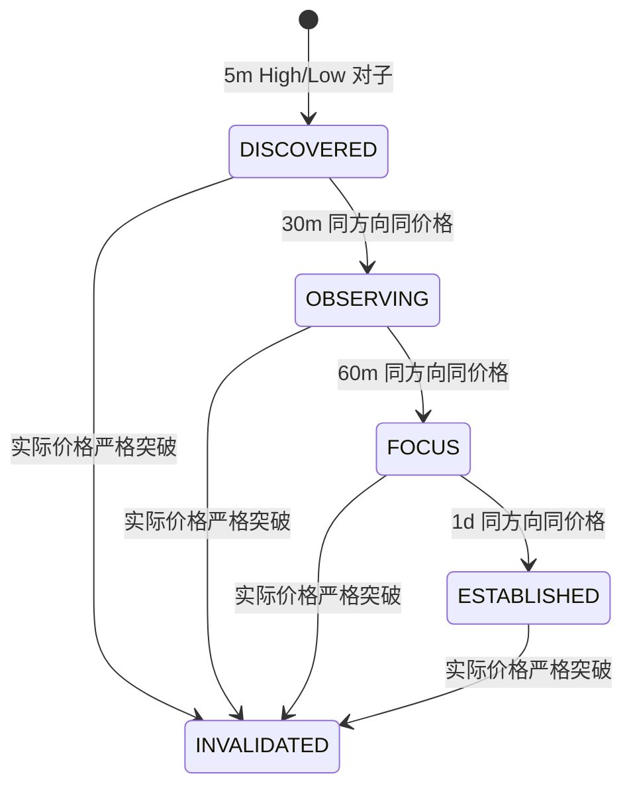
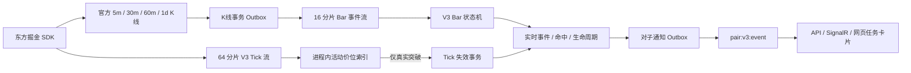

# 对子顶底 V3

## 1. 正式业务口径

`pair-trend-v3` 是当前唯一正式对子算法。旧版 EMA、ATR、趋势方向和延迟反转阈值不再作为命中条件。

- 价格按 `0.01` 元换算为整数 tick，识别 `.00、.11、.22、…、.99`。
- 5 分钟最高价命中对子，建立 `TOP`；最低价命中对子，建立 `BOTTOM`。
- `TOP` 后续实际价格严格大于对子价时失效；`BOTTOM` 后续实际价格严格小于对子价时失效；等于对子价不失效。
- 30 分钟、60 分钟、日线必须与活动事件的方向、整数价格 tick 完全一致，且只能逐级升级。
- 同一股票、方向、价格的活动事件只保留一条；重复 5 分钟命中追加证据，不新建事件。
- 失效后同价再次由新的 5 分钟 K 线发现时，`generation` 加一并建立新事件。

## 2. 状态机与提醒



| 状态 | 中文含义 | 是否推送 | 提醒级别 |
|---|---|---:|---|
| `DISCOVERED` | 发现 | 否 | 无 |
| `OBSERVING` | 观察 | 是 | 新提醒 |
| `FOCUS` | 重点 | 是 | 特别提醒 |
| `ESTABLISHED` | 成立 | 是 | 一级警报；顶部卖出提醒、底部买入提醒 |
| `INVALIDATED` | 失效 | 仅事件曾到观察及以上时 | 解除/失效提醒 |

## 3. 数据链路



Tick 不写入 MySQL。Tick 失效消费者先读取进程内活动价位快照，没有突破时不会查询数据库；只有突破才执行一次事务。5 分钟 K 线仍会再次校验突破，作为 Tick 链路中断时的可靠兜底。

## 4. 数据表

- `pair_trend_backtest_run`：回放运行摘要。
- `pair_trend_backtest_symbol`：逐股票断点、成功和失败信息。
- `pair_trend_event`：历史事件汇总，包含阶段、代次、有效状态和失效原因。
- `pair_trend_hit`：5m 发现及 30m/60m/1d 升级证据。
- `pair_trend_lifecycle`：历史完整状态变化审计。
- `pair_trend_live_event`：盘中活动和已失效事件。
- `pair_trend_live_hit`：盘中 K 线证据。
- `pair_trend_live_lifecycle`：盘中状态变化审计。
- `pair_trend_event_outbox`：只保存需要推送的可靠消息。

回放和实时均使用 `price_ticks` 做价格一致性判断，避免 decimal 格式和显示精度造成误匹配。

## 5. 历史回放

> 当前正式配置 `PairTrendQuery:HistoricalReplayEnabled=false`。网页入口保持可见但不可点击，旧回放查询接口在访问数据库前返回 `409 PAIR_TREND_BACKTEST_DISABLED`。本节仅保留旧实现说明，不代表当前允许执行；按明确日期进行的正式采集补算不属于网页历史回放。

正式回放读取 MySQL 中东方掘金官方确认、质量检查通过的四周期 K 线，并按有效收盘时间合并为一条时间线。相同时间按 `5m → 30m → 60m → 1d` 处理，避免使用未来数据。

```powershell
dotnet run --project .\src\AStockMonitor.Backtest\AStockMonitor.Backtest.csproj `
  -c Release --no-build --no-restore -- `
  --start 2026-02-24 --end 2026-08-13 `
  --frequencies 5m,30m,60m,1d
```

任务按 6 个股票分区并行运行；每只股票独立断点，死锁会自动退避重试。中断后使用相同参数且不加 `--force` 即可只重跑未完成或失败股票。

## 6. 实时基线与启动顺序

首次启用 V3 时：

1. 停止 API 和 StrategyScanner。
2. 清理旧版对子表记录和 Redis V2 消费组。
3. 完成全市场 V3 历史回放。
4. 执行 `database/seed-pair-trend-live-v3.sql`，只复制回放结束时仍有效的价位。
5. 启动 StrategyScanner，消费基线日期之后的 Bar 事件和实时 Tick。
6. 启动 API，通过分页接口抽查事件、命中和生命周期。

基线导入不写通知 Outbox，因此不会把历史观察、重点和成立事件重新推送给网页。

## 7. 查询接口

- `GET /api/pair-trends/capabilities`：盘中、历史数据、历史回放的服务端开关和查询限制。
- `GET /api/pair-trends/intraday/status`：服务端上海日期、交易日状态、交易时段、采集状态和四周期水位。
- `GET /api/pair-trends/intraday/stock-groups`：严格查询上海当日 `root_5m_eob` 的股票分组。
- `GET /api/pair-trends/intraday/stock-groups/{symbol}/events`：展开当日单只股票时间线。
- `GET /api/pair-trends/intraday/events/{id}`：仅允许读取当日正式 V3 的完整事件详情。
- `GET /api/pair-trends/data/stock-groups`：按日期范围查询长期正式数据并按股票分页。
- `GET /api/pair-trends/data/stock-groups/{symbol}/events`：展开单只股票在查询范围内的时间线。
- `GET /api/pair-trends/data/events`：同一严格日期口径下的平铺事件列表。
- `GET /api/pair-trends/live/stock-groups`：历史数据股票分组的兼容地址，与 `data/stock-groups` 使用同一查询服务和响应语义。
- `GET /api/pair-trends/live/stock-groups/{symbol}/events`：单只股票分组时间线的兼容地址，与对应 `data` 接口使用同一查询服务和响应语义。
- `GET /api/pair-trends/runs`、`GET /api/pair-trends/events`、`GET /api/pair-trends/events/{id}`：旧网页历史回放接口；当前均被服务端硬禁用。
- `GET /api/pair-trends/live/events`：实时事件分页，可按 `stage`、`isActive`、方向和股票筛选。
- `GET /api/pair-trends/live/events/{id}`：实时事件、命中和生命周期详情。
- `GET /api/pair-trends/live/hits`：实时命中分页。
- `GET /api/pair-trends/live/status`：Bar 消费分片状态。
- `GET /api/pair-trends/live/status/ticks`：当天 Tick 失效消费者、Pending 和水位。

Swagger UI 提供参数和响应模型说明。

新查询只读取 `pair_trend_live_event` 中的 `pair-trend-v3`。顶底日期唯一使用 `root_5m_eob`，不得回退到 `first_seen_at`、`discovered_at` 或 `last_seen_at`。日期按 `Asia/Shanghai` 自然日转换为半开区间；查询结束日阶段和当前阶段分别返回。股票组按最新顶底日期倒序，组内按 `root_5m_eob DESC,id DESC` 排序，外层分页单位是股票而不是事件。

部署新查询前必须执行 `database/migrations/029_pair_trend_grouped_query.sql`，确认正式 V3 不存在空 `root_5m_eob`，并用目标 MySQL 的 `information_schema` 与 `EXPLAIN ANALYZE` 核验三组索引。029 未完成前不得把新页面切入正式流量。

## 8. 可靠性边界

- 官方 K 线事件只有事务提交后才发布；对子事务成功后才 ACK。
- 消费者异常时消息留在 Redis Pending，由同分片消费者自动接管。
- 状态、生命周期和通知 Outbox 同事务提交，不会出现状态已升级但通知事件丢失。
- Tick 通道负责低延迟失效，5 分钟 K 线通道负责最终兜底。
- `BarRevised` 可以幂等更新同一 K 线证据；涉及已发生状态链回滚的修订应进入按股票重建流程，不能直接反向修改单个阶段。
