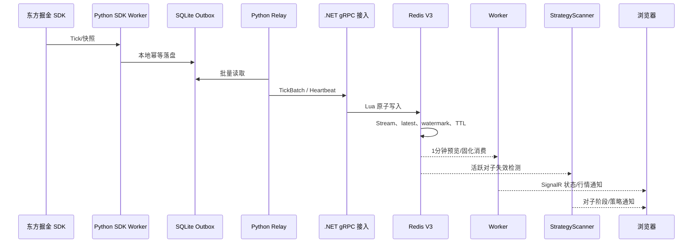
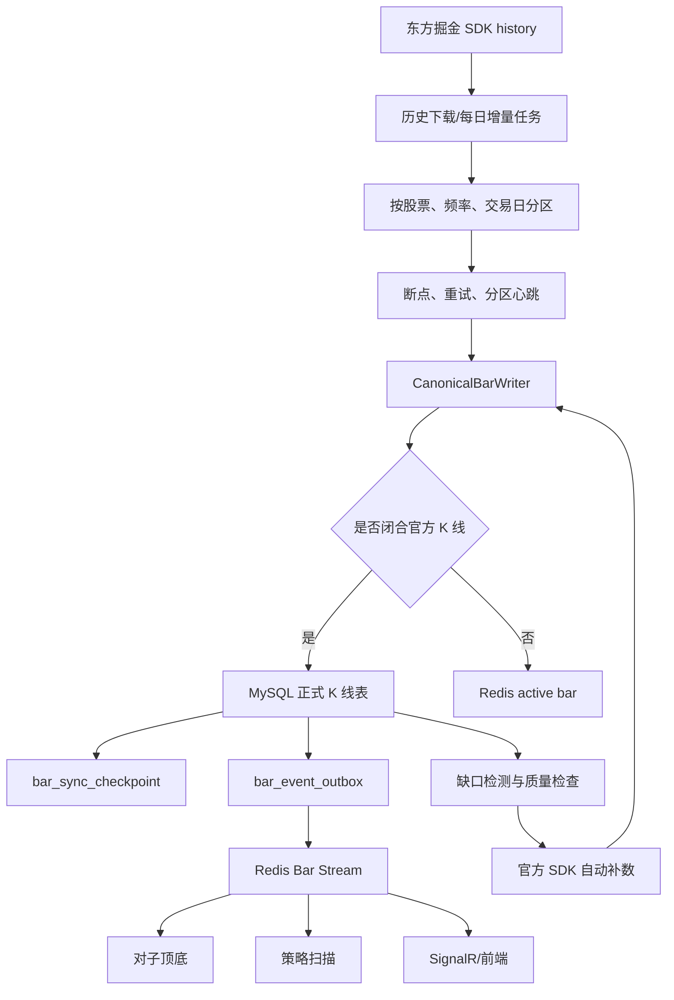
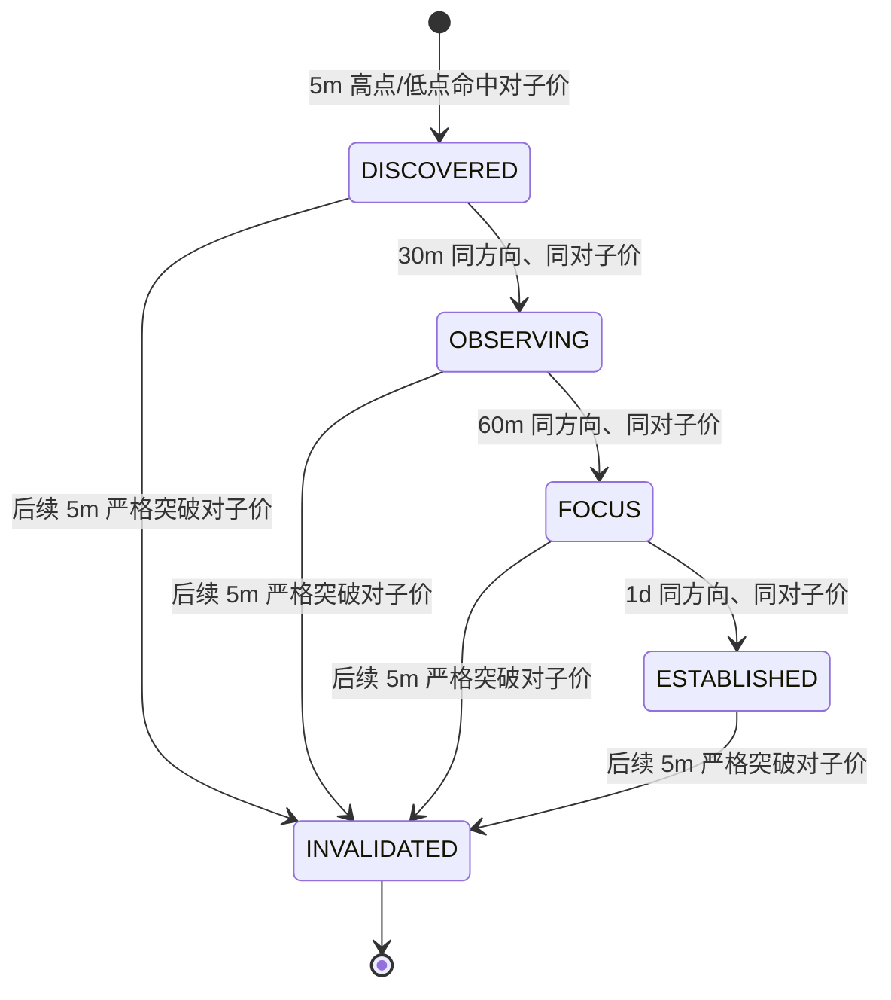
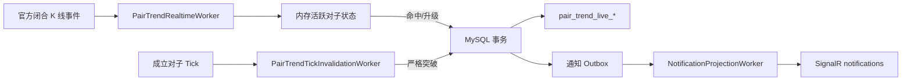
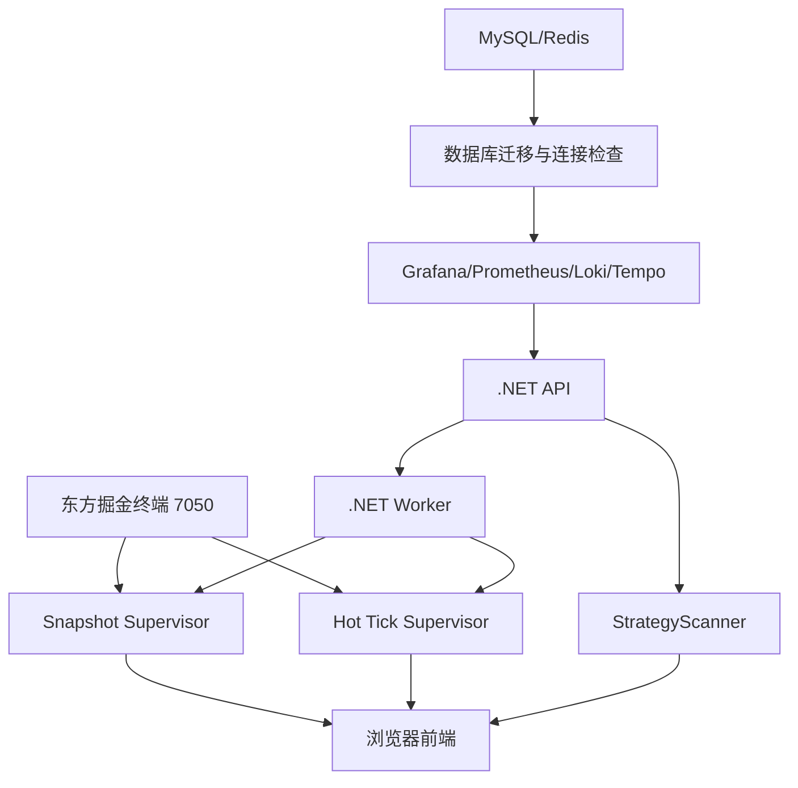

# A股监控程序——最终版项目交接文档

> 文档性质：最终运行架构与开发交接说明  
> 适用日期：2026-08-15  
> 项目范围：行情采集、K线数据底座、对子顶底、策略扫描、消息通知、Web运维与 Linux/Windows 部署  
> 说明：本文只描述当前最终版本，不展开中间版本迭代。所有密钥、Token、数据库密码和公网地址均不写入文档。

## 1. 项目定位与边界

A股监控程序是一个面向个人使用的行情监测与研究系统，核心职责是：

1. 从东方掘金终端 Python SDK 获取 A 股行情和官方 K 线。
2. 通过可靠的本地 Outbox、gRPC、Redis 和 MySQL 链路保存、分发和固化数据。
3. 在盘中生成 1 分钟预览数据，消费正式 5 分钟、30 分钟、60 分钟和日线。
4. 识别对子顶底并按“发现、观察、重点、成立、失效”推进状态。
5. 扫描策略并向前端推送任务卡片、对子事件和一级警报。
6. 提供历史回放、缺口检测、自动补数、质量检查和运行监控。

系统明确不负责：

- 自动下单、交易账户管理、资金管理和策略实盘执行；
- 对外开放互联网 API；
- 将 Tick 全量永久保存到 MySQL；
- 将 Tick 聚合结果作为正式 K 线权威来源。

正式 K 线以东方掘金 SDK 返回的官方 K 线为权威来源，系统只在 Redis 中维护盘中短期预览和实时状态。

## 2. 最终技术架构

### 2.1 技术栈

| 层次 | 技术 | 最终职责 |
|---|---|---|
| SDK 采集 | Python、东方掘金终端 SDK `gm` | Tick、快照、官方 K 线获取 |
| 业务服务 | .NET 10 WebAPI、Worker、StrategyScanner | 接入、固化、分发、对子顶底、策略扫描 |
| 实时通信 | gRPC、Redis Streams、SignalR | 进程间可靠传输、服务间事件分发、浏览器通知 |
| 持久化 | MySQL | 正式 K 线、对子、策略、任务、审计、断点 |
| 实时缓存 | Redis | Tick 短期流、最新价、1 分钟预览、事件队列、租约 |
| 前端 | Vue、Vite、Ant Design Vue、Pinia、ECharts、SignalR | 监控工作台、任务卡片、详情和检索 |
| 可观测性 | Prometheus、Grafana、Loki、Tempo、OpenTelemetry | 指标、日志、链路、告警 |
| 部署 | Windows 服务/计划任务、Linux systemd、Docker | 跨平台运行，SDK 侧保留 Windows |

当前 .NET 项目目标框架为 `net10.0`。Linux 侧已具备 systemd 适配，Windows 侧保留 Windows Service 适配。Python SDK 采集侧仍必须运行在可用东方掘金终端和 SDK 的 Windows 环境中。

### 2.2 推荐部署拓扑

```mermaid
flowchart LR
    subgraph WIN[Windows：东方掘金 SDK 采集节点]
        GM[东方掘金终端\n7050]
        COL[Python 采集进程\nSDK Worker + Relay]
        SNAP[current() 快照轮询]
        HOT[成立对子 Tick 订阅]
        OUTBOX[每进程 SQLite Outbox]
        GM --> COL
        GM --> SNAP
        GM --> HOT
        COL --> OUTBOX
        SNAP --> OUTBOX
        HOT --> OUTBOX
    end

    subgraph APP[业务服务节点：Windows 或 Linux]
        API[.NET API\nHTTP/gRPC/SignalR]
        WORKER[.NET Worker\n固化、补数、广播、监控]
        SCANNER[StrategyScanner\n策略与对子顶底]
    end

    subgraph DATA[数据节点]
        REDIS[(Redis\n实时缓存/队列)]
        MYSQL[(MySQL\n正式数据/审计)]
    end

    subgraph OBS[监控节点]
        OTEL[OpenTelemetry Collector]
        PROM[Prometheus]
        LOKI[Loki]
        TEMPO[Tempo]
        GRAFANA[Grafana]
    end

    OUTBOX -->|gRPC 流/批量| API
    API --> REDIS
    API --> MYSQL
    REDIS --> WORKER
    REDIS --> SCANNER
    WORKER --> MYSQL
    SCANNER --> MYSQL
    API --> OTEL
    WORKER --> OTEL
    SCANNER --> OTEL
    OTEL --> PROM
    OTEL --> LOKI
    OTEL --> TEMPO
    PROM --> GRAFANA
    LOKI --> GRAFANA
    TEMPO --> GRAFANA
```

### 2.3 服务职责

| 服务/进程 | 部署位置 | 核心职责 | 不负责的事项 |
|---|---|---|---|
| 东方掘金终端 | Windows | 提供 SDK 会话和行情源 | 不参与本系统业务判定 |
| Python SDK Worker | Windows | Tick 订阅、官方 K 线拉取、快照获取 | 不写 MySQL，不直接执行策略 |
| Python Relay | Windows | 读取本进程 SQLite Outbox 并通过 gRPC 发送 | 不决定业务状态 |
| Snapshot Worker | Windows | 用 `current()` 轮询全市场最新价 | 不订阅全市场 Tick |
| Hot Tick Supervisor | Windows | 只为成立对子股票建立 Tick 订阅 | 不订阅全部 5000 只股票 |
| AStockMonitor.Api | Windows/Linux | HTTP、Swagger、gRPC 接入、REST 查询、SignalR | 不承担长时间历史回填 |
| AStockMonitor.Worker | Windows/Linux | 数据固化、事件发布、补数调度、广播、健康检查 | 不执行交易 |
| AStockMonitor.StrategyScanner | Windows/Linux | 8 个策略扫描、对子实时状态机、历史回放 | 不负责采集 SDK |
| MySQL | 云服务器/数据节点 | 正式 K 线、业务结果、断点、审计 | 不保存 Tick |
| Redis | 云服务器/数据节点 | 实时缓存、短期流、事件总线、租约 | 不作为永久数据仓库 |
| Grafana 等 | Linux/Docker 推荐 | 监控和告警 | 不参与交易业务链路 |

## 3. 数据总链路

### 3.1 Tick 链路



Tick 的可靠性由“本地 Outbox + gRPC ACK + Redis 幂等写入”保证。采集进程异常时，未确认数据仍在 SQLite 中，Relay 重启后继续发送。每个 SDK Worker 使用独立 Outbox，避免多个 Python 进程竞争同一个 SQLite 文件。

### 3.2 正式 K 线链路



正式逻辑数据只有 5m、30m、60m、1d。30m 和 60m 当前物理上共用 `kline_bar_agg`，由 `frequency` 区分；这属于最终结构，不能仅因物理表名含 `agg` 就当作 Tick 聚合表。

## 4. 行情采集最终规则

### 4.1 全市场最新价格

全市场不建立 5000 只股票的 Tick 长连接。使用 `current()` 快照轮询：

- 目标：当前授权范围内的合格股票池；
- 轮询周期：目标约 5 秒；
- 新鲜度阈值：约 15 秒；
- 结果写入与 Tick 相同的 gRPC/Redis 链路；
- 由累计成交量、累计成交额基线计算 1 分钟预览成交量和成交额；
- 由 Redis 单领导租约保证同一时间只有一个快照主进程。

### 4.2 成立对子股票 Tick 订阅

Hot Tick 只订阅成立状态的对子股票：

- 上一交易日成立股票进入基础池；
- 当日盘中晋级成立的股票动态加入；
- 当前对子算法版本、活跃事件和 `ESTABLISHED` 状态作为入池条件；
- 最多 6 个 Worker，每个 SDK 会话最多 50 只股票，默认容量约 300 只；
- 由 `HotTickSubscriptionCoordinator` 计算优先级并写入 Redis desired 集合；
- `HotTickSupervisor` 根据 desired 集合增删进程；
- 成立状态失效后，下一次池刷新会取消订阅；
- 非交易日清空当日动态订阅，并保留下一交易日计算所需的数据库结果。

### 4.3 东方掘金 SDK 会话限制

当前实现按单会话最多 50 只股票设计，并按交易所拆分任务。采集进程不应自行把全部市场放进一个订阅调用。大规模历史 K 线采用分区、队列和重试，不等同于实时 Tick 长连接数量。

## 5. Redis 最终数据设计

### 5.1 Tick

系统不向 MySQL 写 Tick。Redis V3 保存短期实时数据：

| 数据 | Redis 形态 | 用途 | 保留策略 |
|---|---|---|---|
| Tick 流 | 按交易日、分片的 Redis Stream | Worker、策略和审计式实时消费 | 硬保留 3 分钟；超时后即使 Pending 也过期 |
| 最新价 | 分片 Hash | 低延迟读取当前价 | 约 36 小时 TTL |
| 元数据 | Hash | 来源、优先级、事件时间、序号 | 与最新价同步 |
| 水位 | Hash | 处理和观测进度 | 与数据日期相关 |
| L0 内存 | 每股票最新值和最近 256 条 | API 极低延迟读取 | 进程重启即失效 |

Redis 写入使用 Lua 原子逻辑：先写 Stream，再按事件时间、优先级和序号更新 latest，最后更新水位并设置 TTL。旧事件不能覆盖新事件。

### 5.2 盘中 1 分钟预览

1 分钟数据只作为盘中预览，不进入正式 MySQL K 线表：

- Redis key 以交易日和股票区分；
- 预览数据由 Tick/快照累计成交量差值计算；
- 当前未闭合 Bar 保存在 Redis active projection；
- 预览默认约保留 3 天；
- 系统重启后以官方 5m K 线和最近快照重新建立，不把预览当作历史权威。

### 5.3 Redis 事件流

主要事件流包括：

- Tick V3 分片流；
- Bar 事件流；
- 对子事件流；
- `strategy:v1:signal:event` 策略信号流；
- 通知任务和变更水位。

业务消费者必须使用独立消费者组或可靠 checkpoint。SignalR 只负责唤醒浏览器，数据库和 HTTP 查询才是重连后的权威数据来源。

## 6. MySQL 最终数据设计

### 6.1 正式 K 线

| 表 | 内容 | 说明 |
|---|---|---|
| `kline_bar_5m` | 东方掘金官方 5 分钟 K 线 | 月度范围分区 |
| `kline_bar_agg` | 官方 30 分钟、60 分钟 K 线 | 通过 `frequency` 区分，月度范围分区 |
| `kline_bar_daily` | 东方掘金官方日线 | 正式日线 |

关键字段包括交易日、股票、频率、开始/结束时间、OHLC、成交量、成交额、来源、官方确认标记、来源优先级、行哈希、修订号、质量状态和回填运行号。

唯一键和 `row_hash` 保证幂等写入。同一行哈希重复写入不产生新版本；官方数据修订时增加 revision，并发布 `BarRevised`。

### 6.2 断点、补数和质量

以下表构成数据底座控制面：

- `bar_ingest_batch`、`bar_ingest_partition`、`bar_ingest_partition_attempt`：批次、分区和尝试记录；
- `bar_ingest_checkpoint`、`market_data_watermark`、`bar_sync_checkpoint`：下载、处理和固化水位；
- `history_scheduler_lease`：调度租约；
- `market_recovery_run`、`market_recovery_item`：缺口补数运行和任务；
- `bar_event_outbox`：正式 K 线事件可靠发布；
- `bar_quality_run`、`bar_quality_issue`：质量检查结果；
- `bar_reconcile_log`：来源和本地数据对账；
- `daily_pipeline_run`、`maintenance_job_run`：每日任务与维护审计。

### 6.3 对子顶底

历史回放和历史查询使用：

- `pair_trend_event`：对子事件主记录；
- `pair_trend_hit`：各周期命中记录；
- `pair_trend_lifecycle`：阶段变化和失效记录；
- 回测运行、股票结果和审计表。

实时处理使用：

- `pair_trend_live_event`；
- `pair_trend_live_hit`；
- `pair_trend_live_lifecycle`；
- 实时处理 checkpoint、processed event 和 outbox。

旧历史表仍可能存在，但不应在新代码中继续接入。对子数据按保留策略归档或批量清理，不能通过直接删除正在运行的活跃记录破坏状态机。

### 6.4 策略与通知

策略侧主要表：

- 策略定义、版本和扫描运行表；
- `strategy_signal_event`、机会主表、机会明细和过滤漏斗；
- 扫描 checkpoint、事件 outbox；
- 历史回放、结果、校准表。

前端通知侧主要表：

- `notification_task`：任务卡片和通知状态；
- `notification_task_change`：变更高水位，用于浏览器断线追赶。

## 7. 正式 K 线下载、补数和运维规则

### 7.1 下载范围

正式频率为：

- 5 分钟：`300s`；
- 30 分钟：`1800s`；
- 60 分钟：`3600s`；
- 日线：`1d`。

分钟历史数据只要求最近 60 个自然日。当前交易日不作为历史闭合数据处理，盘中使用 Redis active bar，收盘后由官方 SDK 增量拉取并固化。

### 7.2 分区与进程

- 历史任务按交易日、频率和股票分区；
- 默认每个分区约 100 只股票，SDK 请求批次最多 50 只；
- 正式 K 线回填最多 6 个并行 Worker；
- 每个分区有独立 `partition_id`、数据库断点、心跳和尝试记录；
- 看门狗同时观察进程心跳、分区返回和数据库 `updated_at` 水位；
- 只有“分区无返回且数据库断点不动”才终止；
- 某个分区重试或终止不影响其他健康分区。

### 7.3 幂等和断点续传

每条 K 线写入前计算行哈希，写入时按唯一键 upsert。任务重启后从分区断点继续，已写数据不会重复产生业务记录。重试采用延迟策略，并记录异常来源、失败原因和最后错误信息。

### 7.4 缺口检测与自动补数

缺口检测只覆盖 5m、30m、60m、1d，不对 Tick 和 1m 进行永久补数。检测内容包括：

- 交易时段内应有的 K 线槽位缺失；
- 重复或唯一键冲突；
- OHLC 非法关系；
- 成交量、成交额为负或异常；
- 时间对齐错误；
- 来源不是官方或官方确认状态异常；
- 聚合残留与官方来源不一致。

发现缺口后生成 recovery run/item，补数服务从官方 SDK 拉取，写回统一 CanonicalBarWriter，再重新检查缺口和质量。任务支持查看、取消、重试和按分区重试。

## 8. 对子顶底最终算法

### 8.1 价格规则

- 使用价格的分位整数比较，最小单位为 0.01 元；
- `.00` 纳入对子；
- `.11` 至 `.99` 的双数字小数部分纳入对子；
- 价格比较使用整数 tick，避免浮点误差；
- 5 分钟、30 分钟、60 分钟、日线均使用闭合官方 K 线。

### 8.2 阶段状态机



具体逻辑：

1. 5m 的 High 命中对子价，生成顶部发现；5m 的 Low 命中对子价，生成底部发现。
2. 顶部的未来 5m High 严格大于对子价，顶部失效；底部的未来 5m Low 严格小于对子价，底部失效。
3. 30m 同方向、同股票、同对子价命中后，阶段升为观察。
4. 60m 再次一致后，阶段升为重点。
5. 日线与 5m、30m、60m 一致后，阶段升为成立。
6. 同一股票、同一方向、同一对子价格保持同一活动代次，不重复制造同一事件。
7. 失效以严格突破为准，没有人为的时间过期规则。

### 8.3 消息规则

- 发现：记录，不推送；
- 观察：首次进入观察时推送普通观察消息；
- 重点：升级时发送特别提醒；
- 成立：发送一级警报，提示买卖方向供用户研究；
- 失效：更新记录并推送状态变更；
- 数据重复、重放或客户端重连不应重复发送同一阶段通知。

### 8.4 实时处理链路



Tick 只用于活跃对子失效检测和实时价格观察，不扫描所有股票，也不重新发现正式对子。正式阶段升级由闭合 K 线事件完成。

## 9. 策略扫描最终设计

### 9.1 策略范围

当前保留 8 个纯价格/成交量策略：

1. 盘中 VWAP 与成交量共振；
2. 缺口修复与 VWAP 重启；
3. 平台放量突破；
4. 均线回踩重启；
5. 长期支撑反弹；
6. 强趋势延续；
7. 逆势强度；
8. 强修复反弹。

行业概念热度和情绪指标已从策略逻辑中移除。策略只消费统一市场数据和策略配置，不直接读取 Python 采集进程。

### 9.2 扫描调度

- Fast 扫描约每 60 秒；
- Observe 扫描约每 300 秒；
- 只在交易日和有效交易时段执行；
- 默认最多处理约 6000 只股票；
- 最大并行度约 8，分批约 500 只；
- 信号生命周期：约 6 分钟减弱，约 18 分钟过期；
- 收盘后的历史回放不会直接制造盘中新通知。

策略 Scanner 消费 Redis 事件后写入策略事件和通知 Outbox。策略信号和对子通知分别通过不同消费者处理，避免浏览器消息消费影响业务处理。

### 9.3 历史回放

历史回放使用闭合官方 K 线和未来数据窗口进行无未来函数计算，输出运行记录、信号、结果和阈值校准建议。校准结果不会自动修改线上策略阈值，必须人工审核后再改配置。

交接时必须特别验证历史回放的 60m 使用情况：当前运行时数据读取支持 30m/60m，但历史回放实现中部分路径仍以 `kline_bar_agg` 的 30m 查询为主。若要声称“8 个策略完整使用四周期”，应先完成代码和回放报告核验。

## 10. API、SignalR 与前端

### 10.1 REST API 分类

主要接口前缀如下，完整字段以 Swagger 为准：

| 分类 | 路径 |
|---|---|
| 健康 | `/health/live`、`/health/ready`、`/api/status` |
| 行情 | `/api/market/latest`、`/api/market/latest/batch`、`/api/market/ticks/recent`、`/api/market/bars` |
| 采集 | `/api/market-collection-v4/status`、`/api/market-collection-v4/hot-tick-symbols` |
| 历史任务 | `/api/history/batches`、`/api/history/partitions`、`/api/market-data/gaps`、`/api/market-data/recovery-runs` |
| 质量 | `/api/history/quality/issues` |
| 对子历史 | `/api/pair-trends/runs`、`/events`、`/hits`、`/stats` |
| 对子实时 | `/api/pair-trends/live/events`、`/hits`、`/status`、`/status/ticks` |
| 策略 | `/api/strategies`、`/signals`、`/opportunities`、`/scan-runs`、`/replay-runs` |
| 通知 | `/api/notifications`、`/api/notifications/changes`、`/read-all` |
| 股票 | `/api/instruments/search` |

分页接口统一使用 `page`、`pageSize`，对子页面支持股票名称/代码、阶段、方向、频率、状态、日期范围等过滤。

### 10.2 SignalR

| Hub | 路径 | 用途 |
|---|---|---|
| 行情 | `/hubs/market` | 最新价、BarClosed、BarRevised、Bar 生命周期、对子变化 |
| 策略 | `/hubs/strategy` | 策略信号和机会变化 |
| 通知 | `/hubs/notifications` | 任务卡片、观察、重点、一级警报 |

前端必须遵循“SignalR 只通知，REST 负责查询”的原则：

1. 首次进入页面先 REST 查询；
2. SignalR 到达后刷新对应查询；
3. 断线重连后用 `/api/notifications/changes` 和业务查询补齐；
4. 不允许浏览器直连 Redis 或 MySQL；
5. 不允许把所有 Tick 推送到浏览器，只按股票详情或订阅范围读取。

### 10.3 页面

- Dashboard：系统摘要、采集、服务、消息和告警；
- Strategy Tasks：策略命中任务卡片；
- Pair Trends：对子顶底列表，顶部/底部颜色区分、默认最近 60 天、支持全历史日期搜索和股票检索；
- Pair Trend Detail：单只股票的阶段、周期、价格、命中和失效轨迹；
- Stock Detail：个股最新价、K线和相关对子/策略；
- Messages：观察、重点、一级警报和处理状态。

## 11. 监控、日志和故障发现

### 11.1 监控组件

最终观测方案为 Grafana + Prometheus + Loki + Tempo + OpenTelemetry Collector，配置位于 `deploy/docker-compose.observability.yml`。推荐部署在 Linux Docker 节点，采集节点和 .NET 服务通过 OTLP 上报。

常用地址默认是：

- Grafana：`http://127.0.0.1:3000`；
- Prometheus：`http://127.0.0.1:9090`；
- Loki：`http://127.0.0.1:3100/ready`；
- Tempo：`http://127.0.0.1:3200/ready`；
- OTel Collector health：`http://127.0.0.1:13133`。

首次部署必须立即修改 Grafana、数据库、Redis 和系统账号密码，不在代码或交接文档中保存默认口令。

### 11.2 必看指标

- 采集 Worker 数量、心跳、SDK 会话状态、Outbox 积压、Relay ACK 延迟；
- Tick 最新时间、快照新鲜度、Hot Tick 实际订阅数；
- Redis Stream pending、消费延迟、丢弃计数、latest 更新时间；
- K 线分区进度、数据库 `updated_at`、重试次数、预计完成时间；
- 缺口数量、补数失败数、质量问题数、bar outbox 积压；
- 对子发现/观察/重点/成立/失效数量；
- 策略扫描运行时间、信号数量、失败批次、事件 outbox 积压；
- SignalR 连接数、广播耗时、通知变更高水位；
- API P95、Redis/MySQL 连接池、线程池、GC、CPU 和内存。

### 11.3 健康检查

- `/health/live`：只判断进程是否存活；
- `/health/ready`：检查 Redis、MySQL、bar outbox、对子分片、交易日、采集心跳和盘中 Tick 新鲜度。

健康检查失败时，先查看具体依赖项，不要只重启整个系统。特别是历史回填时，应按分区定位，而不是停止全部回填任务。

## 12. 配置和密钥管理

### 12.1 .NET 配置

正式部署使用环境变量或外部配置文件覆盖默认配置，重点配置包括：

- `Market__MySqlConnection`；
- `Market__RedisConnection`；
- `Market__DurableIngestEnabled`；
- `Market__TickMySqlPersistenceEnabled=false`；
- K 线官方回填、恢复和策略扫描开关；
- API 监听地址、gRPC 端口、SignalR 端点；
- OpenTelemetry endpoint 和服务名称。

默认 `appsettings.json` 中的 localhost 和 `change-me` 只是开发占位值，分离部署时必须显式替换。

### 12.2 Python 配置

东方掘金 Token 通过本机私有配置提供：

- `collector/config.local.json`；
- `ASTOCK_TOKEN` 环境变量；
- Windows Credential Manager/keyring。

Token 不应提交 Git、不应写入日志、不应通过 Swagger 返回。云服务器迁移时，重新在 Windows 采集节点配置 Token，不把 Token 复制到不需要 SDK 的 Linux 节点。

## 13. 启动、停止和升级顺序

### 13.1 启动顺序



推荐顺序：数据服务、监控、API、Worker、StrategyScanner、东方掘金终端、快照和 Hot Tick 采集、历史计划任务，最后打开浏览器。

### 13.2 停止顺序

1. 停止历史回填、缺口补数和每日任务；
2. 停止 Snapshot、Hot Tick 和其他 Python 采集；
3. 停止 StrategyScanner；
4. 停止 Worker；
5. 停止 API；
6. 确认 Outbox、Redis pending 和 MySQL 事务已处理后，再停止数据服务。

数据库迁移或表结构变更时必须先停止所有业务服务和采集进程，避免一边写入一边修改结构。

### 13.3 Windows 运维入口

主要脚本：

- `scripts/start-data-services.ps1`：启动本地 Docker 数据服务；
- `scripts/apply-database-migrations.ps1`：执行数据库迁移；
- `scripts/install-dotnet-services.ps1`：安装 .NET Windows 服务；
- `scripts/start-collector.ps1`：启动普通 SDK 采集；
- `scripts/start-snapshot-collector.ps1`：启动全市场快照；
- `scripts/start-hot-tick-collector.ps1`：启动成立对子 Tick；
- `scripts/start-recovery-worker.ps1`：启动恢复任务；
- `scripts/run-official-kline-backfill.ps1`：启动官方 K 线回填；
- `scripts/start-windows-autostart.ps1`：配置 Windows 开机任务。

Windows 服务名：`AStockMonitor.Api`、`AStockMonitor.Worker`、`AStockMonitor.StrategyScanner`。Python 订阅脚本应使用隐藏窗口方式启动，不能依赖最小化窗口维持运行。

### 13.4 Linux 运维入口

systemd 模板位于：

`deploy/linux/systemd/`

包括 API、Worker、StrategyScanner 服务模板和 README。部署时修改工作目录、用户、配置文件和环境变量，再执行 daemon-reload、enable 和 start。当前 Linux 方案只完成代码和模板适配，未代表已经在目标云服务器安装部署。

## 14. 故障处理手册

### 14.1 全市场没有最新价

1. 查看 `/health/ready` 和采集状态接口；
2. 检查东方掘金终端是否运行、端口是否可达；
3. 检查 Snapshot 是否持有 Redis leader lease；
4. 查看 Python 日志中的 `current()` 异常和 SQLite Outbox；
5. 确认交易日和交易时段判断；
6. 不要直接启动多个快照主进程。

### 14.2 成立对子没有 Tick

1. 查询 `/api/market-collection-v4/hot-tick-symbols`；
2. 确认对子实时记录仍为活动且阶段为 `ESTABLISHED`；
3. 检查 desired 集合和 Hot Tick Worker 数量；
4. 检查单进程是否超过 50 只；
5. 检查 SDK 会话、Relay ACK 和 Outbox 是否积压；
6. 如果对子已失效，确认取消订阅是预期行为。

### 14.3 历史回填长时间不动

1. 按 `partition_id` 查看分区心跳；
2. 查看数据库断点 `updated_at` 是否继续变化；
3. 查看当前尝试、最后错误和 SDK 响应；
4. 只重试无心跳且断点不动的分区；
5. 不要因为整个大分区尚未完成就终止所有进程；
6. 恢复后先检查唯一键和行哈希，再判断是否继续下载。

### 14.4 SignalR 消息看不到

1. 先用 REST 查询确认数据库是否已有记录；
2. 检查浏览器连接的 Hub 地址和网络；
3. 查询通知 change 高水位接口进行补拉；
4. 检查 `notification_task_change` 和 Redis 事件 outbox；
5. 不要把“浏览器没弹消息”直接判断为业务未执行。

### 14.5 API 能启动但查询失败

1. 检查 MySQL/Redis 连接字符串是否为目标云服务；
2. 检查云服务器安全组、防火墙、白名单和端口；
3. 执行数据库迁移状态检查；
4. 查看 `/health/ready` 中失败的具体检查项；
5. 确认时区统一为 `Asia/Shanghai`，交易日由交易日历决定而不是机器本地时间猜测。

## 15. 数据生命周期与清理

### 15.1 Tick

Tick 仅存 Redis 短期缓存，默认最新价约 36 小时，Stream 硬保留 3 分钟，超时后即使仍在消费组 Pending 中也会过期。系统不依赖 Tick 作为历史回测数据源。

### 15.2 K 线

分钟正式 K 线保留最近约 60 个自然日作为在线数据边界，具体清理执行必须先做备份、归档和质量校验。归档默认使用 Parquet 和 `archive_manifest` 记录，生产清理由保留策略和维护任务执行，不手工无条件 `DELETE` 大表。

### 15.3 对子和策略

对子历史表、实时生命周期表和策略回放表按运行记录和保留周期归档。清理前确认：

- 是否仍被前端日期查询使用；
- 是否仍用于回测对账；
- 是否有未完成的回放或通知引用；
- 是否已写入归档清单和审计记录。

## 16. 最终验收清单

### 数据底座

- [ ] MySQL 正式 K 线只包含 5m、30m、60m、1d 权威数据；
- [ ] MySQL 不存在新 Tick 写入路径；
- [ ] Redis Tick TTL、Stream retention 和 latest TTL 生效；
- [ ] 官方 K 线重复下载不会产生重复行；
- [ ] 分区断点、心跳、重试和看门狗可用；
- [ ] 缺口检测和补数只针对四种正式 K 线；
- [ ] 质量检查无未解释的 OHLC、成交量、重复和时段问题。

### 实时链路

- [ ] SDK Worker、SQLite Outbox、Relay 和 gRPC ACK 可观察；
- [ ] 快照可在盘中持续更新；
- [ ] 只为成立对子建立 Tick 订阅；
- [ ] 成立失效后能取消 Tick 订阅；
- [ ] Redis pending、消费延迟和水位可监控；
- [ ] 重启后能从 Outbox/checkpoint 继续，而不是从零丢失。

### 业务功能

- [ ] 对子四阶段状态机和失效逻辑符合需求；
- [ ] 发现不推送、观察推送、重点特别提醒、成立一级警报；
- [ ] 策略扫描只使用价格/成交量逻辑；
- [ ] 历史回放报告确认实际使用的周期；
- [ ] 前端断线后能通过 REST 和 change watermark 补齐数据。

### 运维部署

- [ ] 配置与密钥未提交 Git；
- [ ] Windows 采集和 .NET 服务可按顺序启停；
- [ ] Linux systemd 模板已按目标机器修改；
- [ ] API、MySQL、Redis 仅在私网或防火墙允许范围内开放；
- [ ] Grafana 初始密码已修改；
- [ ] 监控告警能发现采集停止、K 线缺口、队列堆积和通知失败。

## 17. 代码与配置索引

以下目录是最终版本交接时的主要源码入口：

| 路径 | 内容 |
|---|---|
| `src/AStockMonitor.Api` | API、Swagger、gRPC、SignalR、查询接口 |
| `src/AStockMonitor.Worker` | 数据固化、官方 Bar、通知、监控和运维 Worker |
| `src/AStockMonitor.StrategyScanner` | 策略扫描、对子实时处理、历史回放 |
| `src/AStockMonitor.Domain` | 领域模型和核心状态机 |
| `src/AStockMonitor.Application` | 用例、服务和数据读取抽象 |
| `src/AStockMonitor.Infrastructure` | MySQL、Redis、Outbox、事件和外部适配 |
| `src/AStockMonitor.Contracts` | gRPC、API 和事件契约 |
| `collector/astock_collector` | Python SDK 采集、Relay、快照、Hot Tick、历史任务 |
| `web/src` | Vue 页面、查询、SignalR 和图表 |
| `database/migrations` | 数据库结构和索引迁移 |
| `deploy/docker-compose.observability.yml` | 可观测性组件编排 |
| `deploy/linux/systemd` | Linux 服务模板 |
| `scripts` | Windows 启停、回填、恢复、迁移和自启动脚本 |

## 18. 交接结论

当前最终架构的核心原则可以概括为：

> 东方掘金 SDK 是行情和正式 K 线来源；Python 负责 Windows 采集与可靠转发；Redis 负责实时缓存和事件分发；MySQL 负责正式 K 线和业务结果固化；.NET 负责统一接入、状态处理、补数和 API；前端只通过 REST + SignalR 消费；监控系统负责发现链路异常，而不是参与业务判断。

后续新增功能应优先复用现有的官方 K 线、Redis Stream、MySQL Outbox、SignalR 重连补偿和统一监控能力，不应重新建立独立 Tick 表、独立消息通道或绕过 CanonicalBarWriter 直接写正式 K 线。
