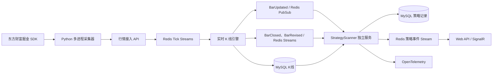

# 策略扫描服务迁移与开发方案

> 方案日期：2026-08-13  
> 旧逻辑来源：`C:\Users\Administrator\Desktop\策略逻辑.md`  
> 目标系统：A股监控程序  
> 本阶段范围：迁移策略识别、信号生命周期、持久化、查询、回放和监控；不接入交易、账户或下单。

## 1. 结论

建立一个独立的 `.NET 10 Worker Service`：`AStockMonitor.StrategyScanner`。它只消费现有数据底座提供的行情和 K 线，不连接东方财富 SDK，也不参与 Tick/K 线落库。

本次迁移以旧文档列出的 **8 个实际策略** 为基线。旧文档标题和维护记录中提到“10 个策略”，但当前策略清单只有 8 个，因此不凭空恢复已下线的两个策略。

迁移时彻底删除以下依赖：

- 行业映射、概念映射；
- 行业热度、概念热度及连续热度状态；
- 市场温度、冰点/偏冷/偏热/过热等情绪分级；
- 情绪统一加减分、动作降级和情绪风险提示；
- 命中时的行业/概念热度上下文及相关快照；
- 任何因行业、概念或情绪缺失而拒绝信号的条件。

保留个股价格、成交量、成交额、VWAP、均线、平台、趋势、回撤、K 线形态和多周期确认等策略本体。`逆势走强`需要的“个股涨幅－全市场平均涨幅”是该策略自身的相对强度基准，不作为统一市场情绪修正；如果未来要求完全不使用任何市场横截面数据，应停用该策略，而不是悄悄改变其含义。

## 2. 服务边界



边界原则：

1. 行情采集、行情持久化、K 线生成、策略扫描四个环节分别部署、分别恢复。
2. 策略异常不能阻塞 Tick ACK、K 线生成或行情落库。
3. 策略服务只通过稳定数据接口和事件契约取数，不直接读取 Python Outbox，不持有东方财富 Token。
4. MySQL 是策略事实记录，Redis 负责实时事件、热点缓存和消费进度，进程内存只负责短生命周期计算缓存。
5. 策略扫描服务可运行在 Windows，也可独立部署到 Linux；只有东方财富 SDK 采集器必须留在 Windows。

## 3. 旧策略迁移清单

| 新编码 | 新名称 | 旧策略 | 迁移处理 | 触发方式 |
|---|---|---|---|---|
| `intraday-vwap-volume-resonance` | 分时 VWAP 量价共振 | 主线板块共振 | 删除行业、概念和热度条件，保留 VWAP、回撤、量能持续、平台突破和 5 分钟涨幅；因已无“主线”语义而重命名 | 60 秒扫描，1 分钟完成 K 驱动 |
| `gap-recovery-vwap-restart` | 低开高走 VWAP 再启动 | 主线低开高走 | 删除行业/概念连续强势条件，保留低开范围、开盘后涨幅、VWAP、量能、回踩再启动/连续站稳分支 | 60 秒扫描，1 分钟完成 K 驱动 |
| `platform-volume-breakout` | 平台放量突破 | 平台放量突破 | 原样保留个股周线平台、日线量价及已完成 30 分钟确认 | 30 分钟 K 关闭/修订，盘中 300 秒兜底 |
| `moving-average-pullback-restart` | 均线回踩再启动 | 均线回踩再启动 | 保留 MA20/30/60、缩量回踩、站回支撑及日内形态 | 300 秒观察扫描，日线修订 |
| `long-support-rebound` | 下跌浪二次探底反弹 | 下跌浪二次探底反弹 | 保留日线结构及 30 分钟三类触发；删除“市场环境很弱时降级” | 30 分钟 K 关闭/修订，300 秒兜底 |
| `strong-trend-continuation` | 强势趋势延续 | 强势趋势延续 | 原样保留均线排列、趋势强度、位置、量比和上影线条件 | 300 秒观察扫描，日线修订 |
| `counter-trend-strength` | 逆势走强 | 逆势走强 | 保留全市场平均涨幅作为本策略必要基准，不进入其他策略、不形成情绪分数 | 300 秒观察扫描 |
| `strong-repair-rebound` | 强修复反弹 | 强修复反弹 | 原样保留个股下探修复、均线、量比和日内位置条件 | 300 秒观察扫描 |

两个重命名策略不是简单删除热度判断：删除行业/概念得分后，旧分数与统一 75 分门槛不再同量纲。迁移版本将价格、量能、位置、形态、确认五类核心分重新归一化到 `0～100`，再使用统一资格门槛；不得继续沿用删除热度分后的残缺总分。

## 4. 策略口径

### 4.1 分时 VWAP 量价共振

保留：

- 成交额不少于 8000 万元，已完成 1 分钟 K 不少于 12 根；
- 当前价不低于当日累计 VWAP，较开盘上涨至少 0.3%，当日涨幅不超过 6.5%；
- 候选回撤区间 `[0.8%, 1.2%]`，最近 2 根完成 1 分钟 K 站上对应累计 VWAP；
- 确认回撤区间 `[0.2%, 1.2%]`，最近 3 根完成 1 分钟 K 站上对应累计 VWAP；
- 候选量能加速不低于 1.35，确认不低于 1.50；最近 3 根相对前 3 根不低于 1.10 且维持/递增；
- 近 5 分钟涨幅至少 0.3%；确认分支还需突破近 15 根分钟平台至少 0.3%；
- 同轮确认优先于候选，止损参考 VWAP 与短平台低点，目标参考当前价上方 2%。

删除：行业/概念热度、连续热度、上涨家数比例、板块龙头排名及对应评分。

### 4.2 低开高走 VWAP 再启动

保留：

- 成交额不少于 8000 万元，完成 1 分钟 K 不少于 12 根；
- 主板低开 `[-2%, 0%)`，创业板/科创板低开 `[-7%, 0%)`；
- 当前价较开盘至少上涨 2%，当日涨幅不超过 3.5%；
- 当前价至少高于当日累计 VWAP 1%；距分时高点回撤不超过 1.8%；
- 量能加速至少 1.50 且最近 3 根量能持续；
- 确认使用“近 8 根内回踩 VWAP 不破后连续 2 根重新站上，并较回踩收盘启动至少 0.20%”或“连续 3 根完成 1 分钟 K 站上对应累计 VWAP”；
- 输出 `Candidate/Medium`，目标参考当前价上方 2%。

删除：行业/概念热度阈值和连续状态。保留过滤漏斗，但漏斗只包含价格、VWAP、形态、成交额和成交量环节。

### 4.3 其余六个策略

平台放量突破、均线回踩再启动、强势趋势延续、逆势走强和强修复反弹按旧文档中的个股条件迁移。下跌浪二次探底反弹删除“市场环境很弱”判断，确认完全由日线结构、30 分钟形态、成交额和量能决定。

平台放量突破需要周线。首版不新增周线永久表，而是按交易周从已完成日线聚合周线，并以 `symbol + 最后交易日 + 复权口径` 缓存。周线平台计算严格排除当前尚未完成的交易周。

## 5. 扫描模型

不采用“全市场、全部策略、固定一分钟全部重算”。采用事件驱动与定时扫描结合：

### 5.1 快速扫描层

- 交易日 `09:25～15:00` 启动，每 60 秒生成一个扫描桶。
- 只运行两个分时策略。
- 以 Redis 最新行情和当前活动 K 线为快速数据，以 MySQL 已完成 K 线为历史窗口。
- 每个扫描桶只允许一个实例执行，Redis 租约防止多实例重复全市场扫描。
- 09:30 前或完成 1 分钟 K 少于 12 根时快速拒绝，不产生信号。

### 5.2 观察扫描层

- 交易时段每 300 秒运行其余六个策略。
- 日线和周线特征每日只增量刷新，不在每次扫描重复计算 180 根历史数据。
- 30 分钟策略在 `BarClosed` 后立即扫描相关股票，300 秒任务只做漏扫兜底。

### 5.3 可靠事件层

- 使用独立 Redis Stream 消费组 `strategy-scanner-v1` 消费 16 个 `BarClosed/BarRevised` 分片。
- `BarClosed` 触发首次确定性计算；`BarRevised` 使用新 revision 重算并写修订事件。
- 只有策略结果和数据库事务成功后才 `XACK`；进程崩溃后通过 `XAUTOCLAIM` 接管 Pending。
- `BarUpdated` 是低延迟提示，不是可靠事实。服务重启后通过 Redis 最新投影和 MySQL 已完成 K 线恢复，不依赖补发历史 Pub/Sub。

### 5.4 收盘任务

- 15:05 后等待官方日线确认，刷新日线/周线特征。
- 对当日所有信号执行一次最终修订，记录最终动作、分数和原因。
- 补跑当日漏扫区间并生成数据完整性摘要。

## 6. 统一策略接口与特征层

建议新增项目和目录：

```text
src/AStockMonitor.StrategyScanner/       独立 Worker Host
src/AStockMonitor.Strategies/            8 个纯策略实现
src/AStockMonitor.Domain/Strategies/     信号、动作、置信度、版本模型
src/AStockMonitor.Application/Strategies/
    IStrategyRule.cs
    StrategyScanOrchestrator.cs
    StrategyFeatureEngine.cs
    StrategySignalLifecycle.cs
src/AStockMonitor.Infrastructure/Strategies/
    StrategyMarketDataReader.cs
    MySqlStrategyRepository.cs
    RedisStrategyEventConsumer.cs
```

核心接口示意：

```csharp
public interface IStrategyRule
{
    StrategyDescriptor Descriptor { get; }
    ValueTask<StrategyEvaluation> EvaluateAsync(
        StrategySnapshot snapshot,
        CancellationToken cancellationToken);
}
```

`StrategySnapshot` 是某只股票在一个确定数据水位下的只读快照，至少包含：

- 最新价格、昨收、今开、日内高低、累计量额；
- 已完成 1m/5m/30m/60m K 线和活动 K 线；
- 最多 180 根已完成日线及由日线派生的已完成周线；
- VWAP、MA5/10/20/30/60、量比、平台上下沿、收盘位置、上下影线、趋势线等共享特征；
- 行情时间、数据接收时间、K 线 revision、数据完整性和来源哈希；
- 仅供逆势走强使用的当时全市场平均涨幅。

共享特征必须只计算一次，再供多个策略读取。策略实现保持纯函数特征：输入同一快照和参数，必须得到同一结果，不自行查数据库、不写 Redis、不推送消息。

## 7. 信号评分与生命周期

### 7.1 评分

- 每个策略的硬条件先判定；硬条件失败时只写漏斗统计，不产生合格信号。
- 软指标按价格、量能、位置、形态、确认五类计分，再按该策略有效类别归一化到 `0～100`。
- 首版统一入池最低分仍为 75；`Watch + Low` 且低于 90 不进入机会池。
- 删除旧逻辑中所有行业、概念和市场情绪加减分，策略之间不做统一环境修正。
- 分数用于排序和层级，不解释为胜率或预期收益。

### 7.2 动作与置信度

动作保留 `Watch`、`PullbackWait`、`Candidate`、`Confirm`；置信度保留 `Low`、`Medium`、`High`。策略只能给出观察和识别结果，服务中不定义 `Buy`、`Sell` 或下单动作。

### 7.3 合并和事件

- 同一股票可同时保留多个策略明细，最高分策略作为主策略。
- 分数至少 90，或同一股票同时命中至少 2 个策略时为“候选”；分数至少 120 的旧规则不再适用于 100 分归一化体系，首版改为“至少 95，或至少 2 个策略且最高分至少 85”进入“重点”，最终阈值必须由历史回放验收后固化。
- 同一股票、同一策略在 8 分钟内且分差小于 2 分时不新增机会，只增加命中次数并刷新最后命中时间。
- 生命周期事件为 `New`、`Repeated`、`Strengthened`、`Weakened`、`Expired`、`Revised`、`Invalidated`。
- 首版先保留旧的 6 分钟减弱、18 分钟消失规则作为配置，不写死在策略代码中；历史回放后分别为 60 秒池和 300 秒池校准。
- `BarRevised` 导致结果变化时不覆盖历史证据，新增 `Revised/Invalidated` 事件并指向原事件。

## 8. 存储设计

新增数据库迁移建议命名为 `008_strategy_scanner.sql`。

| 表 | 用途 | 关键幂等键/索引 |
|---|---|---|
| `strategy_definition` | 策略编码、名称、启停、扫描档位和当前版本 | `strategy_code` 唯一 |
| `strategy_version` | 参数、规则摘要、代码版本和数据需求快照 | `strategy_code + version` 唯一 |
| `strategy_scan_run` | 每次实时、观察、事件、收盘或回放任务 | `run_key` 唯一；按状态和时间索引 |
| `strategy_signal_event` | 不可变的原始命中及生命周期事件 | `event_id` 唯一；按日期、股票、策略、状态索引 |
| `strategy_opportunity` | 同一交易日、同一股票的当前合并状态 | `trading_date + symbol` 唯一 |
| `strategy_opportunity_detail` | 机会下各策略的当前状态、次数和最高分 | `opportunity_id + strategy_code` 唯一 |
| `strategy_filter_funnel` | 每轮各过滤节点累计/独立通过数 | `run_id + strategy_code + step_code` 唯一 |
| `strategy_scan_checkpoint` | 定时桶、事件水位、收盘任务进度 | `scope_key` 唯一 |

`strategy_signal_event`至少保存：策略编码和版本、股票、交易日、事件时间、扫描触发类型、源 Bar event/revision、动作、置信度、分数、命中价、止损参考、目标参考、通过条件、失败条件、完整特征快照、参数快照、数据水位、源数据哈希、关联前一事件和创建时间。这样历史回放结果可解释、修订可追踪。

Redis 只保存热点数据：

```text
strategy:v1:latest:{symbol}:{strategyCode}    最新策略状态，TTL 2天
strategy:v1:opportunities:{tradingDate}       当日机会排序 ZSET，TTL 7天
strategy:v1:scan:last                         各扫描档位最新状态
strategy:v1:signal:event                      下游可靠策略事件 Stream
strategy:v1:lock:scan:{profile}:{bucket}      扫描桶租约
```

## 9. API 与消息

API 继续由现有 `AStockMonitor.Api` 提供，策略计算不放进 API 进程。

```text
GET  /api/strategies
GET  /api/strategies/signals?page=1&pageSize=50&symbol=&strategyCode=&eventType=&tradingDate=
GET  /api/strategies/opportunities?page=1&pageSize=50&level=&tradingDate=
GET  /api/strategies/opportunities/{id}
GET  /api/strategies/scan-runs?page=1&pageSize=50&profile=&status=
```

首版写接口不放在 Web API 中，避免浏览器请求直接控制独立扫描进程。历史回放和人工扫描通过 StrategyScanner 命令/可靠控制 Stream 执行，后续运维页面只负责提交任务和查看任务状态。

所有接口补齐 Swagger 中文注释和分页约束。SignalR 增加统一消息 `StrategyOpportunityChanged`，消息包含事件类型、股票、主策略、全部命中策略、动作、置信度、分数、发生时间和机会详情地址。API 消费可靠策略 Stream 后再推送，浏览器临时断线不影响 MySQL 事实记录。

## 10. 可靠性与性能

- 股票代码继续使用稳定哈希分到 16 个分片，同一股票同一时刻只由一个活跃扫描消费者更新。
- 快速扫描先执行只需最新快照的廉价过滤，再加载分钟历史；未通过基础条件的股票不读取 180 根日线。
- 日线均线、平台和周线等特征按 `symbol + lastDailyEob + adjustMode` 缓存；新日线或修订到达才失效。
- 每轮对 MySQL 批量读取，不允许按“股票 × 策略”形成 N+1 查询。
- 信号落库、机会聚合和 Outbox/策略 Stream 发布采用同一事务边界或事务 Outbox，避免“数据库有记录但没有推送”。
- 所有事件 ID 按策略版本、股票、数据水位、动作和触发来源确定性生成；允许重放，不允许重复事实。
- 数据不完整、K 线质量状态失败、行情时间落后时不扫描，记录 `DataNotReady` 而不是给出低质量信号。

## 11. 监控要求

接入现有 OpenTelemetry 与 Grafana，增加：

- 各扫描档位最后开始/成功/失败时间；
- 每策略评估数、命中数、合格率、计算耗时 P50/P95/P99；
- Redis Stream lag、Pending 数、最旧 Pending 年龄；
- 每轮候选股票数、读取 K 线数、缓存命中率和 MySQL 查询耗时；
- 数据过期股票数、K 线不完整股票数、修订后失效信号数；
- 信号 Stream 积压和 SignalR 推送成功/失败数。

告警至少覆盖：服务停止、交易时段超过 2 个扫描周期未成功、可靠 Stream 积压持续增长、数据水位落后、MySQL 写入失败和单策略异常率突增。

## 12. 开发计划

### 阶段一：契约和数据适配

1. 新建 `AStockMonitor.StrategyScanner` 和 `AStockMonitor.Strategies` 项目。
2. 建立策略接口、快照、结果、版本、生命周期契约。
3. 实现统一策略行情读取器，贯通 Redis 最新投影、`quote_bar`、`kline_bar_5m`、`kline_bar_agg`、`kline_bar_daily` 和股票池。
4. 实现日线派生已完成周线及共享特征引擎。
5. 编写 `008_strategy_scanner.sql` 和仓储幂等测试。

验收：给定固定数据水位，快照可重复构建；数据缺失会明确返回原因；不读取任何行业/概念/情绪数据。

### 阶段二：先迁移六个不依赖板块的策略

按“强势趋势延续 → 均线回踩再启动 → 强修复反弹 → 平台放量突破 → 下跌浪二次探底反弹 → 逆势走强”的顺序实现。每个策略同时提交：参数类、纯函数实现、边界单元测试、中文规则摘要和策略版本。

验收：旧文档中的每项阈值均有测试；未完成 K 线不会用于确认；周线平台排除当前周。

### 阶段三：改造两个原主线策略

实现分时 VWAP 量价共振、低开高走 VWAP 再启动及过滤漏斗，删除所有板块依赖，重新归一化核心分数。

验收：无行业、概念数据时仍能独立计算；候选和确认分支均可达；VWAP 使用当时已完成分钟数据，不产生未来函数。

### 阶段四：扫描编排与生命周期

实现 60 秒池、300 秒池、Bar 事件即时扫描、Redis 消费组、租约、Pending 接管、收盘修订、重复命中合并和机会生命周期。

验收：重复事件幂等；服务在计算、落库和 ACK 各位置异常退出后都能恢复；多个实例不会并发更新同一分片。

### 阶段五：API、消息和运维监控

实现分页接口、Swagger 中文注释、SignalR 策略消息、Grafana 策略扫描看板和告警规则。

验收：可查询任一信号的策略版本、参数、特征、通过/失败原因和源 K 线 revision；可在运维页定位停止扫描的具体档位或策略。

### 阶段六：历史回放与影子运行

1. 使用 2026 年已有历史数据逐交易日、逐时点回放，禁止读取时点之后的数据。
2. 输出每策略扫描数、命中数、重复率、修订失效率、D1/D3/D5/W1 延续表现和极端样本。
3. 重点校准移除热度后的分数分布、重点层级阈值及 6/18 分钟生命周期。
4. 在盘中影子运行至少 5 个交易日：落库、监控但不主动通知。
5. 数据完整性和实时延迟达标后再开启 SignalR 实时通知。

## 13. 首版完成标准

- 8 个策略全部实现，代码和文档中不存在行业、概念、热度或统一情绪修正依赖。
- 任一策略可独立启停和版本化，单策略异常不停止其他策略。
- 实时扫描、可靠事件、服务重启、K 线修订和历史回放产生一致且可追踪的结果。
- 同一股票多策略合并、重复命中、增强、减弱、消失和修订均有完整记录。
- 分页 API、Swagger、SignalR、Grafana 指标和告警可用。
- 不接入账户、交易或下单接口；东方财富 Token 仍只属于采集端私有配置。

## 14. 本方案中的关键决策

1. **独立服务，不塞进现有 Worker。** 便于独立扩容、重启、回滚和故障隔离。
2. **先迁移规则，再校准分数。** 删除热度分后必须重新归一化，不能机械保留旧分数。
3. **实时提示与可靠事实双通道。** `BarUpdated`负责及时性，`BarClosed/BarRevised + MySQL`负责可恢复和可审计。
4. **周线由日线派生。** 首版避免重复存储；性能不足时再增加周线物化表。
5. **保留逆势策略的市场平均涨幅。** 它属于该策略定义，不扩散为全局情绪因子。
6. **先影子运行。** 策略迁移后的第一目标是证明实时一致性和可靠性，不直接把新信号当成交易结论。

## 15. 2026-08-13 实施状态

- 已创建独立的 `AStockMonitor.StrategyScanner`、纯规则程序集 `AStockMonitor.Strategies`，完成 8 个策略迁移；策略规则不读取行业、概念、热度或统一情绪数据。
- 已完成共享特征引擎、时点隔离、Redis Bar 事件消费组、Pending 接管、幂等扫描、不可变信号、机会合并、6/18 分钟生命周期和事务 Outbox。
- 已应用 `008_strategy_scanner.sql`，落地策略定义、版本、扫描、信号、机会、漏斗、检查点和 Outbox 表。
- 已提供分页查询 API、Swagger 中文注释、SignalR `/hubs/strategy` 和 OpenTelemetry/Grafana 策略指标。
- 8 个规则自检全部通过；.NET Release 构建为 0 警告、0 错误；Python 数据底座 12 项测试通过。
- 东方掘金历史行情接口可用；新版证券主数据接口在当前终端返回空，采集器已实现新版优先、旧版兼容接口自动兜底及双空结果熔断。
- 2026 年 4 进程历史回放已启动。日线不受分钟窗口限制，但 5 分钟线仅处理最近 60 个自然日且不含当天；下载器会自动裁剪有效区间、在批次详情中标记 `authorization_limited`，不会把范围外区间伪装成完整数据。兼容证券接口只能提供当前 ST/停牌快照，因此回放股票池会按上市/退市日期修正，但历史 ST 状态属于降级近似；若终端恢复新版按日证券状态服务，应重新构建股票池后执行幂等回放校准。
