# A股监控程序：当前系统架构与完整功能流程图

> 架构基线：V2  
> 更新时间：2026-08-14  
> 技术栈：Windows、Docker Desktop/WSL2、.NET 10、Python、东方财富掘金 SDK、MySQL 8.4、Redis 8、Grafana、Prometheus、Loki、Tempo、OpenTelemetry。  
> 系统边界：只获取和处理行情、生成研究信号；不连接交易账户、不执行策略交易、不调用下单接口。

本文档描述当前代码已经采用的架构。旧文档中的“Tick 写 MySQL”“Tick 聚合为正式 5/30/60 分钟和日线”“1 分钟正式落库”均已退出生产路径。

## 1. 架构结论

当前系统采用“Windows 行情边缘节点 + .NET 服务域 + Redis 实时层 + MySQL 事实层 + Docker 可观测平台”的结构。

五条不可破坏的架构约束：

1. 东方掘金 SDK 是正式 `5m/30m/60m/1d` K 线的权威来源。
2. Tick 只进入本地短期 Outbox、内存和 Redis，不写 MySQL，每个交易日自然失效。
3. MySQL 只保存正式四周期 K 线、任务状态、审计记录和业务结果。
4. Redis 是可重建的实时状态与可靠消息层，不能替代 MySQL 最终事实。
5. 对子顶底、8 个策略和浏览器推送通过独立 Consumer Group 消费同一套 V2 Bar 事件，互不抢消息、互不阻塞。

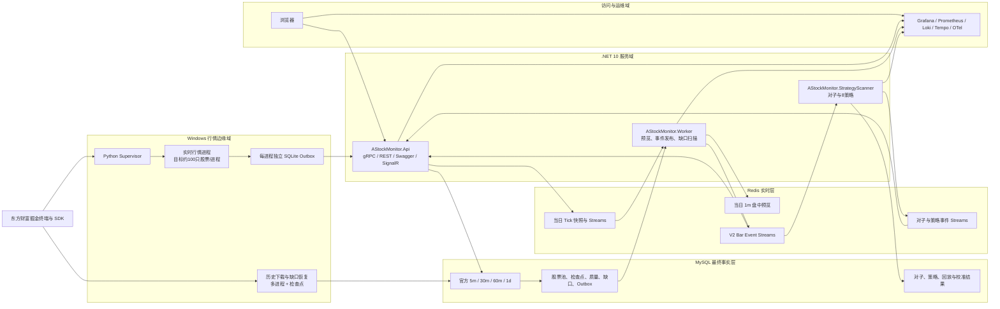

## 2. 物理部署架构

东方掘金终端和 Python SDK 必须保留在 Windows。当前 MySQL、Redis 和监控栈由 Docker Desktop/WSL2 承载；三个 .NET 进程作为 Windows Service 发布。未来可将 .NET、MySQL、Redis 和监控栈迁往 Linux，Windows 只保留采集节点。

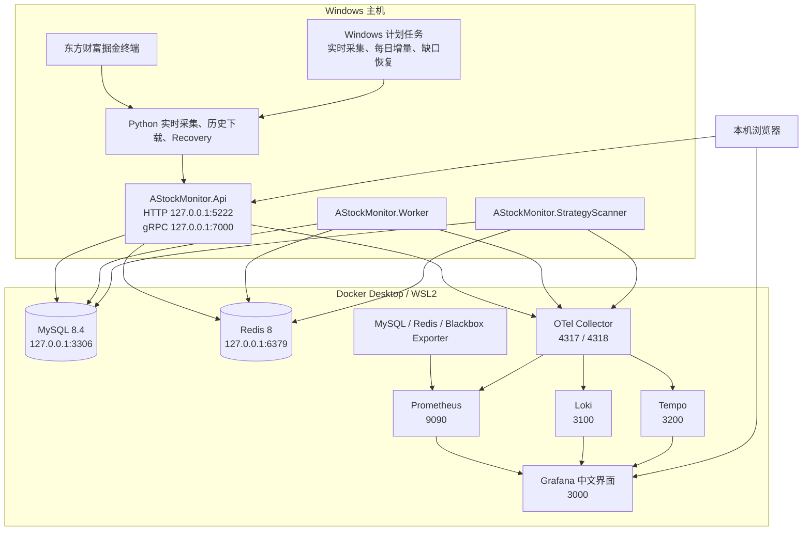

### 2.1 可扩展部署

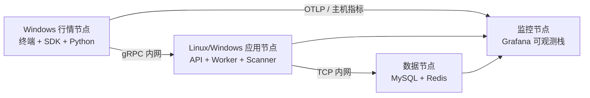

拆分部署时应通过防火墙只开放节点间所需端口；`5222`、`7000`、`3306`、`6379` 不应暴露到公网。

## 3. 服务职责

| 服务/进程 | 核心职责 | 不负责的事情 |
|---|---|---|
| Python Supervisor | 读取严格股票池、分片、启动和重启实时采集进程 | 不计算策略、不下单 |
| Python Live Worker | 同时订阅 Tick 与官方四周期 K 线，写独立 SQLite Outbox，通过 gRPC 发送 | 不写 MySQL Tick |
| Python History | 官方 K 线历史增量、60 日回填、断点续传、质量任务 | 不生成正式 Tick/1m |
| Python Recovery | 领取缺口任务，调用 SDK 补官方四周期 K 线 | 不自行发明 K 线 |
| AStockMonitor.Api | gRPC 接入、Canonical Bar Writer、行情查询、Swagger、SignalR、健康检查 | 不执行全市场策略扫描 |
| AStockMonitor.Worker | Tick 保留、Redis 1m 预览、Bar Outbox 发布、四类缺口扫描、补数后策略重放协调 | 不从 Tick 生成正式 K 线 |
| AStockMonitor.StrategyScanner | 8 策略定时/事件扫描、对子实时扫描、生命周期维护、业务 Outbox 发布 | 不阻塞行情接入 |
| MySQL | 最终事实、任务状态、审计、业务结果 | 不保存 Tick 明细 |
| Redis | 实时快照、短期流、V2 事件、Consumer Group | 不作为长期事实库 |

### 3.1 .NET 项目依赖

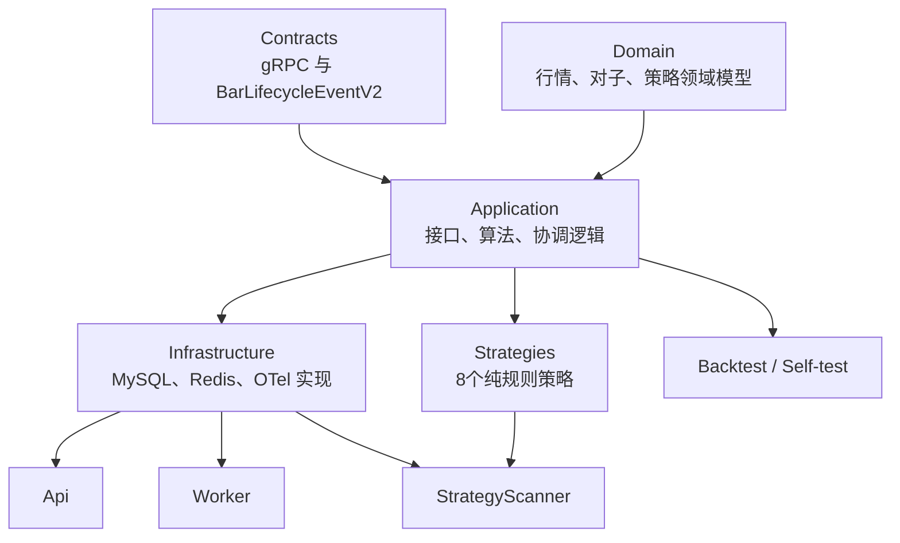

## 4. 数据分层与存储边界

| 数据 | 本地 SQLite | Redis | MySQL | 保留规则 |
|---|---:|---:|---:|---|
| 未确认 Tick | 是 | 否 | 否 | ACK 后延迟清理，默认已确认记录保留 24 小时 |
| 当日 Tick 最新值 | 否 | 是 | 否 | 约 36 小时 TTL |
| 当日 Tick 短期流 | 否 | 是 | 否 | 正常 30 分钟，硬上限约 120 分钟 |
| 1m 盘中预览 | 否 | 是 | 否 | 约 72 小时 TTL，`officialConfirmed=false` |
| 未闭合官方 Bar | 可缓冲 | 是 | 否 | 当日活动状态 |
| 正式 5m/30m/60m/1d | 可缓冲 | 事件投影 | 是 | MySQL 最终事实，SDK 权威 |
| Bar/对子/策略 Outbox | 否 | 发布目标 | 是 | 发布状态和失败审计 |
| 股票池、质量、缺口、检查点 | 否 | 指标/锁 | 是 | 长期审计 |
| 对子、策略、回放、校准 | 否 | 实时通知 | 是 | 长期业务结果 |

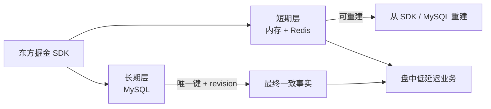

### 4.1 正式表与兼容表

正式 K 线物理表：

- `kline_bar_5m`：官方 5 分钟 K 线；
- `kline_bar_agg`：官方 30/60 分钟 K 线，名称保留但正式数据不再由 5 分钟聚合生成；
- `kline_bar_daily`：官方日线；
- `bar_event_outbox`、`bar_reconcile_log`、`bar_sync_checkpoint`：事件、修订和同步水位。

`quote_tick` 已删除。`quote_bar`、`kline_bar_1m`、旧 V1 实时 K 线类可能仍因迁移兼容或自测保留，但不属于 V2 生产主链，不得被新功能依赖。

## 5. 股票池构建与实时分片

目标股票池是沪深 A 股、非 ST、非北交所；明确排除 `SHSE.900xxx` 和 `SZSE.200xxx` B 股。历史状态不可用时必须记录来源和质量，不可把当前快照伪装成历史权威状态。

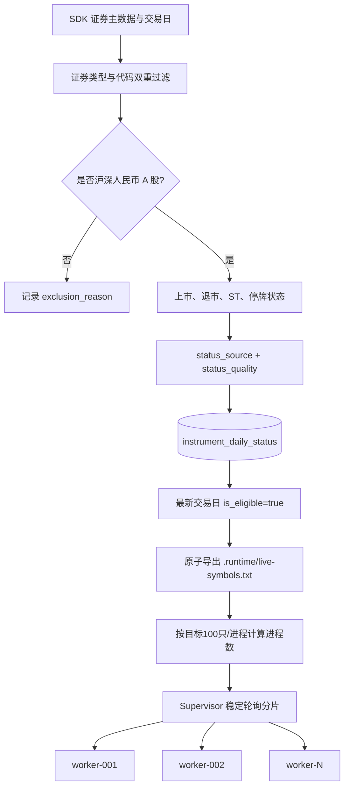

## 6. 实时 Tick 可靠接入

实时 Tick 采用“有界队列 + 每进程独立 SQLite WAL + gRPC 至少一次 + Redis 幂等事件”语义。SQLite 文件不共享，因此多进程之间不会争用同一个数据库锁。

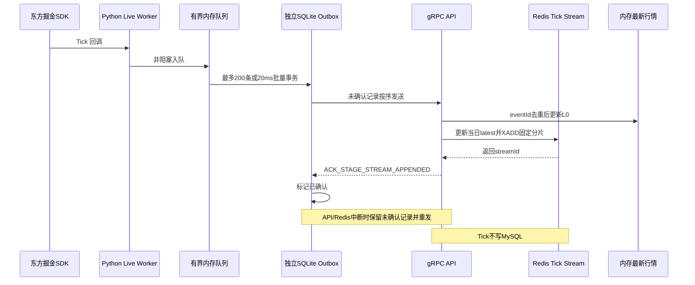

Redis 主键：

```text
md:v2:tick:latest:{tradingDate}:{symbol}
md:v2:tick:stream:{tradingDate}:{00..15}
```

## 7. Tick 保留与 1 分钟盘中预览

1 分钟数据只服务盘中 VWAP、量能和快速策略，是可丢失、可重建的预览，不是正式 K 线。

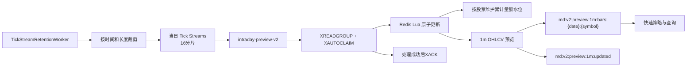

## 8. 官方四周期 K 线实时固化

实时采集进程同时订阅 `300s/1800s/3600s/1d`，每根官方 Bar 走与 Tick 相同的本地可靠 Outbox，但使用更强的 SQLite 提交级别。

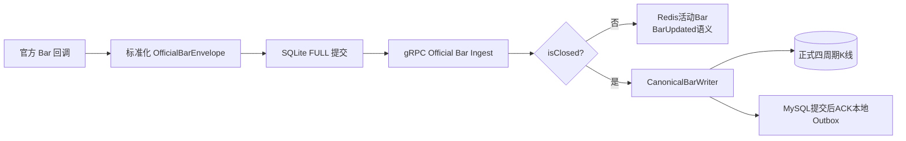

正式 Bar 不从 Tick 聚合，也不从 5 分钟聚合 30/60 分钟。聚合逻辑只可用于离线校验，不能覆盖 SDK 官方事实。

## 9. Canonical Bar Writer 与修订生命周期

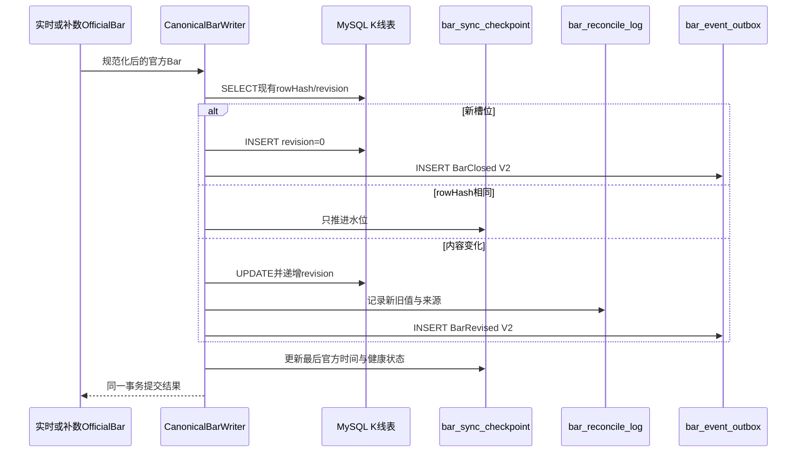

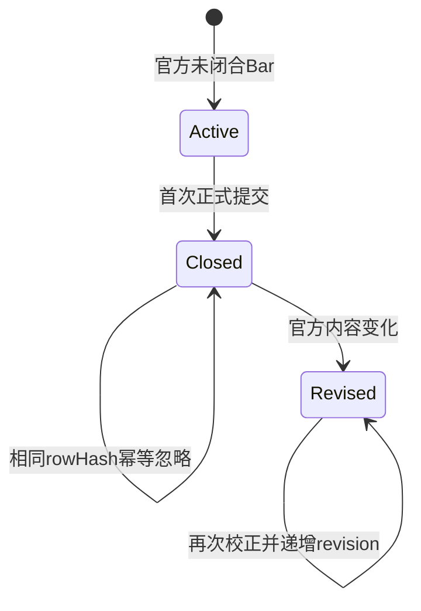

## 10. Bar V2 可靠事件总线

`bar_event_outbox` 通过租约领取，发布到 16 个稳定分片。消费者至少一次接收，以 `eventId` 去重，以 `revision` 覆盖旧版本。

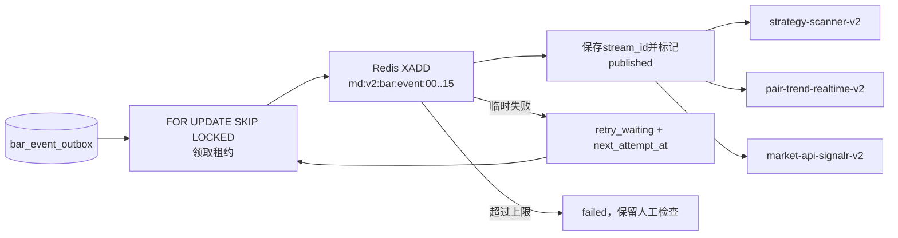

独立 Consumer Group 是防止消息堆积相互传染的关键：对子服务慢不会抢走策略消息，浏览器断开也不会阻塞内部计算。

## 11. 盘中对子顶底实时扫描

对子包含 `.00` 与 `.11`～`.99`。上升趋势检查阶段高点，下降趋势检查阶段低点；四周期独立命中后按同股、同方向、时间窗口合并为一条实时事件。

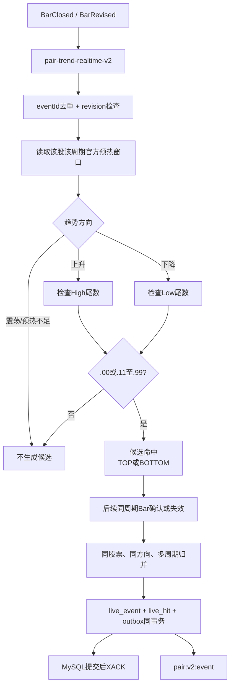

### 11.1 BarRevised 处理

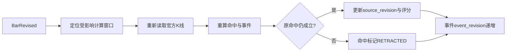

## 12. 8 个策略扫描

策略服务同时支持定时全市场扫描和 Bar 事件扫描。市场数据读取已经批量化：MySQL 按股票批次读取 30 分钟与日线，Redis Pipeline 并发读取最新行情和 1m 预览，避免逐股票 N+1 查询。

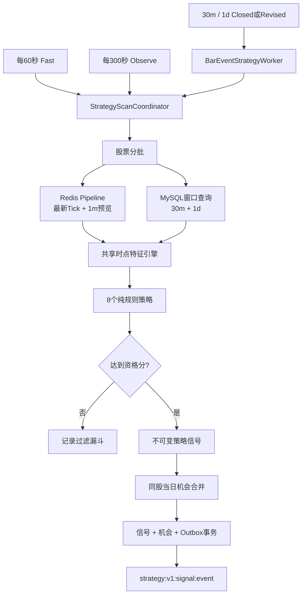

扫描层：

| 层 | 周期 | 策略 |
|---|---:|---|
| Fast | 60 秒 | 分时 VWAP 量价共振、低开高走 VWAP 再启动 |
| Observe/Event | 300 秒或 30m/1d 事件 | 平台放量突破、均线回踩再启动、下跌浪二次探底反弹、强势趋势延续、逆势走强、强修复反弹 |

### 12.1 策略生命周期

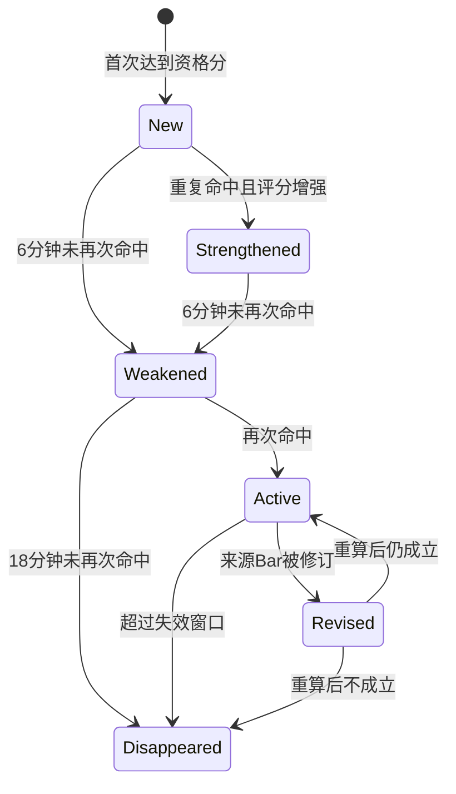

## 13. HTTP 查询、Swagger 与 SignalR

HTTP 提供一致快照和分页历史；SignalR 只提供实时增量。客户端重连后必须重新获取 HTTP 快照，再恢复订阅，不能依赖 SignalR 补历史消息。

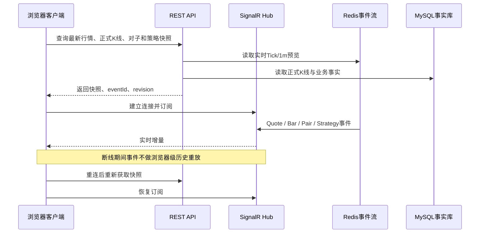

### 13.1 API 功能入口

| 功能 | 路径 |
|---|---|
| 最新 Tick、近期 Tick、采集运行状态 | `/api/market/*` |
| 官方四周期 K 线 | `/api/market/bars*` |
| 历史批次与质量问题 | `/api/history/*` |
| 缺口检测、缺口分页、恢复批次与重试 | `/api/market-data/*` |
| 对子历史回测事件、命中、统计 | `/api/pair-trends/*` |
| 对子实时事件、命中、分片状态 | `/api/pair-trends/live/*` |
| 策略定义、信号、机会、扫描和回放校准 | `/api/strategies/*` |
| Swagger UI | `/swagger` |
| 行情与 Bar 推送 | `/hubs/market` |
| 策略推送 | `/hubs/strategy` |
| 存活/就绪 | `/health/live`、`/health/ready` |

## 14. 60 日历史 K 线增量与断点续传

分钟历史窗口为最近 60 个自然日且默认不含当天；日线不受此分钟窗口限制。下载范围内已有数据通过检查点和最新官方日期增量跳过。

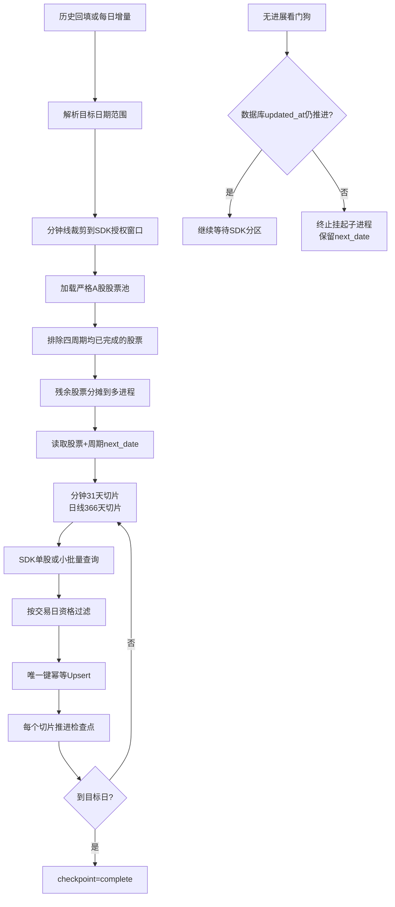

## 15. 每日增量流水线

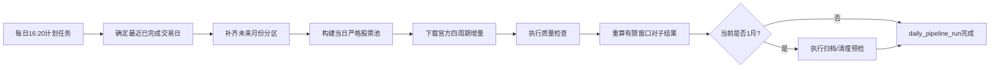

## 16. 数据质量检查

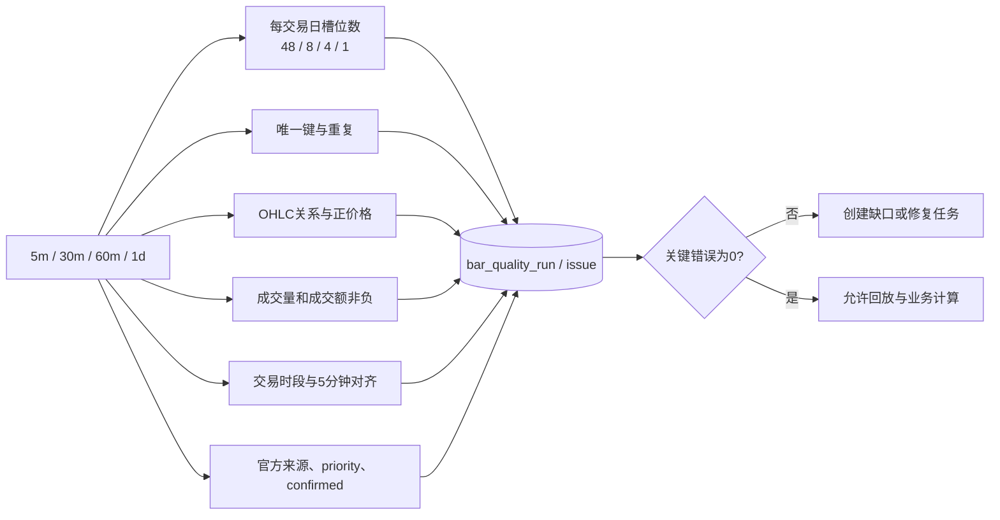

质量结果必须持久化，不以“进程退出码为 0”代替数据正确性。

## 17. 缺口检测与自动补数

缺口服务随 V2 数据架构同步变化：只检测和补充官方 `5m/30m/60m/1d`，不补 Tick，不补正式 1m。

```mermaid
flowchart TB
    STARTUP["Worker启动扫描"] --> DETECT["标准槽位检测"]
    BOUNDARY["每个已闭合5分钟边界"] --> DETECT
    ROLLING["盘中每15分钟滚动扫描"] --> DETECT
    CLOSE["15:10收盘终检"] --> DETECT
    DETECT --> COMPARE["股票池期望槽位 vs MySQL官方槽位"]
    COMPARE --> GAP[("market_data_gap")]
    GAP --> AGE{"分钟缺口是否在60日内?"}
    AGE -->|"否"| EXPIRED["source_expired<br/>停止无效重试"]
    AGE -->|"是"| RUN[("market_recovery_run / item")]
    RUN --> CLAIM["Python Recovery<br/>SKIP LOCKED + 租约"]
    CLAIM --> SDK["SDK官方历史查询"]
    SDK --> CANON["Canonical语义幂等写入"]
    CANON --> EVENT["BarClosed / BarRevised"]
    EVENT --> PAIR["对子重算"]
    EVENT --> STRATEGY["策略重算"]
    CANON --> VERIFY["重新核验缺口"]
    VERIFY --> STATUS["completed / retry_waiting / partial"]
```

## 18. 对子历史回放

```mermaid
flowchart TB
    RANGE["选择日期、股票和四周期"] --> LOAD["读取官方已确认K线"]
    LOAD --> ANALYZE["按时间顺序识别趋势和对子尾数"]
    ANALYZE --> CANDIDATE["产生TOP/BOTTOM候选"]
    CANDIDATE --> FUTURE["最多观察后续配置根数"]
    FUTURE --> STATUS["CANDIDATE / CONFIRMED / INVALIDATED"]
    STATUS --> MERGE["同股、同方向、时间窗、多周期归并"]
    MERGE --> EVENT[("pair_trend_event")]
    MERGE --> HIT[("pair_trend_hit")]
    EVENT --> API["分页、详情、统计接口"]
    HIT --> API
```

## 19. 8 策略逐时点历史回放与阈值校准

```mermaid
flowchart TB
    READY["数据就绪门"] --> RUN["创建strategy_replay_run"]
    RUN --> SYMBOL["股票级并发与断点"]
    SYMBOL --> CLOCK["按5分钟时间轴推进"]
    CLOCK --> SNAPSHOT["只使用观察时点之前的数据"]
    SNAPSHOT --> FAST["Fast策略逐5m评估"]
    SNAPSHOT --> SLOW["Observe策略逐30m评估"]
    FAST --> CROSS["记录阈值首次穿越"]
    SLOW --> CROSS
    CROSS --> SIGNAL[("strategy_replay_signal")]
    SIGNAL --> OUTCOME["D1/D3/D5/W1、MFE、MAE"]
    OUTCOME --> SPLIT["按时间训练/验证切分"]
    SPLIT --> CALIB["样本数、胜率、收益、稳定性校准"]
    CALIB --> RESULT[("strategy_calibration_result")]
    RESULT --> REVIEW["人工审核，不自动改线上阈值"]
```

## 20. 年度归档与清理

每年一月开始检查，分钟 K 线归档截止日为上一年 7 月 1 日之前。默认 dry-run；只有导出校验成功且显式启用 purge 才删除分区。

```mermaid
flowchart LR
    JAN["每年1月"] --> CUTOFF["计算截止日"]
    CUTOFF --> SELECT["选择5m和30/60m月份分区"]
    SELECT --> EXPORT["导出Zstandard Parquet"]
    EXPORT --> VERIFY["校验行数与SHA-256"]
    VERIFY -->|"失败"| KEEP["保留MySQL并记录失败"]
    VERIFY -->|"成功"| MANIFEST[("archive_manifest")]
    MANIFEST --> PURGE{"显式启用purge?"}
    PURGE -->|"否"| DRY["仅报告"]
    PURGE -->|"是"| DROP["删除已验证分区"]
    DROP --> AUDIT[("maintenance_job_run")]
```

日线、股票池、质量、缺口、对子、策略、回放和校准结果长期保留。

## 21. 健康检查与故障发现

`/health/live` 只证明 API 进程能执行代码；`/health/ready` 判断数据链路是否可服务。非交易时段不会因没有新 Tick 误报故障。

```mermaid
flowchart TB
    LIVE["/health/live"] --> PROCESS["进程存活"]
    READY["/health/ready"] --> REDIS["Redis Ping与连接"]
    READY --> MYSQL["MySQL连接与Schema"]
    READY --> OUTBOX["Bar Outbox失败数与最老积压"]
    READY --> PAIR["对子分片检查点"]
    READY --> SESSION{"当前是否交易时段?"}
    SESSION -->|"是"| COLLECTOR["采集心跳少于30秒"]
    SESSION -->|"是"| FRESH["最新Tick少于10秒"]
    SESSION -->|"否"| SKIP["跳过Tick新鲜度故障判定"]
    REDIS --> RESULT{"全部通过?"}
    MYSQL --> RESULT
    OUTBOX --> RESULT
    PAIR --> RESULT
    COLLECTOR --> RESULT
    FRESH --> RESULT
    SKIP --> RESULT
    RESULT -->|"是"| HEALTHY["Healthy"]
    RESULT -->|"否"| UNHEALTHY["Unhealthy + 具体失败原因"]
```

## 22. 可观测与运维页面

```mermaid
flowchart LR
    API["API日志、指标、Trace"] --> OTEL["OTel Collector"]
    WORKER["Worker日志、指标、Trace"] --> OTEL
    SCANNER["Scanner日志、指标、Trace"] --> OTEL
    OTEL --> PROM["Prometheus指标"]
    OTEL --> LOKI["Loki日志"]
    OTEL --> TEMPO["Tempo链路"]
    MYSQL["MySQL Exporter"] --> PROM
    REDIS["Redis Exporter"] --> PROM
    HTTP["Blackbox HTTP探测"] --> PROM
    PROM --> ALERT["告警规则"]
    PROM --> GRAFANA["Grafana中文运维总览"]
    LOKI --> GRAFANA
    TEMPO --> GRAFANA
    ALERT --> GRAFANA
    GRAFANA --> VIEW["服务状态、最后成功时间、Lag、错误与链路"]
```

推荐故障定位顺序：服务可用性 → 最后成功时间/水位 → Outbox 与 Stream Lag → Loki 错误日志 → Tempo 链路 → MySQL/Redis/主机资源。

## 23. 启停与每日运行时序

### 23.1 启动顺序

```mermaid
flowchart LR
    DOCKER["1. MySQL + Redis"] --> OBS["2. 可观测容器"]
    OBS --> API["3. AStockMonitor.Api"]
    API --> WORKER["4. AStockMonitor.Worker"]
    WORKER --> SCANNER["5. StrategyScanner"]
    SCANNER --> COLLECTOR["6. Python实时采集"]
    COLLECTOR --> RECOVERY["7. Python Recovery"]
```

停止顺序相反：先停止采集和补数，再等待 Outbox 排空，然后停止 Scanner、Worker、API，最后停止 Redis/MySQL。

### 23.2 一个交易日

```mermaid
timeline
    title A股监控程序单日运行
    08:50 : 检查MySQL、Redis、服务和采集任务
    09:15 : 刷新股票池与实时采集分片
    09:25 : 就绪检查开始要求采集心跳
    09:30-11:30 : Tick、官方Bar、预览、策略、对子、边界/滚动缺口扫描
    11:30-13:00 : 午休，保留服务与事件消费
    13:00-15:00 : 下午实时链路继续
    15:10 : 四周期收盘完整性终检
    16:20 : 每日官方K线增量、质量检查与离线计算
    盘后 : 缺口Recovery、回放、校准和维护任务
```

## 24. 故障隔离与自动恢复

| 故障 | 直接影响 | 恢复机制 |
|---|---|---|
| 单个 Python 采集进程退出 | 该分片短暂停顿 | Supervisor 重启；独立 SQLite Outbox 重发 |
| gRPC/API 中断 | 实时消息无法上传 | 本地 Outbox 保留，连接恢复后发送 |
| Redis 中断 | Tick 实时层与事件发布暂停 | 本地 Tick Outbox、MySQL Bar Outbox 保留 |
| MySQL 中断 | 正式 Bar、对子、策略事务暂停 | 提交前不 ACK；恢复后重放 |
| Bar Outbox Publisher 中断 | V2 Bar 事件积压 | 租约过期后重新领取 |
| 单个 Bar 分片消费者异常 | 对应分片延迟 | 每分片独立监督、Pending 接管 |
| 对子服务异常 | 对子延迟 | 不影响策略和 SignalR Consumer Group |
| 策略服务异常 | 策略延迟 | 不影响行情与对子；事件恢复后重放 |
| SDK 历史请求挂起 | 当前分区不返回 | 数据库进度看门狗、终止子进程、保留 next_date |
| 数据缺失/修订 | 局部结果不完整 | 缺口补数 → BarClosed/Revised → 业务重算 |
| 监控栈中断 | 暂时不可观察 | 不影响行情事实；Docker 卷恢复后继续采集 |

## 25. 当前生产主链与禁用路径

```mermaid
flowchart LR
    GOOD1["Tick → Redis短期层"] --> GOOD2["Tick → Redis 1m预览"]
    GOOD3["SDK官方四周期 → MySQL"] --> GOOD4["MySQL Outbox → V2 Bar Stream"]
    GOOD4 --> GOOD5["对子 / 策略 / SignalR"]

    BAD1["Tick → MySQL"] -.->|"禁止"| X1["非生产路径"]
    BAD2["Tick → 正式K线"] -.->|"禁止"| X1
    BAD3["5m聚合替代官方30/60m"] -.->|"禁止"| X1
    BAD4["正式1m落库与补数"] -.->|"禁止"| X1
    BAD5["V1 Bar Stream生产消费"] -.->|"禁止"| X1
```

## 26. 完整端到端功能链

```mermaid
flowchart LR
    A["东方掘金实时行情"] --> B["Windows多进程可靠采集"]
    B --> C["gRPC接入"]
    C --> D["Redis Tick与1m预览"]
    C --> E["Canonical官方K线写入"]
    E --> F["MySQL四周期事实"]
    F --> G["V2 BarClosed / BarRevised"]
    G --> H["对子实时扫描"]
    G --> I["8策略事件扫描"]
    D --> I
    H --> J["业务结果Outbox"]
    I --> J
    J --> K["SignalR实时通知"]
    F --> L["HTTP分页与历史快照"]
    K --> M["未来前端页面"]
    L --> M

    N["60日历史增量"] --> F
    O["四类缺口检测"] --> P["SDK自动补数"] --> E
    F --> Q["质量、对子回放、策略回放与校准"]
    R["Grafana可观测平台"] -.-> B
    R -.-> C
    R -.-> F
    R -.-> H
    R -.-> I
```

## 27. 后续开发边界

数据底座稳定后，前端只需要遵守两条调用原则：

1. 首屏、分页、断线恢复全部调用 HTTP 快照接口；
2. 连接 SignalR 后只处理增量，并以 `eventId` 去重、以 `revision/eventRevision` 覆盖旧状态。

前端不会直接访问 Redis、MySQL 或东方掘金 SDK，也不会自行重复实现对子和策略算法。

详细专题文档：

- [行情数据存储与官方 K 线补数 V2](./market-data-storage-and-kline-recovery-v2.md)
- [盘中行情数据底座](./intraday-market-data-core.md)
- [行情缺口恢复](./market-gap-recovery.md)
- [对子趋势顶底](./pair-trend-v2.md)
- [策略扫描服务](./strategy-scanner-service-plan.md)
- [V2 架构整改方案](./v2-architecture-remediation-plan.md)
