# A股监控程序：当前系统架构与功能流程（V3）

> 本文档记录 V3 架构，已由 [V4 当前项目架构与功能执行流程](./system-architecture-and-flows-v4.md) 取代。V4 不再全市场订阅 Tick，也不再通过 SDK 实时订阅正式 K 线；请以 V4 文档为当前实施基线。

> 架构基线：V3  
> 整理日期：2026-08-14  
> 运行环境：Windows + Docker Desktop/WSL2  
> 技术栈：.NET 10、Python、东方财富掘金 SDK、MySQL 8.4、Redis 8、Vue 3、SignalR、Grafana、Prometheus、Loki、Tempo、OpenTelemetry。  
> 系统边界：只采集行情、固化数据、扫描研究信号并展示；不接交易账户、不执行策略交易、不调用下单接口。

本文档以当前代码、数据库迁移和实际部署为准。V3 相比 V2 的核心变化是：Tick 接入升级为批量、分片、进程隔离的可靠链路；正式 K 线仍以东方掘金 SDK 为唯一权威来源；Web 工作台和统一通知投影已经进入正式架构。

## 1. 总体结论

系统由六个逻辑域组成：

1. **Windows 行情边缘域**：东方掘金终端、Python Supervisor、实时 SDK Worker、Relay、历史下载和恢复进程。
2. **.NET 服务域**：API、后台 Worker、独立 StrategyScanner。
3. **Redis 实时域**：当日 Tick、最新快照、1 分钟预览、Bar/策略/对子事件流。
4. **MySQL 事实域**：官方四周期 K 线、任务检查点、数据质量、业务结果和网页任务投影。
5. **Web 访问域**：Vue 工作台、REST 快照、SignalR 增量和 Swagger。
6. **可观测域**：Grafana、Prometheus、Loki、Tempo、OpenTelemetry 与各类 Exporter。

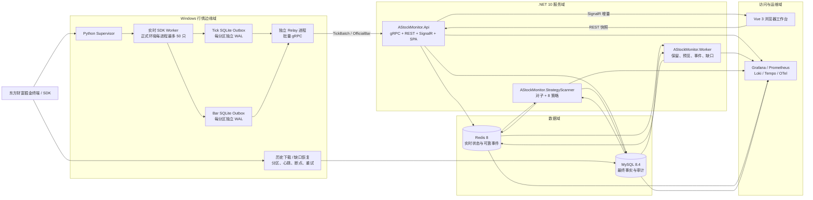

## 2. 不可破坏的数据边界

| 数据类型 | 权威来源 | 实时存储 | 长期存储 | 说明 |
|---|---|---|---|---|
| Tick | 东方掘金 SDK | SQLite Outbox、API 内存、Redis | 无 | 当日短期数据，不写 MySQL |
| 1m 预览 | Tick 计算 | Redis | 无 | 只供盘中 VWAP、量能和快速观察，非正式 K 线 |
| 5m | 东方掘金 SDK | Redis 活动状态/事件 | MySQL `kline_bar_5m` | 正式事实 |
| 30m、60m | 东方掘金 SDK | Redis 活动状态/事件 | MySQL `kline_bar_agg` | 不由 5m 聚合生成；聚合只用于校验 |
| 1d | 东方掘金 SDK | Redis 活动状态/事件 | MySQL `kline_bar_daily` | 正式事实 |
| Bar 生命周期事件 | Canonical Bar Writer | Redis Streams | MySQL `bar_event_outbox` | 至少一次发布，消费者幂等 |
| 对子/策略结果 | StrategyScanner | Redis Streams | MySQL 业务表 | MySQL 是最终结果，Redis 用于实时通知 |
| 网页任务 | 通知投影 | SignalR | MySQL `notification_task*` | 支持断线后按水位补拉 |

明确禁止重新引入以下旧路径：

- Tick 写入 MySQL；
- 从 Tick 生成正式 5m/30m/60m/1d；
- 从 5m 聚合后覆盖官方 30m/60m；
- 把 Redis 作为长期唯一事实；
- 让浏览器连接状态反向阻塞内部行情或策略消费。

## 3. 物理部署

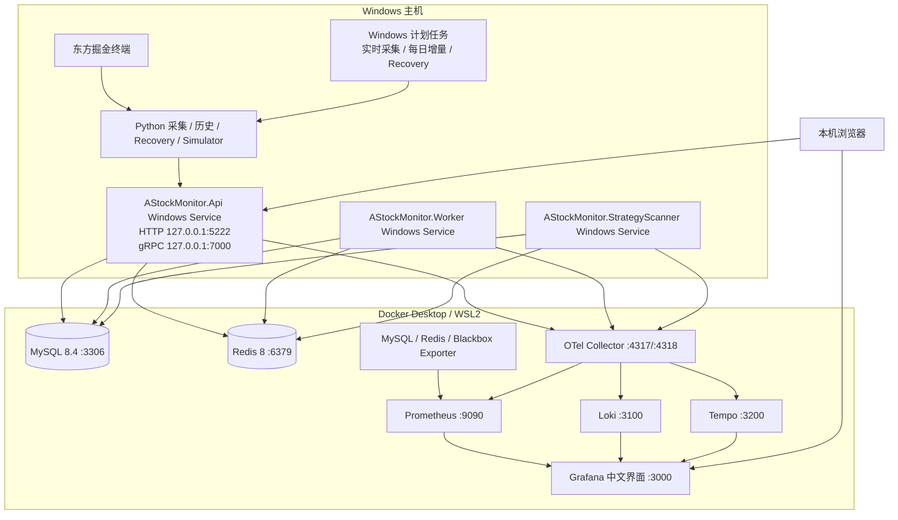

当前所有管理端口只应绑定本机或管理网段。未来拆分部署时，东方掘金终端和 SDK 节点继续保留 Windows；.NET、MySQL、Redis 和监控栈可以迁移到 Linux，Windows 通过内网 gRPC 与 OTLP 接入。

## 4. 服务职责

| 服务/进程 | 当前职责 | 可靠性边界 |
|---|---|---|
| Python Supervisor | 读取股票池、稳定分片、启动 SDK Worker 和 Relay、监控子进程 | 分区独立，单分区故障不终止其他分区 |
| Python SDK Worker | 订阅 Tick 与官方四周期 Bar，标准化并写本地 Outbox | 回调不直接访问 Redis/MySQL；有界队列防止内存失控 |
| Python Relay | 从 SQLite 批量读取并通过 gRPC 发送，按 ACK 更新状态 | 与 SDK 进程隔离；网络故障不阻塞 SDK 回调 |
| Python History | 最近 60 自然日分钟 K 与日线增量、质量检查、断点续传 | 分区 ID、fencing token、独立心跳和自动重试 |
| Python Recovery | 领取缺口任务，调用 SDK 补官方 K 线 | 只补 5m/30m/60m/1d，不补 Tick/1m |
| AStockMonitor.Api | gRPC 接入、Canonical Bar 写入、REST、Swagger、SignalR、SPA、通知投影 | Tick ACK 以 Redis Stream 已追加为准；正式 Bar ACK 以 MySQL 提交为准 |
| AStockMonitor.Worker | Tick Stream 保留、1m 预览、Bar Outbox 发布、缺口扫描和恢复后重放协调 | 后台任务独立循环，失败保留 Pending/重试 |
| AStockMonitor.StrategyScanner | 对子实时扫描、8 策略扫描、生命周期、事件 Outbox、历史回放/校准 | 每类消费者使用独立 Consumer Group |
| MySQL | 官方 K 线和长期业务事实、任务、检查点、审计 | 唯一键、row hash、revision 和事务保证幂等 |
| Redis | 实时 Tick、预览、活动 Bar 和可靠事件总线 | 有 TTL、长度上限和按消费安全水位裁剪 |

## 5. 实时 Tick V3 链路

真实采集当前实测限制是**每个东方掘金 SDK 会话最多订阅 50 只证券**。正式 1,000 股票池应启动 20 个分区，每个分区包含 1 个 SDK Worker 和 1 个 Relay。

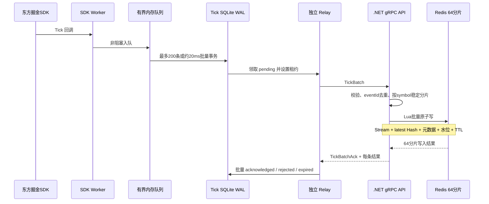

可靠性语义：

- Tick 是“至少一次传输 + Redis 幂等落点”；
- 每个分区使用独立 SQLite 文件，不共享文件锁；
- Tick 与 Bar 使用不同 SQLite 文件和不同发送批次，避免 Tick 洪峰阻塞 Bar；
- `pending / in_flight / acknowledged / rejected / expired` 状态可审计；
- Tick 最长重放约 120 秒，过旧数据标记 `expired`，不污染实时流；
- ACK 后记录延迟保留并最终清理，SQLite 不是长期行情库；
- MySQL 中不存在 Tick 正式表和 Tick 写入路径。

Redis V3 逻辑结构：

```text
md:tick:v3:{yyyyMMdd:00..63}:stream
md:tick:v3:{yyyyMMdd:00..63}:latest
md:tick:v3:{yyyyMMdd:00..63}:latest-meta
md:tick:v3:{yyyyMMdd:00..63}:watermark
```

花括号是 Redis Cluster hash tag，使同一交易日、同一分片的四个键落在同一槽位，Lua 批处理可以保持原子性。

## 6. 1 分钟盘中预览

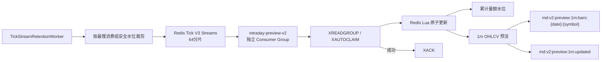

1m 预览必须带 `officialConfirmed=false`，只用于盘中快速指标，不进入正式 K 线查询和历史补数。

## 7. 官方 K 线固化与生命周期

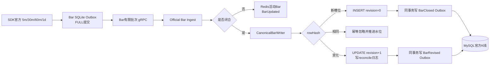

正式数据的唯一语义是：

- 新槽位产生 `BarClosed`；
- 同一槽位相同 `rowHash` 不重复发布；
- 官方内容改变产生 `BarRevised`，`revision` 单调递增；
- 活动 Bar 只产生 `BarUpdated`，不能触发正式历史结果；
- 30m/60m 聚合只输出差异检查，不写回官方事实表。

## 8. Bar 可靠事件总线

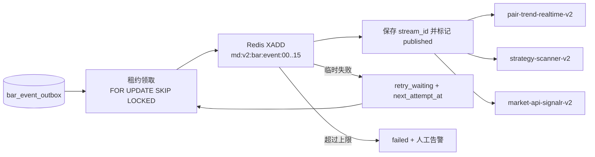

三个 Consumer Group 互相独立：对子变慢不抢策略消息，浏览器断线也不会阻塞内部计算。消费者按 `eventId` 去重，并以更高 `revision` 覆盖旧结果。

## 9. 历史回填、质量检查与自动补数

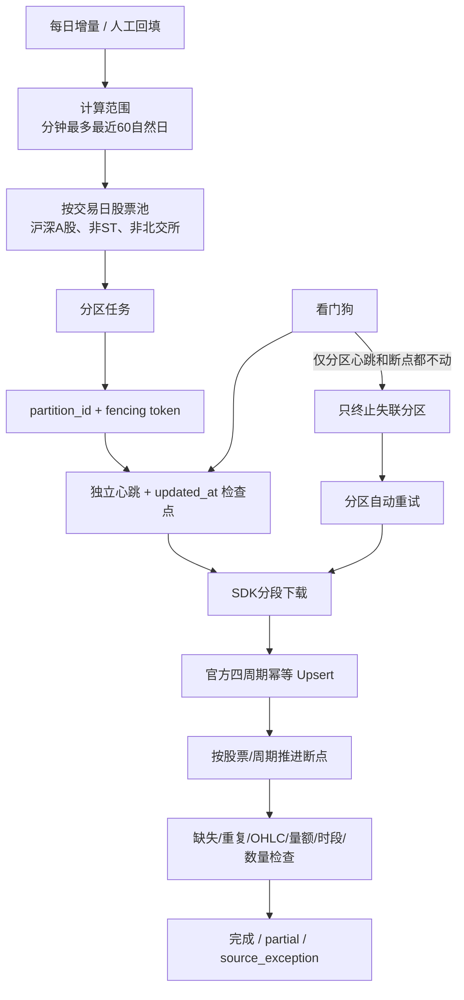

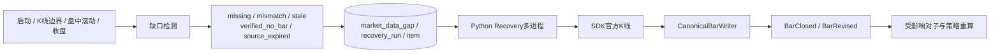

缺口服务随数据架构同步变化：只检查和补充正式 `5m/30m/60m/1d`，不补 Tick 和 1m 预览。分钟源超出最近 60 自然日时标记 `source_expired`，避免无限重试。

## 10. 对子顶底实时链路

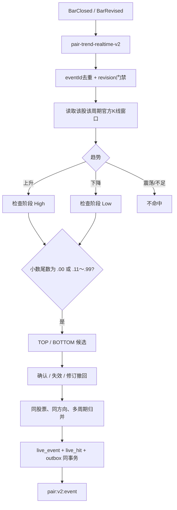

5m、30m、60m、1d 分周期记录；同一股票再次命中时更新同一业务事件及其 revision，并保留各周期命中明细。

## 11. 八策略扫描链路

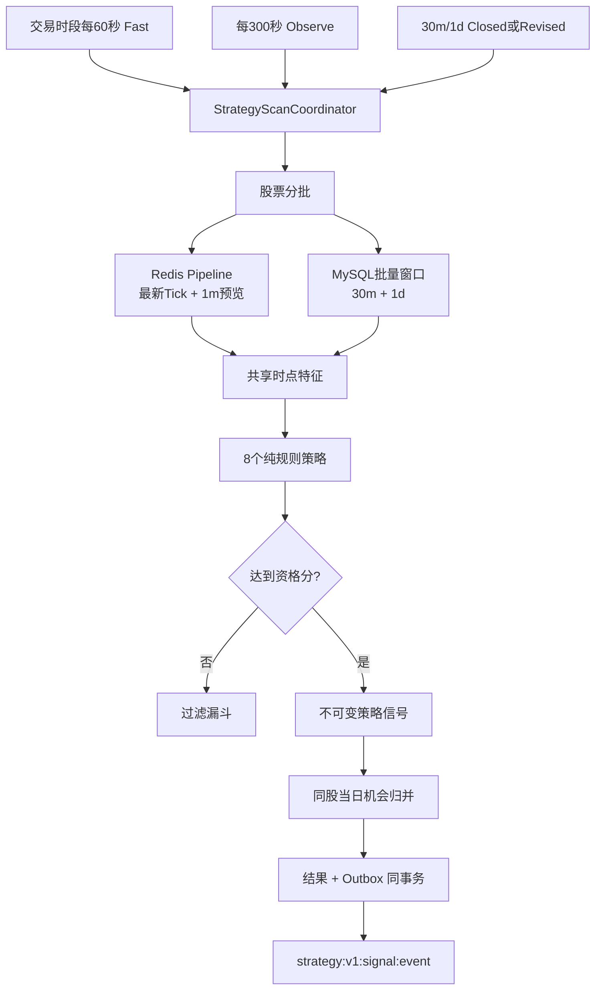

非交易时段不执行全市场 Fast/Observe，只维护已有信号生命周期。历史回放使用逐时点特征并保存阈值校准结果，不能自动把未通过训练/验证门槛的阈值投入线上。

## 12. Web 工作台与可靠通知

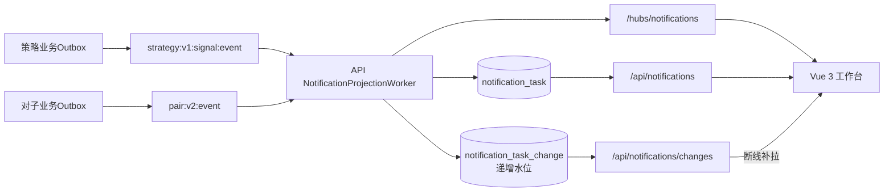

浏览器读取规则：

1. 首次打开通过 REST 获取一致快照；
2. 建立 SignalR 连接接收实时增量；
3. 断线重连后按 `notification_task_change.id` 补拉；
4. 再恢复 SignalR 订阅；
5. UI 慢或浏览器离线不影响 Redis 内部消费者。

主要入口：

| 入口 | 地址/路径 |
|---|---|
| Web 工作台 | `http://127.0.0.1:5222/` |
| Swagger | `http://127.0.0.1:5222/swagger` |
| Grafana | `http://127.0.0.1:3000` |
| 行情 API | `/api/market/*`、`/api/market/bars*` |
| 缺口恢复 | `/api/market-data/*` |
| 对子 | `/api/pair-trends/*`、`/api/pair-trends/live/*` |
| 策略 | `/api/strategies/*` |
| 网页任务 | `/api/notifications/*` |
| Hub | `/hubs/market`、`/hubs/strategy`、`/hubs/notifications` |
| 健康检查 | `/health/live`、`/health/ready` |

## 13. 可观测与故障定位

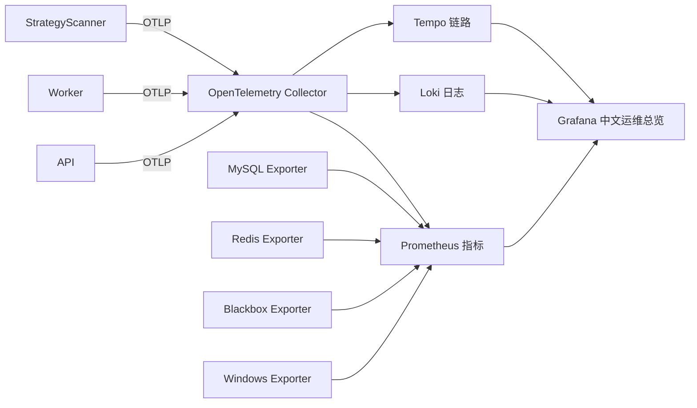

故障定位顺序：Grafana 告警与可用性 → 环节最后成功时间 → Outbox/Stream Lag/Pending → Loki 错误日志 → Tempo 请求链路 → MySQL/Redis/Windows 资源。

关键告警至少覆盖：

- SDK Worker 或 Relay 心跳停止；
- SQLite Pending 或最旧 Tick 年龄持续增长；
- gRPC 拒绝、过期、重复或延迟异常；
- Redis Stream Lag/Pending 持续增长；
- Bar Outbox 重试或 failed；
- 官方 K 线水位停止、缺口异常扩大；
- StrategyScanner 停止或扫描耗时超过周期；
- SignalR/通知投影积压；
- MySQL、Redis、API 或 OTel 不可用。

## 14. 生产规模与容量测试必须分开理解

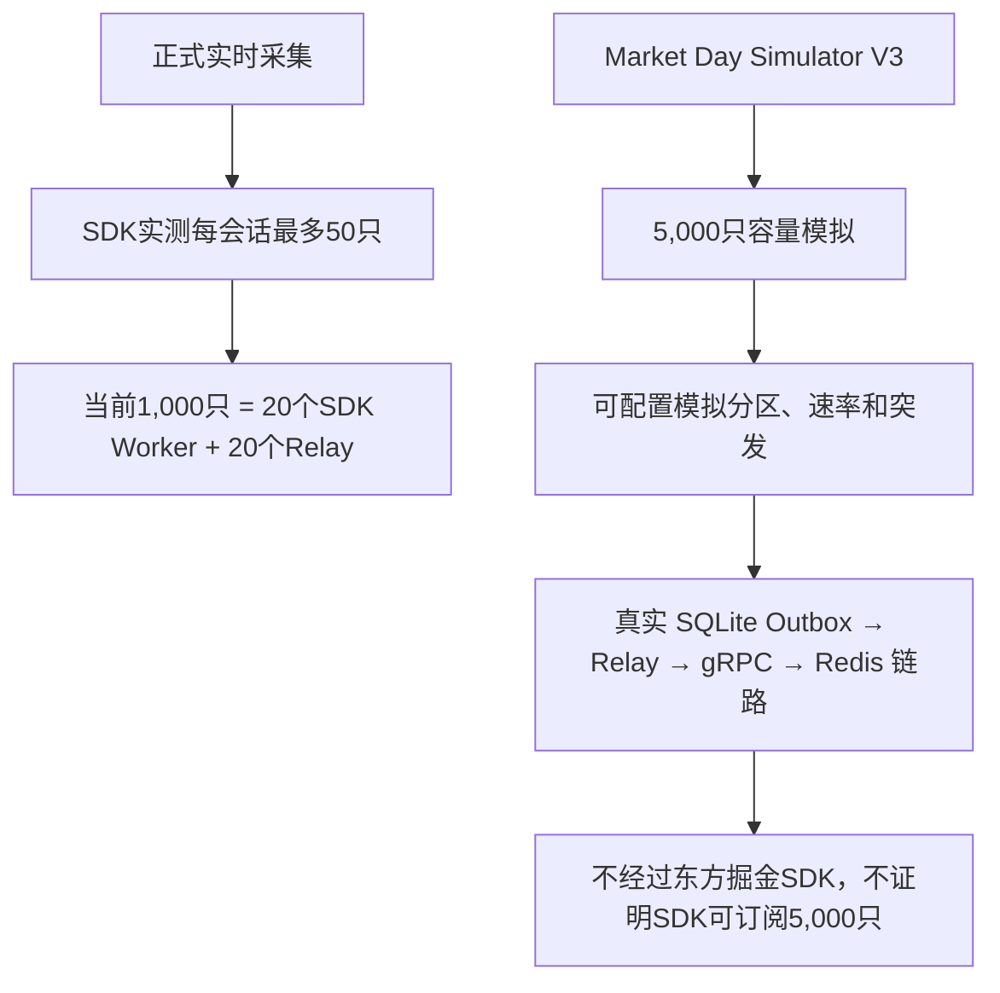

Simulator 使用 `LOAD.*` 证券代码和唯一 `run_id`，验证的是自研接入链路容量，不验证东方掘金授权或 SDK 会话上限。正式扩容到 5,000 只时，按当前 SDK 限制理论上需要约 100 个 SDK 会话和 100 个 Relay；在实施前还必须验证终端授权、主机资源和 SDK 多会话稳定性。

## 15. 当前可靠性机制

| 风险 | 当前机制 |
|---|---|
| SDK 回调突发 | 有界内存队列 + SQLite 批量事务 |
| 网络/API 中断 | SQLite Outbox 保留未确认记录，Relay 重试 |
| SQLite 锁竞争 | 每分区、每数据类型独立文件；SDK 与 Relay 进程分离 |
| Tick 重复 | eventId + Redis Lua 幂等 |
| Tick 无限积压 | 最长重放时间、状态过期、容量与年龄监控 |
| Redis Stream 无限增长 | TTL、长度上限、消费组安全水位裁剪 |
| 正式 K 线重复/修订 | 唯一键 + rowHash + revision + reconcile log |
| MySQL提交后事件丢失 | Transactional Outbox |
| 消费者故障 | Consumer Group Pending + XAUTOCLAIM |
| 历史子进程假死 | partition_id + fencing token + 独立心跳 + 数据库水位 |
| 单分区失败扩大 | 看门狗只终止失联分区，其他分区继续运行 |
| 浏览器断线 | MySQL 任务投影 + 递增 change 水位补拉 |
| 服务分散部署 | OTel 主动上报 + Prometheus/Exporter 集中采集 |

## 16. 当前已知边界与后续工作

1. 策略最新行情读路径已于 2026-08-14 切换到 Tick V3 分片 Hash，使用按分片 `HMGET` 批量读取，不再读取 V2 latest key，也不回退 MySQL Tick；仍需在真实交易时段完成“V3 Tick → Fast 策略”的端到端验收。
2. 正式 SDK 全市场扩容仍受每会话 50 只限制，不能照搬模拟器的每分区 100 只配置；详细方案见 `full-market-sdk-scheduling-plan.md`。
3. Tick V3 已通过批量链路和模拟压测，但仍需在真实完整交易日验收覆盖率、P95/P99 延迟和官方 Bar 并发稳定性。
4. 5,000 股票、约 5,000 Tick/秒模拟中出现周期性短时积压，虽然均可自行收敛且没有 rejected/expired，仍需定位 Windows 调度、Python GC、SQLite checkpoint、gRPC 或 Redis Lua 的周期性停顿来源。
5. 数据质量仍存在 `BAR_COUNT_MISMATCH` 覆盖治理项；它与重复、OHLC、成交量和时段错误应分开处理。
6. 5 个历史零信号策略需要复核特征口径和阈值可达性，不能简单放宽阈值制造命中。
7. 前端大图表包仍可按路由和图表组件拆分，不影响当前业务正确性。
8. `LayeredMarketDataReader` 中的 V2 latest 回退目前只用于 API 迁移兼容；确认 V3 稳定且没有旧生产者后应移除，避免掩盖 V3 数据中断。
9. 任何旧兼容表或 V1 类只有在代码调用、数据库连接审计和监控均证明无依赖后，才允许归档或删除。

## 17. 一次 Tick 到浏览器的完整路径

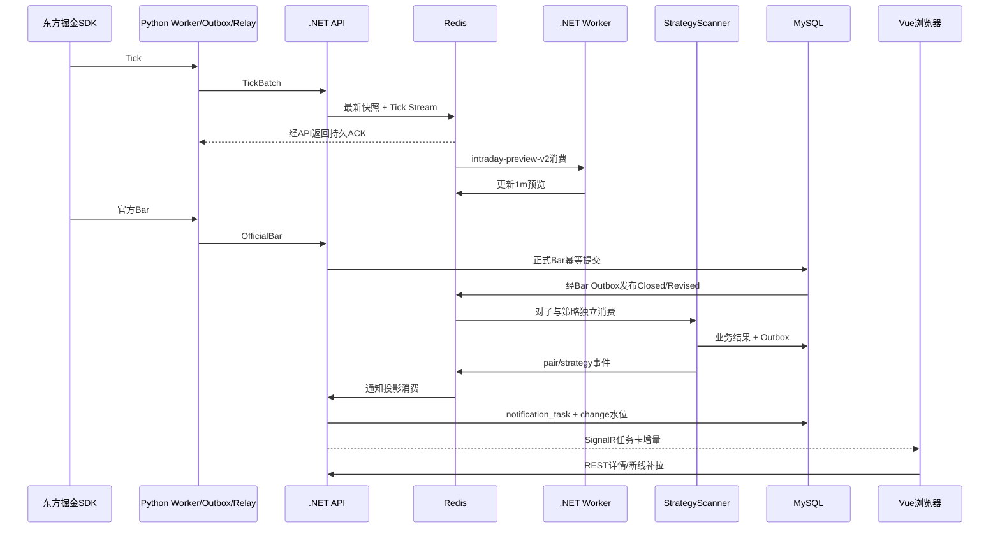

这条路径将“数据及时性”“正式事实”“业务计算”“网页展示”分离：Tick 入口可以高速运行，正式 K 线可修订，策略可以独立扩展，浏览器故障不会反向拖慢行情接入。
