# A股监控程序：当前项目架构与功能执行流程（V4）

> 架构基线：V4.0  
> 整理日期：2026-08-14  
> 部署环境：Windows + Docker Desktop/WSL2  
> 技术栈：.NET 10、Python、东方财富掘金 SDK、MySQL 8.4、Redis 8、Vue 3、SignalR、Grafana、Prometheus、Loki、Tempo、OpenTelemetry。  
> 系统边界：只做行情采集、数据固化、信号研究和网页展示，不连接交易账户，不执行自动下单。

本文档以当前代码、迁移 022 和正式部署为准，取代 V3 架构文档。V4 的核心是把全市场实时行情拆成三条资源等级不同、但下游协议统一的通道：

1. 全市场 `current()` 快照轮询；
2. 最多 300 只重点股票实时 Tick 订阅；
3. 全市场 `5m/30m/60m/1d` 官方 K 线主动拉取。

## 1. 架构总览

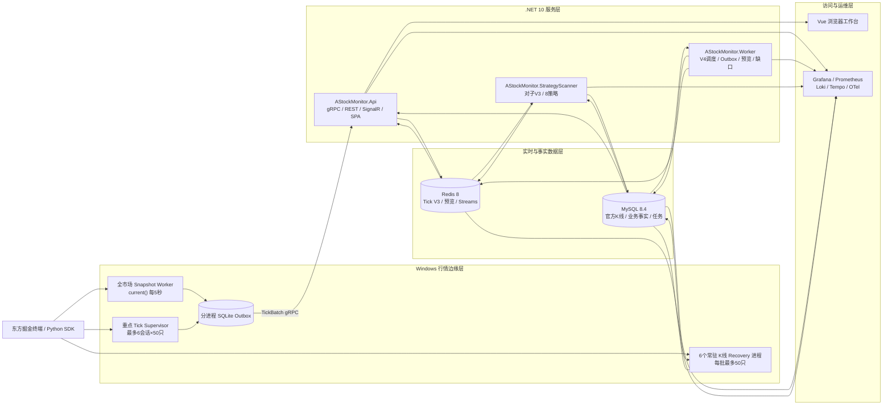

## 2. 不可破坏的设计原则

| 原则 | 当前口径 |
|---|---|
| 正式 K 线权威源 | 只认东方掘金 SDK 返回的 `5m/30m/60m/1d` |
| Tick 范围 | 实时订阅只覆盖重点池，最多 300 只 |
| 全市场即时价格 | 使用 `current()` 快照轮询，目标周期 5 秒 |
| Tick 存储 | SQLite 短时缓冲、Redis 当日层；禁止写 MySQL |
| 1m 数据 | Redis 盘中预览，不是正式 K 线，不进入历史补数 |
| 30m/60m | 直接拉取官方数据；5m 聚合只能校验，不能覆盖官方值 |
| 长期事实 | 官方 K 线、对子、策略、任务和审计以 MySQL 为准 |
| 实时事件 | Redis Streams，独立 Consumer Group，至少一次投递 |
| 浏览器 | REST 获取快照，SignalR 接收增量；浏览器故障不得反向阻塞计算 |

明确禁止恢复以下旧路径：

- 全市场 5,000 只 Tick 实时订阅；
- Tick 写入 MySQL；
- 从 Tick 聚合生成正式 5m/30m/60m/日线；
- 从 5m 聚合后覆盖官方 30m/60m；
- 把 Redis 或 SignalR 当成唯一持久事实。

## 3. 物理部署架构

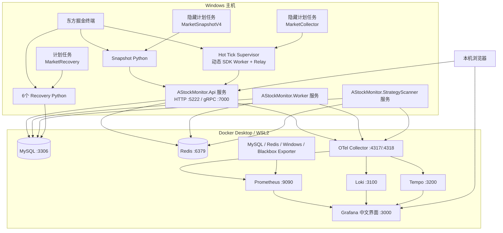

东方掘金终端和 Python SDK 必须运行在 Windows。将来拆分服务器时，.NET、MySQL、Redis 和监控栈可以迁移到 Linux；Windows 采集节点通过内网 gRPC、MySQL 和 OTLP 接入。

## 4. 服务与进程职责

| 服务/进程 | 主要职责 | 故障隔离方式 |
|---|---|---|
| Snapshot Worker | 读取全市场股票池，调用 `current()`，过滤过期/未来快照并发布 | Redis 主租约；非交易时段休眠；状态 TTL |
| HotTick Coordinator | 从对子、策略和人工池计算最多 300 只重点股票 | 每 10 秒刷新；30 秒最短驻留，减少订阅抖动 |
| Hot Tick Supervisor | 读取重点池并管理最多 6 个 SDK Worker + 6 个 Relay | 只重启分配发生变化或失联的槽位 |
| SDK Worker | 接收重点股票 Tick 回调并写独立 SQLite Outbox | 每 Worker 独立文件；回调不访问 Redis/MySQL |
| Relay | 批量读取 SQLite，通过 gRPC 发往 API | 网络故障时保留 Pending，恢复后重发 |
| Recovery Python | 领取官方 K 线任务，批量调用 SDK，幂等写入 MySQL | 6 进程、租约、`SKIP LOCKED`、逐股票重试 |
| AStockMonitor.Api | Tick gRPC 接入、REST、Swagger、SignalR、SPA、通知投影 | Tick 以 Redis 原子写成功为 ACK 边界 |
| AStockMonitor.Worker | 官方 K 线调度、重点池、Bar Outbox、1m 预览、缺口检测 | 各 HostedService 独立循环和指标 |
| StrategyScanner | 对子 V3、Tick 失效、8 策略、生命周期、Outbox | 每条业务链使用独立 Consumer Group |
| MySQL | 官方 K 线、运行任务、检查点、质量和业务最终事实 | 唯一键、row hash、revision、事务 Outbox |
| Redis | 最新价、Tick 流、1m 预览、Bar/对子/策略事件 | 分片、TTL、消费组、Pending 接管和安全裁剪 |

## 5. 数据分层与存储位置

| 数据 | 覆盖范围 | Redis | MySQL | 保留口径 |
|---|---|---:|---:|---|
| 实时 Tick | 最多 300 只重点股 | 是 | 否 | 当日实时层；Stream 软保留30分钟、硬保留120分钟 |
| 全市场快照 | 约 5,000 只 | 是 | 否 | 最新值 TTL 129,600 秒 |
| 1m 预览 | 全市场；重点股由 Tick 增强 | 是 | 否 | TTL 3 天，仅盘中计算 |
| 5m | 全市场 | 事件/短时状态 | `kline_bar_5m` | 正式长期事实，按月分区 |
| 30m/60m | 全市场 | 事件/短时状态 | `kline_bar_agg` | 正式长期事实，按月分区 |
| 日线 | 全市场 | 事件/短时状态 | `kline_bar_daily` | 长期保留 |
| Bar 事件 | 全市场 | 16 分片 Stream | `bar_event_outbox` | MySQL 保证发布可靠性 |
| 对子结果 | 命中股票 | `pair:v3:event` | `pair_trend_*` | 事件、证据、生命周期完整保留 |
| 策略结果 | 命中股票 | `strategy:v1:signal:event` | `strategy_*` | 信号与机会归并长期保留 |
| 网页任务 | 对子/策略消息 | SignalR 增量 | `notification_task*` | 支持断线补拉和用户状态 |

## 6. 行情采集 V4 三通道

### 6.1 全市场快照通道

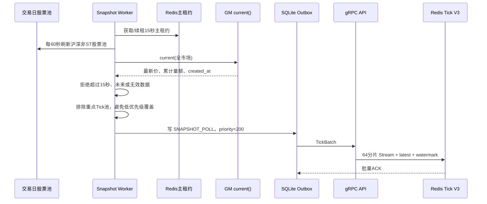

交易窗口为约 `09:15～11:31、12:59～15:05`；非交易日和收盘后状态为 `idle_outside_market_hours`。快照目标一轮 5 秒，覆盖率目标不低于 99%。

### 6.2 重点 Tick 通道

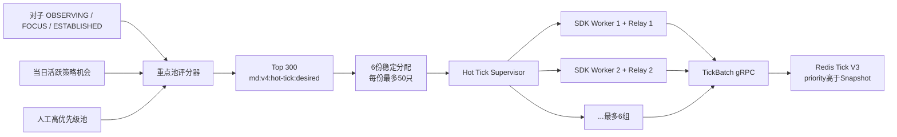

重点池优先级：人工关注 > 对子成立 > 对子重点 > 对子观察 > 策略机会。同一阶段再按最近状态变化和得分排序。移出候选后至少驻留 30 秒，避免 SDK 会话反复重启。

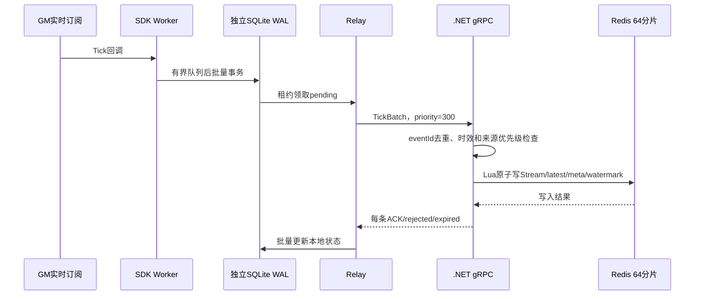

### 6.3 官方 K 线主动拉取通道

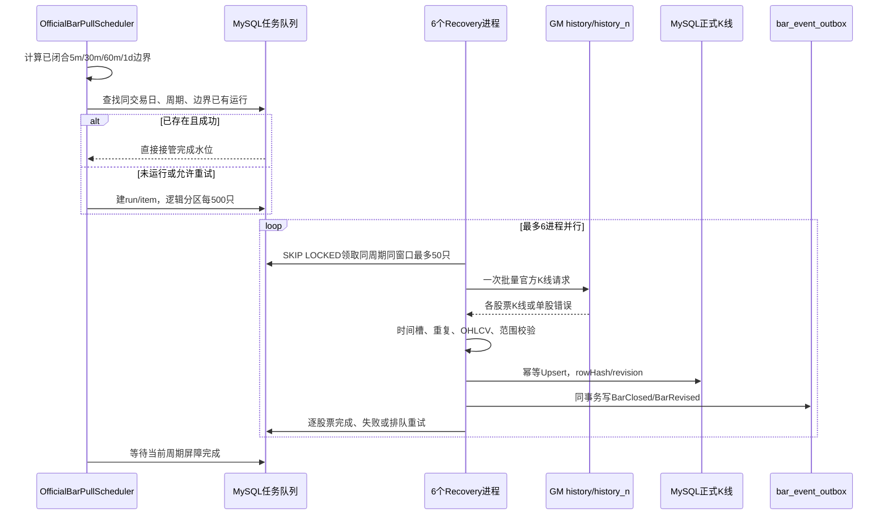

执行边界：

- 5m：每个正式 5 分钟 EOB 后 15 秒；
- 30m：正式 EOB 后 20 秒；
- 60m：正式 EOB 后 30 秒；
- 日线：15:05 开始；
- 同一边界按 `5m → 30m → 60m → 1d` 建立一致性屏障；
- Worker 重启后从 MySQL 查找并接管已有运行，禁止重复创建任务；
- 单只失败进入后续重试队列，不阻塞同批次其他股票。

## 7. 官方 K 线固化与 Bar 事件

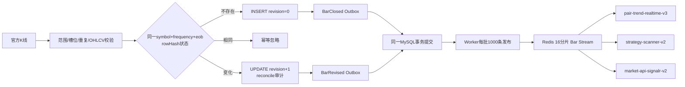

Bar Outbox 发布按 ID 顺序并发执行 Redis `XADD`，成功后使用单条批量 SQL 确认。三个消费组完全独立；任一业务消费者变慢不会抢走其他消费者的消息。

## 8. 1 分钟盘中预览

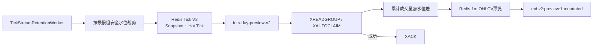

Snapshot 重复返回累计量额，因此 1m 预览必须按累计水位做差值，不能重复累加。重点股切换到实时 Tick 后继续共享水位。所有 1m 预览标记 `officialConfirmed=false`。

## 9. 对子顶底 V3 功能逻辑

### 9.1 状态机

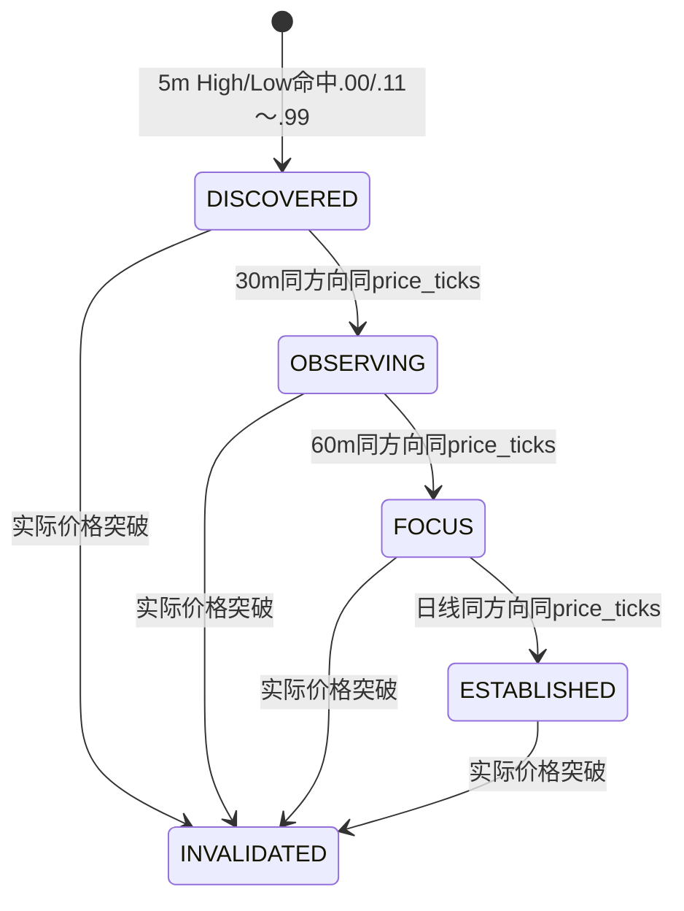

| 阶段 | 含义 | 推送规则 |
|---|---|---|
| `DISCOVERED` | 5m 发现 | 不推送，仅建立候选 |
| `OBSERVING` | 30m 与 5m 同价同方向 | 新提醒 |
| `FOCUS` | 60m 与前两级一致 | 特别提醒 |
| `ESTABLISHED` | 日线与四周期一致 | 一级警报；顶部卖出、底部买入提醒 |
| `INVALIDATED` | 价格突破对子位 | 曾达到观察以上才推送失效提醒 |

### 9.2 实时执行链

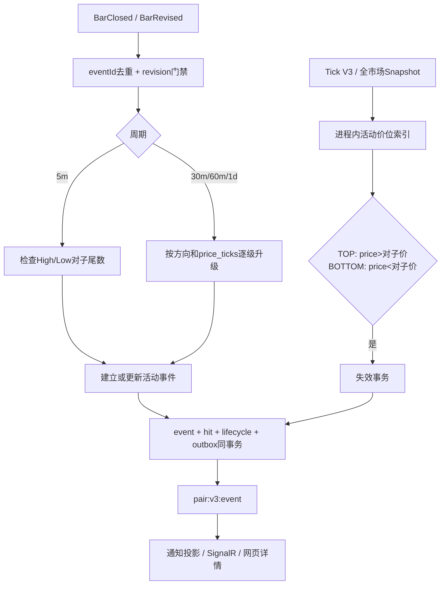

等于对子价不失效。同一股票、方向、价格只保留一条活动事件；同价失效后再次出现时 `generation+1`。重点股通过 Tick 近实时判定失效，非重点股通过约 5 秒快照判定，5m Bar 再提供最终兜底。

## 10. 八策略扫描功能逻辑

当前策略：分时 VWAP 量价共振、低开高走 VWAP 再启动、平台放量突破、均线回踩再启动、下跌浪二次探底反弹、强势趋势延续、逆势走强、强修复反弹。

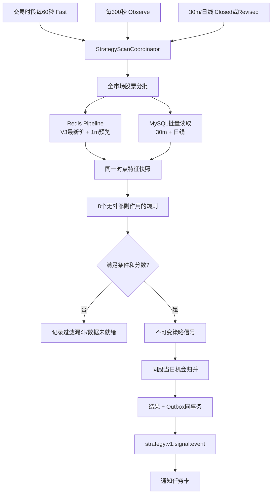

策略读取只使用 Tick V3 最新价，不读取 MySQL Tick，也不回退 V2 Latest。非交易时段停止全市场 Fast/Observe，只维护已有信号的减弱和过期生命周期。

## 11. 缺口检测与自动补数

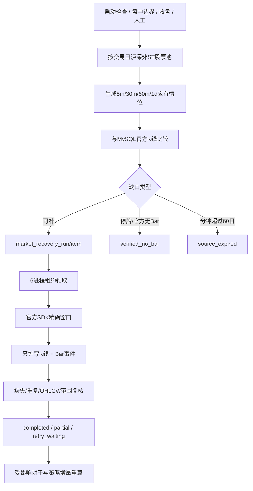

补数只处理正式四周期，不补 Tick 和 1m。分钟历史限制为最近 60 个自然日；超出边界后停止无限重试。历史事件超过实时投递窗口时可以更新业务基线，但不能向网页补发过期警报。

## 12. 分区、重试和看门狗

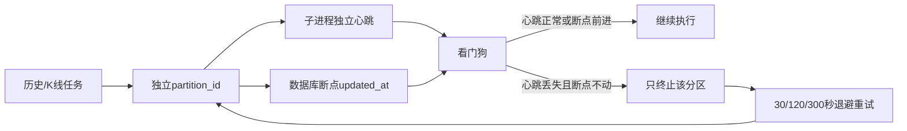

长分区不以“整个分区尚未返回”判死；必须同时观察独立心跳和数据库进度。单分区失败不影响其他进程。

## 13. Web 工作台与消息投影

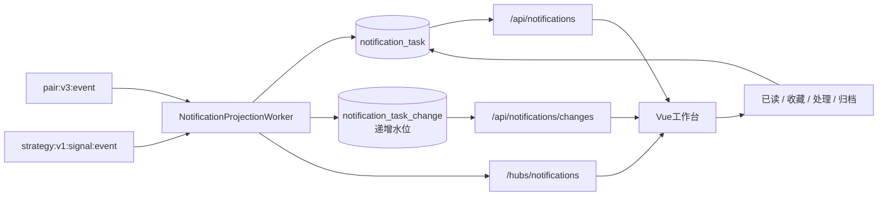

浏览器首次打开先读取 REST 一致快照，再连接 SignalR。断线重连后按 change ID 补拉，再恢复实时订阅，因此不会因为浏览器离线而丢失任务卡。

主要页面功能：

- 策略命中任务卡、筛选、分页、状态操作；
- 对子观察/重点/成立/失效记录；
- 对子事件详情、各周期命中和生命周期；
- 个股详情与官方 K 线；
- 服务状态和 V4 采集状态入口。

## 14. 运维监控与故障发现

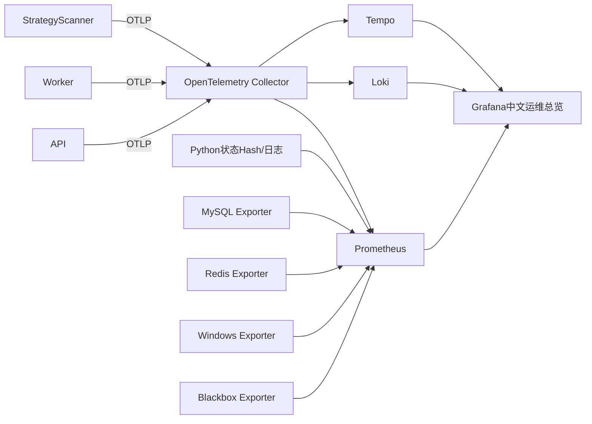

推荐故障排查顺序：

1. Grafana 查看组件存活和最后成功时间；
2. 查看 Snapshot 周期、重点池规模和 SDK 会话数；
3. 检查 MySQL Outbox 状态；
4. 检查 Redis Stream `lag/pending`；
5. 查看 Recovery 分区心跳、租约和重试；
6. 使用 Loki 定位错误日志；
7. 使用 Tempo 查看跨服务链路；
8. 最后检查 Windows、MySQL、Redis 资源瓶颈。

关键告警包括：快照超过 10 秒、覆盖率低于 99%、重点 Tick 会话失联、K 线运行超时、Recovery 重试耗尽、Bar Outbox 积压、Redis 消费组 Lag/Pending、策略扫描超周期、SignalR 投影积压和基础服务不可用。

## 15. 数据生命周期与年度归档

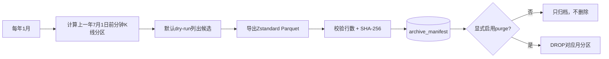

年度归档只针对分钟 K 线及 30/60 分钟表；日线、交易日股票池、质量结果、对子、策略、通知和审计长期保留。任何删除必须先完成归档校验，默认配置禁止 purge。

## 16. 服务启动与恢复顺序

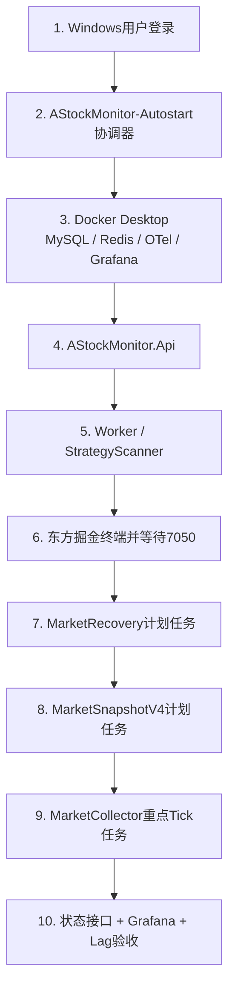

计划任务使用隐藏方式启动，不显示 PowerShell/Python 控制台窗口。统一协调器在登录和每天 08:35 运行，按依赖顺序修复所有组件状态。服务重启后：官方 K 线调度器从 MySQL 水位接管，Relay 从 SQLite Pending 重发，Redis Consumer Group 接管 Pending，对子和策略按事件 ID 与 revision 幂等处理。东方掘金终端和 Docker Desktop 需要交互式用户会话，因此完整系统的“开机自启”实际发生在 Windows 用户登录之后。

## 17. 主要接口与访问入口

| 功能 | 地址/接口 |
|---|---|
| Web 工作台 | `http://127.0.0.1:5222/` |
| Swagger | `http://127.0.0.1:5222/swagger` |
| Grafana | `http://127.0.0.1:3000` |
| API 健康 | `/health/live`、`/health/ready` |
| V4 统一状态 | `GET /api/market-collection-v4/status` |
| 重点 Tick 股票池 | `GET /api/market-collection-v4/hot-tick-symbols` |
| 最新行情与个股 | `/api/market/*`、`/api/instruments/*` |
| 官方 K 线 | `/api/market/bars/*` |
| 缺口与补数 | `/api/market-data/*` |
| 历史分区 | `/api/history/*` |
| 对子历史 | `/api/pair-trends/*` |
| 对子实时 | `/api/pair-trends/live/*` |
| 策略 | `/api/strategies/*` |
| 网页任务 | `/api/notifications/*` |
| SignalR | `/hubs/market`、`/hubs/strategy`、`/hubs/notifications` |

## 18. 一次完整业务信号的端到端路径

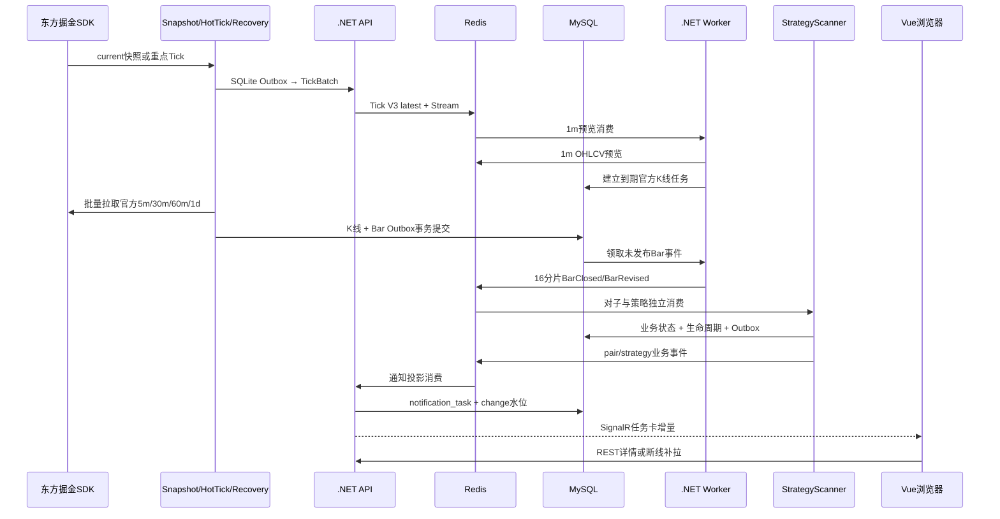

这条链路把“快速价格”“官方事实”“业务计算”“消息展示”分离。快照或 Tick 的短暂故障不会破坏官方 K 线，网页断线不会影响策略消费，官方 K 线修订又可以通过 revision 驱动业务重新计算。

## 19. 当前生产基线

- V4 已启用，Snapshot 目标周期 5 秒；
- 重点池容量 300，只使用最多 6 个 SDK 会话；
- 官方 K 线使用最多 6 个 Recovery 进程，逻辑分区 500 只，SDK 请求批次 50 只；
- Tick V3 使用 64 分片；Bar 事件使用 16 分片；
- 首次全市场四周期任务均完成 5,000/5,000，0 失败、0 质量异常；
- Bar Outbox 已全部发布，SignalR、对子、策略消费组均已达到 `pending=0、lag=0`；
- API、Worker、StrategyScanner、Grafana、Prometheus、Loki、Tempo、OpenTelemetry 均已部署运行；
- 下一完整交易日继续验收 Snapshot 周期、Tick P95/P99 和各周期全市场 K 线完成时间。

## 20. 相关专项文档

- [行情采集 V4 可执行改造方案](./market-data-collection-v4-execution-plan.md)
- [对子顶底 V3](./pair-trend-v3.md)
- [官方 K 线与补数 V2](./market-data-storage-and-kline-recovery-v2.md)
- [策略扫描服务](./strategy-scanner-service-plan.md)
- [Web 前端实现](./web-frontend-implementation.md)
- [可观测部署](./observability-deployment.md)
- [Windows 开机自启](./windows-autostart.md)
