# A股监控程序：系统架构图与功能流程图

> 本文档记录 V1 架构，已由 [V2 当前架构与流程图](./system-architecture-and-flows-v2.md) 取代。V2 已取消 MySQL Tick、Tick 生成正式 K 线以及 5m 聚合替代官方 30/60m 的设计；请勿再按本文档实施。

> 文档日期：2026-08-13  
> 当前技术栈：Windows + Docker Desktop/WSL2、.NET 10、Python 东方财富掘金 SDK、MySQL 8.4、Redis 8、Grafana/Prometheus/Loki/Tempo/OpenTelemetry。  
> 系统边界：只获取、处理、监控行情与研究信号，不连接交易账户，不调用委托或下单接口。

## 1. 系统总览

系统分为六个相互隔离的域：行情采集、实时数据底座、历史数据底座、缺口恢复、业务研究、查询与运维。MySQL 是最终事实库，Redis 是实时可靠传递与热点状态层，进程内存只保存短生命周期计算状态。

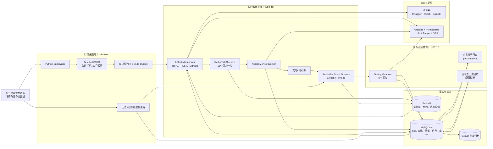

## 2. 部署架构

东方财富 SDK 必须运行在 Windows。MySQL、Redis 和监控栈当前运行在同一台 Windows 主机的 Docker Desktop/WSL2 中；.NET 服务可留在 Windows，也可迁移到 Linux。服务分机后，只需保证内网端口可达，不改变数据契约。

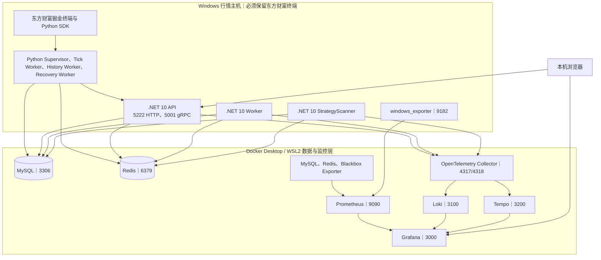

### 可扩展部署

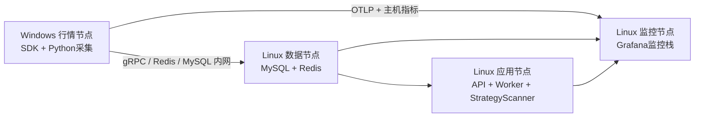

## 3. 实时 Tick 可靠采集流程

核心语义是“至少投递一次 + `event_id` 幂等”。SQLite Outbox 不共享文件，因此多进程不会互相锁库；每个进程只写自己的 WAL 文件。

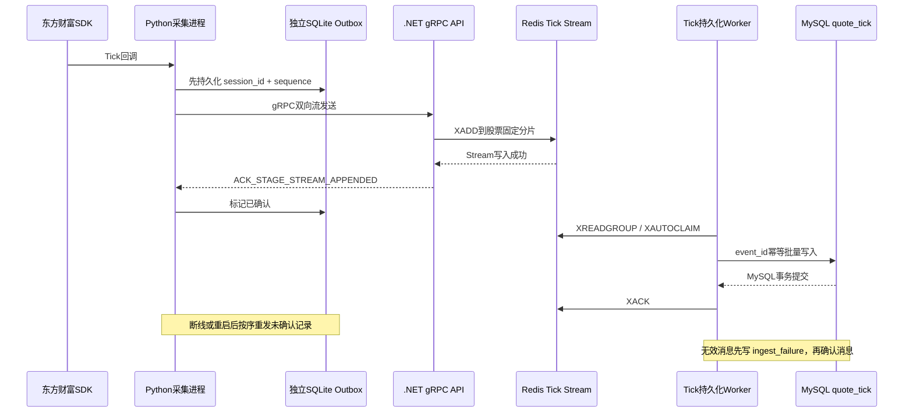

### Tick 数据的职责划分

| 数据 | 位置 | 作用 |
|---|---|---|
| 采集未确认 Tick | 每进程 SQLite Outbox | 抵御采集进程、gRPC、Redis短时故障 |
| 待落库 Tick | Redis `dev:stream:market:raw:tick:00..15` | 可靠传递、消费者组重放 |
| 最新行情 | 内存 + Redis `md:v1:latest:{symbol}` | 低延迟业务读取 |
| 固化 Tick | MySQL `quote_tick` | 最终审计、补算和最近Tick查询 |

## 4. 实时 K 线引擎流程

实时 K 线由 Tick 增量生成 `1m/5m/30m/60m/1d`。盘中更新走低延迟通道，关闭和修订走可靠通道；MySQL 不承受每个 `BarUpdated` 的高频写入。

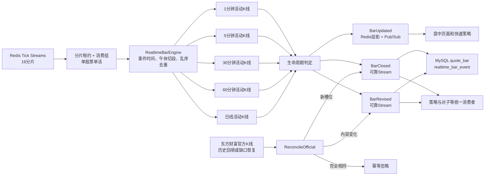

### K 线生命周期

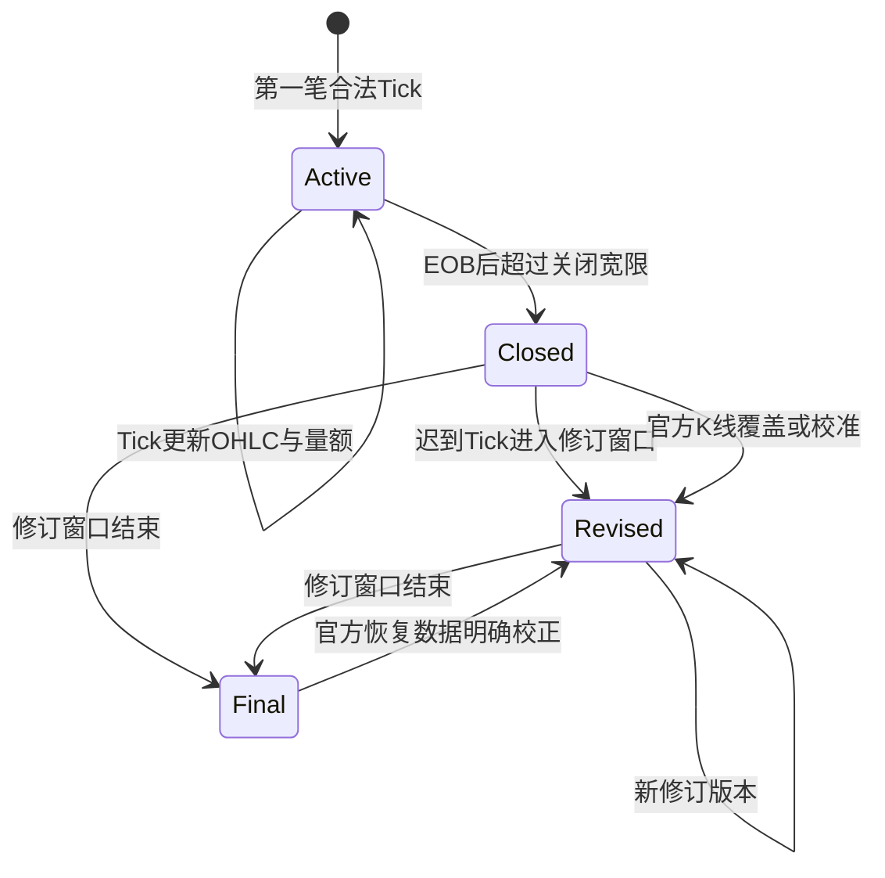

## 5. 行情读取与对外服务流程

业务层只依赖统一读接口，不关心数据来自内存、Redis 还是 MySQL。

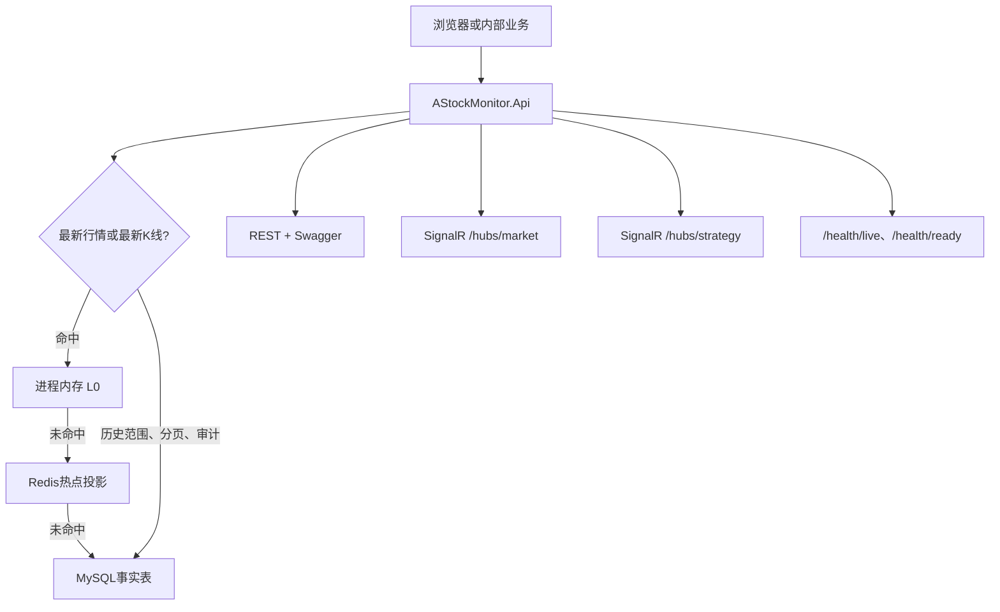

主要功能入口：

- 行情：`/api/market/*`、`/api/market/bars*`；
- 历史底座：`/api/history/*`；
- 缺口恢复：`/api/market-data/gaps*`、`/api/market-data/recovery-runs*`；
- 对子趋势：`/api/pair-trends/*`；
- 8策略与回放：`/api/strategies/*`；
- 接口说明：`/swagger`。

## 6. 历史 K 线数据底座流程

历史批处理不经过实时 Tick gRPC 链路，直接批量、幂等写 MySQL。日线不受分钟窗口限制；分钟线自动裁剪到最近 60 个自然日且不含当天，绝不伪造范围外数据。

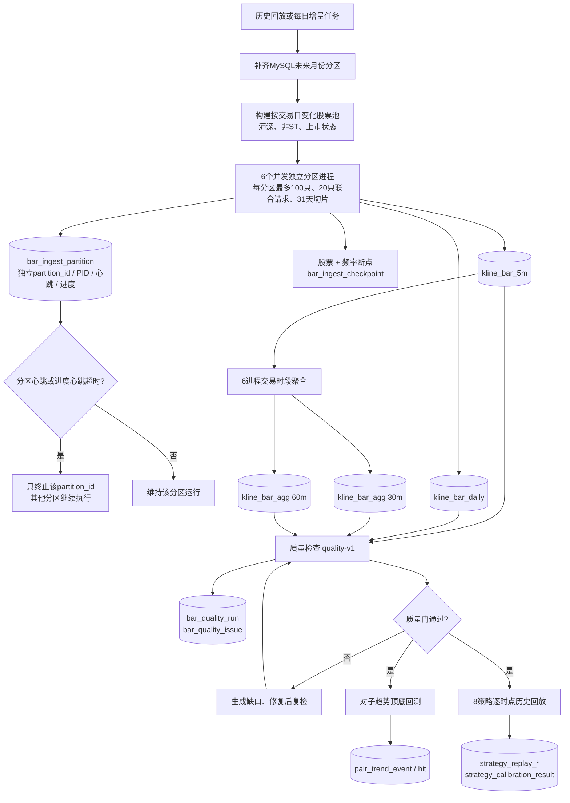

### 历史数据质量门

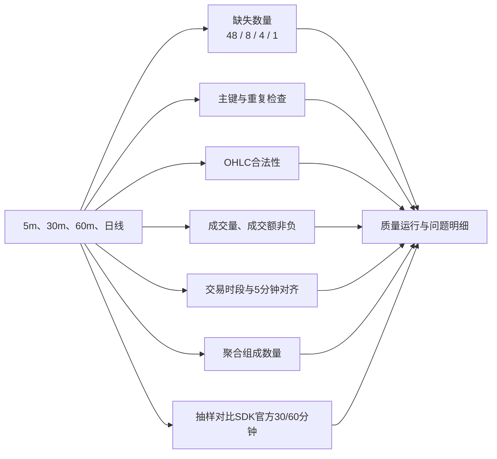

## 7. 行情缺口检测与自动恢复流程

缺口恢复只补官方 K 线，不伪造历史 Tick。恢复后的官方 K 线重新进入统一 Bar 事件链，因此策略消费者不需要维护第二套数据通道。

```mermaid
flowchart LR
    POOL["交易日股票池"] --> SLOT["标准K线槽位生成器"]
    STORED["历史K线 + quote_bar"] --> SLOT
    SLOT --> DETECT["缺失槽位检测<br/>上午、下午分别合并"]
    DETECT --> GAP[("market_data_gap")]
    GAP --> RUN[("market_recovery_run / item")]
    RUN --> CLAIM["Python多进程领取<br/>FOR UPDATE SKIP LOCKED + 租约"]
    CLAIM --> SDK["东方财富官方K线"]
    SDK --> HISTORY["历史表幂等写入"]
    HISTORY --> OFFICIAL["Redis Official Bar Streams<br/>16分片"]
    OFFICIAL --> RECONCILE["实时K线引擎官方校准"]
    RECONCILE --> BARDB["quote_bar + BarClosed / BarRevised"]
    BARDB --> VERIFY["从MySQL重新核算缺口"]
    VERIFY -->|"仍缺失"| CLAIM
    VERIFY -->|"归零"| RECALC["受影响股票与时间范围重算"]
    RECALC --> DONE["completed / partial"]
```

## 8. 8 个策略实时扫描流程

策略服务独立部署。策略异常不会阻塞 Tick ACK、K 线生成或行情落库。

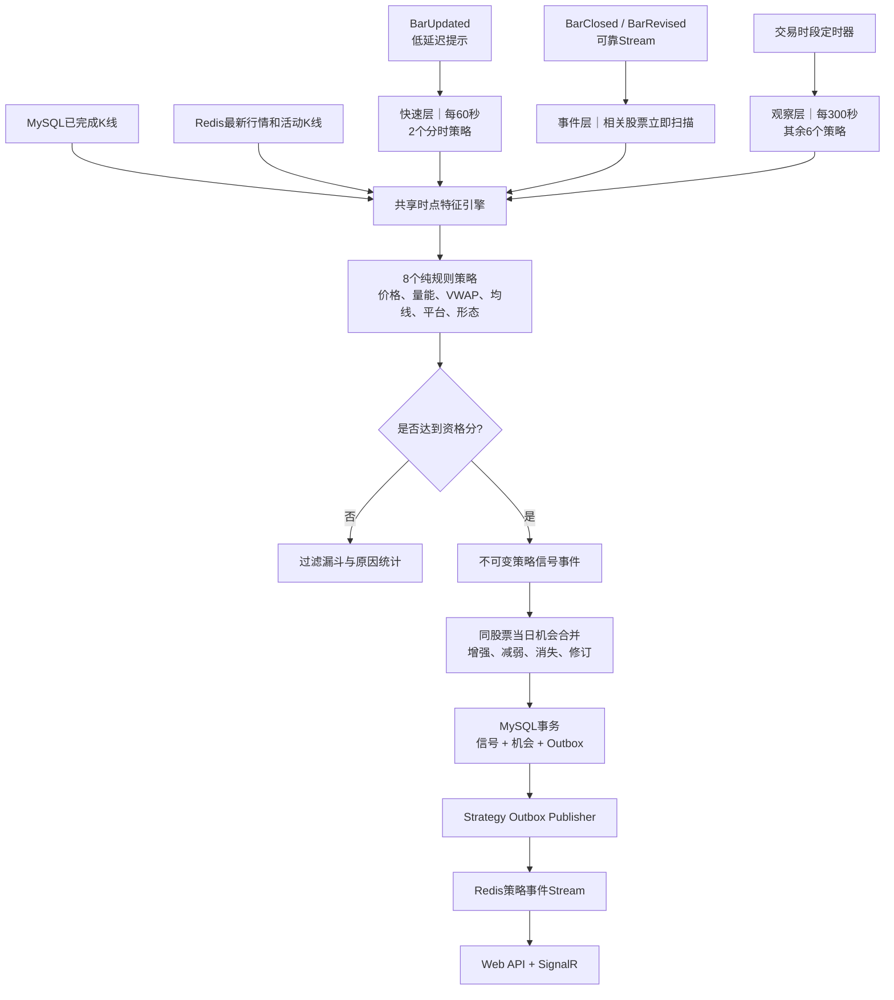

### 策略分层

| 扫描层 | 策略 | 触发方式 |
|---|---|---|
| 快速层 | 分时 VWAP 量价共振、低开高走 VWAP 再启动 | 每60秒 + 分钟K事件 |
| 观察/事件层 | 平台放量突破、均线回踩再启动、下跌浪二次探底反弹、强势趋势延续、逆势走强、强修复反弹 | 每300秒 + 30分钟/日线关闭或修订 |

## 9. 8 策略逐时点历史回放与阈值校准

回放严格按观察时点构建快照：不能读取观察点之后的 5 分钟、30 分钟或日线。它记录每个阈值的首次穿越，而不是用收盘后最高分倒推信号。

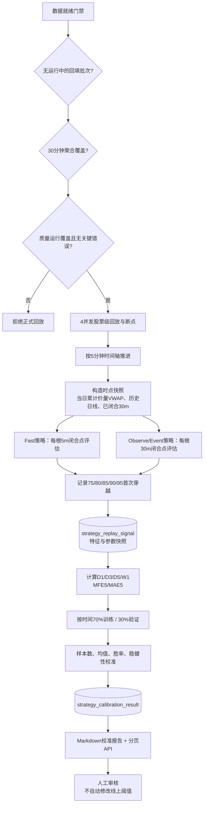

## 10. 对子趋势顶底流程

对子尾数包含 `.00`、`.11`～`.99`。上升趋势检查 K 线高点形成顶部候选；下降趋势检查低点形成底部候选。

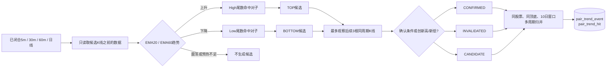

## 11. 数据存储总图

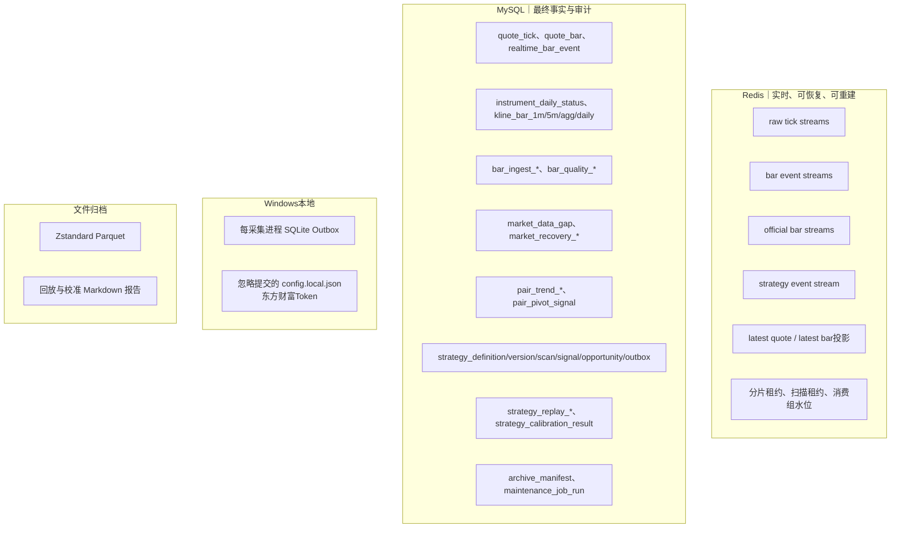

## 12. 运维监控与故障定位流程

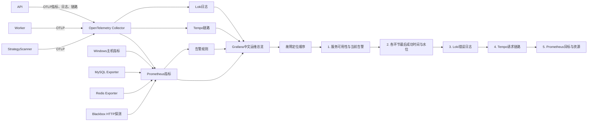

## 13. 年度归档与数据清理

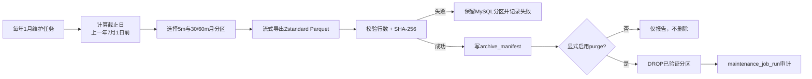

日线、股票池历史、质量结果、对子结果、策略证据和校准结果长期保留；只对分钟 K 线及其 30/60 分钟聚合执行年度归档清理。

## 14. 故障隔离与恢复原则

| 故障 | 影响范围 | 自动恢复依据 |
|---|---|---|
| 单个 Python 采集进程退出 | 该进程股票分片短暂停顿 | 独立 SQLite Outbox、Supervisor重启、未确认重发 |
| API/gRPC 短时不可用 | Tick积压在本地Outbox | 断线重连后按序重发 |
| Redis 短时不可用 | 实时链路暂停 | Outbox保留；Stream消费者恢复后继续 |
| MySQL 短时不可用 | Redis Stream Pending增长 | MySQL提交前不XACK，恢复后重放 |
| K线Worker退出 | Bar生成暂停 | 消费组Pending、XAUTOCLAIM、Redis活动状态恢复 |
| StrategyScanner退出 | 策略提示暂停，不影响行情 | Bar事件Pending、MySQL已完成K线、扫描断点 |
| 历史下载退出 | 当前批次中断 | 股票+频率检查点、幂等写入 |
| 数据缺失或内容错误 | 局部周期不完整 | 缺口任务、官方K线回放、BarRevised、派生重算 |
| 监控栈退出 | 不影响业务数据链路 | Docker持久卷，恢复后重新采集 |

## 15. 完整端到端功能链

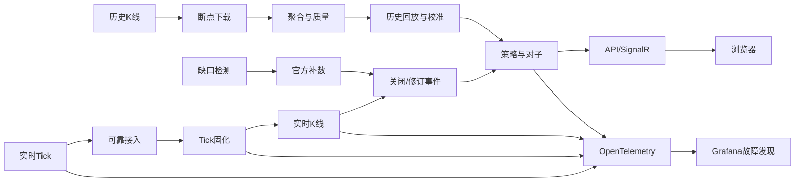

这条链路中的实时提示允许合并，但可靠事实不可跳过：采集先本地固化，Redis Stream 消息只在 MySQL 事务提交后确认，历史和恢复任务均使用断点、租约和唯一键收敛到同一最终状态。
