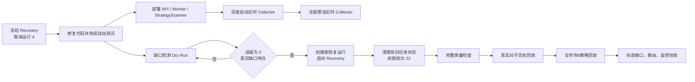

# A股监控程序系统整改与生产就绪执行方案

> 编制日期：2026-08-14  
> 适用环境：Windows + 东方掘金终端；MySQL/Redis/可观测组件运行于 Docker/WSL2  
> 文档性质：执行方案；已于 2026-08-14 执行，结果见《系统整改执行报告》

## 1. 目标与结论

本轮整改目标不是继续扩展业务功能，而是把现有链路收敛到可稳定运行、可恢复、可验证的状态：

1. 恢复沪深非 ST 股票的实时 Tick 采集，并确保每个采集进程独立心跳、自动重启；
2. 修复策略在无1分钟数据、盘外启动和单股异常时的失败扩散；
3. 作废误报的恢复运行 4，修复日线槽位口径，并经过 Dry Run 后才重新开放补数；
4. 清理历史任务的陈旧状态，按原批次和原分区续跑批次 22 的两个失败分区；
5. 修复东方掘金 `2038-01-01` 未退市哨兵值的证券状态映射；
6. 在数据水位稳定后，依次执行真实 A 股对子回放和全市场8策略回放；
7. 优化运维状态接口、带点股票代码的前端路由，以及采集、补数、策略、历史任务告警。

整改完成前，系统可以继续提供历史 K 线查询，但不能把当前盘中策略、对子实时结果或运行 4 的缺口记录视为可信结果。

## 2. 必须遵守的执行顺序

实时采集与历史补数是两个不同进程组：

- `AStockMonitor-MarketCollector`：东方掘金 Tick/实时官方 K 线采集，可以在第一阶段恢复；
- `AStockMonitor-MarketRecovery`：根据 `market_recovery_item` 下载缺失官方 K 线，在运行 4 作废和检测器修复前必须保持禁用。



安全门禁：任何时候都不得在运行 4 仍为 `planned` 且 46,171 个旧恢复项可领取的情况下启动 Recovery Worker。

## 3. 当前基线

| 项目 | 当前状态 |
|---|---|
| 实时采集 | 未运行；采集计划任务尚未执行 |
| 实时股票池 | 最新交易日合格且未停牌 5,000 只 |
| 策略 Fast 启动扫描 | 5,000/5,000 失败 |
| 恢复运行 4 | `planned`，46,171 条缺口记录、89,915 个缺失槽位 |
| 日线误报 | 39,985 条日线缺口中 38,830 条实际已有 K 线 |
| 历史批次 22 | 4,815/5,015 完成；两个100只分区 `retry_exhausted` |
| 陈旧断点 | 80 条 `running`、81 条 `failed` |
| 证券主数据 | `instrument` 表 5,661 只全部错误标为 `delisted` |
| 对子历史结果 | 只有 TEST.TOP / TEST.BOTTOM 验收样本；真实回放为0只股票 |
| 策略历史回放 | 仅完成100只股票的有限回放 |

## 4. 阶段0：冻结错误补数并保存审计快照

### 4.1 操作

1. 禁用 `AStockMonitor-MarketRecovery` 计划任务，不删除任务定义；
2. 确认不存在 `astock_collector.history.cli recover` 进程；
3. 导出运行 4 的运行、缺口和恢复项状态汇总，写入 `.artifacts/recovery-run-4-before-cancel.json`；
4. 新增受运维令牌保护的取消接口：

```text
POST /api/market-data/recovery-runs/{id}/cancel
```

请求体包含幂等 `requestId` 和 `reason`。接口在同一事务内执行：

- `market_recovery_run.status: planned -> cancelled`；
- 未领取的 `market_recovery_item: planned/retry_waiting -> cancelled`；
- 对应 `market_data_gap: planned/detected -> invalidated`；
- 写入取消原因、操作人、时间和算法版本；
- 已完成项不回滚，正在租约中的项必须等待租约过期后再取消。

运行 4 当前没有实际下载记录，因此取消只改变任务状态，不删除 K 线。

### 4.2 验收

- 运行 4 状态为 `cancelled`；
- 运行 4 不再有 `planned/retry_waiting/recovering` 恢复项；
- Recovery 进程数为0；
- 已有 5m/30m/60m/1d K 线总量不变化。

### 4.3 回滚

取消操作通过状态快照可审计，但不直接把运行 4 恢复为可执行。若需要重新补数，必须使用修复后的检测器创建新 RunId，不能复活旧运行。

## 5. 阶段1：修复并启动实时采集

### 5.1 启动模式

东方掘金终端运行在 Windows 用户会话中，采集任务不直接改为 LocalSystem 的 Windows 服务，避免 Session 0 无法连接终端。采用“用户计划任务 + 常驻 Supervisor”模式：

- 触发器1：当前用户登录；
- 触发器2：每个交易日 08:50；
- `StartWhenAvailable=true`；
- `MultipleInstances=IgnoreNew`，防止重复进程组；
- Supervisor 异常退出后1分钟重启，最多100次；
- Recovery 继续使用独立任务，不能与 Collector 合并。

08:50 触发器的作用是：即使任务安装发生在本次登录之后，也能在开盘前自动启动。非交易日可以启动后进入低频心跳状态，或由交易日历门禁直接正常退出。

### 5.2 启动前检查

`start-collector.ps1` 增加 Preflight，任何一项失败均以非0退出，由任务计划程序重试：

1. 东方掘金终端端口 `127.0.0.1:7050` 可连接；
2. 本地 Token 配置存在且不为空，日志中不得输出 Token；
3. API gRPC `127.0.0.1:7000` 可连接；
4. Redis、MySQL、API `/health/ready` 正常；
5. 最新股票池日期不早于最近交易日；
6. 股票池规模在合理区间，例如 4,500～5,500；
7. `.runtime/collector.lock` 不存在有效持有者；陈旧锁必须结合 PID 和启动时间判断后回收。

### 5.3 多进程口径

- 东方掘金 SDK 3.0.186 实测限制为每个会话最多50个实时订阅代码，而非每交易所50个；
- 每个实时采集进程最多50只股票，并保持单一交易所分片；
- 当前账户实时池为沪深各500只，共1,000只，自动拆为20个采集子进程；
- 历史回填仍为6个并发分区、每个分区100只，不能与实时采集进程数混淆；
- 每个实时子进程使用独立 `worker_id`、`partition_id`、PID、股票数和心跳；
- Supervisor 只重启失去心跳的子进程，不终止健康分区；
- 进程重启后通过 `session_id + worker_sequence` 保证 Tick 幂等。

### 5.4 灰度启动

1. 先用6个进程、600只股票运行5分钟；
2. 校验 gRPC 心跳、Tick 接收、Redis Stream、1分钟预览和内存增长；
3. 灰度通过后切换为 `Workers=0, SymbolsPerWorker=100`，自动覆盖全部股票；
4. 盘中2分钟后检查每个分片的消息量和消费者 lag；
5. 全量运行30分钟后再宣布实时采集恢复。

### 5.5 验收指标

| 指标 | 目标 |
|---|---:|
| 连接采集进程 | 等于按交易所分别 `ceil(股票数/50)` 后求和；当前为20 |
| 子进程心跳年龄 | P99 小于15秒 |
| gRPC拒绝消息 | 0 |
| Redis Tick Stream pending | 正常情况下为0；短时峰值可回落 |
| 1分钟预览覆盖 | 开盘后2分钟内覆盖活跃股票的98%以上 |
| 单分区重启影响 | 不影响其他分区 |
| Tick MySQL 表 | 仍为0张、0行 |

## 6. 阶段2：修复策略空分钟数据和交易时段

### 6.1 空分钟数据必须 Fail Closed

`IntradayVwapVolumeResonanceStrategy` 在计算止损前增加显式短路：

1. `DataReady=false` 时直接返回未命中；
2. 1分钟覆盖不足12分钟时直接返回未命中；
3. `Minute1Bars.Count=0` 时 `stop=null`，不得执行 `Min()`；
4. 所有依赖分钟序列的策略统一使用安全函数，例如 `TryGetRecentLow`，而不是直接对可能为空的集合聚合；
5. 单个规则异常只把该规则标记为失败，不影响同一股票其他规则；
6. 单只股票异常只影响该股票，不影响500只分块。

### 6.2 交易时段门禁

将启动扫描与定时扫描使用同一个 `IChinaTradingSession`：

- 使用 Asia/Shanghai / China Standard Time；
- 使用交易日历，而不只是排除周末；交易日来源优先使用 `instrument_daily_status` 或独立交易日表；
- 集合竞价和连续竞价阶段分开标识；
- Fast/Observe 正式扫描只在配置的连续竞价窗口执行；
- 盘外启动只恢复消费者、Outbox和生命周期状态，不执行全市场 Fast/Observe；
- 盘中启动时，必须等待 Collector 心跳存在且1分钟预览达到最小覆盖，再执行第一次扫描；
- 午休期间不创建新扫描，已产生机会只执行生命周期维护。

建议新增状态：

```text
skipped_outside_session
skipped_data_not_ready
completed
partial
failed
```

跳过不计入 `pipeline_failures`，但单独记录 skip 指标。

### 6.3 测试

- 0根、1根、11根1分钟K线均不抛异常且不命中；
- 12根以上进入正常评分；
- 周末、法定休市日、盘前、午休、收盘后不启动 Fast/Observe；
- 盘中重启且数据未就绪时等待，不形成5000只失败；
- 人工构造一只股票规则异常，其他股票仍完成；
- Fast 扫描失败率不得因单一异常扩大到整个分块。

## 7. 阶段3：修复日线缺口判定并重新检测

### 7.1 统一槽位身份

不批量改写现有661,374条日线的 `eob=00:00`。定义统一的 `BarSlotIdentity`：

- 5m/30m/60m：身份为 `(symbol, frequency, eob)`；
- 1d：身份为 `(symbol, trading_date)`，EOB只用于展示，不参与存在性判定。

Repository 的批量查询对日线直接返回已存在交易日，不再用 `15:00` 与数据库 `00:00` 比较。Gap Key 也应使用日线交易日身份，避免同一日因 EOB 表示不同产生两个缺口。

### 7.2 Dry Run 门禁

修复后先执行：

```text
POST /api/market-data/gaps/detect
DryRun=true
DateFrom=最近8个交易日前
DateTo=最近已完成交易日
Datasets=[5m,30m,60m,1d]
```

验收必须同时满足：

- 已有日线的 `SHSE.600000` 等抽样股票不出现在缺口中；
- 日线缺失数量与 `instrument_daily_status LEFT JOIN kline_bar_daily` 精确一致；
- 已存在日线误报为0；
- Dry Run 不创建 `market_recovery_item`；
- 分钟线检测结果与实际槽位差集一致；
- 检测接口在31日限制内可重复执行且 Gap Key 幂等。

### 7.3 重新开放补数

1. Dry Run 通过后创建新的非 Dry Run 恢复运行；
2. 首先只处理10只股票并验证插入/不变/修订计数；
3. 再启动4个 Recovery Worker；
4. 盘中并发上限2，盘后可以提升到4～8；
5. 每个恢复项完成后重新查询官方 K 线并验证槽位；
6. 新运行完成后才重新启用 `AStockMonitor-MarketRecovery` 常驻任务。

## 8. 阶段4：清理历史状态并续跑两个失败分区

### 8.1 先修复旧批次无法被领取的问题

当前 API 可以向 `history_control_command` 写入批次22重试命令，但下载器只在新建批次的调度循环里领取“当前 batch_id”的命令，因此旧批次22不会被实际处理。

新增 Python 入口：

```powershell
python -m astock_collector.history.cli resume `
  --batch-id 22 --workers 6
```

`resume` 必须：

- 读取原批次日期、周期、scope_key和不可变 `symbols_json`；
- 只领取 `retry_waiting/retry_exhausted/failed_permanent` 的指定分区；
- 获取同一历史调度器 fencing lease；
- 使用原 checkpoint 续传，不创建新的全量批次；
- 每个分区保持独立进程、心跳和看门狗；
- 完成后重新计算批次汇总和终态；
- 支持 `--partition-id` 做单分区灰度。

API 重试命令与 `resume` 使用同一状态机，不能存在“接口已接受但永远无人领取”的状态。

### 8.2 陈旧状态清理

新增只处理元数据的 `reconcile-history-state` 运维命令，禁止直接删除 checkpoint：

1. 确认调度器 lease 已过期且没有真实历史下载父进程；
2. 对无活跃进程、心跳超过阈值的 `running` 分区标记 `interrupted`；
3. 对批次11等没有活动分区的 `running` 批次标记 `interrupted` 并补 `finished_at`；
4. 将陈旧 checkpoint 从 `running` 归一为 `pending` 或 `failed`，保留 `next_date`、`rows_written` 和 `last_error`；
5. 对父进程已消失的 Python SDK 子进程记录后终止；
6. 所有更新写入 `history_state_reconciliation_audit`。

不删除 K 线、不重置已完成 checkpoint、不使用 `--force` 全量重下。

### 8.3 分区重跑顺序

1. 先重跑 `batch-22-part-0001-6ebbe455cf79`，它已有20% checkpoint；
2. 验证续传没有从头重复下载；
3. 再重跑 `batch-22-part-0000-44f8be1efcad`；
4. 若再次900秒无进展，保留进程现场和 SDK 调用阶段，不再盲目增加重试次数；
5. 两分区完成后运行 2026-02-24～2026-08-13 全周期质量检查；
6. 对数据商确认无 K 线的上市/停牌日期记录 `verified_no_bar`，不把它永久算作失败。

### 8.4 验收

- 批次22不存在 `retry_exhausted/failed_permanent/running` 分区；
- 旧批次不存在无进程的 `running` 状态；
- 所有 checkpoint 的 `next_date` 单调前进；
- 幂等重跑不增加重复 K 线；
- OHLC、成交量、重复、交易时段对齐检查无 critical 问题。

## 9. 阶段5：修复证券退市哨兵日期

采用双层防御：

1. Provider 将东方掘金明确的 `2038-01-01` 哨兵识别为“未退市”；原始值继续保存在 `raw_attributes`；
2. 入库状态判断改为：`delist_date IS NULL OR delist_date > 当前日期` 时为 `active`，只有退市日期已经到达才为 `delisted`；
3. 对现有数据执行幂等修复：精确哨兵值可归一为 NULL，未来真实退市日期保留；
4. 使用交易日状态表继续判断 ST、停牌和当日是否可用，不用 `instrument.status` 代替点时股票池。

验收样本至少包括：

- `SHSE.600000` 浦发银行；
- `SHSE.601398` 工商银行；
- `SZSE.000001` 平安银行；
- `SZSE.300750` 宁德时代；
- 一只真实历史退市股票。

验收标准：正常股票为 `active`，真实已退市股票为 `delisted`，搜索接口返回正确名称与状态，股票池合格数不因修复异常波动。

## 10. 阶段6：真实 A 股对子回放

### 10.1 数据就绪门

只有以下条件全部满足才启动：

- 历史回填和恢复任务没有 `running`；
- 5m/30m/60m/1d 水位覆盖到最近已完成交易日；
- 覆盖区间存在完整质量运行且无 critical 问题；
- 证券名称和状态已经修复；
- MySQL 没有长事务和明显锁等待；
- 不与全市场策略回放并行。

### 10.2 执行范围与步骤

受分钟历史最近 60 自然日限制，本轮使用实际可用区间：

```text
2026-02-24 ～ 2026-08-13
5m、30m、60m、1d
```

执行顺序：

1. 20只股票灰度；
2. 100只股票灰度；
3. 全市场执行，不传 `--symbol-limit`；
4. 使用股票级 checkpoint 续传，失败股票可单独重跑；
5. 不使用 acceptance 数据源，不向前端发送历史盘中通知。

正式命令示例：

```powershell
dotnet run --project .\src\AStockMonitor.Backtest\AStockMonitor.Backtest.csproj `
  -c Release --no-build -- `
  --start 2026-02-24 --end 2026-08-13 `
  --frequencies "5m,30m,60m,1d"
```

验收：

- `requested_symbols` 接近当期有效沪深非 ST 股票数且大于0；
- `completed_symbols + failed_symbols = requested_symbols`；
- 正式结果的 `data_source=dongcai-gm`、`run_mode=historical`；
- 前端历史列表不再只有 TEST 数据；
- 命中、事件、顶底、周期、`.00` 与对子数统计可分页查询；
- 随机抽取20条事件用 K 线窗口复核。

## 11. 阶段7：全市场8策略历史回放与校准

### 11.1 执行策略

- 在对子回放结束后单独执行；
- 建议盘后停止实时 StrategyScanner 服务，运行专用回放进程，结束后恢复服务；
- 首轮 `workers=2` 验证死锁和吞吐，再提升到4；
- 不建议直接使用8～16并发；
- 使用股票级断点，失败股票单独续跑；
- 阈值仍使用 `75,80,85,90,95`，训练集比例0.70，最小校准样本30；
- 不使用 `--allow-incomplete-data` 绕过数据质量门禁。

命令示例：

```powershell
.\deploy\services\AStockMonitor.StrategyScanner\AStockMonitor.StrategyScanner.exe `
  --historical-replay `
  --start 2026-02-24 --end 2026-08-13 `
  --workers 4 `
  --thresholds "75,80,85,90,95" `
  --train-ratio 0.70 `
  --minimum-samples 30
```

### 11.2 验收

- 8个策略均参与；
- 全市场请求股票数大于4,500；
- 完成率不低于99.9%，其余失败项必须有可重跑原因；
- MySQL deadlock 最终失败为0；
- 每个策略至少输出样本量、命中率、D1/D3/D5/W1、MFE5、MAE5；
- 训练集和验证集结果分开；
- 生成 `.artifacts/strategy-replay-{runId}.md`；
- 回放结果不写入实时通知 Stream。

当前回放使用官方5分钟 K 线模拟 Fast 的5分钟闭合时点，不等同于真实1分钟逐分钟回放，报告必须继续保留这一限制。

## 12. 阶段8：状态接口、个股路由和监控告警

### 12.1 `/api/history/status` 优化

移除请求路径中的大表实时精确 `COUNT(*)`。新增 `dataset_stat_snapshot`：

- dataset/frequency；
- row_count；
- distinct_symbols；
- min/max trading_date；
- quality/open_gap 数；
- `is_exact`；
- `calculated_at`。

快照在历史批次、恢复运行、质量检查完成后异步刷新。API 只读取快照和最近任务状态，可加 Redis 30秒缓存。

验收目标：

- P95 小于500ms；
- MySQL查询小于200ms；
- 返回 `snapshotAt` 和 `isExact`，不把过期快照伪装成实时值；
- 快照刷新失败不阻塞行情写入。

### 12.2 个股路由

为带点股票代码增加明确 SPA fallback，例如 `/stocks/{**path}`，然后保留通用 `nonfile` fallback，避免把不存在的 `.js/.css` 静态资源也返回 `index.html`。

验收：

- 直接访问、刷新 `/stocks/SHSE.600000` 返回200；
- `SZSE.000001` 同样通过；
- 不存在的静态资源仍返回404；
- 前端内部跳转、浏览器后退和详情任务跳转正常。

### 12.3 新增指标

建议增加以下 OpenTelemetry 指标：

```text
astock_collector_workers_expected
astock_collector_workers_connected
astock_collector_heartbeat_age_seconds_max
astock_collector_queue_depth_max
astock_collector_ticks_received_total
astock_market_session_open
astock_recovery_runs{status}
astock_recovery_items{status}
astock_recovery_oldest_planned_age_seconds
astock_history_stale_batches
astock_history_stale_checkpoints
astock_strategy_scan_skipped_total{reason,profile}
astock_strategy_scan_failure_ratio{profile}
astock_pair_consumer_lag
```

Windows 计划任务状态通过 windows_exporter textfile collector 输出，至少包含任务是否启用、最近结果、最近运行时间和任务进程是否存在。

### 12.4 新增告警

| 告警 | 条件 | 严重级别 |
|---|---|---|
| CollectorMissingDuringMarket | 交易时段连接采集进程为0持续30秒 | critical |
| CollectorWorkerCoverageLow | 已连接进程低于期望95%持续2分钟 | critical |
| CollectorHeartbeatStale | 最大心跳年龄超过30秒 | critical |
| CollectorQueueBacklog | 队列深度持续增长5分钟 | warning |
| TickCoverageLow | 开盘后活跃股票覆盖低于98% | warning |
| RecoveryRunStuck | planned/recovering状态超过阈值不动 | critical |
| RecoveryWorkerMissing | 有计划项但无Recovery Worker | critical |
| HistoryStaleState | 存在无进程的running批次或checkpoint | warning |
| StrategyFastFailureRatio | Fast失败率超过1% | critical |
| StrategySkippedDataNotReady | 盘中连续跳过超过3次 | warning |
| PairConsumerLag | Bar事件 lag 超过阈值 | warning |
| DatasetSnapshotStale | 状态快照超过30分钟未刷新 | warning |

交易时段告警使用 `astock_market_session_open` 门控，避免夜间正常无 Tick 触发告警。

### 12.5 Grafana 页面

在现有中文运维大盘增加：

- 实时采集：期望/在线进程、分区、心跳、Tick速率、队列；
- K线链路：最新水位、Bar事件速率、Outbox、Redis lag；
- 补数：运行状态、计划项年龄、下载/插入/修订速度；
- 历史回填：批次、分区、重试、吞吐、ETA；
- 策略与对子：扫描完成率、跳过原因、信号数、消费者 lag；
- 系统消息：当前 firing 告警和最近错误日志。

## 13. 部署与停启顺序

1. 禁用 Recovery 任务并取消运行 4；
2. 停止 `AStockMonitor.StrategyScanner` 和 `AStockMonitor.Worker`；
3. 停止 Collector 任务及其 Supervisor；
4. 停止 API，发布 Release 产物；
5. 启动 API，验证 health、Swagger、gRPC；
6. 启动 Worker，但 Recovery 任务仍禁用；
7. 启动 StrategyScanner，确认盘外不执行全市场扫描；
8. 灰度启动 Collector，再全量启动；
9. 通过缺口 Dry Run 后才创建新恢复运行并启动 Recovery；
10. 完成历史分区续跑和质量检查；
11. 盘后依次运行对子回放、策略回放；
12. 验收接口、路由、Grafana和告警。

## 14. 自动测试与整体验收清单

### 14.1 自动测试

- `.NET build`：0错误；
- Python collector tests：全部通过；
- Bar Lifecycle V2 自测通过；
- 旧 `RealtimeBarSelfTest` 同步 V2 四正式周期与Redis 1分钟预览后通过；
- 策略8/8自测通过，新增空分钟和盘外测试；
- 缺口检测新增日线00:00/15:00兼容测试；
- 证券哨兵日期测试；
- History resume/retry 幂等测试；
- 前端 build 和路由刷新测试。

### 14.2 系统验收

- MySQL/Redis/三个.NET服务和可观测组件全部健康；
- Collector 在盘中全股票池运行30分钟无大面积重启；
- Redis Stream、Outbox、SignalR 无持续堆积；
- MySQL 不存 Tick，只存5m/30m/60m/1d；
- 新缺口运行不存在日线误报；
- 批次22完成或对数据商无数据项形成可审计终态；
- 真实对子和策略回放均产生可分页结果；
- `/api/history/status` 达到性能目标；
- 个股详情直接刷新成功；
- 人工停止一个采集分区、一个Recovery Worker、一个.NET服务，告警均在规定时间触发并在恢复后自动解除。

## 15. 预计交付拆分

| 交付批次 | 内容 | 建议耗时 |
|---|---|---:|
| R1 | 冻结运行4、实时采集启动机制、策略空数据与时段门禁 | 1～2个开发日 |
| R2 | 日线缺口修复、取消接口、Dry Run与Recovery灰度 | 1～2个开发日 |
| R3 | 历史状态对账、旧批次resume、两个分区续跑 | 1～2个开发日，不含SDK下载时间 |
| R4 | 证券状态修复、完整质量检查 | 0.5～1个开发日 |
| R5 | 真实对子与全市场策略回放 | 1个开发日，不含实际计算时间 |
| R6 | 状态接口、个股路由、指标、告警、Grafana | 1～2个开发日 |

总原则：每个批次必须通过本阶段验收后再进入下一阶段；不得为了赶进度跳过 Dry Run、质量门或用 `--force` 重置历史断点。
