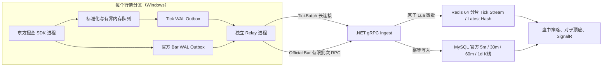
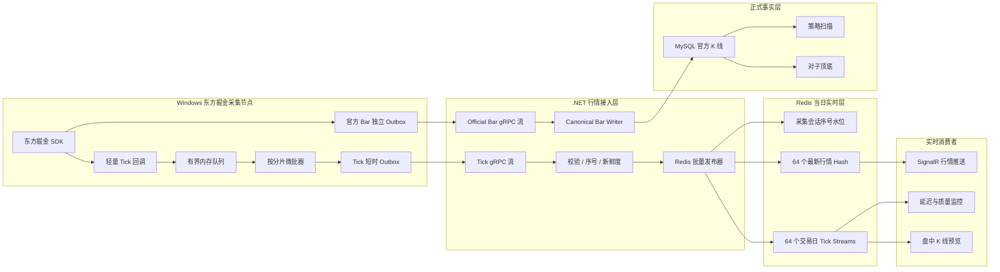
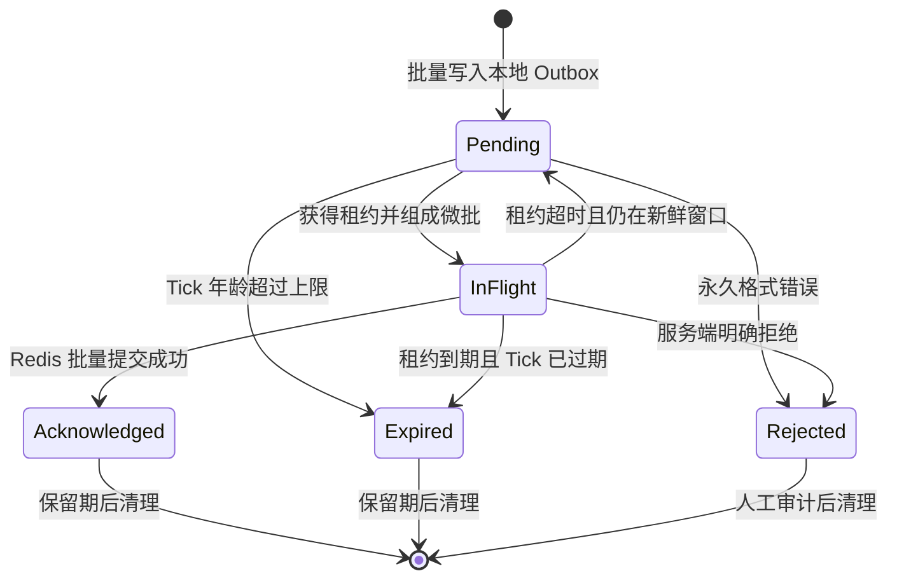

# Tick 实时存储与读取开发方案

> 项目：A股监控程序  
> 状态：核心开发完成，2 分区灰度运行中  
> 日期：2026-08-14  
> 适用范围：东方掘金 Tick 采集、gRPC 接入、Redis 当日实时层、行情查询与实时消费者  
> 优先级：P0（数据底座整改第一阶段）

## 实施结果（2026-08-14）

- Tick V3 协议、64 分片 Redis Lua 微批、批量 ACK、租约、过期、快速读接口和安全裁剪均已实现。
- 713,189 条旧 Tick 已标记过期，7,000 条官方 Bar 完整保留；迁移前备份位于 `.runtime/backups/tick-outbox-20260814-before-v3`。
- Tick 与官方 Bar 已使用独立 SQLite WAL 文件：`worker-NNN-tick.sqlite3` 与兼容保留的 `worker-NNN.sqlite3`。
- 东方掘金 SDK 与 gRPC Relay 已拆成独立 OS 进程。每个分区由一个 SDK 采集进程和一个 Relay 发送进程组成，SDK 线程调度不会再阻塞心跳、Tick 微批或 ACK。
- 官方 Bar 通过有限批次 RPC 发送；Tick 使用唯一长期 gRPC 流，两条链路互不等待。
- Python 测试 36 项通过；.NET 10 Release 构建 0 警告、0 错误。
- Redis 隔离压测达到约 25,120 Tick/秒，满足 20,000 Tick/秒正式目标；50,000 Tick/秒拉伸目标尚未达到。
- 当前计划任务 `AStockMonitor-MarketCollector` 固定为 2 分区、每分区 50 只股票的灰度模式；完成交易时段观察后再扩展到全量分区。



## 1. 结论

本阶段不增加新的数据库，继续采用以下技术栈：

- Windows Python 进程通过东方掘金 SDK 采集 Tick；
- Python 与 .NET 之间使用 gRPC 双向流；
- Redis 保存当日 Tick 流和最新行情快照；
- MySQL 不保存 Tick；
- 正式 5m、30m、60m、1d K 线继续以东方掘金 SDK 的官方 K 线为权威来源；
- SQLite Outbox 只承担短时断线缓冲，不承担历史 Tick 归档和无限重放。

本方案借鉴 kdb+ Tick 架构中的 Feed Handler、Tickerplant、RDB、RTE、HDB 和 Gateway 分层，但使用现有组件实现，不引入 kdb+、DolphinDB、Kafka 或 ClickHouse。

核心原则：

> Tick 的目标是“新鲜、可消费、可快速查询”，不是“逐条永久保存”。超过实时价值窗口的 Tick 不进入实时链路；系统停机造成的正式行情缺口由东方掘金官方 K 线补数服务恢复。

## 2. 当前问题

2026-08-14 盘中检查曾观察到：

- 20 个采集进程在线；
- 采集端 SQLite Outbox 待确认记录超过 61 万条；
- 约 10.74 秒内待确认记录增加 2,789 条，净增长约 260 条/秒；
- 最旧待发送 Tick 比实时行情落后约 50 分钟；
- 旧记录存在多次重复发送；
- Redis 消费组本身没有形成同等级积压，Redis/MySQL 主机资源也未饱和。

因此当前瓶颈不是 Redis 的理论吞吐能力，而是接入链路设计：

1. SQLite Outbox 没有明确的 `in_flight` 状态，同一批未确认记录每 2 秒即可再次被租赁；
2. gRPC 逐条发送、逐条 Redis 写入、逐条 ACK，网络往返和调度开销过高；
3. 每条 Tick 分别执行 Stream 写入、TTL 和最新行情投影，Redis 调用次数过多；
4. Tick 与官方 K 线共用一个 Outbox 和同一 FIFO，过期 Tick 会阻塞权威 K 线；
5. 旧 Tick 被当作必须完整重放的数据，积压越严重，实时性越差；
6. 当前最新行情采用每只股票一个 Redis Key，批量读取和生命周期管理仍可优化。

## 3. 目标与非目标

### 3.1 开发目标

- SDK 回调不得执行网络访问或逐条磁盘同步；
- Tick 从 SDK 回调到 Redis 可查询的正常 P95 延迟小于 100ms；
- 正常 P99 延迟小于 300ms，最旧待发送 Tick 年龄小于 2 秒；
- 支持 20,000 Tick/秒持续 30 分钟；
- 支持 50,000 Tick/秒持续 10 分钟的拉伸测试；
- Redis 单次批量提交包含 100～500 条 Tick，或最多等待 10ms；
- 同一个股票固定进入同一个 Redis 分片，保持股票内事件顺序；
- Tick 过期、重复、乱序、部分故障均有明确处理规则；
- 最新行情支持单股 O(1) 读取和多股按分片批量读取；
- K 线、对子顶底和策略消费者通过独立消费组读取实时数据，互不抢占；
- Tick、官方 K 线传输隔离，Tick 故障不阻塞官方 K 线；
- 现有 60 万级历史 Outbox 积压可以安全迁移，不删除其中的官方 K 线。

### 3.2 非目标

- 不把 Tick 写入 MySQL；
- 不长期保存历史 Tick；
- 不补采系统停机期间的历史 Tick；
- 不使用 Tick 生成正式 5m、30m、60m、1d K 线；
- 不在本阶段替换 Redis、MySQL 或 gRPC；
- 不修改对子顶底和八个策略的业务规则；
- 不执行自动交易或下单。

## 4. 目标架构



## 5. Tick 生命周期



建议状态值：

| 状态 | 数值 | 说明 |
|---|---:|---|
| `pending` | 0 | 可以发送 |
| `acknowledged` | 1 | Redis 已确认 |
| `rejected` | 2 | 永久无效，禁止自动重试 |
| `in_flight` | 3 | 已发送，租约内禁止重复发送 |
| `expired` | 4 | 超过实时价值窗口，禁止重放 |

默认参数：

| 参数 | 初始值 | 说明 |
|---|---:|---|
| Tick 微批条数 | 200 | 可在 100～500 内压测调整 |
| 微批最大等待 | 10ms | 满足低延迟和批量吞吐平衡 |
| Tick 最大重放年龄 | 120秒 | 超过后标记过期 |
| In-flight 租约 | 30秒 | ACK 丢失后允许重试 |
| 每进程最大 Tick in-flight | 400 | 防止请求生成器无限租赁 |
| 每进程内存队列 | 20,000 | 维持现有默认值，压测后调整 |
| 已确认/过期记录保留 | 1小时 | 用于短时审计 |
| 永久拒绝记录保留 | 24小时 | 用于排查格式和协议问题 |

`Tick 最大重放年龄`应从行情的 `receive_time` 计算，而不是从最后一次发送时间计算。官方 K 线没有该过期规则。

## 6. Python 采集端设计

### 6.1 SDK 回调

SDK 回调仅执行：

1. 标准化证券代码和数值；
2. 生成确定性 `event_id`；
3. 补充 `event_time`、`receive_time`、`session_id`、`worker_sequence`；
4. 放入有界内存队列；
5. 立即返回。

回调中禁止：

- 调用 gRPC；
- 调用 Redis/MySQL；
- 对单条 Tick 执行 `FULL` fsync；
- 执行策略、K 线或对子计算；
- 无期限等待已满队列。

### 6.2 内存队列背压

| 水位 | 行为 |
|---:|---|
| `<70%` | 正常运行 |
| `70%～90%` | 告警并提高批量提交频率 |
| `90%～100%` | 进入拥塞状态，记录开始时间 |
| `100%` | 不阻塞 SDK 回调；按股票保留最新 Tick，替换过时的中间快照 |

累计成交量、累计成交额和最新价格主要表达状态变化。严重拥塞时，优先保留每只股票最新状态，比让采集线程无限阻塞更符合实时监控目标。所有降级丢弃必须计入指标。

### 6.3 SQLite Outbox

修改表结构：

```sql
ALTER TABLE outbox ADD COLUMN message_type TEXT NOT NULL DEFAULT 'tick';
ALTER TABLE outbox ADD COLUMN lease_until REAL NULL;
ALTER TABLE outbox ADD COLUMN lease_token TEXT NULL;
ALTER TABLE outbox ADD COLUMN expired_at REAL NULL;
```

迁移时根据 Payload 中 `_messageType=official_bar` 回填 `message_type`，其余旧记录按 `tick` 处理。

必须实现：

- `lease_pending` 在一个 SQLite 事务中选择记录并更新为 `in_flight`；
- 租约未到期的记录不能再次返回；
- ACK 必须校验 `lease_token`，避免旧连接 ACK 新租约；
- 只有租约到期后才能重新进入 `pending`；
- 每秒扫描并标记超过 120 秒的旧 Tick 为 `expired`；
- 官方 K 线永不过期，并拥有独立 in-flight 配额；
- 清理 `acknowledged/expired` 不影响 `rejected` 和官方 K 线。

### 6.4 Tick 与官方 K 线隔离

最终目标采用两个物理 Outbox 和两个 gRPC 流：

```text
.runtime/outbox/tick/worker-001.sqlite3
.runtime/outbox/bar/worker-001.sqlite3
```

第一轮兼容迁移可以继续读取旧文件，但调度时必须先发送 `official_bar`，并为 Tick、Bar 分别设置 in-flight 上限。新数据切换后再使用物理隔离文件。

## 7. gRPC 微批协议

当前单条 `TickEvent → IngestAck` 改成按 Redis 分片组织的微批：

```protobuf
message TickBatch {
  string batch_id = 1;
  string worker_id = 2;
  string session_id = 3;
  int32 shard_id = 4;
  int64 first_worker_sequence = 5;
  int64 last_worker_sequence = 6;
  repeated TickEvent ticks = 7;
}

message TickBatchAck {
  string batch_id = 1;
  int32 shard_id = 2;
  int32 accepted_count = 3;
  int32 duplicate_count = 4;
  int32 expired_count = 5;
  int32 rejected_count = 6;
  string redis_last_id = 7;
  AckStage stage = 8;
  string reason = 9;
}
```

协议规则：

- 一个 TickBatch 只能包含一个 Redis 分片的数据；
- 批内按 `worker_sequence` 升序；
- .NET 只有在该批 Redis Lua 提交成功后才返回 `STREAM_APPENDED`；
- 客户端收到批 ACK 后，按 `batch_id + lease_token` 一次确认整批记录；
- 连接中断且没有 ACK 时，等待租约到期后重试；
- 协议保留单条 Tick 消息一个版本周期，用于灰度和回滚；
- 官方 Bar 继续使用独立消息和逐条可靠 ACK，因为其频率低且是权威事实。

## 8. Redis 数据结构

### 8.1 分片

使用稳定 FNV-1a 或现有一致哈希，将股票固定映射到 64 个分片：

```text
shard = StableHash(symbol) % 64
```

分片数通过配置控制，但同一个交易日内禁止动态变化。调整分片数必须从下一个交易日启用新的 `layout_version`。

### 8.2 Redis Key

```text
md:tick:v3:{20260814:12}:stream
md:tick:v3:{20260814:12}:latest
md:tick:v3:{20260814:12}:latest_meta
md:tick:v3:{20260814:12}:watermark
```

说明：

- `{20260814:12}` 是 Redis Cluster hash tag；相关 Key 保持在同一槽位；
- `stream` 保存短时顺序事件；
- `latest` 是 Hash，Field 为证券代码，Value 为紧凑行情 Payload；
- `latest_meta` 保存每只股票的 `event_time_ms + worker_sequence`；
- `watermark` 保存 `worker_id + session_id` 在该分片上的最大序号。

虽然当前 Redis 是单实例，Key 从现在开始按 Cluster 槽位设计，可以避免未来扩容时重新定义协议。

### 8.3 批量 Lua 提交

每个分片的一个微批通过一次 Lua 调用完成：

1. 检查会话/分片序号水位；
2. 丢弃已提交序号，防止 ACK 丢失造成重复追加；
3. 对有效 Tick 执行 `XADD`；
4. 只有事件时间更新，或事件时间相同但序号更大时，更新最新行情；
5. 更新该采集会话的序号水位；
6. 设置 Stream、Hash 和水位 Key 的统一过期时间；
7. 返回接受、重复、过期数量和最后一个 Stream ID。

该脚本只保证单分片微批原子性，因此 gRPC 微批也必须按分片生成。

### 8.4 保留和清理

- Key 按交易日隔离；
- 最新行情保留到下一交易日新行情稳定后，建议 TTL 36 小时；
- Tick Stream 正常查询窗口为最近 30 分钟；
- 故障恢复上限为 2 小时；
- Retention Worker 根据所有必要消费组的最小安全水位执行 `XTRIM MINID`；
- 不得裁剪仍处于 Pending 的必要消费组消息；
- 收盘后停止增长，次日按 TTL 自动释放；
- 配置 Redis `maxmemory` 告警和明确淘汰策略，禁止依赖随机淘汰维持运行。

## 9. .NET 接入层设计

### 9.1 批量接入

`MarketIngestGrpcService` 不再对 Tick 执行“逐条 await Redis，再逐条 ACK”。调整为：

1. 校验 Batch 元数据；
2. 批量转换领域模型；
3. 校验股票代码、价格、时间和新鲜度；
4. 调用 `IReliableTickPublisher.PublishBatchAsync`；
5. 返回一个 `TickBatchAck`。

20 个采集连接可以并发处理，但单连接设置最大未确认批次数，避免客户端无限推送。

### 9.2 发布接口

```csharp
Task<DurableBatchPublishReceipt> PublishBatchAsync(
    TickBatch batch,
    CancellationToken cancellationToken);
```

保留现有 `PublishAsync` 作为兼容适配器，内部转换为单条批次；灰度完成后再删除。

### 9.3 去重语义

采用“至少一次传输 + Redis分片序号幂等”：

- Outbox 保证网络故障时可重试；
- `worker_id + session_id + shard_id + worker_sequence` 判定重放；
- `event_id`用于审计和日志关联；
- Redis最新行情以 `event_time + worker_sequence` 防止旧值覆盖新值；
- Tick 重复不得继续进入 Stream；
- 官方 Bar 继续使用事件ID、行哈希和MySQL唯一键完成强幂等。

## 10. 快速读取设计

业务读取必须按用途分流：

| 用途 | 数据来源 | 说明 |
|---|---|---|
| 单股最新行情 | Redis `latest` Hash | `HGET`，O(1) |
| 多股最新行情 | 按分片 `HMGET` | API并行读取最多64个分片 |
| 实时K线预览 | Tick Stream消费组 | 顺序消费，不通过HTTP轮询 |
| SignalR推送 | 内存最新投影/Redis最新Hash | 合并高频更新，限制推送频率 |
| 近期Tick详情 | API进程内存环形缓存 | 每股保留64～256条，可丢失、可重建 |
| 正式K线/回放 | MySQL官方K线 | 不读取Tick Stream生成事实 |
| 对子顶底/策略 | 正式Bar事件与MySQL | 不直接扫描Tick |

### 10.1 查询接口

保留现有 URL，升级响应语义：

```text
GET /api/market/latest?symbol=SHSE.600000
GET /api/market/latest/batch?symbols=SHSE.600000,SZSE.000001
GET /api/market/ticks/recent?symbol=SHSE.600000&limit=128
GET /api/market/runtime
```

最新行情响应增加：

```json
{
  "symbol": "SHSE.600000",
  "eventTime": "2026-08-14T10:15:23.120+08:00",
  "receivedAt": "2026-08-14T10:15:23.145+08:00",
  "ingestedAt": "2026-08-14T10:15:23.171+08:00",
  "ageMs": 51,
  "source": "dongcai-gm",
  "isStale": false,
  "retention": "intraday"
}
```

交易时段没有最新数据，或 `ageMs` 超过配置阈值时，返回 `503 REALTIME_DATA_UNAVAILABLE`，不得回退到已经停用的 MySQL Tick 表。

### 10.2 近期 Tick 查询边界

近期 Tick 是调试和个股详情能力，不是事实接口：

- API内存中每股保留最近128条；
- API重启后缓存从新Tick重新建立；
- 不为了恢复近期明细而扫描整个分片Stream；
- 若未来确实需要稳定的单股Tick查询，再为“正在查看/订阅”的股票创建按需短时环形缓存，不对全市场双写。

## 11. 背压、降级与故障处理

| 故障 | 处理规则 |
|---|---|
| .NET/gRPC短时断开 | Tick进入短时Outbox，120秒内重试 |
| .NET/gRPC长时间断开 | 旧Tick标记过期；连接恢复后只发送新鲜Tick |
| Redis短时不可用 | 服务端不ACK；客户端按租约重试 |
| Redis长时间不可用 | 实时行情标记不可用；不得无限扩大Outbox |
| ACK丢失 | 租约到期后重试；Redis序号水位去重 |
| 单分片异常 | 只暂停该分片批次，其他分片继续 |
| 官方Bar通道异常 | 独立Outbox持续重试，不受Tick过期策略影响 |
| 采集队列满 | 按股票合并为最新状态并记录降级丢弃数 |
| 服务停机 | 不补Tick；恢复后刷新最新行情，正式K线由补数服务处理 |
| Redis整库丢失 | 重新接收最新Tick建立快照；正式数据从MySQL与SDK恢复 |

## 12. 监控指标和告警

### 12.1 Python采集端

```text
astock_tick_callback_total{worker}
astock_tick_queue_depth{worker}
astock_tick_queue_utilization_ratio{worker}
astock_tick_batch_size{worker,shard}
astock_tick_outbox_pending{worker}
astock_tick_outbox_inflight{worker}
astock_tick_outbox_oldest_seconds{worker}
astock_tick_outbox_expired_total{worker}
astock_tick_outbox_retry_total{worker}
astock_tick_degraded_drop_total{worker,reason}
astock_tick_grpc_unacked_batches{worker}
```

### 12.2 .NET和Redis

```text
astock_tick_ingest_batch_total{result,shard}
astock_tick_ingest_batch_size{shard}
astock_tick_ingest_latency_ms{stage}
astock_tick_duplicate_total{shard}
astock_tick_stale_total{shard}
astock_tick_stream_length{shard}
astock_tick_stream_lag{group,shard}
astock_tick_stream_pending{group,shard}
astock_tick_latest_age_seconds{shard}
astock_tick_redis_batch_duration_ms{shard}
astock_tick_trim_watermark_age_seconds{shard}
```

### 12.3 初始告警阈值

| 告警 | 条件 |
|---|---|
| Tick不新鲜 | 交易时段P99年龄连续30秒超过1秒 |
| Outbox积压 | 最旧待发送Tick超过10秒 |
| Outbox失控 | 待发送数量连续1分钟增长且超过队列容量50% |
| 重放风暴 | 重复率连续1分钟超过1% |
| 消费积压 | 必要消费组Lag连续2分钟增长，或最旧消息超过10秒 |
| Redis批量变慢 | Redis批量写P99连续1分钟超过50ms |
| 采集降级 | 任一进程发生按股票合并/丢弃 |
| 分区失联 | 交易时段任一分区心跳超过10秒未更新 |

## 13. 代码修改清单

### 13.1 Python

- `collector/astock_collector/outbox.py`
  - 新增状态、租约、消息类型、过期和批量ACK；
  - 增加旧表无损迁移；
  - 增加按消息类型和分片租赁。
- `collector/astock_collector/grpc_publisher.py`
  - 按分片微批发送；
  - 限制最大in-flight批次数；
  - Tick过期扫描；
  - Tick和Bar独立调度/连接。
- `collector/astock_collector/config.py`
  - 增加微批、租约、最大重放年龄、最大in-flight配置；
  - 旧 `ASTOCK_OUTBOX_RETRY_SECONDS` 进入兼容弃用期。
- `collector/astock_collector/worker.py`
  - SDK回调背压和降级状态；
  - 独立Tick/Bar发布器生命周期。
- `collector/proto/market_ingest.proto`
  - 增加 `TickBatch` 和 `TickBatchAck`；
  - 保留旧单条协议用于灰度。
- `collector/tests/test_outbox.py`
  - 补齐租约、过期、优先级、批量ACK和迁移测试。

### 13.2 .NET

- `src/AStockMonitor.Contracts/Protos/market_ingest.proto`
  - 与Python协议同步。
- `src/AStockMonitor.Api/Services/MarketIngestGrpcService.cs`
  - 接收微批、批量校验、批量ACK；
  - Tick和Bar处理隔离。
- `src/AStockMonitor.Application/Market/MarketDurability.cs`
  - 增加批量发布接口和回执模型。
- `src/AStockMonitor.Infrastructure/Market/RedisTickStreamPublisher.cs`
  - 改为按分片Lua批量提交；
  - 一次完成去重、水位、Stream、最新行情和TTL。
- `src/AStockMonitor.Infrastructure/Configuration/MarketOptions.cs`
  - 增加v3 Key、64分片、微批和保留配置。
- `src/AStockMonitor.Infrastructure/Configuration/MarketConfigurationValidator.cs`
  - 校验分片数、TTL、批次和过期窗口。
- `src/AStockMonitor.Application/Market/MarketEventProcessor.cs`
  - 保留轻量内存最新值和近期环形缓存；
  - 不承担跨进程可靠去重。
- `src/AStockMonitor.Infrastructure/Market/LayeredMarketDataReader.cs`
  - 批量最新行情按分片读取；
  - 删除MySQL Tick回退。
- `src/AStockMonitor.Api/Controllers/MarketController.cs`
  - 增加批量最新行情接口；
  - 返回年龄、新鲜度和保留语义。
- `src/AStockMonitor.Worker/TickStreamRetentionWorker.cs`
  - 根据消费组安全水位执行裁剪。
- `src/AStockMonitor.Infrastructure/Observability/AStockObservability.cs`
  - 增加批量、延迟、过期、重放和Lag指标。

### 13.3 不涉及MySQL结构变更

本阶段不创建新的Tick表，不恢复 `quote_tick` 写入。只需检查并保持：

- Tick MySQL持久化开关关闭；
- 查询接口不回退到 `quote_tick`；
- 正式K线补数服务不依赖历史Tick。

## 14. 分阶段实施计划

### 阶段0：保护和基线（0.5天）

- 保持业务系统停止；
- 只读统计20个SQLite Outbox的Tick、Bar、状态、最旧时间和文件大小；
- 备份Outbox文件和当前配置；
- 建立现有单条链路的模拟吞吐、延迟和重复率基线；
- 增加功能开关，默认继续使用旧协议。

验收：不删除任何数据；能够区分旧Tick和官方Bar；基线报告可复现。

### 阶段1：先终止重复重放（1天）

- 实现Outbox `in_flight + lease_until + lease_token`；
- 实现最大in-flight限制；
- 实现120秒旧Tick过期；
- 实现官方Bar优先和独立配额；
- 补充单元测试。

验收：同一条记录在租约内只发送一次；旧Tick不重放；官方Bar不被Tick积压阻塞。

### 阶段2：gRPC微批（1天）

- 扩展Proto；
- Python按分片生成微批；
- .NET接收批次并返回批ACK；
- 保留旧协议开关；
- 增加批次指标。

验收：模拟链路中单条ACK数量下降两个数量级；断线重试没有无限重复租赁。

### 阶段3：Redis v3批量写入（1～1.5天）

- 建立64分片交易日Key；
- 实现单分片原子Lua；
- 一次完成Stream、最新投影、水位和TTL；
- 实现重复与旧序号过滤；
- 实现v2/v3影子双读校验，禁止长期双写。

验收：一批一次Redis往返；ACK丢失重试不新增重复Stream记录；最新值不被乱序旧Tick覆盖。

### 阶段4：读取接口（0.5～1天）

- 实现单股和多股最新行情读取；
- 多股查询按分片并行HMGET；
- 限制近期Tick为内存短窗口；
- 增加 `ageMs/isStale/retention`；
- 清除MySQL Tick回退路径。

验收：最新行情接口P95小于20ms；批量500只股票P95小于100ms；Redis不可用时返回明确503。

### 阶段5：安全清理和保留（0.5天）

- Retention Worker按消费组水位裁剪；
- 统一交易日TTL；
- 监控Redis内存和每分片Stream长度；
- 保持过期Tick状态记录1小时后再清理。

验收：Redis占用有上限；不裁剪必要消费组的未确认消息；次日旧交易日Key自动释放。

### 阶段6：现有积压迁移（0.5天）

- 停机状态备份旧Outbox；
- 执行兼容迁移并回填消息类型；
- 把超过120秒的旧Tick标记为`expired`；
- 保留并优先发送全部官方Bar；
- 不立即物理删除或VACUUM；
- 稳定运行3个交易日后再审批压缩旧文件。

验收：旧Tick不冲击实时链路；官方Bar数量迁移前后一致；备份可恢复。

### 阶段7：压测、灰度和正式切换（1～2天）

- 20,000 Tick/秒持续30分钟；
- 50,000 Tick/秒持续10分钟；
- 模拟Redis停机30秒、gRPC断线、ACK丢失和单分片变慢；
- 先启动2个采集进程灰度，再扩展到20个进程；
- 观察完整交易日后切换v3读取；
- 连续3个交易日稳定后删除旧协议开关。

验收：达到第15节全部标准后才允许恢复全市场正式采集。

## 15. 测试与验收

### 15.1 单元测试

- 租约内不能重复租赁；
- 租约到期可以重试；
- ACK必须匹配租约令牌；
- 旧Tick过期，官方Bar不过期；
- 官方Bar优先于Tick；
- 批量ACK一次更新整批状态；
- 旧SQLite表自动迁移且数据不丢失；
- 分片哈希在Python和.NET结果一致；
- Redis Lua重复批次不重复追加；
- 乱序旧Tick不能覆盖最新行情；
- TTL和交易日Key正确。

### 15.2 集成测试

- Python模拟器 → gRPC → Redis Stream/最新Hash → 查询API；
- 连接中断前后批次重试；
- Redis写入成功但ACK丢失；
- Python进程在租约期间重启；
- .NET API在批处理中重启；
- 官方Bar与高压Tick并行发送；
- 必要消费组Pending被接管；
- Retention不误删未确认消息。

### 15.3 性能验收

| 指标 | 通过标准 |
|---|---:|
| SDK回调 → Redis P95 | `<100ms` |
| SDK回调 → Redis P99 | `<300ms` |
| 最新行情单股查询P95 | `<20ms` |
| 500股批量查询P95 | `<100ms` |
| Redis批量写P99 | `<50ms` |
| 正常Outbox最旧年龄 | `<2s` |
| 正常Stream消费Lag | `<2s` |
| 正常重复率 | `<0.01%` |
| 稳态旧Tick过期率 | `0` |
| MySQL Tick新增量 | `0` |
| 官方Bar因Tick阻塞 | `0` |

### 15.4 故障验收

- 断线30秒后，链路在2分钟内恢复实时状态；
- 断线超过120秒后，不重放过期Tick；
- Redis恢复后只刷新最新状态，不制造历史重放风暴；
- 任一采集分区故障不影响其他分区；
- Tick通道故障不影响官方Bar最终固化；
- Redis数据完全丢失后，可从新Tick重建最新投影，正式K线不受影响。

## 16. 配置建议

Python：

```text
ASTOCK_QUEUE_CAPACITY=20000
ASTOCK_TICK_BATCH_SIZE=200
ASTOCK_TICK_BATCH_MAX_WAIT_MS=10
ASTOCK_TICK_MAX_REPLAY_AGE_SECONDS=120
ASTOCK_OUTBOX_LEASE_SECONDS=30
ASTOCK_OUTBOX_MAX_INFLIGHT=400
ASTOCK_OUTBOX_ACK_RETENTION_SECONDS=3600
ASTOCK_TICK_SHARD_COUNT=64
ASTOCK_TICK_PROTOCOL_VERSION=3
```

.NET：

```json
{
  "Market": {
    "TickProtocolVersion": 3,
    "TickShardCount": 64,
    "TickBatchMaxSize": 500,
    "TickMaxAgeSeconds": 120,
    "TickLatestTtlHours": 36,
    "TickStreamRetentionMinutes": 120,
    "TickRecentPerSymbolCapacity": 128,
    "TickMySqlPersistenceEnabled": false
  }
}
```

配置校验必须拒绝：

- 分片数不是2的幂；
- Python和.NET分片数不一致；
- 最大重放年龄大于Stream保留时间；
- Tick MySQL持久化被误开启；
- 批量大小超过协议上限；
- Redis TTL小于一个完整交易日。

## 17. 切换和回滚

切换顺序：

1. 先部署兼容v2/v3的.NET服务端；
2. 再部署带新Outbox状态机的Python采集端；
3. 用2个进程启用v3微批；
4. 校验v2/v3最新行情和事件数量；
5. 扩展到全部采集进程；
6. 切换读取接口到v3最新行情；
7. 观察3个完整交易日；
8. 停止旧协议和旧Redis Key写入。

回滚原则：

- 回滚应用版本，不回滚或删除已经写入的官方Bar；
- v3失败时可暂时恢复单条gRPC，但仍必须保留Outbox租约和Tick过期机制；
- 不允许回滚到“旧Tick无限重放”和“Tick写MySQL”；
- 旧Redis Key只作为灰度对照，不作为长期双写目标；
- 物理删除旧Outbox文件必须在稳定观察期后单独审批。

## 18. 开发顺序

严格按以下顺序执行：

1. Outbox状态机、租约、旧Tick过期；
2. Tick/官方Bar隔离；
3. gRPC按分片微批协议；
4. Redis v3批量Lua；
5. 最新行情单股/批量读取；
6. Retention和监控告警；
7. 旧积压迁移；
8. 压测；
9. 小流量灰度；
10. 全市场恢复。

其中第1步完成前，不应重新启动当前实时采集任务；第7步不得以删除SQLite文件代替兼容迁移。
