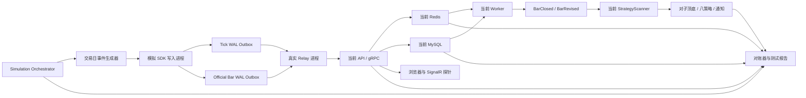

# A股交易时段模拟测试方案

> 项目：A股监控程序  
> 日期：2026-08-14  
> 状态：待开发、待执行  
> 目标：不依赖东方掘金实时回调，直接使用当前部署的 Redis、MySQL、API、Worker 和 StrategyScanner 模拟一个完整交易日，验证 Tick V3、官方 K 线、策略、对子顶底、消息推送和故障恢复链路。

## 1. 测试结论口径

本次不能只做“每秒发送多少条”的压力测试，而要同时回答四个问题：

1. **数据正确性**：Tick 是否去重、保序、及时过期；最新行情、成交量和官方 K 线是否正确。
2. **实时性能**：正常流量和开收盘突发流量下，延迟、队列、Redis、CPU、内存是否满足指标。
3. **业务可用性**：官方 BarClosed/BarRevised 是否能驱动对子顶底、八个策略和网页消息。
4. **故障恢复**：API、Redis、MySQL、Relay、Worker 或 StrategyScanner 中断后，系统是否按既定语义恢复。

正式结论分为：

- `PASS`：所有正式门槛通过；
- `PASS_WITH_LIMITATION`：正式门槛通过，但 50,000 Tick/秒拉伸目标未通过；
- `FAIL`：存在数据错误、正式容量不达标、故障后无法恢复或污染正式数据。

## 2. 当前模拟能力的不足

现有 `collector/astock_collector/simulator.py` 适合基础连通性检查，但不能承担本次验收：

- 使用协议 V2 单条 Tick，不走 V3 TickBatch；
- 直接调用 gRPC，绕过 SDK 写入进程、SQLite Outbox 和独立 Relay；
- 没有交易时段节奏、午间休市、开盘和收盘突发；
- 价格只做简单单向变化，缺少涨跌趋势、震荡、对子价和成交量结构；
- 不产生官方 5m、30m、60m、1d K 线；
- 不产生重复、乱序、延迟、过期、修订和断线场景；
- 没有 `run_id`、数据隔离、自动对账、延迟分位数和测试报告。

因此应保留旧模拟器用于冒烟测试，新增正式的 `Market Day Simulator V3`。

## 3. 当前环境直接测试架构

本轮不建立独立 Redis、MySQL、API、Worker 或 StrategyScanner。模拟数据直接经过当前服务，才能验证系统此刻的真实部署、配置、性能和运行状态。

| 组件 | 测试目标 |
|---|---|
| API HTTP | 当前 `127.0.0.1:5222` |
| gRPC | 当前 `127.0.0.1:7000` |
| Redis | 当前 `127.0.0.1:6379` |
| MySQL | 当前 `astock_monitor` Schema |
| Worker | 当前 `AStockMonitor.Worker` |
| StrategyScanner | 测试时启动当前服务，测试后按原状态恢复 |
| Outbox | `.runtime/simulation/{run_id}/outbox`，不与东方掘金采集 Outbox 共用文件 |

虽然不做物理隔离，仍必须实现可识别、可对账、可清理的逻辑边界：

- 每轮生成唯一 `run_id`；
- `source=market-day-simulator`；
- `worker_id=sim-{run_id}-NNN`；
- Tick、Bar 和业务事件的 `event_id` 必须包含 `sim:{run_id}`；
- 容量测试只使用 `LOAD.000001` 一类合成代码；
- 业务测试只使用 `SIM.000001` 一类专用证券代码，不修改真实股票行情；
- 测试前记录所有相关表、Redis Stream、Hash、水位和消费组基线；
- 测试结束按 `run_id + SIM./LOAD.` 精确清理，并再次对账正式证券数据没有变化。



容量和故障测试会直接影响当前运行服务，必须在收盘后执行。开始前暂停东方掘金实时采集计划任务，记录其原状态；测试完成后恢复原状态。20,000 Tick/秒和服务中断测试禁止在真实交易时段执行。

### 3.1 测试数据清理范围

清理程序必须先等待消费组和 Outbox 排空，再按外键依赖顺序处理，并在删除前导出本轮清单。至少覆盖：

- Redis V3 Stream 中 `event_id` 含本轮 `run_id` 的记录；
- Redis Latest/LatestMeta 中所有 `SIM./LOAD.` Field；
- Redis Watermark 中 `sim-{run_id}-*` 会话 Field；
- `md:v2:preview:1m` 下的模拟证券预览和累计状态；
- Bar、对子、策略和通知 Stream 中本轮事件；
- MySQL `kline_bar_5m`、`kline_bar_agg`、`kline_bar_daily` 中的模拟证券；
- `bar_event_outbox`、`bar_reconcile_log` 中的本轮事件；
- `pair_trend_live_event/hit`、`pair_trend_event_outbox` 和已处理事件记录；
- `strategy_signal_event`、`strategy_opportunity/detail`、`strategy_event_outbox`；
- `notification_task/change`；
- 为业务测试临时建立的 `SIM.` 证券主数据。

Redis Stream 清理前必须确认消息已经 ACK，避免留下消费组 PEL 悬空项。清理完成后，真实证券相关表的行数、最大更新时间和校验摘要必须与测试前基线一致。

## 4. 新增测试工具

### 4.1 Market Day Simulator V3

建议新增：

```text
collector/astock_collector/market_day_simulator.py
collector/astock_collector/simulation_profiles.py
collector/config/simulation-normal.json
collector/config/simulation-stress.json
```

必须支持：

- V3 TickBatch，使用与生产一致的 FNV-1a 64 分片；
- `direct-grpc` 和 `outbox-relay` 两种模式；
- 每次测试唯一 `run_id/session_id/worker_id/event_id`；
- 指定证券数、分区数、持续时间、时间倍率、平均速率和峰值速率；
- 可复现随机种子；
- 输出生产数、发送数、ACK 数、重复数、过期数、拒绝数和延迟分位数；
- 同时产生 Tick 和东方掘金语义一致的官方 5m、30m、60m、1d K 线；
- 支持确定性的对子顶部、对子底部和策略命中测试股票。

### 4.2 Simulation Orchestrator

建议新增：

```text
scripts/run-trading-session-simulation.ps1
scripts/stop-trading-session-simulation.ps1
scripts/inject-simulation-fault.ps1
```

职责：

1. 生成 `run_id`；
2. 记录 API、Worker、StrategyScanner、采集计划任务、Redis 和 MySQL 的原始状态；
3. 在非交易时段暂停东方掘金采集任务，保持当前 API、Worker、Redis、MySQL 运行；
4. 按测试需要启动当前 StrategyScanner；
5. 记录相关表、Redis Key、Stream、消费组和系统资源的测试前基线；
6. 启动模拟器、接口探针、SignalR 探针和资源采样器；
7. 按时间表执行经确认的故障注入；
8. 等待队列排空并执行自动对账；
9. 按 `run_id` 和模拟证券前缀精确清理 Tick、Bar、策略、对子和通知测试数据；
10. 恢复采集任务和各服务的原始运行状态；
11. 生成 Markdown 和 JSON 报告，并保存清理前后的对账证据。

### 4.3 自动对账器

建议新增：

```text
collector/scripts/verify_simulation_run.py
```

对账器读取当前 Redis/MySQL 中带有本轮 `run_id` 的数据，禁止通过运行日志推测正确性。它应核对：

- 产生、接受、重复、过期、拒绝之间的数量守恒；
- 每只股票最新行情是否等于最大 `event_time + worker_sequence`；
- Redis Stream 是否没有重复事件；
- Tick Outbox 是否已排空，官方 Bar 是否全部 ACK；
- MySQL 不存在 `quote_tick`；
- 官方 K 线数量、OHLC、成交量、成交额和修订号是否与生成器清单一致；
- Bar Event Outbox、策略事件、对子命中和通知投影是否与预期清单一致；
- 同一 `run_id` 重跑后没有新增重复业务事实。

## 5. 模拟交易日模型

### 5.1 证券池

分成两个数据集：

- **容量池**：100、1,000、5,000 只股票，用于吞吐和资源测试；
- **业务场景池**：20～50 只股票，使用确定性价格路径，用于 K 线、对子顶底、八策略和通知验收。

业务场景池应使用模拟数据库中已有历史 K 线作为前置窗口，或预先装载至少 60 个交易日的确定性历史数据，避免 EMA、ATR、趋势和成交量分位数因样本不足而失真。

### 5.2 日内时段

完整模拟以下阶段：

| 阶段 | 模拟市场时间 | 相对流量 |
|---|---|---:|
| 集合竞价观察 | 09:15～09:25 | 0.3x，可选 |
| 开盘突发 | 09:30～09:35 | 2.5x |
| 上午常态 | 09:35～11:25 | 1.0x |
| 上午收尾 | 11:25～11:30 | 1.5x |
| 午间休市 | 11:30～13:00 | 0，注入 Tick 应被单独标记 |
| 午后开盘 | 13:00～13:05 | 1.5x |
| 午后常态 | 13:05～14:55 | 0.9x |
| 收盘突发 | 14:55～15:00 | 2.5x |
| 收盘排空 | 15:00以后 | 0，等待 Bar、策略和消息处理完成 |

功能测试使用 10 倍时间压缩，240 分钟连续竞价压缩为约 24 分钟，再留 6～10 分钟排空，总时长约 35 分钟。

性能认证必须再执行一次墙钟对齐测试。压缩时钟只能验证状态转换、数量和恢复语义，不能作为 P95/P99 实时延迟的最终认证结果。

### 5.3 股票活跃度

不能让每只股票等频发送。建议：

- 10% 热门股贡献约 50% Tick；
- 30% 中等活跃股贡献约 35% Tick；
- 60% 低活跃股贡献约 15% Tick；
- 每分钟重新抽样少量热点，模拟热点轮动；
- 单只股票必须始终由同一分区写入，验证证券内顺序。

### 5.4 价格与成交量

至少包含以下价格路径：

- 平稳随机游走；
- 单边上涨、冲高回落；
- 单边下跌、探底回升；
- 区间震荡；
- 放量突破、缩量回踩；
- 价格触达 `.00/.11/.22/.33/.44/.55/.66/.77/.88/.99`；
- 明确构造 `14.88` 等上升阶段顶部和 `89.22` 等下降阶段底部；
- 涨跌停附近、零成交分钟和跨午休边界。

数据约束：

- 累计成交量、累计成交额只能增加；
- `last_volume/last_amount` 与累计差值一致；
- 买一小于等于卖一；
- OHLC 和成交量必须能从生成清单独立复算；
- 乱序 Tick 只改变其事件时间所属区间，不得覆盖更新事件时间更晚的最新行情。

### 5.5 官方 K 线

正式 5m、30m、60m、1d 仍由“官方 Bar 通道”注入，不能把 Tick 聚合结果当成正式事实。

一个完整交易日每只股票预期：

| 周期 | 数量 |
|---|---:|
| 5m | 48 |
| 30m | 8 |
| 60m | 4 |
| 1d | 1 |

官方 Bar 测试还应包含：

- 正常闭合；
- 完全重复发送；
- 同一 Bar 的后续修订；
- 先 Tick 预览、后官方确认；
- 官方 Bar 延迟 1～30 秒；
- 少量 Bar 暂时缺失，随后由补数服务补齐。

## 6. 流量测试矩阵

| 场景 | 股票数 | 平均 Tick/s | 峰值 Tick/s | 时长 | 目的 |
|---|---:|---:|---:|---:|---|
| S0 冒烟 | 20 | 50 | 100 | 3分钟 | 连通、查询、基本对账 |
| S1 当前灰度 | 100 | 200 | 500 | 10分钟 | 对应当前2分区运行规模 |
| S2 当前授权规模 | 1,000 | 1,000 | 3,000 | 30分钟 | 验证20分区附近运行状态 |
| S3 全市场模型 | 5,000 | 5,000 | 20,000 | 30分钟 | 正式设计容量验收 |
| S4 持续容量 | 5,000 | 20,000 | 20,000 | 30分钟 | Tick V3正式吞吐门槛 |
| S5 拉伸 | 5,000 | 20,000 | 50,000 | 峰值2分钟 | 发现极限，不作为当前上线阻断项 |

实际市场速率应在获得完整真实交易日样本后校准。以上是系统容量测试档位，不声称等于东方掘金真实逐秒分布。

## 7. 异常数据场景

每轮正常流量中混入可精确对账的异常：

| 异常 | 建议比例/数量 | 预期 |
|---|---:|---|
| 完全重复 Tick | 0.5% | Redis Stream 不重复追加 |
| 同事件不同到达顺序 | 0.2% | 最新行情不被旧事件覆盖 |
| 0～2秒网络抖动 | 2% | 正常接受，延迟指标可见 |
| 30～119秒延迟 | 固定100条 | 仍在窗口内，按事件顺序处理 |
| 超过120秒 | 固定100条 | 标记 expired，不进入实时流 |
| 非法股票/空 event_id | 固定20条 | rejected，不无限重试 |
| 午间 Tick | 固定20条 | 记录异常，不生成正式 Bar |
| 重复官方 Bar | 每周期固定2条 | MySQL 和业务事件保持幂等 |
| 官方 Bar 修订 | 每周期固定2条 | 产生 BarRevised，revision递增 |

## 8. 故障注入计划

故障会作用于当前服务，只允许在非交易时段、完成数据服务备份并确认恢复命令后执行。S0～S4正确性和容量测试通过前，不执行服务中断。

| 编号 | 故障 | 持续时间 | 预期结果 |
|---|---|---:|---|
| F1 | 停止当前 API/gRPC | 30秒 | Tick进入短时Outbox，恢复后新鲜Tick排空 |
| F2 | 停止当前 Redis | 30秒 | 服务端不ACK；恢复后序号水位去重 |
| F3 | 终止单个 Relay | 20秒 | SDK写入不停；Supervisor只重启该Relay |
| F4 | 终止单个 SDK模拟进程 | 20秒 | Relay排空已有数据；其他分区不受影响 |
| F5 | 停止当前 Worker | 2分钟 | Tick Stream保留；恢复后消费组追平 |
| F6 | 停止当前 StrategyScanner | 2分钟 | Bar事件保留；恢复后策略和对子继续消费 |
| F7 | 停止当前 MySQL | 30秒 | 官方Bar不丢失，Outbox保持待确认并最终补写 |
| F8 | 制造一个Redis分片延迟 | 60秒 | 仅该分片变慢，其他63分片继续处理 |
| F9 | Relay收到ACK后、SQLite确认前终止 | 1次 | 重试由Redis水位判重，不重复追加 |
| F10 | 服务整体停止超过120秒 | 150秒 | 旧Tick过期；官方Bar最终全部固化 |

每个故障场景单独执行，避免多个故障重叠后无法判断根因。完成单故障验收后，再增加一次 F1+F2 的组合灾难演练。

## 9. 业务链路验收

### 9.1 Tick 与查询

- 单股最新行情等于生成器预期最终值；
- 500股批量接口返回数量、缺失列表和最新值正确；
- 最近 Tick 接口明确保持进程内短窗口语义；
- API 重启后最新行情可从 Redis 恢复；
- MySQL 始终没有 Tick 表和 Tick 新增记录。

### 9.2 K 线与事件

- 每只股票四周期数量与生成清单一致；
- OHLC、成交量、成交额逐根精确一致；
- BarClosed 只产生一次；
- 官方修订只产生一次 BarRevised，修订号递增；
- `bar_event_outbox` 最终无长期 Pending/DeadLetter；
- 缺失 K 线补数执行后完整，重复执行不新增重复事实。

### 9.3 对子顶底

准备确定性股票：

- 上涨路径分别在 5m、30m、60m、1d 触达对子价，预期分类为顶部候选；
- 下跌路径分别触达对子价，预期分类为底部候选；
- 包含 `.00`；
- 同一股票跨周期命中时更新同一业务记录并补全周期信息；
- BarRevised 后旧命中应修订或撤销，不得保留互相矛盾的结果；
- 对子详情接口和分页接口与数据库记录一致。

### 9.4 八个策略与消息

- 为每个策略至少准备 1 个必命中和 1 个必不命中的确定性标的；
- 同一 BarClosed 重放不产生重复策略机会；
- BarRevised 能产生正确的 strengthened/weakened/revised 状态；
- 策略卡片和对子卡片经 SignalR 到达浏览器探针；
- 数据库事件、Redis消息、SignalR消息和前端卡片可用同一事件ID关联。

## 10. 性能验收门槛

### 10.1 正式门槛

| 指标 | 通过标准 |
|---|---:|
| 生成器写入时刻 → Redis ACK P95 | <100ms |
| 生成器写入时刻 → Redis ACK P99 | <300ms |
| Redis Lua批量写 P99 | <50ms |
| 正常Outbox最旧Tick P99 | <2秒 |
| Relay心跳最大年龄 | <10秒 |
| 单股最新行情API P95 | <20ms |
| 500股批量行情API P95 | <100ms |
| Bar事件 → 对子/事件策略 P95 | <2秒 |
| 业务事件 → SignalR探针 P95 | <1秒 |
| 持续吞吐 | 20,000 Tick/秒，30分钟 |
| 稳态重复追加率 | 0 |
| 稳态旧Tick过期率 | 0 |
| MySQL Tick新增量 | 0 |

### 10.2 资源门槛

- API、Worker、StrategyScanner 和 Relay 不持续 CrashLoop；
- 进程 CPU 连续5分钟不高于可用总核的80%；
- 进入稳态后内存不能持续单调增长；
- Redis 内存低于配置上限的70%，Stream 长度受限；
- MySQL 连接池无耗尽，Bar Outbox 能持续下降；
- 任一慢分片不能拖停其他分片。

50,000 Tick/秒属于拉伸指标。根据当前隔离压测约 25,000～27,000 Tick/秒的结果，S5 可能不通过；这不会否定 20,000 Tick/秒正式目标，但报告必须明确瓶颈位置。

## 11. 自动停止条件

发生以下任一情况立即停止发送并保留现场：

- 任一生成事件缺少当前 `run_id`，或使用了非 `SIM./LOAD.` 的真实证券代码；
- 当前 MySQL 出现 `quote_tick` 表或任何 Tick 持久化；
- 真实证券代码的行情、K线、策略、对子或通知基线发生非预期变化；
- Redis 内存超过上限80%；
- Outbox 使用率超过90%，或最旧 Tick 超过30秒持续2分钟；
- rejected/error 超过1%且不属于预置异常；
- 任一服务连续重启3次；
- CPU持续5分钟超过95%或系统可用内存低于10%；
- 官方 Bar 出现不可解释的数据丢失或重复业务事实。

## 12. 执行顺序

### 阶段0：开发测试工具

开发 V3 模拟器、隔离环境、故障注入器、接口/SignalR探针和自动对账器。先用单元测试验证固定随机种子可复现。

### 阶段1：S0冒烟

20只股票、3分钟，不注入故障。通过后检查 Redis、MySQL、API、K线、对子、策略和网页消息。

### 阶段2：业务确定性回放

20～50只场景股票，完整压缩交易日。先验证数量和算法结果，不追求吞吐。

### 阶段3：S1/S2规模递增

依次运行100和1,000只股票；每档结束后排空、对账，再进入下一档。

### 阶段4：S3/S4容量验收

5,000只股票，先验证开收盘20,000 Tick/秒峰值，再执行20,000 Tick/秒持续30分钟。

### 阶段5：故障注入

在S2或S3流量下逐项执行F1～F10，记录检测时间、恢复时间、丢失、重复和过期数量。

### 阶段6：S5拉伸

短时升到50,000 Tick/秒，定位 CPU、gRPC、Redis Lua、分片热点或客户端调度瓶颈；达到自动停止条件立即终止。

### 阶段7：墙钟影子测试

选择一个真实交易日，以墙钟时间运行至少一个完整上午或下午，使用模拟数据但保持事件时间、接收时间和现实时间一致。该阶段用于最终认证P95/P99和告警时效。

## 13. 测试报告

每次运行输出：

```text
.artifacts/simulation/{run_id}/manifest.json
.artifacts/simulation/{run_id}/generator-summary.json
.artifacts/simulation/{run_id}/reconciliation.json
.artifacts/simulation/{run_id}/fault-timeline.json
.artifacts/simulation/{run_id}/metrics.csv
.artifacts/simulation/{run_id}/report.md
```

报告至少包含：

- 代码版本、配置、随机种子和机器规格；
- 各阶段发送速率、ACK、重复、过期、拒绝和队列变化；
- P50/P95/P99/最大延迟；
- CPU、内存、Redis、MySQL和磁盘曲线；
- Tick、K线、对子、策略和消息的自动对账结果；
- 每次故障的发现时间、恢复时间和数据影响；
- Grafana关键面板快照和Loki错误摘要；
- PASS/FAIL及阻断问题清单。

## 14. 本轮开发边界

本次模拟测试只产生行情和业务信号，不接入账户、委托、成交或任何自动交易接口。所有事件源统一标记为 `market-day-simulator`。模拟数据允许暂时进入当前 Redis 和 MySQL，但必须仅使用 `SIM./LOAD.` 证券代码和本轮 `run_id`，测试后自动清理；不得修改真实证券数据，也不得进入东方掘金终端。
