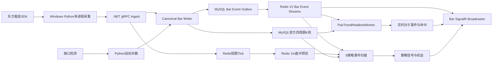
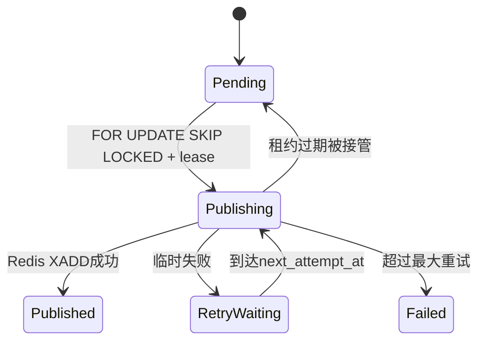
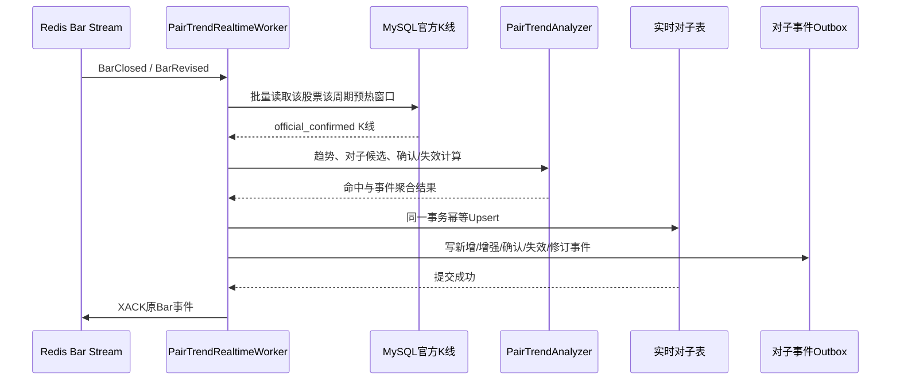
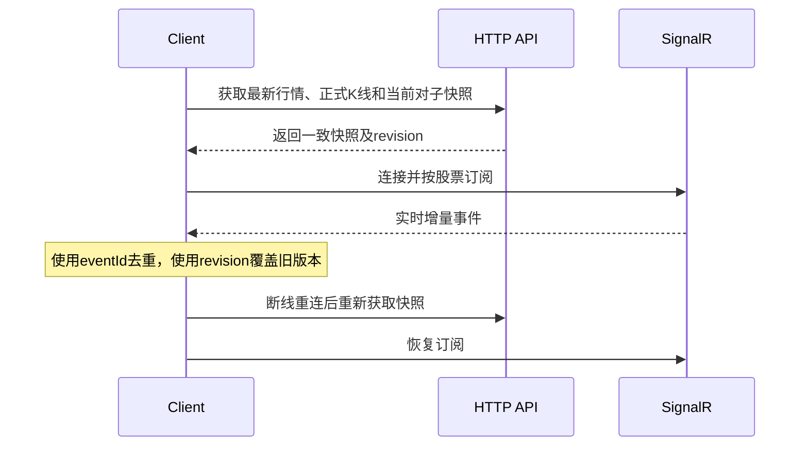

# A股监控程序：V2 架构问题整改方案

> 方案日期：2026-08-13  
> 方案状态：待执行  
> 适用范围：行情采集、官方 K 线、事件总线、对子顶底、8 策略、缺口补数、API/SignalR、运行监控与 Windows 部署。  
> 实施原则：东方掘金 SDK 只负责行情；MySQL 只保存正式四周期 K 线和业务事实；Redis 保存短期实时状态和事件；不恢复 MySQL Tick，不执行交易。

## 1. 整改结论

当前系统的数据存储方向正确，但实时链路尚未闭环。整改按以下顺序进行：

1. 完成当前 60 日回填并冻结数据基线；
2. 统一 V2 K 线事件 Stream、消息契约和可靠发布；
3. 实现盘中对子顶底实时扫描；
4. 增加不落 MySQL 的 1 分钟盘中预览，恢复 Fast 策略输入；
5. 修正沪深 A 股股票池和历史状态语义；
6. 补齐缺口检测四类调度和自动补数守护；
7. 批量化策略数据读取，消除全市场 N+1 查询；
8. 补齐 Bar 与对子 SignalR 推送；
9. 安装并守护 API、Worker、StrategyScanner 和 Python Recovery；
10. 完成连续交易日影子运行、故障演练和容量验收。

整改后的主链：



## 2. 问题与整改映射

| 编号 | 优先级 | 当前问题 | 整改模块 | 完成标准 |
|---|---|---|---|---|
| R01 | P0 | Worker 发布 `md:v2:bar:event`，Scanner 监听 V1 Stream | 事件总线 | 所有生产者和消费者只使用同一 V2 前缀 |
| R02 | P0 | Outbox JSON 与 `MarketBarEvent` 结构不一致 | 事件契约 | 同一契约完成序列化往返和端到端消费 |
| R03 | P0 | 没有盘中对子实时消费者 | 对子服务 | 四周期关闭/修订后自动新增或更新记录 |
| R04 | P0 | API、Worker、Scanner 未安装运行 | 部署 | Windows 服务自动启动，异常退出自动恢复 |
| R05 | P0 | Production 下 Tick 可靠接入可能关闭 | 配置 | 启动自检失败即拒绝启动，不允许静默降级 |
| R06 | P1 | Fast 策略没有 1m 输入 | 盘中预览 | Redis 提供当日 1m 预览，MySQL 不新增 1m |
| R07 | P1 | 股票池混入 B 股 | 股票池 | 目标池只有沪深 A 股、非 ST、非北交所 |
| R08 | P1 | 历史状态回退为当前快照 | 股票池 | 状态来源和质量可追踪，不再静默伪装历史状态 |
| R09 | P1 | SignalR 只推 Tick | API | 推送 Quote、Bar 和对子生命周期事件 |
| R10 | P1 | 全市场策略存在 N+1 查询 | 策略数据层 | 批量查询，扫描耗时小于调度周期 |
| R11 | P1 | Outbox 多实例可能重复发布 | 可靠事件 | 租约领取、幂等发布、失败可恢复 |
| R12 | P1 | 单个 Redis 分片异常可能静默停止 | 消费监督 | 每分片独立重启并暴露最后成功时间 |
| R13 | P1 | 30秒盘中缺口配置未落地 | 补数调度 | 边界、滚动、收盘、启动四类扫描可见可控 |
| R14 | P2 | 最近 Tick 分片查询可能被其他股票截断 | 查询层 | 指定股票返回完整短窗口或明确不完整标志 |
| R15 | P2 | Ready 健康检查总是偏乐观 | 运维 | Redis/MySQL/采集/事件Lag均进入就绪判定 |
| R16 | P2 | V1 配置、文档和指标残留 | 清理 | 代码、配置、Grafana、文档只保留 V2 语义 |

## 3. 前置保护：完成回填与建立基线

当前 60 日、5m/30m/60m/1d、4 进程回填正在执行。整改前先完成：

1. 等待回填批次进入 `complete` 或 `partial` 终态；
2. 统计四周期行数、股票数、最早/最晚日期；
3. 检查唯一键重复、OHLC、量额、交易时段和官方来源；
4. 保存 `bar_ingest_batch`、`bar_ingest_checkpoint` 和质量运行结果；
5. 备份数据库结构，不复制或删除已有 K 线；
6. 回填完成前不执行会重建 `kline_bar_5m`、`kline_bar_agg` 的 DDL。

前置门禁：

- 回填错误项全部有明确状态；
- MySQL 中不存在 Tick 表；
- 现有正式 K 线数量不因整改迁移减少；
- Redis/MySQL 保持健康。

## 4. 工作包 A：统一 V2 Bar 事件总线

### 4.1 唯一 Stream 约定

统一使用：

```text
md:v2:bar:event:00..15
```

三个独立消费组：

```text
strategy-scanner-v2
pair-trend-realtime-v2
market-api-signalr-v2
```

`RealtimeBars.ReliableEventStreamKeyPrefix` 不再参与正式 V2 路径。所有组件从 `Market:BarEventV2KeyPrefix` 读取同一配置，启动时校验分片数和前缀。

### 4.2 唯一事件契约

在 `AStockMonitor.Contracts` 定义 `BarLifecycleEventV2`，禁止生产者使用匿名对象拼装正式事件。

```json
{
  "schemaVersion": 2,
  "eventId": "sha256:...",
  "eventType": "BarClosed",
  "symbol": "SHSE.600000",
  "frequency": "5m",
  "tradingDate": "2026-08-13",
  "bob": "2026-08-13T09:30:00+08:00",
  "eob": "2026-08-13T09:35:00+08:00",
  "revision": 0,
  "rowHash": "...",
  "source": "dongcai-gm",
  "sourceUpdatedAt": "2026-08-13T09:35:01+08:00",
  "officialConfirmed": true,
  "collectionMode": "live",
  "recoveryRunId": null,
  "occurredAt": "2026-08-13T09:35:02+08:00",
  "bar": {
    "open": 10.10,
    "high": 10.22,
    "low": 10.08,
    "close": 10.20,
    "preClose": 10.00,
    "volume": 123400,
    "amount": 1258000.00
  }
}
```

事件规则：

- `BarUpdated`：未闭合预览，只走 Redis Pub/Sub 或最新状态键，不进入可靠 Outbox；
- `BarClosed`：正式 K 线首次落库，与 Outbox 在同一 MySQL 事务提交；
- `BarRevised`：同槽位内容发生变化、revision 增加后提交；
- 相同 `rowHash`：只推进 checkpoint，不产生重复事件；
- `eventId` 包含 `symbol + frequency + eob + revision + rowHash`；
- 消费者使用 `eventId` 去重，使用 `symbol + frequency + eob + revision` 覆盖版本。

### 4.3 Outbox 多实例领取

下一号数据库迁移扩展 `bar_event_outbox`：

```text
lease_owner
lease_expires_at
stream_id
next_attempt_at
```

领取流程：



发布成功后保存 Redis `stream_id`。已发布记录按保留策略归档或清理，Redis Bar Stream 按消费组最小水位和保留天数裁剪，不能无限增长。

### 4.4 配置保护

增加启动校验：

- API 在实时模式下必须 `DurableIngestEnabled=true`；
- API、Worker、StrategyScanner 的 Redis 连接、V2 前缀、分片数必须一致；
- `TickMySqlPersistenceEnabled` 必须为 false；
- 正式 K 线周期只能是 `5m/30m/60m/1d`；
- 配置不符合时进程启动失败并写出清晰错误，不允许静默运行。

由于当前服务尚未正式部署，不进行长期 V1/V2 双写。切换前确认旧 Stream 无有效 Pending，随后一次性切换消费者。

## 5. 工作包 B：盘中对子顶底实时服务

### 5.1 服务归属

在 `AStockMonitor.StrategyScanner` 新增独立 `PairTrendRealtimeWorker`。它与 8 策略共享进程和基础设施，但使用独立消费组、独立仓储和独立监控，互不确认对方消息。

### 5.2 实时处理流程



正式消费规则：

- 四周期 `5m/30m/60m/1d` 全部消费；
- `BarClosed` 计算新候选并推进已有候选确认状态；
- `BarRevised` 从受影响 K 线前的预热窗口重新计算；
- 只使用 `official_confirmed=true` 的正式 K 线；
- `BarUpdated` 最多产生临时预览，不写正式对子记录；
- MySQL 事务成功后才能 XACK；
- Pending 由 `XAUTOCLAIM` 接管。

### 5.3 实时表模型

保留现有 `pair_trend_event/hit` 作为历史回测证据，新增实时表，避免把长期实时数据伪装成一次 backtest run：

```text
pair_trend_live_event
pair_trend_live_hit
pair_trend_event_outbox
pair_trend_consumer_checkpoint
```

`pair_trend_live_hit` 的业务唯一键：

```text
symbol + frequency + eob + pivot_type + algorithm_version
```

修订时更新同一命中行的 `source_revision/source_row_hash/status`，不新增重复命中。若修订后不再满足对子条件，将原命中标记为 `RETRACTED`，再重算所属事件。

`pair_trend_live_event` 更新规则：

- 同股票、同顶底方向、相邻命中间隔不超过配置窗口时更新同一事件；
- 新周期命中更新 `frequencies/timeframe_mask/confluence_count`；
- 更新 `latest_pair_price`、`last_seen_at`、命中数和评分；
- 任一命中确认时事件进入 `CONFIRMED`；
- 全部命中失效或撤回时事件进入 `INVALIDATED`；
- 新增 `event_revision`，每次业务内容变化递增；
- 使用 `SELECT ... FOR UPDATE` 保证同股票并发事件串行更新。

### 5.4 分片监督

每个 Redis 分片由独立循环监督：

- 单分片异常只重启该分片；
- 记录 `last_message_id`、`last_success_at`、Pending、Lag 和失败原因；
- 主进程不能因为其他 15 个分片仍在运行而掩盖一个分片死亡；
- 同一股票按稳定哈希进入同一分片，保证自然有序。

## 6. 工作包 C：Redis 1分钟盘中预览

不恢复正式 1m K 线，也不写 MySQL。新增 `IntradayPreviewWorker` 消费 Tick Stream：

```text
Tick → 当日1m预览 → Redis → Fast策略
```

建议键：

```text
md:v2:preview:1m:active:{tradingDate}:{symbol}
md:v2:preview:1m:closed:{tradingDate}:{symbol}
md:v2:preview:1m:updated
```

规则：

- 只聚合 1m，用于 VWAP、最近5分钟涨幅、量能加速等盘中指标；
- Redis 保留当日，TTL 36～72 小时；
- 明确标记 `officialConfirmed=false`、`source=derived-tick-preview-v2`；
- 服务重启后只从仍在 Tick 短期窗口内的数据恢复，不能伪造全天 1m；
- 预览覆盖不足时 Fast 策略返回 `DataNotReady`，不生成错误信号；
- 5m/30m/60m/1d 正式事实仍全部来自 SDK。

## 7. 工作包 D：修正沪深 A 股股票池

### 7.1 证券范围

优先使用 SDK 的证券子类型、市场和币种字段过滤；代码规则只作为保护性兜底：

- 保留沪深人民币普通股票；
- 排除 `SHSE.900xxx`、`SZSE.200xxx` B 股；
- 排除北交所、基金、债券、指数、存托凭证等非目标证券；
- 排除当日 ST；
- 已上市且当日有效；
- 停牌股票保留证券身份，但当日不生成预期 K 线槽位。

### 7.2 历史状态质量

`instrument_daily_status` 增加或明确：

```text
status_source
status_quality: authoritative | inferred | degraded
is_a_share
exclusion_reason
```

历史接口不可用时：

1. 不允许把当前快照静默写成历史权威状态；
2. 可以利用上市/退市日期推断证券有效性，但标记 `inferred`；
3. 无法确认历史 ST 时标记 `degraded`；
4. 正式历史回测默认只用 `authoritative/inferred`，是否允许 degraded 必须显式配置；
5. 质量报告列出被排除和降级的交易日/股票数量。

对已回填数据执行一次范围审计。发现 B 股数据时先停止后续新增；物理清理另建可回滚任务，不与事件链整改混在同一迁移中。

## 8. 工作包 E：策略数据读取性能整改

### 8.1 取消逐股票 N+1

新增 `StrategyMarketSnapshotProvider`：

- Redis Pipeline 批量读取最新行情；
- MySQL 按股票批次读取 30m 和日线；
- 日线技术特征按交易日缓存；
- 事件扫描只加载事件涉及的股票；
- 定时全市场扫描作为兜底，并设置不重入租约。

建议批次：每批 100～300 只股票，按压测校准。

### 8.2 调度约束

- Fast：读取 Tick 最新值和 1m Redis 预览，不逐股票查询 MySQL；
- Observe：批量加载日线特征，目标在下一周期前完成；
- Event：只扫描 Bar 事件涉及股票；
- 同 profile 上一轮未完成时不启动下一轮；
- 每轮记录请求数、缓存命中率、MySQL 查询数、耗时和失败股票。

初始验收目标：

- Fast 全市场扫描 P95 小于 45 秒；
- Observe 全市场扫描 P95 小于 240 秒；
- 单股票事件扫描 P95 小于 1 秒；
- 不出现每只股票两次以上独立 MySQL 查询的 N+1 模式。

## 9. 工作包 F：SignalR 实时消息

新增 `BarEventBroadcaster` 和 `PairTrendEventBroadcaster`，使用各自独立 Redis Consumer Group。

统一消息：

```text
QuoteUpdated
BarUpdated
BarClosed
BarRevised
PairTrendCandidate
PairTrendConfirmed
PairTrendInvalidated
PairTrendRevised
```

客户端恢复规则：



SignalR 不承担历史重放；服务内部可靠消费完成后再推送。前端即使错过消息，也能通过 HTTP 快照恢复。

## 10. 工作包 G：缺口检测与自动补数

`MarketGapScanWorker` 实现四类调度：

| 类型 | 触发 | 范围 |
|---|---|---|
| boundary | 每30秒 | 最近刚闭合且超过宽限的槽位 |
| rolling | 每5分钟 | 当日最近一段时间 |
| daily-close | 15:10及日线可用后 | 当日四周期完整对账 |
| startup | Worker启动后 | 最近若干交易日与未完成任务 |

Python Recovery Worker 作为 Windows 后台任务或服务守护，按盘中/盘后并发上限领取任务：

- 使用 `FOR UPDATE SKIP LOCKED`；
- 每批最多20只股票调用 SDK；
- 超过 60 自然日的分钟缺口进入 `source_expired`；
- 写入正式 K 线和事件必须复用统一 Canonical 写入语义；
- 补数完成后发布 `BarClosed/BarRevised`，对子和策略自然重算；
- 不补 Tick、不补正式 1m。

## 11. 工作包 H：查询与保留策略

### 11.1 最近 Tick

当前共享分片先限量再过滤股票可能返回不完整结果。二选一实施：

1. 推荐：Redis 额外维护每股票短期 Tick Stream/List，设置严格长度和 TTL；
2. 备选：在共享 Stream 中持续分页，直到满足数量或到达时间边界。

响应必须返回：

```text
storage=redis
retentionMinutes
complete=false
oldestAvailableAt
```

### 11.2 Stream 与 Outbox 保留

- Tick Stream：正常30分钟、硬上限2小时，不能因无消费者而无限增长；
- Bar Event Stream：按所有有效消费组最小确认水位裁剪，并保留故障恢复余量；
- 已发布 Bar Outbox：保留至少90天或按年度归档策略处理；
- Failed Outbox：不自动删除，支持分页查询和人工重试；
- 删除过期消费组前先确认它不再属于生产部署。

## 12. 工作包 I：健康检查、监控和部署

### 12.1 就绪检查

`/health/live` 只表示进程存活；`/health/ready` 至少检查：

- MySQL 可连接；
- Redis 可连接；
- 交易时段至少有预期数量的采集进程连接；
- 最新 Tick 年龄；
- 四周期官方 K 线延迟；
- Bar Outbox 最老 Pending；
- 三个 Bar 消费组 Lag/Pending；
- Python Recovery 最后心跳；
- 股票池最近成功日期。

非交易时段不能因没有新 Tick 判为故障，需要按交易日历切换规则。

### 12.2 Windows 服务

安装并设置自动启动：

```text
AStockMonitor.Api
AStockMonitor.Worker
AStockMonitor.StrategyScanner
Python Collector Supervisor
Python Market Recovery
```

要求：

- 服务账号有东方掘金终端、日志目录和本地 Outbox 权限；
- 失败后按退避策略自动重启；
- Production 配置与 Development 配置分离；
- Token 继续从忽略提交的本地配置读取；
- 密码不写入公开仓库；
- 启动顺序为 MySQL/Redis → API/Worker/Scanner → Python采集/补数；
- 停止顺序反向执行，先停止采集并排空 Outbox。

### 12.3 Grafana 告警

新增或校正：

- 单分片消费者停止；
- Stream 名称/消费组不存在；
- Outbox Pending 年龄与失败数；
- Tick 最新年龄；
- K 线闭合延迟；
- 对子扫描延迟和失败；
- 策略全市场扫描超时；
- 股票池出现 B 股或 degraded 状态突增；
- 补数任务积压与 `source_expired` 数量。

## 13. 代码与数据库修改清单

### .NET

- `AStockMonitor.Contracts`：新增唯一 `BarLifecycleEventV2`；
- `CanonicalBarWriter`：只通过契约工厂写 Outbox；
- `BarEventOutboxPublisherWorker`：租约领取、V2 Stream、stream_id、保留；
- `BarEventStrategyWorker`：改用 V2 契约和 V2 前缀；
- 新增 `PairTrendRealtimeWorker`、实时仓储、分片监督；
- 新增 `IntradayPreviewWorker` 和 1m Redis 预览读取；
- 新增 `BarEventBroadcaster`、`PairTrendEventBroadcaster`；
- `StrategyMarketDataReader`：改为批量快照提供器；
- `MarketGapScanWorker`：实现四类调度；
- `MarketHealthCheck`：拆分 live/ready 和依赖检查；
- `MarketOptions`：移除生产路径中的 V1 Bar 前缀，增加配置验证；
- `PairTrendsController`：增加实时事件、命中和状态分页接口。

### Python

- 股票池 Provider：严格 A 股过滤和状态质量标记；
- Recovery：复用统一事件契约或统一 Canonical 写入入口；
- Supervisor：暴露进程心跳、订阅数量、重启次数；
- 历史任务：不再下载 B 股，保留已完成检查点和幂等规则。

### 数据库

按独立迁移拆分，避免一次大迁移难以回滚：

1. Bar Outbox 租约、stream_id 和索引；
2. 实时对子 event/hit/outbox/checkpoint；
3. 股票池来源质量和 A 股标志；
4. 必要的消费审计与保留策略；
5. B 股历史数据清理另建 dry-run/归档任务，默认不立即删除。

## 14. 测试方案

### 14.1 单元测试

- V2 事件序列化、反序列化和版本拒绝；
- `eventId`、revision 和 rowHash 幂等；
- .00、.11～.99 的顶部和底部识别；
- `BarRevised` 后命中更新、撤回和事件重算；
- 1m 预览的午休、收盘、乱序和重复 Tick；
- A/B 股、ST、北交所和证券类型过滤；
- 非交易时段健康检查。

### 14.2 集成测试

```text
Python OfficialBar
→ gRPC
→ MySQL K线 + Outbox
→ Redis V2 Stream
→ Pair/Strategy/SignalR三个消费组
→ MySQL业务结果
```

覆盖：

- 相同 Bar 重发100次；
- 内容修订只生成一个新 revision；
- Redis 在发布前后重启；
- Worker 在领取 Outbox 后被终止；
- 消费者事务提交前终止；
- 单个分片抛异常后自动恢复；
- MySQL不可用时不XACK；
- SignalR断线后通过HTTP快照恢复。

### 14.3 数据验收

- 四周期唯一键重复为0；
- B 股和北交所进入目标池数量为0；
- 官方来源、OHLC、量额错误为0或有隔离记录；
- 对子实时结果与同区间离线回放一致；
- Fast 策略只有在1m预览覆盖充足时运行；
- 补数前后的修订均能触发对子和策略重新计算。

### 14.4 容量与稳定性

- Tick 20,000条/秒持续30分钟；
- 5,000只股票四周期集中闭合；
- 三个 Bar 消费组并行消费；
- 30分钟停机后积压恢复；
- 连续至少3个完整交易日影子运行；
- Redis、MySQL、API、Worker、Scanner、Python分别重启一次。

## 15. 分阶段执行计划

| 阶段 | 工作内容 | 预估工作量 | 上线门禁 |
|---|---|---:|---|
| 0 | 完成回填、质量基线、备份 | 0.5～1天 | 回填终态且基线可复查 |
| 1 | V2事件契约、Stream统一、Outbox租约 | 1.5～2.5天 | 端到端集成测试通过 |
| 2 | 实时对子Worker、实时表、API | 2～4天 | 四周期实时结果与离线一致 |
| 3 | Redis 1m预览、Fast策略恢复 | 1.5～2.5天 | 不写MySQL且覆盖门禁正确 |
| 4 | A股股票池和历史状态质量 | 1～2天 | B股/北交所为0 |
| 5 | 策略批量读取、分片监督、SignalR | 2～3天 | 扫描耗时和Lag达标 |
| 6 | 四类缺口调度、Recovery守护 | 1～2天 | 模拟停机后自动补齐 |
| 7 | Windows服务、健康检查、Grafana | 1～2天 | 重启演练全部通过 |
| 8 | 3个交易日影子运行和容量验收 | 至少3个交易日 | 达到第16节标准后正式启用 |

阶段可开发并行，但正式切换必须遵循表中顺序。尤其是实时对子不能绕过事件契约直接读取临时 JSON。

## 16. 最终验收标准

### 数据

- MySQL 不存在 Tick 明细写入；
- 正式 K 线只有 5m/30m/60m/1d，权威来源为东方掘金 SDK；
- 四周期重复为0，修订可审计；
- 股票池只有目标沪深 A 股，历史状态质量可追踪；
- 对子同股票事件按规则更新，不重复堆积孤立记录。

### 实时

- 正常交易时段最新 Tick P99 年龄小于1秒；
- 5m `BarClosed` P99 在 EOB 后60秒内；
- 30/60m `BarClosed` P99 在 EOB 后120秒内；
- Bar 事件到对子结果 P95 小于2秒；
- 单股票事件策略 P95 小于1秒；
- 三个消费组 Lag 正常小于2秒且能收敛。

### 可靠性

- MySQL提交后的 Bar 事件最终必达；
- 每个消费者至少一次消费但业务结果幂等；
- 任一服务重启后自动恢复，不需要人工改数据库状态；
- 单个分片异常可以被发现并自动重启；
- Redis 丢失后可由 MySQL 和 SDK 重建实时投影；
- 断线客户端可通过 HTTP 快照和 revision 恢复一致状态。

### 运维

- API、Worker、StrategyScanner、Collector、Recovery 全部受 Windows 守护；
- `/health/ready` 能真实反映数据链路；
- Grafana 可以定位采集、Tick、官方K线、Outbox、消费组、补数、对子和策略故障；
- V1 Bar Stream、V1消费者和过时文档不再被生产使用。

## 17. 回滚策略

- 每阶段使用独立功能开关，不在一个版本同时切换全部消费者；
- 事件契约切换前保留 MySQL Outbox，失败时可以重新发布；
- 实时对子表独立于历史回测表，关闭实时 Worker 不影响历史结果；
- 1m 预览异常时仅暂停 Fast 策略，不影响 Tick 和官方 K 线；
- 股票池整改先报告差异，再停止错误新增，最后单独审批清理；
- 数据库迁移只增加字段/表，稳定观察结束前不物理删除可回滚数据；
- 已产生的修订和审计记录不回删。

## 18. 下一步开发目标

第一开发迭代只执行工作包 A：

1. 定义 `BarLifecycleEventV2`；
2. 统一 `md:v2:bar:event:00..15`；
3. 改造 Outbox Publisher 的租约和完整负载；
4. 改造 StrategyScanner 消费者；
5. 建立契约与端到端集成测试；
6. 加入 Production 配置启动自检。

工作包 A 验收通过后，再开始 `PairTrendRealtimeWorker`。这样可以先修复所有实时业务共同依赖的事件底座，避免对子和8策略各自形成第二套事件链。
