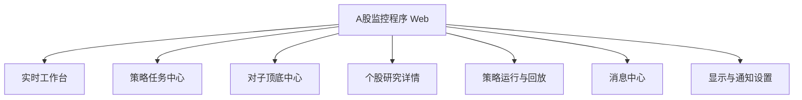
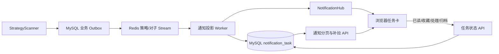
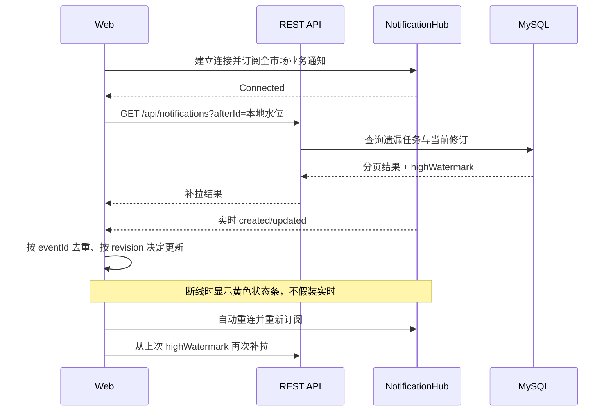
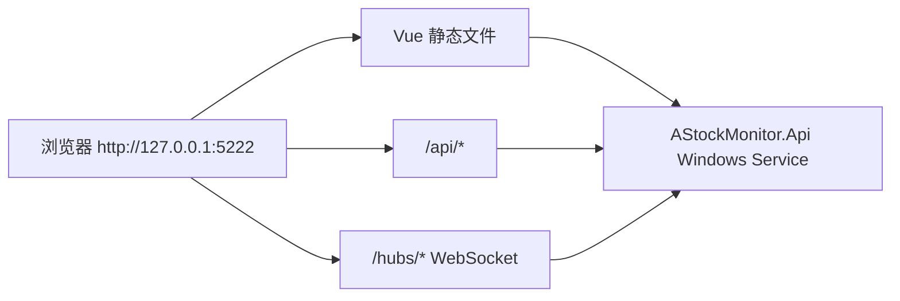

# A股监控程序：网页端建设方案

> 版本：V1.0  
> 日期：2026-08-14  
> 阶段：开发前方案  
> 系统边界：行情监控与研究信号展示，不连接交易账户、不提供下单功能。

## 1. 建设结论

网页端现在可以进入开发阶段，但一期不能只搭页面。应同时补齐一层“可靠任务通知投影”，使页面具备以下闭环：

1. 策略命中后，以可更新、可追踪、可处理的任务卡片实时进入浏览器；
2. 对子顶底按顶部/底部、5m/30m/60m/1d、`.00`/重复尾数和生命周期完整展示；
3. 页面刷新、浏览器重启和 SignalR 短暂断线后不漏消息；
4. 同一股票、同一业务事件发生加强、减弱、修订或失效时更新原卡片，不制造重复卡片；
5. 从任务卡片能够进入个股详情，联合查看四周期 K 线、策略命中和对子顶底标记；
6. 页面顶部仅保留连接状态和最近数据时间，深入排障继续使用现有 Grafana。

推荐把一期定义为“行情研究工作台”，而不是普通后台管理页面。

## 2. 当前后端能力评估

### 2.1 可以直接复用的能力

| 能力 | 当前接口/通道 | 网页用途 |
|---|---|---|
| 策略定义 | `GET /api/strategies` | 策略名称、扫描档位、启停状态 |
| 策略信号 | `GET /api/strategies/signals` | 信号历史、条件和价格依据 |
| 合并机会 | `GET /api/strategies/opportunities` | 策略任务卡片列表 |
| 机会详情 | `GET /api/strategies/opportunities/{id}` | 一只股票的多策略命中详情 |
| 策略运行/回放 | `scan-runs`、`replay-runs`、`replay-signals`、`calibrations` | 策略运行和历史验证页面 |
| 实时对子事件 | `GET /api/pair-trends/live/events` | 对子顶底主列表 |
| 实时对子命中 | `GET /api/pair-trends/live/hits` | 5m/30m/60m/1d 命中明细 |
| 对子消费者状态 | `GET /api/pair-trends/live/status` | 实时计算链路状态 |
| 历史对子数据 | `/api/pair-trends/events`、`hits`、`stats` | 历史查询与统计 |
| 四周期 K 线 | `/api/market/bars`、`latest` | 个股 K 线图 |
| 历史分区 | `/api/history/batches`、`partitions` | 回填进度与故障入口 |
| 缺口恢复 | `/api/market-data/gaps`、`recovery-runs` | 数据质量与补数状态 |
| 策略 SignalR | `/hubs/strategy` | 当前推送 `strategy.opportunity.changed` |
| 对子 SignalR | `/hubs/market` | 当前推送 `pairTrend.changed` 及生命周期事件 |

### 2.2 开发网页前必须补齐的问题

1. **现有 SignalR 是按股票代码订阅，单次最多 500 只。** 它适合个股详情和自选股，不适合接收全市场策略命中；A 股全市场任务收件箱需要独立的低频全局业务通知通道。
2. **SignalR 不是持久消息队列。** 当前 MySQL 已保存策略和对子业务事实，但没有“未读、收藏、已处理、归档”等网页任务状态，也没有统一补拉游标。
3. **当前实时载荷偏底层。** 策略消息是单策略信号，任务卡需要合并机会 ID、股票名称、机会层级和多策略摘要；对子推送也应带稳定事件 ID、修订号和股票名称。
4. **生命周期与用户操作状态需要分离。** `Strengthened/Weakened/Expired/Revised/Invalidated` 是算法状态；`Unread/Read/Handled/Starred/Archived` 是用户状态，不能混用一个字段。
5. **当前 API 未托管 SPA，也未配置跨域。** 推荐生产环境采用同源静态托管；开发环境由 Vite 代理 API 和 Hub，避免放开宽泛 CORS。

## 3. 技术选型

### 3.1 推荐栈

| 层次 | 选型 | 用途 |
|---|---|---|
| 基础框架 | Vue 3 + TypeScript + Composition API | 组件和强类型业务开发 |
| 构建工具 | Vite | 本地开发、构建和代理 |
| 路由 | Vue Router | 工作台页面路由 |
| UI 组件 | Ant Design Vue | 卡片、表格、抽屉、筛选器、分页、状态标签 |
| 服务端状态 | TanStack Vue Query | REST 查询缓存、失效刷新、分页和重试 |
| 客户端状态 | Pinia | 页面偏好、连接状态、筛选条件、临时交互状态 |
| 实时通信 | `@microsoft/signalr` | 策略、对子和系统通知 |
| 图表 | Apache ECharts | K 线、成交量、指标、命中标记和统计图 |
| API 类型 | OpenAPI 生成 TypeScript Client | 让 Swagger 契约成为前后端唯一类型来源 |
| 测试 | Vitest + Vue Test Utils + Playwright | 单元、组件和浏览器端到端测试 |

### 3.2 选择理由

- 当前是本机/内网业务 SPA，不需要 SSR，也不需要引入 Nuxt。
- Vue 3 + TypeScript 对任务卡、筛选表格和实时状态组合足够清晰。
- Vue Query 管理服务端数据；Pinia 只管理连接状态和本地偏好，避免将所有接口结果重复塞进全局 Store。
- 策略与对子消息量远小于 Tick，SignalR 首期使用 JSON 协议，便于排查；行情高频页面未来确有需要时再单独启用 MessagePack。
- 不把 Tick 流直接推给工作台。页面消费业务事件和按需 K 线，避免无意义的网络与渲染压力。

### 3.3 UI 风格：专业金融工作台

推荐采用“专业金融终端的信息密度 + 现代任务卡片”的风格，默认深色主题，同时保留浅色切换。它不是传统后台管理系统，也不采用大屏驾驶舱、霓虹科技风或大面积毛玻璃。

设计原则：

- **深色但不纯黑**：主背景使用深蓝灰，降低长时间盘中观察的视觉疲劳；
- **中高信息密度**：一屏看到足够多的策略任务，但通过层级和留白避免拥挤；
- **任务优先**：分数、方向、周期共振、生命周期和更新时间优先于装饰；
- **中国行情语义**：价格上涨用红、下跌用绿；对子顶部使用琥珀色标签，底部使用青蓝色标签，避免与涨跌色混淆；
- **颜色不是唯一信号**：顶部/底部、确认/失效必须同时使用文字、图标和形状；
- **数字稳定对齐**：价格、涨跌幅、分数使用等宽数字和 `tabular-nums`，实时更新时不左右跳动；
- **轻动效**：新任务淡入并短暂描边，高优先级任务只闪烁一次；禁止循环呼吸、跳动和无意义动画；
- **桌面优先**：首先适配 1440p 和 1080p 浏览器，移动端只保证查询，不承担完整盯盘工作。

建议视觉令牌：

| 用途 | 建议值 |
|---|---|
| 页面背景 | `#0B1220` |
| 面板背景 | `#111A2B` |
| 二级面板 | `#172236` |
| 主文字 | `#E7ECF4` |
| 次文字 | `#8FA0B8` |
| 边框 | `#26344A` |
| 上涨 | `#F04455` |
| 下跌 | `#19A974` |
| 对子顶部 | `#F0A43A` |
| 对子底部 | `#31B7D5` |
| Focus/高优先级 | `#7C6CF2` |

组件特征：8px 左右圆角、细边框、极轻阴影；任务卡通过左侧状态色条表达级别，不使用夸张渐变。字体使用 `Segoe UI + Microsoft YaHei`，数字区启用等宽数字。K 线与页面共用同一套涨跌和背景色。

## 4. 页面信息架构



### 4.1 实时工作台（首页）

首页用于回答四个问题：现在出现了什么、优先看什么、消息是否实时、连接是否正常。

建议布局：

- 顶部轻量状态条：SignalR 在线/重连/离线，以及最近一条业务数据时间；
- 左侧主区：实时策略任务卡片流；
- 右侧上方：最新对子顶底事件；
- 右侧下方：收藏任务和最近更新事件；
- 顶部快速筛选：股票、策略、机会层级、顶部/底部、周期、未读/收藏。

### 4.2 策略任务中心

支持卡片和紧凑表格两种视图。默认按“机会层级、最高分、最近更新时间”排序。

每张任务卡至少显示：

| 区域 | 字段 |
|---|---|
| 标题 | 股票名称、代码、机会层级 `Observe/Candidate/Focus` |
| 触发信息 | 主策略、命中策略数、动作、置信度、最高分 |
| 价格信息 | 命中价、止损参考、目标参考；明确标注仅供研究 |
| 时间信息 | 首次发现、最后更新、距现在时长 |
| 生命周期 | 新发现、重复、加强、减弱、修订、失效 |
| 数据依据 | 数据水位、所需周期是否齐全、条件摘要 |
| 用户状态 | 未读、收藏、已处理、归档 |

卡片操作：查看详情、收藏、标记已读、标记已处理、归档、加入自选观察。首期不提供任何交易按钮。

任务聚合规则：

- 聚合键使用 `交易日 + 股票代码`，直接对应现有 `strategy_opportunity`；
- 同一股票命中多个策略时更新同一任务卡，策略数和最高分同步变化；
- `latest_event_id` 和修订号用于幂等更新；
- 算法生命周期更新卡片内容，不覆盖用户的已读/收藏/处理状态；
- 任务跨交易日重新建立，不把昨日机会和今日机会混在一起。

### 4.3 对子顶底中心

主列表既提供卡片概览，也提供可分页表格。默认展示盘中实时事件，可切换历史回放结果。

展示内容：

- 股票名称和代码；
- 类型：`TOP` 顶部、`BOTTOM` 底部，必须同时显示文字和图标，不能只依靠颜色；
- 对子价格和种类：`.00`、`.11/.22/.../.99`；
- 命中周期：5m、30m、60m、1d；
- 最强周期、周期共振数、总命中数、已确认/待确认/失效/撤回数；
- 当前分数、趋势强度、首次发现、最后更新、确认时间；
- 生命周期：创建、更新、确认、修订、失效、撤回；
- 算法版本和源事件 ID，便于追溯。

筛选条件：股票、顶部/底部、周期、对子类型、状态、分数区间、日期范围、是否多周期共振。

点击事件打开详情抽屉：

1. 事件摘要和生命周期时间轴；
2. 按 5m/30m/60m/1d 分组的全部命中；
3. OHLC、成交量、EMA20/EMA60、ATR14、影线比例、量能分位；
4. K 线图上的命中点、确认点、修订点和失效点；
5. 算法判定原因、版本、数据水位与修订记录。

同一 `event_key` 的消息必须原位更新；`event_revision` 较旧的消息直接丢弃。

### 4.4 个股研究详情

这是策略任务和对子事件的统一落点：

- 股票基本信息、最新价和数据新鲜度；
- 5m/30m/60m/1d 四周期切换或联动 K 线；
- K 线上叠加策略命中、对子顶部/底部、确认/失效标记；
- 当日策略机会及全部规则详情；
- 对子事件与命中时间轴；
- 数据质量提示：缺失、修订、恢复中、官方数据未闭合；
- 最近扫描记录和来源水位。

K 线按视口分页加载，不一次下载完整 60 天的全市场分钟数据。

### 4.5 策略运行与回放

- 8 个策略的定义、版本、所需周期和启用状态；
- 实时扫描任务状态、处理股票数、命中数、耗时和错误；
- 历史回放任务、阈值校准和 D1/D3/D5/W1 结果；
- 策略横向对比图；
- 首期只读。后续若允许页面修改阈值，必须增加配置版本、操作审计和回滚，不能直接修改运行中配置文件。

### 4.6 消息中心与浏览器通知

统一容纳：策略任务、对子顶底、数据质量、分区失败、缺口恢复和系统故障。

- 页面内通知默认开启；
- 浏览器桌面通知、声音提示必须由用户主动授权并可按类型关闭；
- 相同任务短时间重复更新只更新计数和时间，不连续弹窗；
- 盘中可以开启“仅 Focus、仅多周期共振、仅故障”模式；
- 支持静默时段和一键清除已读，清除只改变用户状态，不删除业务事实。

## 5. 可靠实时消息设计

### 5.1 推荐链路



关键原则：MySQL 中现有策略/对子记录仍是业务事实；`notification_task` 是面向网页的可重建投影和用户操作状态，不反向驱动策略算法。

### 5.2 新增统一通知契约

建议新增 `/hubs/notifications`，统一事件名：

- `notification.task.created`
- `notification.task.updated`
- `notification.task.removed`（只表示从当前视图移除，不删除业务事实）
- `system.status.changed`

统一 DTO：

```json
{
  "schemaVersion": 1,
  "notificationId": 12345,
  "eventId": "sha256:...",
  "revision": 3,
  "taskKey": "strategy:20260814:SHSE.600000",
  "type": "strategy_opportunity",
  "symbol": "SHSE.600000",
  "symbolName": "浦发银行",
  "severity": "focus",
  "businessStatus": "strengthened",
  "userStatus": "unread",
  "occurredAt": "2026-08-14T10:35:00+08:00",
  "updatedAt": "2026-08-14T10:35:02+08:00",
  "payload": {}
}
```

`payload` 按任务类型扩展，但外层稳定字段不可随意变更。所有消息必须包含稳定 `eventId`、递增 `revision` 和 `schemaVersion`。

### 5.3 首次加载与断线恢复



前端水位可以保存在 `localStorage`，但它只用于优化补拉；权威任务和用户状态仍在 MySQL。

### 5.4 防堆积和防页面卡顿

- Hub 只发送策略、对子和状态变化，不发送全市场 Tick；
- 策略按 `交易日 + 股票` 合并，对子按 `event_key` 合并；
- 前端 100～250ms 批量合并消息后再更新界面；
- 活跃卡片列表设置上限，完整历史通过服务端分页查询；
- 长列表使用虚拟滚动；
- 旧 `revision`、重复 `eventId` 直接丢弃；
- SignalR 断线期间由 REST 补拉，不在浏览器内建立无限内存队列；
- 服务端导出通知投影延迟、Hub 发送量、发送失败数和连接数指标。

## 6. 后端配套改造

### 6.1 数据表

建议新增 `notification_task`：

| 字段 | 说明 |
|---|---|
| `id` | 单调递增补拉水位 |
| `task_key` | 业务聚合键，唯一 |
| `task_type` | `strategy_opportunity/pair_trend/system_alert/data_quality` |
| `source_id` | 原业务记录 ID 或 event_key |
| `symbol/symbol_name` | 股票标识 |
| `severity` | 排序级别 |
| `business_status` | 算法或系统生命周期 |
| `revision` | 原位更新版本 |
| `latest_event_id` | 幂等键 |
| `title/summary/payload_json` | 卡片投影 |
| `is_read/is_starred/user_status` | 用户操作状态 |
| `first_seen_at/last_seen_at` | 首次与最后发现 |
| `read_at/handled_at/archived_at` | 操作时间 |
| `created_at/updated_at` | 审计时间 |

唯一约束：`UNIQUE(task_key)`、`UNIQUE(latest_event_id)`；列表索引覆盖 `task_type + user_status + last_seen_at`、`symbol + last_seen_at`。

项目当前为单人本机使用，首期无需用户表。若未来开放多用户，再把用户状态拆到 `notification_user_state`。

### 6.2 REST API

新增：

- `GET /api/notifications`：分页、筛选和 `afterId` 补拉；
- `GET /api/notifications/{id}`：任务详情；
- `PATCH /api/notifications/{id}/state`：已读、收藏、处理、归档；
- `POST /api/notifications/read-all`：按当前筛选批量已读；
- `GET /api/dashboard/summary`：首页一次请求所需的计数和数据新鲜度；
- `GET /api/instruments/search`：按代码/名称搜索股票；
- `GET /api/instruments/{symbol}/overview`：个股头部摘要。

现有接口建议增强：

- 策略机会列表补充 `symbolName`、主策略名称、最新动作、置信度和价格摘要；
- 对子事件接口增加 `pairKind` 等枚举说明，避免前端猜测字符串；
- 所有分页响应统一 `page/pageSize/total/totalPages/items`；
- 所有时间明确为北京时间偏移或统一 UTC，并在前端格式化为 `Asia/Shanghai`；
- OpenAPI 为 DTO 枚举、字段和示例补全中文注释。

### 6.3 SignalR

- 保留 `/hubs/strategy` 和 `/hubs/market`，继续服务个股、自选和未来行情页；
- 新增低频 `/hubs/notifications`，提供全市场业务任务组；
- 重连后必须重新加入组；
- 不使用 `Clients.All` 推送 Tick 或 K 线；
- 投影成功写 MySQL 后再推送，确保浏览器收到的任务可通过 REST 查回；
- 投影或 Hub 暂时失败时保留 Redis Pending，并暴露消费延迟指标。

## 7. 前端代码结构

```text
web/
  src/
    api/                 # OpenAPI 生成客户端与请求拦截
    realtime/            # SignalR 连接、重连、订阅、去重、水位
    stores/              # Pinia：连接、偏好、筛选
    queries/             # Vue Query 查询定义
    components/
      task-card/
      pair-trend/
      kline-chart/
      system-status/
    pages/
      dashboard/
      strategy-tasks/
      pair-trends/
      stock-detail/
      strategy-replay/
      data-health/
      messages/
      settings/
    router/
    types/
    utils/
  tests/
```

重要边界：组件不直接拼 URL、不直接解析 Redis 风格事件、不自行推断策略生命周期；统一通过 API Client、Query 和 Realtime Adapter 转换为页面 ViewModel。

## 8. 部署方案

### 8.1 当前阶段推荐

前端构建为静态文件，由 `AStockMonitor.Api` 的 `wwwroot` 同源托管：



优点是本机使用无需额外端口、CORS、证书和反向代理配置。Vite 开发服务器通过代理访问 `5222`。

### 8.2 后续拆分部署

若 API 迁往 Linux 或需要局域网访问，可将静态文件放入 Nginx/IIS，反向代理 `/api` 和 `/hubs`。东方掘金 SDK 仍留在 Windows，不影响浏览器方案。

东方掘金 Token、MySQL 密码和 Redis 密码只保留在服务端配置，绝不能进入前端构建产物、浏览器 Local Storage 或网络响应。

## 9. 建议增加的业务功能

按价值排序：

### P0：与本期一起开发

1. 统一任务收件箱和可靠断线补拉；
2. 个股统一详情与四周期 K 线标记；
3. 数据新鲜度、SignalR 连接和扫描状态常驻提示；
4. 股票搜索和简单自选列表；
5. 策略与对子消息的收藏、已读、处理、归档。

### P1：一期稳定后

1. 多策略共振筛选：同一股票同时命中多个策略或策略与对子底部共振；
2. 历史事件时间轴：查看一只股票从发现、加强到失效的完整过程；
3. 回放对照：点击任务后展示相同策略历史样本及 D1/D3/D5 表现；
4. 盘中摘要：按时间段统计新增任务、加强、失效、顶部和底部数量；
5. 自定义通知规则，但仅影响提醒，不改变策略算法。

### P2：后续管理能力

1. 策略阈值配置、版本发布、审计和一键回滚；
2. PWA/桌面通知和断网只读缓存；
3. 局域网访问时增加身份认证、权限和操作审计。

### 暂不开发

- 下单、持仓、账户和交易接口；
- 全市场 Tick 明细页面；
- 在业务网页中重做 Grafana、Loki 和 Tempo；
- 将策略参数直接写入运行中配置文件。

## 10. 分阶段开发计划

### 阶段 0：契约与可靠通知底座（2～3 个开发日）

- 建立 `notification_task` 迁移和投影 Worker；
- 增加统一通知 DTO、分页/状态 API 和 `NotificationHub`；
- 增强策略机会摘要与股票搜索接口；
- 为补拉、幂等、修订和用户状态编写后端测试。

验收：断开浏览器后产生消息，重连能全部补回；同一机会更新不产生重复任务。

### 阶段 1：前端骨架与实时连接（1～2 个开发日）

- 创建 Vue 3 + TypeScript + Vite 工程；
- 接入路由、Ant Design Vue、Vue Query、Pinia 和 OpenAPI Client；
- 实现 SignalR 连接状态、自动重连、重新订阅、补拉和去重；
- 完成基础布局、主题和错误边界。

验收：API 暂停、恢复和页面刷新时状态明确，无未处理异常。

### 阶段 2：策略任务卡（2～3 个开发日）

- 首页任务流和策略任务中心；
- 卡片/表格视图、筛选、分页、详情抽屉；
- 已读、收藏、处理、归档和重复消息原位更新；
- 浏览器通知节流。

验收：真实策略命中可在目标延迟内出现，生命周期变化正确更新原卡片。

### 阶段 3：对子顶底与个股详情（3～4 个开发日）

- 实时/历史对子列表、命中详情和生命周期时间轴；
- 5m/30m/60m/1d K 线图及顶部/底部标记；
- `.00` 和重复尾数完整展示；
- 策略任务与对子事件跳转到统一个股详情。

验收：同一事件的修订、确认、失效和撤回都能正确呈现，K 线与命中时间一致。

### 阶段 4：测试与交付（1～2 个开发日）

- Playwright 关键流程、性能和断线测试；
- 构建产物由 API 同源托管；
- 更新部署、使用和故障排查文档。

验收：本机浏览器可直接访问；连接中断时顶部状态明确；关键页面无无限加载和消息堆积。

预计一期总量：8～12 个开发日。若先只交付“策略卡片 + 对子列表”，可以在阶段 2 后形成首个可用版本，但可靠通知底座不能省略。

## 11. 关键验收指标

| 指标 | 一期目标 |
|---|---:|
| 业务事件已进入 Redis 后到网页显示 | 正常情况下 P95 小于 1 秒 |
| SignalR 断线可见性 | 1 秒内显示非实时状态 |
| 重连后遗漏补拉 | 全量补回，重复展示为 0 |
| 同一任务更新 | 原位更新，不新增重复卡 |
| 任务列表首屏 | 本机正常环境小于 2 秒 |
| 长列表 | 1 万条历史分页查询不一次载入浏览器 |
| 时间一致性 | 全页面统一显示北京时间，保留原始时间语义 |
| 数据追溯 | 每张业务卡可定位 eventId/sourceId/algorithmVersion |

## 12. 最终开发顺序

建议下一步不是先画静态页面，而是按以下顺序执行：

1. 固化任务卡 DTO、聚合键和生命周期；
2. 开发通知投影、任务状态表、REST 补拉与 `NotificationHub`；
3. 建立前端工程和实时连接适配层；
4. 完成策略任务卡；
5. 完成对子顶底中心与个股 K 线详情；
6. 做真实盘中事件、断网、重启和消息突发测试。

该顺序能保证第一版网页从上线开始就是可恢复、可追溯、不会因短暂断线漏掉策略任务的业务工作台。
