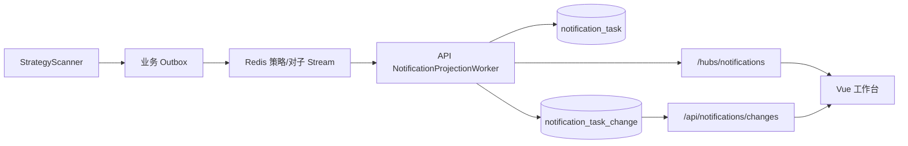

# A股监控程序网页端：开发与使用说明

> 实现日期：2026-08-14  
> 状态：第一期已开发并部署  
> 访问地址：http://127.0.0.1:5222/

## 已实现功能

- 专业金融工作台暗色主题；
- 实时工作台和任务数量摘要；
- 策略任务卡、筛选、分页、收藏、已读、处理和归档；
- 对子顶底盘中实时/历史回放双视图；
- `.00` 与 `.11～.99`、5m/30m/60m/1d、顶部/底部、确认/失效展示；
- 消息中心；
- 个股详情与东方掘金官方四周期 K 线；
- SignalR 在线/重连/离线状态；
- SignalR 断线后的 MySQL 变化水位补拉；
- Vue Router 路由刷新回退；
- Swagger 中的网页任务通知接口。

没有建设独立数据健康中心。深度运维仍使用 Grafana，网页顶部只显示实时连接状态和最近业务消息时间。

## 可靠通知链路



`notification_task` 保存任务当前投影和单人用户状态；`notification_task_change.id` 是严格递增补拉水位。策略按“交易日+股票”聚合，对子按 `event_key` 聚合。

## 网页路由

| 地址 | 功能 |
|---|---|
| `/` | 实时工作台 |
| `/strategies` | 策略任务 |
| `/pair-trends` | 对子顶底实时/历史数据 |
| `/messages` | 消息中心 |
| `/stocks/{symbol}` | 个股四周期 K 线和相关任务 |
| `/swagger` | API 文档 |
| `/api/status` | API 基础状态 |

## 新增接口

- `GET /api/notifications`
- `GET /api/notifications/changes`
- `GET /api/notifications/{id}`
- `PATCH /api/notifications/{id}/state`
- `POST /api/notifications/read-all`
- `GET /api/instruments/search`
- `/hubs/notifications`

## 本地开发

```powershell
cd web
pnpm install
pnpm run dev
```

开发地址为 `http://127.0.0.1:5173`，Vite 自动代理 `/api` 和 `/hubs` 到 `5222`。

生产构建：

```powershell
pnpm --filter astock-monitor-web build
dotnet publish .\src\AStockMonitor.Api\AStockMonitor.Api.csproj -c Release
```

Vite 构建产物写入 `src/AStockMonitor.Api/wwwroot`，随 API 一起发布，实现同源访问，无需 CORS。

## 已完成验证

- `dotnet build AStockMonitor.sln --no-restore`：0 警告、0 错误；
- `pnpm --filter astock-monitor-web build`：TypeScript 检查和生产构建成功；
- 数据库迁移 `017_web_notification_tasks.sql` 已应用；
- `/api/status`、通知分页、变化补拉、历史对子、股票搜索、Swagger 均返回 HTTP 200；
- NotificationHub negotiate 返回 WebSockets、SSE 和 Long Polling；
- 浏览器首页显示“实时在线”；
- 历史对子列表可展示已确认和已失效记录；
- 个股详情 ECharts K 线容器正常创建；
- 浏览器控制台无 error/warn。

## 当前运行说明

网页和 API 已部署到 `AStockMonitor.Api` Windows Service。任务列表只展示策略扫描器后续产生的实时业务事件；若 StrategyScanner 没有运行或当天尚无命中，首页显示空状态属于预期行为。历史对子数据可在“对子顶底 → 历史回放”中直接查看。

