# Windows 开机自启说明

系统使用 `AStockMonitor-Autostart` 统一协调启动，避免 Docker、MySQL、Redis、API、东方掘金终端和 Python 采集任务在登录时无序抢跑。

## 启动顺序

```mermaid
flowchart LR
    LOGIN["Windows用户登录"] --> AUTO["AStockMonitor-Autostart"]
    AUTO --> DOCKER["Docker Desktop"]
    DOCKER --> DATA["MySQL / Redis / 可观测容器"]
    DATA --> API["AStockMonitor.Api"]
    API --> WORKER["Worker / StrategyScanner"]
    WORKER --> GM["东财掘金终端 gmstarter"]
    GM --> PORT["等待SDK端口7050"]
    PORT --> TASKS["Recovery / Snapshot / Hot Tick"]
    TASKS --> VERIFY["V4状态接口验收"]
```



三个 .NET 服务配置为延迟自动启动；`AStockMonitor-Goldminer` 在用户登录和每天 08:30 触发，并作为常驻看护任务监测 7050；统一协调任务在用户登录和每天 08:35 触发，失败后每两分钟重试，最多十次。Docker 容器均使用 `restart: unless-stopped`。

Docker Desktop冷启动可能超过四分钟。协调脚本最多等待十分钟，并优先检查MySQL、Redis、OTel、Prometheus和Grafana端口；容器已经恢复时不会因当前PowerShell会话无法读取Docker命名管道而阻塞后续服务启动。

## 安装与立即验证

以管理员 PowerShell 执行：

```powershell
.\scripts\install-windows-autostart.ps1 -StartNow
```

运行日志：`.runtime/task-logs/windows-autostart-latest.log`。

## 非交易日行为

计划任务仍可在周末和法定节假日启动，用于保持基础设施和积压消费能力；业务门禁统一读取 `instrument_daily_status`：

- V5 Tick目标池清空，Python Supervisor停止全部SDK订阅槽；
- 全市场 `current()` 快照不调用SDK；
- 官方K线拉取、定时策略扫描和策略生命周期维护跳过；
- 16:20日终流水线由东方掘金交易日历复核后返回 `skipped_non_trading_day`；
- API、Redis/MySQL、Outbox消费和运维监控继续运行；
- Prometheus交易时段告警仅在 `astock_market_is_trading_day=1` 时生效。

详细口径与验收记录见 [非交易日统一运行门禁](./non-trading-day-execution-gate.md)。

## 重要边界

东方掘金终端和 Docker Desktop 都属于当前用户的交互式程序，因此完整行情系统是在 `Administrator` 登录 Windows 后自动启动。登录前只有 Windows 服务可以启动，无法可靠启动东方掘金 SDK。不要为此开启无密码自动登录；如需无人值守，应改用受控的专用 Windows 账户和操作系统自动登录策略。
